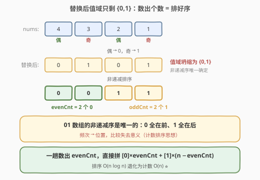
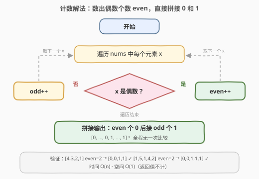

# 将数组按照奇偶性转化

- **题目名称**：将数组按照奇偶性转化
- **链接**：[3467. 将数组按照奇偶性转化](https://leetcode.cn/problems/transform-array-by-parity/)
- **难度**：简单
- **标签**：数组、计数、排序

## 1. 题目概述

给你一个整数数组 `nums`。请你按照以下顺序**依次**执行操作，转换 `nums`：

1. 将每个**偶数**替换为 `0`。
2. 将每个**奇数**替换为 `1`。
3. 按**非递减**顺序排序修改后的数组。

执行完这些操作后，返回结果数组。

**示例 1**：

```text
输入：nums = [4,3,2,1]
输出：[0,0,1,1]
解释：
  将偶数（4 和 2）替换为 0，将奇数（3 和 1）替换为 1。现在，nums = [0,1,0,1]。
  按非递减顺序排序 nums，得到 nums = [0,0,1,1]。
```

**示例 2**：

```text
输入：nums = [1,5,1,4,2]
输出：[0,0,1,1,1]
解释：
  将偶数（4 和 2）替换为 0，将奇数（1、5 和 1）替换为 1。现在，nums = [1,1,1,0,0]。
  按非递减顺序排序 nums，得到 nums = [0,0,1,1,1]。
```

**约束条件**：

- `1 <= nums.length <= 100`
- `1 <= nums[i] <= 1000`

---

## 2. 解题思路

### 2.1 暴力思路：老老实实模拟

按题面顺序执行三步——替换两个 `for` 循环，排序一次 `sort`：

```text
for x in nums: x → x % 2      # 偶→0，奇→1（本题元素均为正数）
sort(nums)                     # 非递减
```

时间复杂度 `O(n log n)`。本题 `n <= 100` 当然能过，但「排序」这一步排的是一堆**只有 0 和 1** 的数——比较排序在这里的信息利用率极低：两个 0 之间怎么比都是相等，真正有信息量的只有「0 有几个、1 有几个」。

### 2.2 核心观察：值域坍缩成 {0,1}，计数即排序



替换之后数组里**只剩 0 和 1** 两种值，而「非递减排序一个 01 数组」的结果是**唯一确定**的：所有 `0` 在前、所有 `1` 在后。设偶数有 `evenCnt` 个、奇数有 `oddCnt` 个（`evenCnt + oddCnt = n`），则答案就是：

$$\underbrace{0, 0, \dots, 0}_{\text{evenCnt 个}} , \underbrace{1, 1, \dots, 1}_{\text{oddCnt 个}}$$

于是**一趟扫描统计 `evenCnt`**（奇数个数 = $n - \text{evenCnt}$，不用单独数），再按个数直接拼接，全程**无一次比较**——这正是**计数排序**在「值域只有两个值」时的形态，排序从 `O(n log n)` 退化为 `O(n)`。

> 💡 本质：比较排序的 `O(n log n)` 下界是针对「任意值域」的；当值域坍缩到常数个值时，**频次统计完全确定了每个元素的位置**，比较失去意义。905/922（按奇偶重排）、75（颜色分类，值域 {0,1,2}）都是同一思想的不同化身。

验证示例：`[4,3,2,1]` 偶数 2 个 → `[0,0] + [1,1]` = `[0,0,1,1]` ✓；`[1,5,1,4,2]` 偶数 2 个 → `[0,0] + [1,1,1]` = `[0,0,1,1,1]` ✓。

### 2.3 算法流程图



整个算法只有一个循环体：对每个元素判一次奇偶、给对应计数器加一；循环结束后按两个计数器拼接输出。

---

## 3. 参考代码

### C++

```cpp
class Solution {
  public:
    vector<int> transformArray(vector<int>& nums) {
        int even = count_if(nums.begin(), nums.end(),
                            [](int x) { return x % 2 == 0; });
        vector<int> res(nums.size(), 1);
        fill(res.begin(), res.begin() + even, 0);
        return res;
    }
};
```

### Python

```python
class Solution:
    def transformArray(self, nums: List[int]) -> List[int]:
        even = sum(x % 2 == 0 for x in nums)
        return [0] * even + [1] * (len(nums) - even)
```

---

## 4. 复杂度分析

| 维度 | 复杂度 | 说明 |
|------|--------|------|
| 时间复杂度 | O(n) | 一趟计数 O(n) + 按个数构造答案 O(n) |
| 空间复杂度 | O(1) | 仅常数个计数变量（返回数组不计入） |

---

## 5. 扩展：奇偶判定的语言陷阱与计数排序的推广

**奇偶判定的写法**：本题约束 `1 <= nums[i] <= 1000` 全为正数，`x % 2` 恒为 0/1，怎么写都对。但若允许负数，C++/Java 中 `-3 % 2 == -1`，把 `x % 2` 的结果直接当 0/1 用就会出错；更稳的写法是判 `x % 2 == 0`（或 `x & 1`，取补码最低位，对负数同样正确）。Python 的 `%` 结果与除数同号，`-3 % 2 == 1`，无此坑。

**计数排序的推广**：当待排序的值只有 `k` 种时，统计频次再按值序输出即可，时间 `O(n + k)`。本题 `k = 2`；[75. 颜色分类](https://leetcode.cn/problems/sort-colors/) 是 `k = 3` 的经典版（还可用一趟双指针做到 O(1) 空间原位重写）；[1051. 高度检查器](https://leetcode.cn/problems/height-checker/) 是「对期望结果做计数排序，再与原数组逐位比对」；值域更大的场景（如 [912. 排序数组](https://leetcode.cn/problems/sort-an-array/)，值 ∈ [−50000, 50000]）计数排序依然 `O(n + k)`，只需按值域平移下标。

---

## 6. 面试要点

1. **为什么可以跳过排序步骤？**
   - 替换后值域只剩 {0,1}，非递减序唯一：0 全在前、1 全在后。频次（`evenCnt`/`oddCnt`）完全确定结果，元素之间的比较不再提供任何信息。

2. **`x % 2`、`x & 1`、`x % 2 == 0` 三种写法有何差别？**
   - 本题全正数，三者等价。一般情形：C++/Java 的 `%` 对负数保留符号（`-3 % 2 == -1`），把 `x % 2` 直接当 0/1 会错；`x & 1` 取补码最低位，负数也正确；判 `x % 2 == 0` 永远安全。Python 的 `%` 与除数同号，无坑。

3. **与 905「按奇偶排序数组」的区别是什么？**
   - 905 保留元素**原值**，只按奇偶重排，需要双指针交换且关心每个值落在哪半边；本题把值替换成 0/1，原值信息全部丢弃，只剩「两类各多少个」，因此连交换都不需要。

4. **计数排序的适用条件与复杂度？**
   - 值属于可枚举的有限集合（整数或能映射为整数的键），值域大小 `k`。统计频次 O(n)，按序输出 O(n + k)，总 `O(n + k)`；它是非比较排序，不受比较排序 `O(n log n)` 下界约束。

5. **本题解法稳定吗？**
   - 该问题无稳定性可言：值只剩 0/1 且原信息被抹掉，两个 0 之间无从区分。一般计数排序按「频次前缀和 + 从后往前填」可以实现稳定排序。

---

## 7. 同类练习题

- [905. 按奇偶排序数组](https://leetcode.cn/problems/sort-array-by-parity/)（[题解](../0901-1000/905_按奇偶排序数组.md)）：同按奇偶重排但保留原值，双指针交换的基本版
- [922. 按奇偶排序数组 II](https://leetcode.cn/problems/sort-array-by-parity-ii/)（[题解](../0901-1000/922_按奇偶排序数组II.md)）：奇偶交替下标约束版，双指针各走一步
- [75. 颜色分类](https://leetcode.cn/problems/sort-colors/)（[题解](../0001-0100/75_颜色分类.md)）：值域 {0,1,2} 的计数排序 / 一趟双指针经典题
- [1051. 高度检查器](https://leetcode.cn/problems/height-checker/)（[题解](../1001-1100/1051_高度检查器.md)）：对期望结果计数排序，再与原数组逐位比对
- [912. 排序数组](https://leetcode.cn/problems/sort-an-array/)（[题解](../0901-1000/912_排序数组.md)）：值域较大时计数排序与各比较排序的取舍
