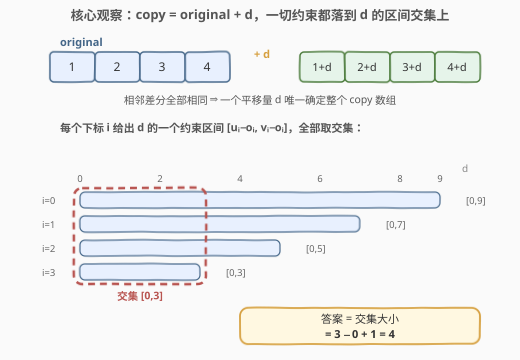

# 可行数组的数目

- **题目名称**：可行数组的数目
- **链接**：[3468. 可行数组的数目](https://leetcode.cn/problems/find-the-number-of-copy-arrays/)
- **难度**：中等
- **标签**：数组、数学

## 1. 题目概述

给你一个长度为 $n$ 的数组 `original` 和一个长度为 $n \times 2$ 的二维数组 `bounds`，其中 `bounds[i] = [u_i, v_i]`。

你需要找到长度为 $n$ 且满足以下条件的**可能的**数组 `copy` 的数量：

- 对于 $1 \le i \le n-1$，都有 $(copy[i] - copy[i-1]) == (original[i] - original[i-1])$；
- 对于 $0 \le i \le n-1$，都有 $u_i \le copy[i] \le v_i$。

返回满足这些条件的数组数目。

**示例 1**：

```text
输入：original = [1,2,3,4], bounds = [[1,2],[2,3],[3,4],[4,5]]
输出：2
解释：可能的数组为 [1,2,3,4] 和 [2,3,4,5]。
```

**示例 2**：

```text
输入：original = [1,2,3,4], bounds = [[1,10],[2,9],[3,8],[4,7]]
输出：4
解释：可能的数组为 [1,2,3,4]、[2,3,4,5]、[3,4,5,6]、[4,5,6,7]。
```

**示例 3**：

```text
输入：original = [1,2,1,2], bounds = [[1,1],[2,3],[3,3],[2,3]]
输出：0
解释：没有可行的数组。
```

**约束条件**：

- $2 \le n = \text{original.length} \le 10^5$
- $1 \le \text{original}[i] \le 10^9$
- `bounds.length == n`
- $1 \le u_i \le v_i \le 10^9$

> 💡 **读题关键**：第一个条件说的是 `copy` 与 `original` 的**相邻差分完全相同**——这并不意味着 `copy = original`，而是 `copy` 可以是 `original` 的任意**整体平移**。一旦看破「平移」二字，剩下的就只是一道区间交集的算术题。

---

## 2. 解题思路

### 2.1 暴力思路

最直接的做法：枚举 `copy[0]` 的每一个候选值 $c_0 \in [u_0, v_0]$（官方 hint 也点明了 `copy[0]` 唯一决定其余所有值）。对每个 $c_0$，依次写出 $copy[i] = c_0 + \sum_{j \le i}(original[j] - original[j-1])$，再逐位检查是否落在 $[u_i, v_i]$ 内。

问题在于 $c_0$ 的候选多达 $v_0 - u_0 + 1$ 个，最坏 $10^9$ 个；每个候选还要 $O(n)$ 检查，总计 $O(n \times 10^9)$，完全不可行。瓶颈很明显：**候选平移量太多，但真正决定可行性的是「全体约束的交集」，不需要逐个试**。

### 2.2 核心观察：平移不变性——一切自由度坍缩为一个 d



**观察 1（差分相同 ⇔ 整体平移）**：把第一个条件从 $i=1$ 到 $n-1$ 逐项累加，相邻差分相消，得到对任意 $i$：

$$copy[i] - original[i] = copy[0] - original[0] \triangleq d$$

即 $copy[i] = original[i] + d$ 对所有 $i$ 成立。整个 `copy` 数组的自由度只有**一个整数 $d$**（平移量）：$d$ 定，则数组定。反过来，同一个 $d$ 只对应一个 `copy`，所以「数组的数目」就是「合法 $d$ 的个数」。

**观察 2（上下界约束 ⇔ d 的区间约束）**：条件 $u_i \le original[i] + d \le v_i$ 移项即

$$u_i - original[i] \;\le\; d \;\le\; v_i - original[i]$$

即每个下标 $i$ 都给 $d$ 圈出一个区间 $[u_i - o_i,\ v_i - o_i]$。

**观察 3（答案 = 区间交集大小）**：$d$ 合法当且仅当它落在**所有** $n$ 个区间的交集里。交集可以边扫边维护：

$$lo = \max_i (u_i - o_i), \qquad hi = \min_i (v_i - o_i)$$

- 若 $lo > hi$：交集为空，答案为 0（对应示例 3）；
- 否则答案为 $hi - lo + 1$（交集内每个整数 $d$ 恰好对应一个合法数组）。

以示例 2 为例，四个约束区间是 $[0,9], [0,7], [0,5], [0,3]$，交集 $[0,3]$，答案 $3 - 0 + 1 = 4$，与预期一致。

> ⚠️ **数值范围**：$u_i - o_i$ 与 $v_i - o_i$ 的绝对值不超过 $10^9 - 1$，但 $hi - lo + 1$ 最大约 $2 \times 10^9$，逼近 `int32` 上限。C++ 中用 `long long` 维护 $lo, hi$ 最稳妥，避免边界心智负担。

### 2.3 算法流程图

![算法流程：单趟扫描维护交集 [lo, hi]，一旦为空提前返回 0，否则返回 hi − lo + 1](../images/p3468_algorithm_flow.svg)

流程是**单趟扫描**：初始化 $lo = -\infty$、$hi = +\infty$，从左到右遍历每个下标，用 $u_i - o_i$ 抬高 $lo$、用 $v_i - o_i$ 压低 $hi$。由于交集**只会单调收缩**，一旦 $lo > hi$ 即可提前剪枝返回 0；扫完后返回 $hi - lo + 1$。

### 2.4 示例演算

以示例 2（`original = [1,2,3,4]`，`bounds = [[1,10],[2,9],[3,8],[4,7]]`）逐步演算：

| $i$ | $o_i$ | $[u_i, v_i]$ | $d$ 的约束 $[u_i - o_i,\ v_i - o_i]$ | 当前交集 $[lo, hi]$ |
|---|---|---|---|---|
| 0 | 1 | $[1, 10]$ | $[0, 9]$ | $[0, 9]$ |
| 1 | 2 | $[2, 9]$ | $[0, 7]$ | $[0, 7]$ |
| 2 | 3 | $[3, 8]$ | $[0, 5]$ | $[0, 5]$ |
| 3 | 4 | $[4, 7]$ | $[0, 3]$ | $[0, 3]$ |

最终 $lo = 0$、$hi = 3$，答案 $= 3 - 0 + 1 = 4$，对应 $d \in \{0,1,2,3\}$，即数组 $[1,2,3,4], [2,3,4,5], [3,4,5,6], [4,5,6,7]$。

再看示例 3（`original = [1,2,1,2]`）：约束区间依次为 $[0,0], [0,1], [2,2], [0,1]$，处理到 $i=2$ 时 $lo = \max(0, 0, 2) = 2 > hi = \min(0, 1, 2) = 0$，交集为空，提前返回 0。

---

## 3. 参考代码

### C++

```cpp
class Solution {
  public:
    int countArrays(vector<int>& original, vector<vector<int>>& bounds) {
        long long lo = LLONG_MIN, hi = LLONG_MAX;   // 交集 [lo, hi]，初始为全集
        for (int i = 0; i < (int)original.size(); i++) {
            lo = max(lo, (long long)bounds[i][0] - original[i]);
            hi = min(hi, (long long)bounds[i][1] - original[i]);
            if (lo > hi) return 0;                  // 交集只会越缩越小，空了直接剪枝
        }
        return (int)(hi - lo + 1);
    }
};
```

### Python

```python
class Solution:
    def countArrays(self, original: List[int], bounds: List[List[int]]) -> int:
        lo, hi = -inf, inf                # 交集 [lo, hi]，初始为全集
        for o, (u, v) in zip(original, bounds):
            lo = max(lo, u - o)
            hi = min(hi, v - o)
            if lo > hi:                   # 交集只会越缩越小，空了直接剪枝
                return 0
        return hi - lo + 1
```

---

## 4. 复杂度分析

| 维度 | 复杂度 | 说明 |
|------|--------|------|
| 时间复杂度 | O(n) | 每个下标只做常数次减法、比较与最值更新，单趟扫描 |
| 空间复杂度 | O(1) | 仅 $lo, hi$ 两个滚动变量 |

---

## 5. 扩展：变体思考

**变体 1（差分约束为集合）**：若条件改为 $copy[i] - copy[i-1] \in S_i$（允许的差分集合逐位给出），则不再有「整体平移」的不变量，需要沿数组做**可达集合的区间传播**（若 $S_i$ 是区间则仍是区间交，否则退化为集合 DP），复杂度与 $\prod |S_i|$ 相关。

**变体 2（对 d 计数的其他姿势）**：本题答案 $= \max(0, \min_i(v_i - o_i) - \max_i(u_i - o_i) + 1)$，本质与 [798. 得分最高的最小轮调](https://leetcode.cn/problems/smallest-rotation-with-highest-score/) 同构——都是「固定一个全局平移量 $k$，统计/评估每个位置在平移后的合法性」，798 用差分数组把每个位置的合法 $k$ 区间做**区间加 1**，最后取最大值；本题约束更纯粹，直接取交集大小即可。

---

## 6. 面试要点

1. **为什么「差分相同」等价于「整体平移」？**
   - 将条件从 $i=1$ 累加到任意 $i$，相邻差分 telescoping 相消，得 $copy[i] - original[i] = copy[0] - original[0] = d$ 为常数。因此 $n$ 维搜索空间坍缩为一维，这是本题唯一的关键转折。

2. **为什么答案是交集大小而不是别的计数？**
   - 每个 $d$ 通过 $copy[i] = original[i] + d$ 双射到一个 `copy` 数组；$d$ 合法 ⇔ 落在所有 $[u_i - o_i, v_i - o_i]$ 的交集内。整数交集的大小就是 $hi - lo + 1$，空集时为 0。

3. **提前剪枝 `lo > hi` 为什么是对的？**
   - 交集运算单调收缩：多并入一个区间只会让 $lo$ 不减、$hi$ 不增。一旦 $lo > hi$，后续再并入任何区间也不可能翻盘，直接返回 0 是安全的（对正确性非必需，对 $10^5$ 规模是常数级优化）。

4. **溢出风险在哪里？**
   - $u_i - o_i$ 本身约 $\pm 10^9$ 尚在 `int32` 内，但 $hi - lo + 1$ 最大约 $2 \times 10^9$，贴着 `INT_MAX = 2147483647` 的边缘。用 `long long` 维护 $lo/hi$ 是零成本保险，也免去「刚好不溢出」的脆弱论证。

5. **如果约束改为「相邻差分的绝对值等于 original 的」呢？**
   - 每个位置可加 $\pm d$，自由度变成 $2^{n-1}$ 条平移路径，但逐位可行域仍是区间形式的交错组合；思路依旧是把每个位置的可行值写成 $o_i + \delta_i$（$\delta_i \in \{\pm d\}$ 前缀和），对每条符号路径取交集——规模爆炸，需另寻规律（如按符号分组取最值）。

---

## 7. 同类练习题

- [189. 轮转数组](https://leetcode.cn/problems/rotate-array/)（[题解](../0101-0200/189_轮转数组.md)）：数组整体平移的基础操作，直观理解本题 `copy = original + d` 的「平移」本质
- [1109. 航班预订统计](https://leetcode.cn/problems/corporate-flight-bookings/)（[题解](../1101-1200/1109_航班预订统计.md)）：差分数组经典题，是「差分相同 ⇔ 平移」这枚硬币的另一面
- [798. 得分最高的最小轮调](https://leetcode.cn/problems/smallest-rotation-with-highest-score/)（[题解](../0701-0800/798_得分最高的最小轮调.md)）：同样是「枚举全局平移量 + 逐位合法性」，把每个位置的合法平移量做成区间计数
- [1526. 形成目标数组的子数组最少增加次数](https://leetcode.cn/problems/minimum-number-of-increments-on-subarrays-to-form-a-target-array/)（[题解](../1501-1600/1526_形成目标数组的子数组最少增加次数.md)）：从差分视角把构造问题转化为逐位最值统计
