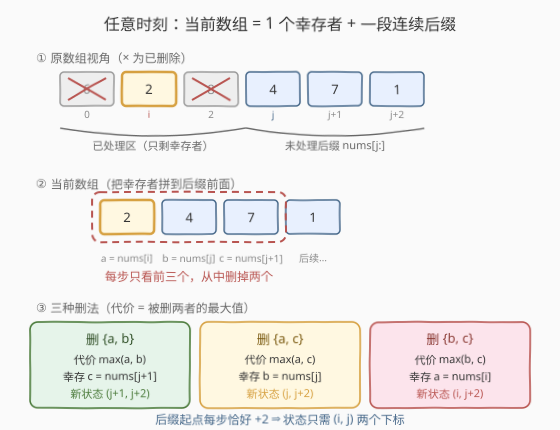
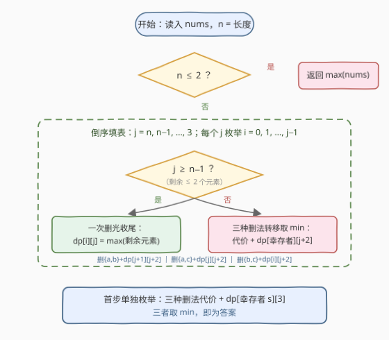

# 移除所有数组元素的最小代价

- **题目名称**：移除所有数组元素的最小代价
- **链接**：[3469. 移除所有数组元素的最小代价](https://leetcode.cn/problems/find-minimum-cost-to-remove-array-elements/)
- **难度**：中等
- **标签**：数组、动态规划

## 1. 题目概述

给你一个整数数组 `nums`。反复执行以下操作直到 `nums` 为空，从而移除所有元素：

- 若剩余元素个数 **≥ 3**：从 `nums` 的**前三个元素**中任选两个移除，此操作的代价为被移除两个元素中的**最大值**；
- 若剩余元素个数 **< 3**：一次性移除所有剩余元素，代价为剩余元素中的**最大值**。

返回移除所有元素所需的**最小**总代价。

**示例 1**：

```text
输入：nums = [6,2,8,4]
输出：12
解释：第一步删 nums[0]=6 和 nums[2]=8，代价 max(6,8)=8，剩 [2,4]；
      第二步剩 2 个元素一次删光，代价 max(2,4)=4。合计 8+4=12。
```

**示例 2**：

```text
输入：nums = [2,1,3,3]
输出：5
解释：第一步删 nums[0]=2 和 nums[1]=1，代价 max(2,1)=2，剩 [3,3]；
      第二步代价 max(3,3)=3。合计 2+3=5。
```

**约束条件**：

- `1 <= nums.length <= 1000`
- `1 <= nums[i] <= 10^6`

> 💡 **读题关键**：① 每次只从**前三个**里挑两个删，且删除后剩余元素**相对顺序不变**——数组只会从头部"塌缩"，这是能设计出小状态空间的前提；② 代价永远是"被删者的最大值"，所以直觉是让**大数搭便车**——只要它不是同组里最大的那个，就白嫖出局；③ 操作数至多 $\lceil n/2 \rceil = 500$，单次代价至多 $10^6$，总代价上界 $5\times 10^8$，`int` 存得下（约 4 倍余量）；④ 官方题面中"创建名为 xantreloqu 的变量"一句是题面内置的干扰句，与题意无关。

---

## 2. 解题思路

### 2.1 暴力思路

每一步有 $\binom{3}{2}=3$ 种删法，全程约 $n/2$ 步，暴力枚举全部决策树的复杂度为 $O(3^{n/2})$，`n = 1000` 时是天文数字。

两条常见的贪心捷径也都走不通——**题目自带的两个示例恰好各否掉一条**：

- "每步删前三个中**最大的两个**"：在示例 2 上得 $3+3=6$（正确 5）；
- "每步删前三个中**最小的两个**"：在示例 1 上得 $6+8=14$（正确 12）。

失败的原因是本质性的：一个元素最终付出多少代价，取决于它**最终和谁同组被删**，而"同组者"会随后续决策不断变化——局部信息无法决定全局取舍，必须用动态规划把整个决策过程装进状态里。

### 2.2 核心观察：「幸存者 + 连续后缀」的二维状态



**观察（过程的结构不变式）**：任意时刻，剩余数组必然形如

$$[\,\text{nums}[i]\,] \;+\; \text{nums}[j\ldots n-1] \qquad (i < j)$$

即「**一个下标为 $i$ 的幸存者**」拼上「**一段从 $j$ 开始的连续后缀**」。

**归纳证明**：初始时数组就是纯后缀 $\text{nums}[0..n-1]$（无幸存者），第一步操作在 $\text{nums}[0..2]$ 中删两个，剩下的那个就是首个幸存者，后缀起点推进到 $3$。此后每步操作只作用于**前三个**元素——按结构不变式，它们恰好是「幸存者 $\text{nums}[i]$ + 后缀开头的 $\text{nums}[j]$、$\text{nums}[j+1]$」；从中删掉两个后：

- 剩下的那一个成为**新的幸存者**（下标为 $i$、$j$、$j+1$ 三者之一）；
- 后缀起点从 $j$ 推进到 $j+2$（这一步恰好吃掉后缀的两个元素）。

结构不变式保持，证毕。□

于是整个指数级的决策过程被压缩成二维状态。定义：

$$dp[i][j] = \text{清空数组 } [\text{nums}[i]] + \text{nums}[j\ldots n-1] \text{ 的最小总代价}$$

记 $a = \text{nums}[i]$、$b = \text{nums}[j]$、$c = \text{nums}[j+1]$。当剩余 **≥ 3** 个元素（$j \le n-2$）时，三种删法对应三个转移：

$$
dp[i][j] = \min \begin{cases}
\max(a, b) + dp[j+1][j+2] & \text{删 } \{a, b\},\ \text{幸存 } c \\
\max(a, c) + dp[j][j+2] & \text{删 } \{a, c\},\ \text{幸存 } b \\
\max(b, c) + dp[i][j+2] & \text{删 } \{b, c\},\ \text{幸存 } a
\end{cases}
$$

**边界**（剩余 ≤ 2 个元素，触发"一次删光"）：

$$dp[i][j] = \begin{cases} \text{nums}[i] & j = n \quad(\text{只剩幸存者一个}) \\ \max(\text{nums}[i],\ \text{nums}[j]) & j = n-1 \quad(\text{剩幸存者 + 一个后缀元素}) \end{cases}$$

**首步单独处理**（初始没有幸存者）：第一步在 $\text{nums}[0..2]$ 里删两个，三种删法分别留下下标 $2$、$1$、$0$ 的元素当幸存者，进入状态 $(s, 3)$：

$$\text{ans} = \min\big(\max(a,b) + dp[2][3],\ \max(a,c) + dp[1][3],\ \max(b,c) + dp[0][3]\big)$$

其中 $a, b, c = \text{nums}[0], \text{nums}[1], \text{nums}[2]$。`n <= 2` 时直接返回 `max(nums)`。

> 💡 转移只依赖 $j+2$ 层（后缀起点每步恰好 +2），所以可达状态的 $j$ 从 $3$ 起恒为**奇数**。刷表时不必利用这一点（多算偶数层无害），但它正是后面"按奇偶滚动数组"优化到 $O(n)$ 空间的依据。

### 2.3 算法流程图



流程要点：**倒序刷表**（$j$ 从 $n$ 递减到 $3$，内层枚举幸存者 $i$）保证转移依赖的 $j+2$ 层总是先算好；基例（一次删光）与三转移统一写在一个分支里；最后首步三选一接上 $dp[s][3]$ 收敛答案。

### 2.4 示例演算

以 `nums = [3, 5, 1, 4, 2]`（`n = 5`）为例倒序刷表。

**基例层**：

- $j = 5$（只剩幸存者）：$dp[i][5] = \text{nums}[i]$，即 `[3, 5, 1, 4, 2]`（$i = 0..4$）；
- $j = 4$（剩幸存者 + 1 个）：$dp[i][4] = \max(\text{nums}[i],\, 2)$，即 `[3, 5, 2, 4]`（$i = 0..3$）。

**转移层 $j = 3$**（幸存者拼上 $b = \text{nums}[3] = 4$、$c = \text{nums}[4] = 2$）：

| $i$ | $a=\text{nums}[i]$ | 删 $\{a,b\}$: $\max$+$dp[4][5]$ | 删 $\{a,c\}$: $\max$+$dp[3][5]$ | 删 $\{b,c\}$: $4$+$dp[i][5]$ | $dp[i][3]$ |
|---|---|---|---|---|---|
| 0 | 3 | $4+2 = 6$ | $3+4 = 7$ | $4+3 = 7$ | **6** |
| 1 | 5 | $5+2 = 7$ | $5+4 = 9$ | $4+5 = 9$ | **7** |
| 2 | 1 | $4+2 = 6$ | $2+4 = 6$ | $4+1 = 5$ | **5** |

**首步**（$a, b, c = 3, 5, 1$）：

| 删法 | 代价 | 幸存者 | 后续代价 | 合计 |
|---|---|---|---|---|
| 删 $\{3,5\}$ | 5 | $\text{nums}[2]=1$ | $dp[2][3]=5$ | **10** |
| 删 $\{3,1\}$ | 3 | $\text{nums}[1]=5$ | $dp[1][3]=7$ | **10** |
| 删 $\{5,1\}$ | 5 | $\text{nums}[0]=3$ | $dp[0][3]=6$ | 11 |

答案 $10$，且有**两条**最优路径：删 $\{3,5\}$(5) → 剩 $[1,4,2]$ 删 $\{4,2\}$(4) → 剩 $[1]$ 删 $1$；或删 $\{3,1\}$(3) → 剩 $[5,4,2]$ 删 $\{5,4\}$(5) → 剩 $[2]$ 删 $2$。两条路径都是 $5+4+1$ 与 $3+5+2$，恰好等于 $10$——最优解不唯一，也再次印证贪心没有稳定的局部准则。

官方两个示例也可秒验：`[6,2,8,4]` 的 $dp[i][3] = [6,4,8]$，首步 $\min(6+8,\ 8+4,\ 8+6) = 12$ ✓；`[2,1,3,3]` 的 $dp[i][3] = [3,3,3]$，首步 $\min(2+3,\ 3+3,\ 3+3) = 5$ ✓。

---

## 3. 参考代码

### C++

```cpp
class Solution {
  public:
    int minCost(vector<int>& nums) {
        int n = nums.size();
        if (n <= 2) return *max_element(nums.begin(), nums.end());

        // dp[i][j]：清空 [nums[i]] + nums[j..n-1] 的最小总代价
        vector<vector<int>> dp(n + 1, vector<int>(n + 2, 0));
        for (int j = n; j >= 3; --j) {
            for (int i = 0; i < j; ++i) {
                if (j >= n - 1) {                    // 剩 1~2 个元素：一次删光
                    dp[i][j] = (j == n) ? nums[i] : max(nums[i], nums[j]);
                } else {
                    int a = nums[i], b = nums[j], c = nums[j + 1];
                    dp[i][j] = min({max(a, b) + dp[j + 1][j + 2],
                                    max(a, c) + dp[j][j + 2],
                                    max(b, c) + dp[i][j + 2]});
                }
            }
        }

        int a = nums[0], b = nums[1], c = nums[2];   // 首步单独三选一
        return min({max(a, b) + dp[2][3],
                    max(a, c) + dp[1][3],
                    max(b, c) + dp[0][3]});
    }
};
```

### Python

```python
class Solution:
    def minCost(self, nums: List[int]) -> int:
        n = len(nums)
        if n <= 2:
            return max(nums)

        # dp[i][j]：清空 [nums[i]] + nums[j..n-1] 的最小总代价
        dp = [[0] * (n + 2) for _ in range(n + 1)]
        for j in range(n, 2, -1):
            for i in range(j):
                if j >= n - 1:                        # 剩 1~2 个元素：一次删光
                    dp[i][j] = nums[i] if j == n else max(nums[i], nums[j])
                else:
                    a, b, c = nums[i], nums[j], nums[j + 1]
                    dp[i][j] = min(max(a, b) + dp[j + 1][j + 2],
                                   max(a, c) + dp[j][j + 2],
                                   max(b, c) + dp[i][j + 2])

        a, b, c = nums[:3]                            # 首步单独三选一
        return min(max(a, b) + dp[2][3],
                   max(a, c) + dp[1][3],
                   max(b, c) + dp[0][3])
```

---

## 4. 复杂度分析

| 维度 | 复杂度 | 说明 |
|------|--------|------|
| 时间复杂度 | $O(n^2)$ | 状态 $(i, j)$ 约 $n^2/2$ 个（$n=1000$ 时约 $5\times10^5$），每个 $O(1)$ 三选一转移 |
| 空间复杂度 | $O(n^2)$ | 二维 dp 表；`int` 约 4 MB。转移只依赖 $j+2$ 层，可按奇偶滚动到 $O(n)$ |

---

## 5. 扩展：记忆化搜索与 O(n) 滚动数组

**记忆化搜索**（自顶向下，与官方 hint 的 $dp[i][j]$ 状态一致，递归深度 $\approx n/2$，Python 可直接跑）：

```python
from functools import cache

class Solution:
    def minCost(self, nums: List[int]) -> int:
        n = len(nums)
        if n <= 2:
            return max(nums)

        @cache
        def dp(i: int, j: int) -> int:
            # 清空 [nums[i]] + nums[j:] 的最小总代价
            if j >= n - 1:                      # 剩 1~2 个元素：一次删光
                return nums[i] if j == n else max(nums[i], nums[j])
            a, b, c = nums[i], nums[j], nums[j + 1]
            return min(max(a, b) + dp(j + 1, j + 2),
                       max(a, c) + dp(j, j + 2),
                       max(b, c) + dp(i, j + 2))

        a, b, c = nums[:3]
        return min(max(a, b) + dp(2, 3),
                   max(a, c) + dp(1, 3),
                   max(b, c) + dp(0, 3))
```

**滚动优化**：转移只依赖 $j+2$ 层，而 $j$ 的奇偶分层互不干扰——保留相邻两层交替覆盖即可把空间降到 $O(n)$。若把"删法"从三选一推广为"前 $k$ 个里删 $k-1$ 个"，后缀起点每步推进 $k-1$、状态维数不变仍是 $(i, j)$，但单步转移变为 $k$ 种，总复杂度 $O(n^2 k)$。

---

## 6. 面试要点

1. **为什么剩余数组一定是「一个幸存者 + 一段连续后缀」？**
   - 归纳不变式：每步只动前三个（幸存者 + 后缀头两个），删两个剩一个成为新幸存者，后缀起点恰好 +2；初始纯后缀、首步产生首个幸存者。这是把指数级决策树压成二维状态的关键。

2. **贪心为什么不可行？**
   - 「删最大两个」在示例 2 上得 6（正确 5），「删最小两个」在示例 1 上得 14（正确 12）。元素代价取决于它最终与谁同组，决策全局耦合。

3. **为什么倒序刷表（$j$ 从大到小）？**
   - 转移只依赖 $j+2$ 层，倒序保证依赖先算好；也正是这一性质支撑按奇偶滚动到 $O(n)$ 空间。

4. **边界怎么处理？为什么不会漏"剩 3 个"的情况？**
   - 剩 3 个（$j = n-2$）仍走正常三选一转移，转移目标 $dp[\cdot][n]$、$dp[\cdot][n]$ 恰好落在两个基例上；只有剩 1~2 个（$j \ge n-1$）才触发"一次删光"。注意 $j = n$（只剩幸存者）与 $j = n-1$（幸存者 + 一个）是两个不同基例。

5. **首步为什么要单独处理？**
   - 初始数组是纯后缀、没有幸存者，不满足状态 $(i, j)$ 的形态；枚举首步三选一后才进入 $(s, 3)$ 的统一状态。`n <= 2` 时无"前三个"可言，直接一次删光。

---

## 7. 同类练习题

- [312. 戳气球](https://leetcode.cn/problems/burst-balloons/)（[题解](../0301-0400/312_戳气球.md)）：删元素算代价的区间 DP 鼻祖——删除代价依赖邻居，与本题"代价依赖同组者"同源
- [546. 移除盒子](https://leetcode.cn/problems/remove-boxes/)（[题解](../0501-0600/546_移除盒子.md)）：状态里"额外携带信息"（同色连长）的经典困难 DP，与本题"幸存者进状态"同一思想
- [664. 奇怪的打印机](https://leetcode.cn/problems/strange-printer/)（[题解](../0601-0700/664_奇怪的打印机.md)）：同为"给 DP 加一维携带状态"的设计训练
- [1000. 合并石头的最低成本](https://leetcode.cn/problems/minimum-cost-to-merge-stones/)（[题解](../1001-1100/1000_合并石头的最低成本.md)）：从头部分组消耗、代价取最值的分组 DP
- [1140. 石子游戏 II](https://leetcode.cn/problems/stone-game-ii/)（[题解](../1101-1200/1140_石子游戏II.md)）：线性推进 + 把"携带参数 M"写进状态的入门版
