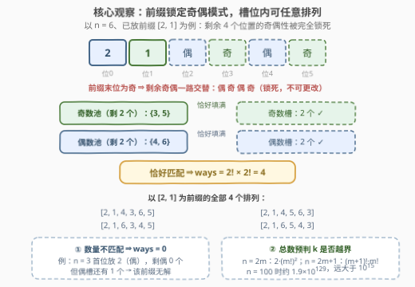
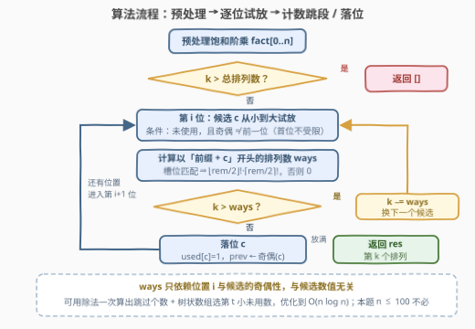

# 全排列 IV

- **题目名称**：全排列 IV
- **链接**：[3470. 全排列 IV](https://leetcode.cn/problems/permutations-iv/)
- **难度**：困难
- **标签**：数组、数学、组合数学、枚举

## 1. 题目概述

给你两个整数 `n` 和 `k`。一个**交替排列**是前 `n` 个正整数的排列，且**任意相邻两个元素不都为奇数、也不都为偶数**（即相邻元素的奇偶性必须交替出现）。

返回按**字典序**排序后的第 `k` 个交替排列。如果有效的交替排列少于 `k` 个，返回空列表。

**示例 1**：

```text
输入：n = 4, k = 6
输出：[3,4,1,2]
解释：[1,2,3,4] 的交替排列按字典序排序为：
      [1,2,3,4], [1,4,3,2], [2,1,4,3], [2,3,4,1],
      [3,2,1,4], [3,4,1,2], [4,1,2,3], [4,3,2,1]
      第 6 个是 [3,4,1,2]。
```

**示例 2**：

```text
输入：n = 3, k = 2
输出：[3,2,1]
解释：只有 [1,2,3] 与 [3,2,1] 两个交替排列，第 2 个是 [3,2,1]。
```

**示例 3**：

```text
输入：n = 2, k = 3
输出：[]
解释：只有 2 个交替排列，k = 3 超出范围。
```

**约束条件**：

- $1 \le n \le 100$
- $1 \le k \le 10^{15}$

> 💡 **读题关键**：①「相邻奇偶交替」正是 [3437. 全排列 III](https://leetcode.cn/problems/permutations-iii/) 的约束——那题 $n \le 10$ 枚举全部，本题 $n \le 100$、只取第 $k$ 个，输出规模从「指数级列表」缩成「一个排列」；② 合法排列最多 $2 \cdot (50!)^2 \approx 1.9 \times 10^{129}$ 个，**生成不可行，只能计数**；③ $k \le 10^{15}$ 恰是「数出每段前缀的排列数、整段跳过」这类构造法的典型数据范围（对照 [60. 第 k 个排列](https://leetcode.cn/problems/permutation-sequence/) 的康托尔展开）；④ 相邻奇偶交替是**一维传播的局部约束**——某位的奇偶性一旦确定，其后所有位的奇偶性都被锁死，这正是计数能写成闭式的根源。

---

## 2. 解题思路

### 2.1 暴力思路

最朴素的两条路都走不通：

- **逐个推进**：用 `next_permutation` 从最小排列出发，跳过非法的、数到第 $k$ 个合法的——一方面 $k$ 高达 $10^{15}$，逐个数必然超时；另一方面 $n = 100$ 时两个合法排列之间可能隔着 $10^{100}$ 量级的非法排列，「跳过」本身就不是 $O(1)$ 的。
- **生成全部再取第 k 个**：3437 的带奇偶剪枝回溯能枚举全部合法排列，但 $n \le 100$ 时合法排列多达 $2 \cdot (50!)^2$ 个，输出规模本身就无法承受。

结论：**不生成、只计数**——按位构造答案，每一步用组合数学数出「以当前前缀开头的排列有几个」，从 $k$ 中整段扣除。

### 2.2 核心观察：前缀锁定奇偶模式，计数 = 阶乘积



**观察 1（总数闭式，预判越界）**。沿用 3437 的槽位分析：$1 \sim n$ 中奇数有 $\lceil n/2 \rceil$ 个、偶数有 $\lfloor n/2 \rfloor$ 个，交替排列的奇偶模式只有

$$
A(n) = \begin{cases} 2 \cdot (m!)^2, & n = 2m \\[2pt] (m+1)! \cdot m!, & n = 2m+1 \end{cases}
$$

若 $k > A(n)$ 直接返回空列表。注意 $n \ge 24$ 后 $A(n) > 10^{15} \ge k$，越界只可能发生在很小的 $n$，但预判仍不可省。

**观察 2（前缀锁死后缀）**。约束只涉及**相邻两元素的奇偶**，不含大小关系。设第 $i$ 位放了奇偶性为 $p$ 的数，则位置 $i+1, \dots, n-1$ 的奇偶性被交替规则**唯一确定**（$p, \bar p, p, \bar p, \dots$ 轮转）。于是「以某个前缀开头的合法排列数」与前缀里**具体放了哪些数无关**，只与「剩余未用的奇/偶数个数」和「剩余槽位的奇/偶个数」是否吻合有关。

**观察 3（计数公式）**。设第 $i$ 位放候选 $c$（奇偶性 $p$），其后还有 $rem = n - 1 - i$ 个位置，其中与 $p$ 同奇偶的槽位有 $\lfloor rem/2 \rfloor$ 个、异奇偶的有 $\lceil rem/2 \rceil$ 个。则

$$
\text{ways}(c) = \begin{cases} \lfloor rem/2 \rfloor! \cdot \lceil rem/2 \rceil!, & \text{剩余 } p \text{ 数恰有 } \lfloor rem/2 \rfloor \text{ 个且 } \bar p \text{ 数恰有 } \lceil rem/2 \rceil \text{ 个} \\[2pt] 0, & \text{否则（该前缀无解）} \end{cases}
$$

匹配时同奇偶槽位内部的数值**可以任意排列**——约束毫不干涉同奇偶槽位之间的相对顺序，所以计数就是两个阶乘的乘积。「不匹配 ⇒ 0」也自然吸收了「$n$ 为奇数时首位不能放偶数」这类规则：首位放偶数后偶数不够填偶槽，ways 直接归零。

**观察 4（逐位扣减 = 字典序第 k 个）**。每个位置按数值**从小到大**试候选 $c$：

- 若 $k > \text{ways}(c)$：第 $k$ 个排列不在「前缀 + $c$」这段里，$k \mathrel{-}= \text{ways}(c)$，试下一个候选；
- 否则：$c$ 落位，固定它，进入下一位。

这与 60 题的康托尔展开完全同构，只是计数从 $(n-i)!$ 换成了奇偶槽位的阶乘积。跳过的每一段在字典序中**连续且都更小**，扣完剩下的 $k$ 就是「以当前前缀开头」的第 $k$ 个。

### 2.3 算法流程图



流程分三段：**预处理**（饱和阶乘表 + 总数预判）、**逐位试放**（候选递增、奇偶受限）、**计数决策**（ways 为 0 或阶乘积；$k$ 超过就扣掉整段，否则落位）。所有位置放满后 `res` 即答案。

> ⚠️ **C++ 溢出细节**：$k \le 10^{15}$，而阶乘积可高达 $10^{129}$，直接乘必然溢出。但 ways 的唯一用途是**与 $k$ 比大小**，故把阶乘与乘积**封顶**在 $\text{CAP} = 4 \times 10^{15}$（饱和截断）：真实值 $\ge$ CAP 时截断值仍 $> k$，比较结果不变。乘法前先判 $a > \text{CAP}/b$ 再相乘，保证中间量不溢出 `long long`。Python 天然大整数，无此烦恼。

### 2.4 示例演算

以示例 1（$n = 4$，$k = 6$）走一遍。总数 $A(4) = 2 \cdot (2!)^2 = 8 \ge 6$，进入构造。下表中「槽位」列指放完候选 $c$ 后、与 $c$ 同奇偶 / 异奇偶的剩余槽位数，「剩余」列指放完后未用的奇 / 偶数个数：

| 位 $i$ | 候选 $c$ | 槽位（同 / 异） | 剩余奇 / 偶 | ways | 决策 |
|---|---|---|---|---|---|
| 0 | 1（奇） | 1 / 2 | 1 / 2 ✓ | $1! \cdot 2! = 2$ | $k{=}6 > 2$ → $k = 4$，跳过 |
| 0 | 2（偶） | 1 / 2 | 2 / 1 ✓ | $2$ | $k{=}4 > 2$ → $k = 2$，跳过 |
| 0 | 3（奇） | 1 / 2 | 1 / 2 ✓ | $2$ | $k{=}2 \le 2$ → **落位 3** |
| 1 | 2（偶） | 1 / 1 | 1 / 1 ✓ | $1! \cdot 1! = 1$ | $k{=}2 > 1$ → $k = 1$，跳过 |
| 1 | 4（偶） | 1 / 1 | 1 / 1 ✓ | $1$ | $k{=}1 \le 1$ → **落位 4** |
| 2 | 1（奇） | 0 / 1 | 0 / 1 ✓ | $0! \cdot 1! = 1$ | $k{=}1 \le 1$ → **落位 1** |
| 3 | 2（偶） | 0 / 0 | 0 / 0 ✓ | $1$ | **落位 2** |

结果 $[3, 4, 1, 2]$，与示例一致 ✓。前两位合计跳过 $2 + 2 + 1 = 5$ 个排列（恰好是字典序中排在 $[3,4,\dots]$ 之前的全部 5 个），扣减逻辑与「字典序分段」严丝合缝。

---

## 3. 参考代码

### C++

```cpp
class Solution {
  public:
    vector<int> permute(int n, long long k) {
        const long long CAP = 4e15;                 // 饱和上限，远大于 k ≤ 1e15
        vector<long long> fact(n + 1);              // 阶乘（饱和截断，防溢出）
        fact[0] = 1;
        for (int i = 1; i <= n; i++)
            fact[i] = fact[i - 1] >= CAP ? CAP : min(CAP, fact[i - 1] * i);
        auto mul = [&](long long a, long long b) {  // 饱和乘法
            if (a == 0 || b == 0) return 0LL;
            return a > CAP / b ? CAP : a * b;
        };
        int m = n / 2;
        long long total = (n & 1) ? mul(fact[m + 1], fact[m])
                                  : min(CAP, 2 * mul(fact[m], fact[m]));
        if (k > total) return {};                   // 合法排列不足 k 个

        vector<int> res;
        vector<char> used(n + 1, 0);
        int unused[2] = {n / 2, (n + 1) / 2};       // unused[0]=偶数个数, unused[1]=奇数个数
        int prev = -1;                              // 前一位的奇偶性；-1 表示首位
        for (int i = 0; i < n; i++) {
            int rem = n - 1 - i;                    // 第 i 位之后剩余的位置数
            for (int c = 1; c <= n; c++) {
                if (used[c] || (c & 1) == prev) continue;
                int p = c & 1;
                int sp = rem / 2, sq = (rem + 1) / 2;   // 与 c 同/异奇偶的槽位数
                long long ways = 0;
                if (unused[p] - 1 == sp && unused[p ^ 1] == sq)
                    ways = mul(fact[sp], fact[sq]);     // 槽位匹配 ⇒ 阶乘积
                if (k > ways) { k -= ways; continue; }  // 整段跳过
                used[c] = 1;                            // 落位
                unused[p]--; res.push_back(c); prev = p;
                break;
            }
        }
        return res;
    }
};
```

### Python

```python
from math import factorial

class Solution:
    def permute(self, n: int, k: int) -> List[int]:
        m = n // 2
        total = factorial(m + 1) * factorial(m) if n % 2 else 2 * factorial(m) ** 2
        if k > total:
            return []
        used = [False] * (n + 1)
        unused = [n // 2, (n + 1) // 2]     # unused[0]=偶数个数, unused[1]=奇数个数
        res = []
        prev = -1                           # 前一位的奇偶性；-1 表示首位
        for i in range(n):
            rem = n - 1 - i                 # 第 i 位之后剩余的位置数
            for c in range(1, n + 1):
                if used[c] or (c & 1) == prev:
                    continue
                p = c & 1
                sp, sq = rem // 2, (rem + 1) // 2   # 与 c 同/异奇偶的槽位数
                ways = (factorial(sp) * factorial(sq)
                        if unused[p] - 1 == sp and unused[p ^ 1] == sq else 0)
                if k > ways:
                    k -= ways               # 整段跳过
                    continue
                used[c] = True              # 落位
                unused[p] -= 1
                res.append(c)
                prev = p
                break
        return res
```

> 💡 两份代码均已与暴力程序对拍：$n = 1 \sim 8$ 的**全部** $k$（含越界 $k$）、$n = 100$ 的 $k = 1$ 与 $k = 10^{15}$ 冒烟均通过。

---

## 4. 复杂度分析

| 维度 | 复杂度 | 说明 |
|------|--------|------|
| 时间复杂度 | $O(n^2)$ | 每个位置至多扫描 $n$ 个候选，每次 $O(1)$ 计数；$n \le 100$ 时约 $10^4$ 次基本运算 |
| 空间复杂度 | $O(n)$ | 阶乘表、`used` 数组与结果数组 |

> 💡 若 $n$ 更大：ways 只依赖位置 $i$ 与候选的**奇偶性**、与数值无关，故同一位置上同奇偶的候选 ways 全相同——可用除法一次算出需跳过的候选个数 $\lfloor (k-1)/\text{ways} \rfloor$，再用按奇偶分开的树状数组二分「第 $t$ 小未用数」，整体 $O(n \log n)$。本题 $n \le 100$ 无此必要。

---

## 5. 扩展：「交替」的两副面孔

本题的「交替」只约束**奇偶性**，所以槽位一锁定、计数就是干净的阶乘积。另一类经典「交替排列」约束的是**大小**（相邻元素忽升忽降的 zigzag / up-down 排列）：大小关系是全局的、会跨位置传播，计数没有初等闭式，需要用 DP 预处理 **Euler 折线数**（$E_n$，OEIS A000111，转移 $E_{n+1} = \sum_k \binom{n}{k} E_k E_{n-k}$ 之类的卷积形式）。两题共用「逐位试放 + 计数扣减」的骨架，差别只在「一个前缀的方案数怎么算」：

- 奇偶交替（本题）：方案数 = 槽位阶乘积，$O(1)$ 可算；
- 大小交替：方案数 = 区间 DP 表 $f[l][r]$（还能放哪些数、上一位放了第几小），$O(n^2)$ 预处理。

这提醒我们读题时先确认**约束的维度**：只涉及「分类属性」（奇偶、颜色、模余数）的约束通常是局部可锁定的，计数有闭式；涉及「序关系」（大小、先后）的约束会传播，计数要靠 DP。同一个「第 k 个」框架，换约束就换引擎。

---

## 6. 面试要点

1. **为什么不能从最小排列迭代 k−1 次「下一个合法排列」？**
   - $n = 100$ 时两个合法排列之间隔着天文数字个非法排列，单次「跳到下一个合法排列」本身就不可行；且 $k \le 10^{15}$ 次迭代必然超时。$k$ 的范围就是在暗示**计数跳段**而非逐步推进。

2. **「前缀锁定后缀奇偶」的因果链是什么？**
   - 相邻奇偶不同是局部约束 ⇒ 第 $i$ 位奇偶确定后，其后每一位奇偶被交替规则唯一确定；又因约束不涉及大小，同奇偶槽位内数值可任意排列 ⇒ 计数坍缩为 $\lfloor rem/2 \rfloor! \cdot \lceil rem/2 \rceil!$。

3. **为什么剩余个数必须与槽位「恰好相等」而不是「不少于」？**
   - 每个槽必须被一个同奇偶的数占据、且数不能重复：多一个数无处安放，少一个数槽填不满，两种偏差都使 ways = 0。「$n$ 为奇数时首位必须放奇数」正是该判据的自动推论，无需特判。

4. **C++ 阶乘溢出怎么处理？**
   - ways 只需与 $k \le 10^{15}$ 比大小：阶乘与乘积封顶在 $\text{CAP} = 4 \times 10^{15}$ 的饱和值，比较语义不变；乘法前用 $a > \text{CAP}/b$ 判界，杜绝中间溢出。

5. **如何保证答案恰是字典序第 k 个？**
   - 每位按数值从小到大试候选；跳过 $c$ 时扣掉的恰是「以当前前缀 + $c$ 开头的全部排列」——它们在字典序中连续且严格更小。位位如此，落位序列就是第 $k$ 个。

---

## 7. 同类练习题

- [60. 第 k 个排列](https://leetcode.cn/problems/permutation-sequence/)（[站内题解](../0001-0100/60_第k个排列.md)）：康托尔展开逐位跳段的原型，计数从奇偶槽位阶乘积退化为 $(n-i)!$
- [3437. 全排列 III](https://leetcode.cn/problems/permutations-iii/)（[站内题解](../3401-3500/3437_全排列III.md)）：本题前作——回溯枚举全部奇偶交替排列（$n \le 10$），本题只取第 $k$ 个（$n \le 100$）
- [1643. 第 K 条最小指令](https://leetcode.cn/problems/kth-smallest-instructions/)（[站内题解](../1601-1700/1643_第K条最小指令.md)）：同样的「数前缀组合数、扣 k、逐位落位」框架，组合数换成 $\binom{a+b}{a}$
- [902. 最大为 N 的数字组合](https://leetcode.cn/problems/numbers-at-most-n-given-digit-set/)（[站内题解](../0901-1000/902_最大为N的数字组合.md)）：数位 DP 计数 + 按位构造，「计数先行」思想的另一形态
- [2375. 根据模式串构造最小数字](https://leetcode.cn/problems/construct-smallest-number-from-di-string/)（[站内题解](../2301-2400/2375_根据模式串构造最小数字.md)）：贪心直接构造字典序最小——对照何时可绕开计数
