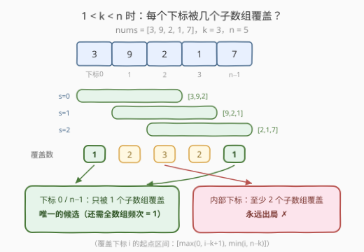
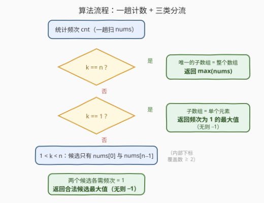

# 找出最大的几近缺失整数

- **题目名称**：找出最大的几近缺失整数
- **链接**：[3471. 找出最大的几近缺失整数](https://leetcode.cn/problems/find-the-largest-almost-missing-integer/)
- **难度**：简单
- **标签**：数组、哈希表

## 1. 题目概述

给你一个整数数组 `nums` 和一个整数 `k`。

如果整数 `x` **恰好仅出现在 `nums` 中的一个大小为 `k` 的子数组中**，则认为 `x` 是 `nums` 中的**几近缺失**（almost missing）整数。

返回 `nums` 中**最大的几近缺失**整数，如果不存在这样的整数，返回 `-1`。

> **子数组**是数组中的一个连续元素序列。注意「出现」是按**值**判断的：只要某个子数组里含有至少一个 `x`，就算 `x` 出现在这个子数组中。

**示例 1**：

```text
输入：nums = [3,9,2,1,7], k = 3
输出：7
解释：1 出现在两个大小为 3 的子数组中：[9,2,1]、[2,1,7]
      2 出现在三个大小为 3 的子数组中：[3,9,2]、[9,2,1]、[2,1,7]
      3 出现在一个大小为 3 的子数组中：[3,9,2]
      7 出现在一个大小为 3 的子数组中：[2,1,7]
      9 出现在两个大小为 3 的子数组中：[3,9,2]、[9,2,1]
      返回 7，因为它是满足题意的所有整数中最大的那个。
```

**示例 2**：

```text
输入：nums = [3,9,7,2,1,7], k = 4
输出：3
解释：3 只出现在 [3,9,7,2] 一个子数组中；而 7 出现在三个子数组中，不符合。
      返回 3。
```

**示例 3**：

```text
输入：nums = [0,0], k = 1
输出：-1
解释：不存在满足题意的整数（0 出现两次，分别落在两个长度为 1 的子数组里）。
```

**约束条件**：

- `1 <= nums.length <= 50`
- `0 <= nums[i] <= 50`
- `1 <= k <= nums.length`

> 💡 **读题关键**：① 「恰好出现在一个子数组」统计的是**包含该值的子数组个数**，不是该值出现的总次数；② 值域极小（`0–50`），暗示计数用桶/哈希表即可；③ `k` 可以取到 `n`，此时子数组只有一个，是必须单独处理的边界。

---

## 2. 解题思路

### 2.1 暴力思路

大小为 `k` 的子数组由起点 $s \in [0, n-k]$ 唯一决定，共 $n-k+1$ 个。暴力做法：枚举每个出现过的值 $x$，再枚举全部 $n-k+1$ 个子数组，统计包含 $x$ 的个数，恰好为 1 的参与取最大值：

```python
ans = -1
for x in set(nums):
    cnt = sum(1 for s in range(n - k + 1) if x in nums[s:s+k])
    if cnt == 1:
        ans = max(ans, x)
```

时间 $O(V \cdot n \cdot k)$（$V \le 51$ 为值域大小），$n \le 50$ 时最多约 $51 \times 47 \times 47 \approx 10^5$ 次操作，完全可通过。但**它没有利用问题的结构**——下面证明只有两个位置上的值有可能成为答案。

### 2.2 核心观察：端点覆盖数——分类讨论 O(n)



**观察（覆盖数公式）**：下标 $i$ 处的一次出现，被哪些起点 $s$ 的子数组覆盖？$s$ 需同时满足 $s \le i \le s+k-1$ 与 $0 \le s \le n-k$，即

$$
s \in \big[\max(0,\ i-k+1),\ \min(i,\ n-k)\big]
$$

据此对 $1 < k < n$（即 $k \ge 2$ 且 $n-k \ge 1$）逐类分析：

| 下标 $i$ | 覆盖它的起点区间 | 个数 |
|---|---|---|
| $i = 0$ | $[\,0,\ 0\,]$（只剩 $s=0$） | 恰 $1$ |
| $i = n-1$ | $[\,n-k,\ n-k\,]$（只剩 $s=n-k$） | 恰 $1$ |
| $1 \le i \le n-2$ | $\max(0,i-k+1) < \min(i,n-k)$，区间长度 $\ge 2$ | $\ge 2$ |

内部下标的证明：若 $i-k+1 \le 0$ 则左端为 $0 < 1 \le \min(i, n-k)$；否则左端 $i-k+1 \le i-1 < i$ 且 $i-k+1 \le n-k \Leftrightarrow i \le n-1$（内部严格成立），两种情况都有区间长度 $\ge 2$。

于是**值 $x$ 几近缺失** $\Leftrightarrow$ 覆盖 $x$ 所有出现位置的子数组并集大小恰为 $1$：

- 若 $x$ 出现在任何**内部**下标 → 至少 2 个子数组包含它，出局；
- 若 $x$ 同时出现在下标 $0$ 和 $n-1$ → 子数组 $[0..k-1]$ 与 $[n-k..n-1]$ 都包含它（$k<n$ 时二者不同），出局；
- 所以 $x$ 几近缺失 $\Leftrightarrow$ **$x$ 在全数组恰好出现一次，且出现位置是 $0$ 或 $n-1$**，即 $x \in \{nums[0],\ nums[n-1]\}$ 且频次为 $1$。

再补上两个退化的边界：

1. **$k = n$**：唯一的子数组就是整个数组，所有出现过的值都恰好出现在这 1 个子数组里 → 答案是 $\max(nums)$；
2. **$k = 1$**：每个子数组是单个元素，值 $x$ 恰出现在 1 个子数组 $\Leftrightarrow$ $x$ 在 `nums` 中恰好出现一次 → 答案是**频次为 1 的最大值**（无则 $-1$）。

> 💡 三类情况其实都能统一在覆盖数公式下：$k=n$ 时 $n-k=0$，「端点」$0$ 与 $n-1$ 的起点区间都坍缩成 $\{0\}$（同一个子数组）；$k=1$ 时每个下标（包括端点）的覆盖数都是 1，区分度只能来自**频次**。分类讨论只是把公式的两种退化显式写出来。

### 2.3 算法流程图



整体流程：一趟计数得到 `cnt`，然后三分支判断——`k == n` 直接返回最大值；`k == 1` 返回频次为 1 的最大值；否则只检查 `nums[0]` 与 `nums[n-1]` 两个候选，各自要求频次为 1，取合法者的最大值。

### 2.4 示例演算

以示例 2（`nums = [3,9,7,2,1,7]`，`k = 4`，`n = 6`）走一遍 $1 < k < n$ 分支。频次表：`3:1, 9:1, 7:2, 2:1, 1:1`。

| 候选 | 频次 | 是否合法 | 说明 |
|---|---|---|---|
| $nums[0] = 3$ | $1$ | ✅ | 只出现在下标 0，仅被子数组 $[3,9,7,2]$ 覆盖 |
| $nums[5] = 7$ | $2$ | ❌ | 出现在下标 2 和 5，覆盖它的子数组有 3 个 |

合法候选只有 $\{3\}$，答案 $3$，与官方输出一致。中间的 $9, 2, 1$ 无论频次如何，出现位置都是内部下标，覆盖数 $\ge 2$，直接出局。

---

## 3. 参考代码

### C++

```cpp
class Solution {
  public:
    int largestInteger(vector<int>& nums, int k) {
        int n = nums.size();
        if (k == n) return *max_element(nums.begin(), nums.end());

        vector<int> cnt(51, 0);              // 值域 0~50，直接开桶
        for (int x : nums) cnt[x]++;

        if (k == 1) {                        // 频次恰为 1 的最大值
            int ans = -1;
            for (int v = 0; v <= 50; v++)
                if (cnt[v] == 1) ans = max(ans, v);
            return ans;
        }

        int ans = -1;                        // 1 < k < n：只查两个端点
        if (cnt[nums[0]] == 1) ans = max(ans, nums[0]);
        if (cnt[nums[n - 1]] == 1) ans = max(ans, nums[n - 1]);
        return ans;
    }
};
```

### Python

```python
class Solution:
    def largestInteger(self, nums: List[int], k: int) -> int:
        n = len(nums)
        if k == n:                       # 唯一子数组 = 整个数组
            return max(nums)

        cnt = Counter(nums)

        if k == 1:                       # 频次恰为 1 的最大值
            return max((v for v in cnt if cnt[v] == 1), default=-1)

        ans = -1                         # 1 < k < n：只查两个端点
        if cnt[nums[0]] == 1:
            ans = nums[0]
        if cnt[nums[n - 1]] == 1:
            ans = max(ans, nums[n - 1])
        return ans
```

---

## 4. 复杂度分析

| 维度 | 复杂度 | 说明 |
|------|--------|------|
| 时间复杂度 | $O(n + V)$ | 一趟统计频次；$V = 51$ 为值域大小，可视为常数 |
| 空间复杂度 | $O(V)$ | 频次表（值域固定，常数空间） |

> 💡 若值域不受限，把桶换成哈希表（`Counter`），复杂度变为 $O(n)$ 时间、$O(n)$ 空间，结论不变。

---

## 5. 扩展：当分类讨论不好使时——通用化两条路

**① 覆盖区间求并（任意「恰好 m 个」）**：把变体推广为「恰好出现在 $m$ 个子数组中的最大值」。对值 $x$ 的出现位置 $p_1 < p_2 < \cdots < p_t$，子数组起点 $s$ **不含** $x$ 当且仅当 $s \notin [p_j,\ p_j+k-1]$ 对所有 $j$ 成立。把每个出现位置映射成起点数轴上的禁区间，做区间合并：

$$
\#\text{包含 } x = (n-k+1) - \Big|\bigcup_j [p_j,\ p_j+k-1] \cap [0,\ n-k]\Big|
$$

所有值合计 $O(n \log n)$。本题的分类讨论正是该公式在 $m=1$、$t=1$ 时的手算版。

**② bitset 暴力（保底通用解）**：当题目改成任意奇形怪状的计数条件（如「出现次数为质数」）时，回到暴力并用位运算加速——每个值 $x$ 的出现位置集合存成 50 位 bitset，每个起点 $s$ 的窗口 $[s, s+k-1]$ 也存成 bitset，两者按位与后 `popcount > 0` 即「窗口包含 $x$」。总操作约 $V \cdot (n-k+1)$ 次字长运算，$n \le 50$ 下瞬间完成。**先想结构性结论，想不出再用暴力兜底**，这在小数据范围的题目里是稳妥的答题策略。

---

## 6. 面试要点

1. **为什么 $1 < k < n$ 时内部位置的值永远出局？**
   - 覆盖下标 $i$ 的起点区间是 $[\max(0, i-k+1), \min(i, n-k)]$。当 $k \ge 2$ 且 $n-k \ge 1$ 时，内部下标（$1 \le i \le n-2$）该区间长度 $\ge 2$，即至少两个不同子数组包含它，不可能「恰好一个」。

2. **$k = 1$ 和 $k = n$ 为什么必须单独处理？**
   - $k = n$ 时 $n - k = 0$，端点 $0$ 与 $n-1$ 的覆盖区间坍缩成同一个起点 $\{0\}$（同一个子数组），「出现两次也在同一个子数组里」；$k = 1$ 时每个下标（含端点）覆盖数都是 1，瓶颈从位置转移到频次。两种退化都推翻「端点 + 频次 1」的判据。

3. **频次为什么要按整个数组统计，而不是按某个子数组？**
   - 「几近缺失」按**值**定义：包含 $x$ 的子数组集合是覆盖其**所有**出现位置的子数组之并。哪怕某个窗口里 $x$ 只出现一次，只要别的窗口也含有 $x$（在别处出现），就不满足「恰好一个」。

4. **返回 $-1$ 作哨兵安全吗？**
   - 安全。约束 $nums[i] \ge 0$，任何合法答案都 $\ge 0$，不会与哨兵混淆；若题目改成可为负，需换成 `optional` / 标志位。

5. **如何验证分类讨论没有漏情况？**
   - 小数据范围（$n \le 50$）正好适合**对拍**：写 2.1 的暴力，随机生成几万组 $(nums, k)$ 与 O(n) 解法比对。本文结论即经 2 万组随机测试验证。

---

## 7. 同类练习题

- [217. 存在重复元素](https://leetcode.cn/problems/contains-duplicate/)（[题解](../0001-0100/217_存在重复元素.md)）：频次计数判断「恰好一次」的基本功
- [219. 存在重复元素 II](https://leetcode.cn/problems/contains-duplicate-ii/)（[题解](../0001-0100/219_存在重复元素II.md)）：把「出现位置的下标距离」写进哈希条件，与本题覆盖区间的思路同源
- [438. 找到字符串中所有字母异位词](https://leetcode.cn/problems/find-all-anagrams-in-a-string/)（[题解](../0401-0500/438_找到字符串中所有字母异位词.md)）：固定长度窗口的滑动计数，练「窗口内频次」的维护
- [643. 子数组最大平均数 I](https://leetcode.cn/problems/maximum-average-subarray-i/)（[题解](../0601-0700/643_子数组最大平均数I.md)）：最裸的「大小为 k 的子数组」遍历，本题暴力分支的原型
- [2461. 长度为 K 的子数组中的最大和](https://leetcode.cn/problems/maximum-sum-of-distinct-subarrays-with-length-k/)（[题解](../2401-2500/2461_长度为K子数组中的最大和.md)）：固定窗口 + 频次表判重的综合练习
