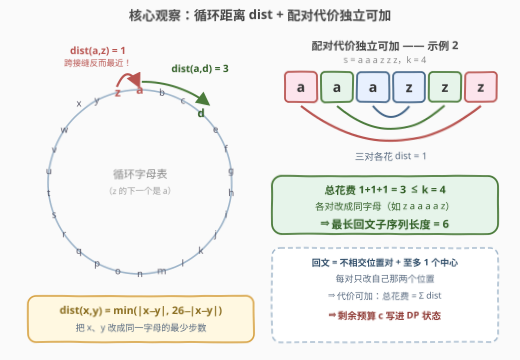
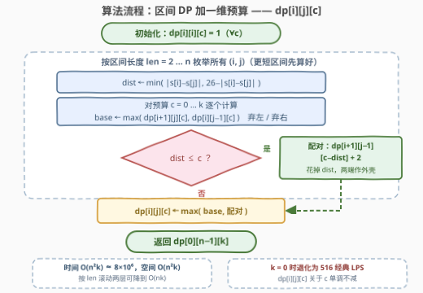

# LeetCode 至多K次操作后的最长回文子序列 题解

## 1. 题目概述

- **标题 / 题号**：至多K次操作后的最长回文子序列（#3472，medium）
- **链接**：https://leetcode.cn/problems/longest-palindromic-subsequence-after-at-most-k-operations/
- **难度**：中等
- **标签**：字符串、动态规划、区间 DP

**题意**：给定字符串 `s` 和整数 `k`。一次操作可以把**任意位置**的字符替换为字母表中**相邻**的字符——字母表是**循环**的，`'z'` 的下一个字母是 `'a'`（同理 `'a'` 的上一个是 `'z'`）。

求**至多进行 `k` 次操作后**，`s` 的**最长回文子序列**的长度（子序列允许跳过任意字符，保持剩余字符相对顺序）。

**示例 1**：

```text
输入：s = "abced", k = 2
输出：3
解释：s[1] 'b'→'c'、s[4] 'd'→'c' 后得到 "accec"，其子序列 "ccc" 是长度 3 的回文。
```

**示例 2**：

```text
输入：s = "aaazzz", k = 4
输出：6
解释：三对 (a,z) 各改一步可得到 "zaaaaz"，整个字符串即回文。
```

**约束**：

- `1 <= s.length <= 200`
- `1 <= k <= 200`
- `s` 仅由小写英文字母组成

> 💡 **读题关键**：① 操作作用在**单个位置**、每次只挪一步字母，且字母表**首尾相接**——把两个字母变成相同的花费是**循环距离**而非 $|x-y|$（`a` 与 `z` 只差 1！）；② 求的是**子序列**，这是 516 题「最长回文子序列」的带预算版；③ $n, k \le 200$ 的数据范围暗示 $O(n^2 k)$ 量级的 DP。

## 2. 解题思路

### 2.1 暴力思路

最直接的做法：枚举 `s` 的所有子序列（$2^n$ 个），再枚举如何把它们修改成回文——直接爆炸。

退一步，先把「修改」这层抽象掉：

- 回文子序列由**若干对对称位置**（可能外加一个中心字符）构成；
- 每对 $(i, j)$ 只要求最终 $s_i = s_j$，与其它位置的修改无关。

于是真正需要量化的只剩「把两个字母变相同的最少操作数」。结合 $n, k \le 200$ 的提示，方向明确：在 516 题经典区间 DP 的基础上**加一维预算**。

### 2.2 核心观察：循环距离作配对代价，预算进状态



**观察 1（单对代价 = 循环距离）**：一次操作把一个字符挪一步（字母表循环）。把字母 $x, y$ 改成同一字母的最少操作数是

$$\operatorname{dist}(x, y) = \min\big(|x - y|,\ 26 - |x - y|\big)$$

任取公共目标字母 $t$ 都有 $\operatorname{dist}(x,t) + \operatorname{dist}(y,t) \ge \operatorname{dist}(x,y)$（循环距离满足三角不等式），而直接把 $x$ 原样挪到 $y$ 即可取等。

**观察 2（配对独立、代价可加）**：回文的各对称位置对**互不重叠**，每对只修改自己那两个位置 ⇒ 修改互不干扰，**总代价 = 各对 dist 之和**。示例 2 中三对 `(a,z)` 各花 1 步，共 $3 \le 4$。

**观察 3（预算进状态）**：在经典 LPS 区间 DP 上加一维剩余预算：

$$dp[i][j][c] = s[i..j] \text{ 内、总花费} \le c \text{ 的最长回文子序列长度}$$

转移三选一——**弃左端**、**弃右端**、**两端配成一对外壳**（花 dist）：

$$
dp[i][j][c] = \max\begin{cases}
dp[i+1][j][c] & \text{（不选 } s_i\text{）}\\[2pt]
dp[i][j-1][c] & \text{（不选 } s_j\text{）}\\[2pt]
dp[i+1][j-1]\big[c-\operatorname{dist}(s_i, s_j)\big] + 2 & \text{（配对，需 } \operatorname{dist} \le c\text{）}
\end{cases}
$$

边界：$dp[i][i][c] = 1$（单字符零花费）；$i > j$ 时为 $0$。答案即 $dp[0][n-1][k]$。

> ⚠️ **不能贪心地「优先配便宜的对外壳」**：各配对**竞争同一份全局预算**，且外层配对决定了内层还能用哪些字符，二者耦合（便宜的外壳可能逼出昂贵的内层），没有可交换性——必须把预算写进状态联合决策。

### 2.3 算法流程图



流程与经典区间 DP 完全同构，只多一层 `c` 循环：外层按**区间长度**从小到大，保证计算 `dp[i][j]` 时更短的区间（`dp[i+1][j]`、`dp[i][j-1]`、`dp[i+1][j-1]`）都已就绪；每个 `(i, j)` 先算出两端的循环距离 `dist`，再对每个预算 `c` 做三选一取最大。

### 2.4 示例演算

以示例 2（`s = "aaazzz"`，`k = 4`）看最优解在转移中的路径：

| 区间 | 两端 | dist | 决策 | 预算变化 | 贡献 |
|------|------|------|------|----------|------|
| `[0, 5]` | `a…z` | 1 | 配对 | 4 → 3 | +2 |
| `[1, 4]` | `a…z` | 1 | 配对 | 3 → 2 | +2 |
| `[2, 3]` | `a…z` | 1 | 配对 | 2 → 1 | +2 |
| 空区间 | — | — | 结束 | 剩 1（用不完） | 0 |

总花费 $1+1+1 = 3 \le 4$，回文长 $6$（如 `zaaaaz`）。再看示例 1（`s = "abced"`，`k = 2`）：长 3 可行——外对 `b…d`（dist 2）各挪一步变成 `c…c`，带上中心 `c`，即官方的 `"ccc"`；而长 4 需要两对**嵌套**配对，枚举可知最少共花 4 步（如外对 `b…d` 花 2 + 内对 `c…e` 花 2）$> 2$，故答案为 3。

## 3. 参考代码

### C++

```cpp
class Solution {
  public:
    int longestPalindromicSubsequence(string s, int k) {
        int n = s.size();
        // dp[i][j][c]：s[i..j] 内总花费 <= c 的最长回文子序列长度
        vector dp(n, vector(n, vector<int>(k + 1, 0)));
        for (int i = 0; i < n; i++)
            for (int c = 0; c <= k; c++)
                dp[i][i][c] = 1;                          // 单字符零花费
        for (int len = 2; len <= n; len++) {
            for (int i = 0; i + len - 1 < n; i++) {
                int j = i + len - 1;
                int d = abs(s[i] - s[j]);
                int dist = min(d, 26 - d);                // 循环距离
                for (int c = 0; c <= k; c++) {
                    int best = max(dp[i + 1][j][c], dp[i][j - 1][c]);  // 弃左 / 弃右
                    if (dist <= c)
                        best = max(best, dp[i + 1][j - 1][c - dist] + 2);  // 配对
                    dp[i][j][c] = best;
                }
            }
        }
        return dp[0][n - 1][k];
    }
};
```

### Python

```python
class Solution:
    def longestPalindromicSubsequence(self, s: str, k: int) -> int:
        n = len(s)
        # dp[i][j][c]：s[i..j] 内总花费 <= c 的最长回文子序列长度
        dp = [[[0] * (k + 1) for _ in range(n)] for _ in range(n)]
        for i in range(n):
            for c in range(k + 1):
                dp[i][i][c] = 1                    # 单字符零花费
        for length in range(2, n + 1):
            for i in range(n - length + 1):
                j = i + length - 1
                d = abs(ord(s[i]) - ord(s[j]))
                dist = min(d, 26 - d)              # 循环距离
                inner, skip_l, skip_r = dp[i + 1][j - 1], dp[i + 1][j], dp[i][j - 1]
                row = dp[i][j]
                for c in range(k + 1):
                    best = max(skip_l[c], skip_r[c])          # 弃左 / 弃右
                    if dist <= c and inner[c - dist] + 2 > best:
                        best = inner[c - dist] + 2            # 两端配对
                    row[c] = best
        return dp[0][n - 1][k]
```

## 4. 复杂度分析

| 维度 | 复杂度 | 说明 |
|------|--------|------|
| 时间复杂度 | O(n²k) | 区间 $O(n^2)$ × 预算 $k+1$，每状态 $O(1)$ 转移；$200^2 \times 200 \approx 8 \times 10^6$ |
| 空间复杂度 | O(n²k) | 三维 DP 表（`int` 约 32 MB）；按区间长度滚动两层可降至 O(nk) |

> 💡 令 $k = 0$（只允许 $\operatorname{dist} = 0$ 的免费配对），转移恰好退化为 516 题的经典 LPS——本题就是「经典模板 + 一维费用」的组合拳。

## 5. 扩展：记忆化搜索与变体

**记忆化搜索**（与官方 hint 的 `dp[i][j][k]` 定义一一对应，自顶向下更贴近转移式）：

```python
class Solution:
    def longestPalindromicSubsequence(self, s: str, k: int) -> int:
        @cache
        def dfs(i: int, j: int, c: int) -> int:
            if i > j:
                return 0
            if i == j:
                return 1
            best = max(dfs(i + 1, j, c), dfs(i, j - 1, c))
            d = abs(ord(s[i]) - ord(s[j]))
            dist = min(d, 26 - d)
            if dist <= c:
                best = max(best, dfs(i + 1, j - 1, c - dist) + 2)
            return best

        return dfs(0, len(s) - 1, k)
```

**变体思考**：

- **字母表不循环**（`z` 之后再无字母）：$\operatorname{dist}$ 退化为 $|x - y|$，其余不变；
- **「恰好 k 次」**：操作可以原地空转（来回改两次复原），故与「至多 k 次」等价；
- **对偶指标**：也可定义 $g[i][j][L]$ = 区间内长度为 $L$ 的回文子序列的**最小花费**，答案取最大的可行 $L$——复杂度同阶，但直接写「预算上界」版更顺手。

## 6. 面试要点

1. **为什么把两端改成同字母的最少代价是 dist(x,y)？**
   - 每次操作只能把一个位置的字符挪到相邻字母；两个字符各挪若干步在某字母相遇，由循环距离的三角不等式，总步数 $\ge \operatorname{dist}(x,y)$，且把一端原样挪到另一端即取等。

2. **为什么各配对的代价可以直接相加？**
   - 回文的对称位置对互不重叠，每对只修改自己那两个位置，操作之间零干扰。反之，若操作一次影响多个位置（如交换、区间移位），可加性就破了，状态需要重新设计。

3. **为什么不能贪心（优先配代价小的对）？**
   - 配对共享同一份全局预算，且外层配对决定了内层可用的字符集合，两者耦合，构造反例容易。区间 DP 把「选哪些位置对 + 花多少预算」放进一个状态联合决策。

4. **dp[i][j][c] 关于 c 有什么性质？**
   - 单调不减（预算越多，能达到的长度不会更小）。本题只在 $c = k$ 处查询；若多次询问不同预算，整张表可直接复用。

5. **与 516 题的关系？**
   - $k = 0$ 时只有相同字母对（$\operatorname{dist} = 0$）可免费配对，转移退化为经典 LPS。识别出「原型题 + 附加费用维」的套路，考场上就能快速迁移。

## 同类练习题

| # | 题目 | 与本题的关联 |
|---|------|-------------|
| 516 | [最长回文子序列](https://leetcode.cn/problems/longest-palindromic-subsequence/)（[题解](../0501-0600/516_最长回文子序列.md)） | 本题的零预算原型，先掌握这个再叠加费用维 |
| 1216 | [验证回文串 III](https://leetcode.cn/problems/valid-palindrome-iii/)（[题解](../1201-1300/1216_验证回文串III.md)） | 把「至多 k 次删除」作为预算写进区间 DP，结构完全同构 |
| 1312 | [让字符串成为回文串的最少插入次数](https://leetcode.cn/problems/minimum-insertion-steps-to-make-a-string-palindrome/)（[题解](../1301-1400/1312_让字符串成为回文串的最少插入次数.md)） | 对偶指标——长度固定求最小代价，同样源于 LPS 区间 DP |
| 1771 | [由子序列构造的最长回文串的长度](https://leetcode.cn/problems/maximize-palindrome-length-from-subsequences/)（[题解](../1701-1800/1771_由子序列构造的最长回文串的长度.md)） | LPS 的跨两字符串变体，练区间 DP 的状态扩展 |
