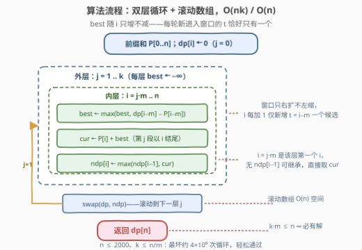

# 长度至少为M的K个子数组之和

- **题目名称**：长度至少为 M 的 K 个子数组之和
- **链接**：[3473. 长度至少为 M 的 K 个子数组之和](https://leetcode.cn/problems/sum-of-k-subarrays-with-length-at-least-m/)
- **难度**：中等
- **标签**：数组、动态规划、前缀和

## 1. 题目概述

给定一个整数数组 `nums` 和两个整数 `k`、`m`，要求从 `nums` 中选出 **k 个互不重叠的子数组**，且每个子数组的**长度至少为 m**，返回这 k 个子数组的**最大**总和。子数组是数组中的一个连续序列。

**示例 1**：

```text
输入：nums = [1,2,-1,3,3,4], k = 2, m = 2
输出：13
解释：选 nums[0..1]（和为 1 + 2 = 3，长度 2 ≥ m）与 nums[3..5]（和为 3 + 3 + 4 = 10，长度 3 ≥ m），
      总和 3 + 10 = 13。
```

**示例 2**：

```text
输入：nums = [-10,3,-1,-2], k = 4, m = 1
输出：-10
解释：必须恰好选 4 个子数组，把每个元素单独作为一段：(-10) + 3 + (-1) + (-2) = -10。
```

**约束条件**：

- `1 <= nums.length <= 2000`
- `-10^4 <= nums[i] <= 10^4`
- `1 <= k <= floor(nums.length / m)`
- `1 <= m <= 3`

> 💡 **读题关键**：① 是「恰好 k 个」而不是「至多 k 个」——元素全负时（示例 2）不能少选，答案可以为负；② 约束 $k \cdot m \le n$ 保证**一定有可行方案**，无需判无解；③ $n \le 2000$ 但 $k$ 最大也是 $2000$，朴素的 $O(n^2 k)$ 划分 DP 会到 $8 \times 10^9$，必须优化掉内层枚举。

---

## 2. 解题思路

### 2.1 暴力思路

「k 个不重叠子数组、每个长度 ≥ m」是一个**划分型**结构：把数组按顺序切出 k 个连续段，段与段之间允许留空隙。最暴力的做法是组合枚举所有切法，指数级爆炸。

退一步的**标准划分 DP**：记 $P[i]$ 为前 $i$ 个元素的前缀和，定义

$$dp[j][i] = \text{前 } i \text{ 个元素中恰好选 } j \text{ 个长度} \ge m \text{ 的不重叠子数组的最大和}$$

按「最后一个子数组在哪里结束」分类，转移为：

$$dp[j][i] = \max\Big(dp[j][i-1],\ \max_{t} \big(dp[j-1][t] + P[i] - P[t]\big)\Big),\qquad (j-1)m \le t \le i-m$$

两个分支分别对应「第 $i$ 个元素不属于任何选中段的结尾」（跳过）与「最后一个子数组为 $nums[t..i-1]$、长度 $i - t \ge m$」。边界 $dp[0][i] = 0$，答案 $dp[k][n]$。

问题在复杂度：每个状态要枚举 $O(n)$ 个 $t$，总时间 $O(n^2 k)$——$n = k = 2000$ 时约 $8 \times 10^9$，不可接受。瓶颈正是那个内层 $\max_t$。

### 2.2 核心观察：拆出 P[i]，窗口只右扩 ⇒ 单变量前缀最大值

![核心观察：最后一段独立决策，max 里拆出 P[i]，用单变量维护窗口前缀最大值](../images/p3473_dp_transition.svg)

**观察 1（$P[i]$ 与 $t$ 无关，可以提出来）**：把转移里的 $P[i]$ 从 $\max_t$ 中提出去：

$$dp[j][i] = \max\Big(dp[j][i-1],\ P[i] + \underbrace{\max_{(j-1)m \le t \le i-m}\big(dp[j-1][t] - P[t]\big)}_{\text{best}}\Big)$$

**观察 2（候选窗口单调右扩）**：固定 $j$，当 $i$ 从左往右扫时，$t$ 的合法区间 $[(j-1)m,\ i-m]$ 的**左端不动、右端每次恰好前进 1**——每轮只有 $t = i - m$ 这一个新候选进入。于是 $\text{best}$ 用**一个变量**顺路维护即可：

$$\text{best} \leftarrow \max\big(\text{best},\ dp[j-1][i-m] - P[i-m]\big)$$

> 💡 对比 [239. 滑动窗口最大值](https://leetcode.cn/problems/sliding-window-maximum/)：那题窗口**左端也会动**（要弹出过期元素）才需要单调队列；这里左端固定，是「前缀最大值」而非「滑动窗口最大值」，单变量就够。

**观察 3（下界 $(j-1)m$ 天然合法）**：$t \ge (j-1)m$ 保证前 $t$ 个元素塞得下 $j-1$ 个长 $m$ 的段；又因 $km \le n$，归纳可知每个 $dp[j][jm]$ 都是可达的，`best` 从该层第一个 $i = jm$ 起就有有效值，全程无需哨兵判空。

至此内层枚举被消掉：外层 $j$、内层 $i$ 各扫一遍，总时间 $O(nk)$，滚动数组空间 $O(n)$。最坏 $2000 \times 2000 = 4 \times 10^6$ 次基本操作。

### 2.3 算法流程图



流程是规整的两层循环：外层 $j = 1..k$ 每层把 `best` 重置为 $-\infty$，内层 $i$ 从 $jm$ 扫到 $n$，先让新候选 $t = i - m$ 进入 `best`，再用 $\max(ndp[i-1],\ P[i] + \text{best})$ 填新行；一层做完 `swap(dp, ndp)` 滚动进入下一层，最后 $dp[n]$ 即答案。

### 2.4 示例演算

以示例 1（`nums = [1,2,-1,3,3,4]`，`k = 2`，`m = 2`）走一遍，$P = [0, 1, 3, 2, 5, 8, 12]$：

**第 1 层 $j = 1$**（上一层 $dp[t] \equiv 0$，故 `best` 始终为 $0$）：

| $i$ | 新进入的 $t = i-2$ | best $= \max(dp[t] - P[t])$ | $P[i] + \text{best}$ | $ndp[i]$ |
|---|---|---|---|---|
| 2 | 0 | $\max(-\infty,\ 0-0) = 0$ | $3$ | $3$ |
| 3 | 1 | $\max(0,\ 0-1) = 0$ | $2$ | $\max(3, 2) = 3$ |
| 4 | 2 | $\max(0,\ 0-3) = 0$ | $5$ | $5$ |
| 5 | 3 | $\max(0,\ 0-2) = 0$ | $8$ | $8$ |
| 6 | 4 | $\max(0,\ 0-5) = 0$ | $12$ | $12$ |

得到 $dp = [\cdot,\cdot,3,3,5,8,12]$——正是「前 $i$ 个元素中长度 ≥ 2 的最大子数组和」。

**第 2 层 $j = 2$**（上一层即上表）：

| $i$ | 新进入的 $t = i-2$ | best 更新 | $P[i] + \text{best}$ | $ndp[i]$ |
|---|---|---|---|---|
| 4 | 2 | $dp[2]-P[2] = 3-3 = 0 \Rightarrow$ best $= 0$ | $5$ | $5$ |
| 5 | 3 | $dp[3]-P[3] = 3-2 = 1 \Rightarrow$ best $= 1$ | $9$ | $9$ |
| 6 | 4 | $dp[4]-P[4] = 5-5 = 0 \Rightarrow$ best 仍 $1$ | $\mathbf{13}$ | $13$ |

第 2 层 $i=6$ 时 best 保留的是 $t=3$ 的候选：前 3 个元素选 1 段（$[1,2]$ 和为 3），最后一段 $nums[3..5] = 3+3+4 = 10$，合计 $13$，与示例一致。

---

## 3. 参考代码

### C++

```cpp
class Solution {
  public:
    int maxSum(vector<int>& nums, int k, int m) {
        int n = nums.size();
        vector<long long> P(n + 1);
        for (int i = 0; i < n; i++) P[i + 1] = P[i] + nums[i];

        vector<long long> dp(n + 1, 0);          // j = 0 行：不选任何子数组，和为 0
        vector<long long> ndp(n + 1);
        for (int j = 1; j <= k; j++) {
            long long best = LLONG_MIN;          // max{ dp[t] - P[t] : (j-1)*m <= t <= i-m }
            for (int i = j * m; i <= n; i++) {
                int t = i - m;                   // i 右移一格，t = i-m 恰好新进入窗口
                best = max(best, dp[t] - P[t]);
                long long cur = P[i] + best;     // 第 j 个子数组以 i 结尾
                ndp[i] = (i == j * m) ? cur : max(ndp[i - 1], cur);
            }
            swap(dp, ndp);                       // 滚动到下一层
        }
        return (int)dp[n];
    }
};
```

### Python

```python
class Solution:
    def maxSum(self, nums: List[int], k: int, m: int) -> int:
        n = len(nums)
        P = [0] * (n + 1)
        for i, x in enumerate(nums):
            P[i + 1] = P[i] + x

        dp = [0] * (n + 1)                  # j = 0 行：不选任何子数组
        for j in range(1, k + 1):
            ndp = [0] * (n + 1)
            best = -inf                     # max{ dp[t] - P[t] : (j-1)*m <= t <= i-m }
            for i in range(j * m, n + 1):
                t = i - m                   # i 右移一格，t = i-m 恰好新进入窗口
                best = max(best, dp[t] - P[t])
                cur = P[i] + best           # 第 j 个子数组以 i 结尾
                ndp[i] = cur if i == j * m else max(ndp[i - 1], cur)
            dp = ndp                        # 滚动到下一层
        return dp[n]
```

> ⚠️ **两个易错点**：① `ndp[i]` 在 $i = jm$（该层第一个位置）时没有 `ndp[i-1]` 可继承，必须直接取 `cur`；② 新一层的循环从 $i = jm$ 起步，天然只会读上一层的 $t \ge (j-1)m$，因此 `ndp` 中 $< jm$ 的位置虽是脏值也绝不会被读到——想清楚这一点就不必每层重置整行。

---

## 4. 复杂度分析

| 维度 | 复杂度 | 说明 |
|------|--------|------|
| 时间复杂度 | $O(nk)$ | 外层 $j$ 共 $k$ 轮，每轮内层 $i$ 单趟扫描，每个位置仅常数次比较与加法 |
| 空间复杂度 | $O(n)$ | 前缀和数组 + 两行滚动数组 |
| 数据范围验证 | — | $n \le 2000$，$k \le n/m$：最坏 $4 \times 10^6$ 次操作；元素绝对值 $\le 10^4$，总和上界 $2 \times 10^7$，`int` 足够（中间用 64 位更稳） |

> 💡 若不提取 $P[i]$、逐状态枚举 $t$，则是 $O(n^2 k) \approx 8 \times 10^9$——本题数据范围就是冲着「会不会消内层 max」设计的。

---

## 5. 扩展：从「恰好 k 段」到经典变体

**（a）$m = 1$ 的特化——经典「k 个不重叠子数组最大和」**：$m = 1$ 时约束退化为「每段长度 ≥ 1」，正是 [1031. 两个非重叠子数组的最大和](https://leetcode.cn/problems/maximum-sum-of-two-non-overlapping-subarrays/)、[689. 三个无重叠子数组的最大和](https://leetcode.cn/problems/maximum-sum-of-3-non-overlapping-subarrays/) 的推广版。这两题还附带「长度恰好等于某定值」的要求，做法不变：把转移里的长度下界换成定值即可（此时 $t = i - L$ 唯一，连 `best` 都不用维护）。

**（b）「至多 k 段」怎么改**：本题是「恰好 k 段」。若改成「至多 k 段且可以为空」，当元素存在负数时答案会变大——只需把初始行也纳入转移（$dp[j][i]$ 允许从 $dp[j-1][i]$ 以「空段」转移，或直接对 $j \le k$ 的所有行取 $\max$）；全正数时「至多」与「恰好」等价。

**（c）另一等价状态设计**：也可以定义 $f[i][j][0/1]$——前 $i$ 个元素、已完整选好 $j$ 段、第 $i$ 个元素是否正被某段覆盖（「正在延伸」）。转移在「开新段 / 继续延伸 / 空一格」三选一，$O(nk)$ 空间稍大、但不需要前缀和。两种写法可互推，面试时任选一种讲清即可。

---

## 6. 面试要点

1. **状态为什么这样定义？「跳过」分支为什么必不可少？**
   - 段与段之间允许有空隙（未选中的元素），$dp[j][i-1]$ 这一支正是「第 $i$ 个元素不作为任何段的一部分」；同时它是「恰好 k 段」语义下允许负元素进出答案的关键（示例 2 不能少选也不能多选）。

2. **内层 max 怎么消的？为什么不需要单调队列？**
   - $P[i]$ 与 $t$ 无关先提出去；剩下 $\max_t (dp[j-1][t] - P[t])$ 的候选窗口 $[(j-1)m,\ i-m]$ 左端固定、右端随 $i$ 每次 +1，只进不出，单变量顺路取 max 即前缀最大值。单调队列是给「左端也移动」的窗口准备的。

3. **`best` 的初始值与该层第一个 `i` 为什么安全？**
   - 该层 $i = jm$ 时窗口恰好含 $t = (j-1)m$ 一个候选，且由 $km \le n$ 归纳可知 $dp[j-1][(j-1)m]$ 必可达，故 `best` 自始至终有效，无需哨兵判空、也无需担心读到脏值。

4. **为什么滚动数组里 `ndp` 的小下标脏值不碍事？**
   - 第 $j$ 层只会写 $[jm, n]$，而第 $j+1$ 层只会读 $t \ge jm$ 的位置，恰好都在新写范围内；最终答案 $dp[n]$ 也有 $n \ge km$ 保证。若不放心，把每层起点统一写成从 $jm$ 开始即可。

5. **复杂度卡在哪，数据范围给了什么暗示？**
   - $n \le 2000$ 说明 $O(n^2)$（约 $4 \times 10^6$）可过、$O(n^2 k)$ 不可过；$m \le 3$ 很小反而把 $k$ 上限抬到 $n$，逼着必须做掉 $k$ 这一维里的内层枚举——读约束时就要预判到这层优化。

---

## 7. 同类练习题

- [689. 三个无重叠子数组的最大和](https://leetcode.cn/problems/maximum-sum-of-3-non-overlapping-subarrays/)：本题 $k=3$、长度恰为定值的经典版，前后缀分解或同款划分 DP 都可解
- [1031. 两个非重叠子数组的最大和](https://leetcode.cn/problems/maximum-sum-of-two-non-overlapping-subarrays/)：$k=2$ 的入门版，体会「固定长度 ⇒ $t$ 唯一」带来的简化
- [813. 最大平均值和的分组](https://leetcode.cn/problems/largest-sum-of-averages/)：同款划分型 DP，段长无下界、目标换成平均和最大化
- [1278. 分割回文串 III](https://leetcode.cn/problems/palindrome-partitioning-iii/)：划分型 DP + 预处理代价（回文修改代价表对应本题的前缀和）
- [1335. 工作计划的最低难度](https://leetcode.cn/problems/minimum-difficulty-of-a-job-schedule/)：划分型 DP 求最小化，转移同样是「最后一段独立决策 + 内层枚举可优化结构」
