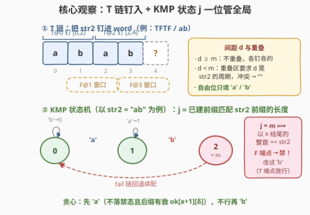
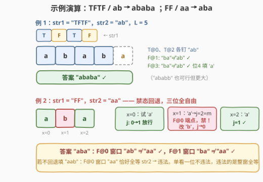

# 字典序最小的生成字符串

- **题目名称**：字典序最小的生成字符串
- **链接**：[3474. 字典序最小的生成字符串](https://leetcode.cn/problems/lexicographically-smallest-generated-string/)
- **难度**：困难
- **标签**：贪心、字符串、字符串匹配、KMP 自动机、动态规划

## 1. 题目概述

给定长度为 $n$ 的串 `str1`（只含 `'T'`/`'F'`）和长度为 $m$ 的串 `str2`（小写字母）。称长度为 $n + m - 1$ 的串 `word` 由二者**生成**，若对每个下标 $0 \le i \le n-1$：

- `str1[i] == 'T'`：从 $i$ 开始、长度为 $m$ 的子串**等于** `str2`，即 `word[i..i+m-1] == str2`；
- `str1[i] == 'F'`：该子串**不等于** `str2`。

返回可生成的**字典序最小**的 `word`；不存在则返回 `""`。

**示例 1**：

```text
输入：str1 = "TFTF", str2 = "ab"
输出："ababa"
解释：T@0 与 T@2 分别把 "ab" 钉在 [0,2) 和 [2,4)；
      F@1 的窗口 "ba" ≠ "ab"，F@3 的窗口 "ba" ≠ "ab"，均自动满足；
      剩余自由位 4 填 'a'，得 "ababa"（"ababb" 也可行但更大）。
```

**示例 2**：

```text
输入：str1 = "TFTF", str2 = "abc"
输出：""
解释：T@0 钉 word[0..3) = "abc"，T@2 钉 word[2..5) = "abc"，
      word[2] 被同时要求为 'c' 和 'a'，冲突，无解。
```

**示例 3**：

```text
输入：str1 = "F", str2 = "d"
输出："a"
```

**约束**：$1 \le n \le 10^4$，$1 \le m \le 500$。注意 $L = n + m - 1$ 可达 $10^4 + 499$。

> 💡 **读题关键**：`word` 的长度被**锁死**为 $n + m - 1$——第 $i$ 个窗口恰好是 `word[i..i+m)`，最后一个窗口的右端点正好贴着串尾。`'T'` 是**等值强制**（把 `str2` 整段钉进去），`'F'` 是**不等式约束**（只需窗口内至少一个位置与 `str2` 对应字符不同）。两类约束数量都不超过 $n$，且互相重叠纠缠——这正是本题困难所在。

---

## 2. 解题思路

### 2.1 暴力思路

最朴素的做法：`word` 有 $L$ 个位置，每处 26 种选法，枚举 $26^L$ 种组合再逐窗口校验——指数级直接爆炸。哪怕退一步用「逐位 DFS + 剪枝」（前缀一旦让某个 `'T'` 窗口无法成立即回溯），`'F'` 约束仍是**全局**的：一个 `'F'` 窗口是否成立要看它**全部** $m$ 个字符，剪不掉。$L \approx 10^4$ 的规模要求算法至少是 $O(L \cdot m)$ 级别的多项式方法。

先冷静拆解约束的结构，会发现问题天然分成两半：

1. **`'T'` 窗口没有任何自由度**——它就是把 `str2` 钉进 `word` 的对应区间。钉的过程中若两个 `T` 窗口对同一位置要求了不同字符，直接无解。这一步是纯粹的**确定性填充 + 冲突检测**。
2. **`'F'` 窗口只剩「打破」需求**——钉完 `'T'` 后，剩余自由位随便填，唯一的隐患是「某个 `F` 窗口 $m$ 个字符恰好与 `str2` 全等」。要字典序最小，自然想让自由位尽量填 `'a'`，只在被迫时抬高。

于是整个算法 = **阶段一：填死 `'T'`；阶段二：贪心填 `'F'` 区的自由位**。

### 2.2 核心观察：T 链周期一致性 + KMP 状态 + 贪心 `'a'/'b'`



**观察一：相邻 T 窗口重叠 ⟺ 间距是 str2 的周期。**

设两个 `T` 下标 $i < j$，间距 $d = j - i < m$ 时窗口重叠，重叠区同时满足 `str2[k] == str2[k+d]`（$0 \le k < m-d$）——即 $d$ 是 `str2` 的**周期**。实现上不必显式判周期：把每个 `T` 窗口逐位写入、写前比对（已被写过且字符不同即冲突返回 `""`），相邻一致后由 Fine–Wilf 定理可证链内所有窗口两两一致（$p$、$q$ 均为周期且 $p+q-\gcd(p,q) \le m$ 时 $\gcd(p,q)$ 也是周期），不会出现「逐对检查通过、整体却矛盾」的假阴性。相邻 `T` 间距 $\ge m$ 时窗口不重叠，互不干扰。全 `T` 且间距为 1 是最强的情形：它要求 `str2` 本身所有字符相同。

**观察二：判定「F 窗口等于 str2」只需一个 KMP 匹配状态。**

阶段一结束后 `word` 分成「固定字符」与「自由位」两类。扫描前缀时维护 KMP 自动机状态：

$$j = \text{「已构建前缀的最长后缀，其长度恰为 } str2 \text{ 前缀的长度」}$$

读入字符 $c$ 后 $j' = \delta(j, c)$（沿 `fail` 链回退的经典转移，预处理 $(m+1) \times 26$ 张转移表）。**关键**：位置 $x$ 处 $j' = m$ 当且仅当「以 $x$ 结尾的长度为 $m$ 的窗口恰好等于 `str2`」。而每个位置 $x \ge m-1$ 恰是一个窗口（起点 $x-m+1$）的末端——于是 `F` 约束的判定被压缩成一行：

> 处理完位置 $x$ 后状态为 $m$，且 `str1[x-m+1] == 'F'` ⟹ 违法。

不需要记住「哪个窗口匹配到哪里」——一个 $j \in [0, m]$ 就概括了所有窗口的全部历史，这正是 KMP 状态机的压缩威力（状态数 $m+1$ 而非窗口数 $n$）。

**观察三：自由位只需在 `'a'`/`'b'` 中二选一。**

字典序最小 ⟹ 自由位默认填 `'a'`。需要**抬高**一个自由位的唯一动机是打破某个 `F` 窗口：位置 $x$ 若要成为窗口 $i$ 的「打破点」，只需 `word[x] != str2[x-i]`——与某字符不同的最小字母，要么是 `'a'`（当 `str2[x-i] != 'a'`），要么是 `'b'`（当 `str2[x-i] == 'a'`）。也就是说候选集 $\{a, b\}$ 覆盖了所有「最小可行选择」（官方 hint 亦明确此点；见第 5 节的进一步讨论）。

**观察四：贪心需要一张「后缀可行性」表兜底。**

纯左到右贪心（能填 `'a'` 就填）会在这种局面翻车：某个 `F` 窗口的末端是**固定字符**，前面的自由位一路 `'a'` 下去，到窗口末端才发现整窗恰好等于 `str2`——末端改不了，必须**提早**在窗口内部某个自由位抬高。到底抬哪一位、抬了会不会又补全别的窗口，靠局部信息答不了。解决办法是标准套路——**倒序可行性 DP + 正向贪心**：

$$ok[x][j] = \text{从状态 } j \text{（已处理完前 } x \text{ 位）出发，} x \ldots L-1 \text{ 能否合法填完}$$

- 边界 $ok[L][j] \equiv \text{true}$；
- 位置 $x$ 字符固定为 $c$：$ok[x][j] = ok[x+1][\delta(j,c)]$，但若 $x$ 是 `F` 窗口末端则禁止 $\delta(j,c) = m$；
- 位置 $x$ 自由：$ok[x][j] = ok[\cdot][\delta(j,\texttt{'a'})] \lor ok[\cdot][\delta(j,\texttt{'b'})]$（同样受禁态约束）。

> 💡 **禁态的实现技巧**：「$x$ 是 `F` 端点时禁止进入状态 $m$」等价于「先把 $ok[x+1][m]$ 置假、再做状态转移」——转移和约束就解耦成两步简单操作。

有了 $ok$ 表，正向贪心水到渠成：每个自由位先试 `'a'`（不落禁态且 $ok[x+1][\delta]$ 为真），不行再 `'b'`；固定字符直接走转移。$ok[0][0]$ 为假则全程无解，返回 `""`。

### 2.3 算法流程图


| 步骤 | 模块 | 作用 | 失败出口 |
|------|------|------|---------|
| ① | `T` 窗口逐位写入 | 把 `str2` 钉进 `word`，检测链内冲突 | 写入冲突 → `""` |
| ② | 建 `fail` + 转移表 $\delta$ | $(m+1) \times 26$ 的 KMP 自动机 | — |
| ③ | 倒序 DP $ok[x][j]$ | 后缀可行性，含 `F` 端点禁态 $m$ | $ok[0][0]$ 假 → `""` |
| ④ | 正向贪心 | 自由位先 `'a'` 后 `'b'`，固定位直行 | 不会失败（③ 已兜底） |

### 2.4 示例演算



**例 1（`str1 = "TFTF"`, `str2 = "ab"`）**：$L = 5$。

| 阶段 | 动作 | `word` 状态 |
|------|------|------------|
| ① T@0 | 钉入 `[0,2) = "ab"` | `ab???` |
| ① T@2 | 间距 $2 \ge m=2$，不重叠，钉入 `[2,4) = "ab"` | `abab?` |
| ② F@1 | 窗口 `[1,3) = "ba" ≠ "ab"`，自动满足 | `abab?` |
| ② F@3 | 窗口 `[3,5) = "b?"`，首位 `'b' ≠ 'a'` 已破 | `abab?` |
| ③ 位 4 自由 | 试 `'a'`：F@3 窗口成 `"ba"` 仍 ≠ `"ab"` ✓ | **`ababa`** |

**禁态回退小例（`str1 = "FF"`, `str2 = "aa"`）**：$L = 3$，无 `T`，三位全自由。

| 位 | 试 `'a'` 后状态 $j$ | 判定 | 结果 |
|----|--------------------|------|------|
| 0 | $j=1$（后缀 `"a"` 匹配前缀） | 非窗口末端，放行 | `a??` |
| 1 | $j=2=m$，且是 **F@0 的末端** | 落禁态 → 回退试 `'b'`，$j=0$ | `ab?` |
| 2 | $j=1$ | F@1 窗口 `"ba" ≠ "aa"` ✓ | **`aba`** |

注意位 1 这一步：贪心不是「看当前位像不像 `str2`」——**单看一位永远不违法**，违法的是「以它结尾的整窗恰好全等」，所以禁态只在**窗口末端**检查。这一例也解释了为什么答案不是直觉的 `"aab"`（它的 F@0 窗口 `"aa"` 恰好全等，违法）。

---

## 3. 参考代码

### C++

```cpp
class Solution {
public:
    string generateString(string str1, string str2) {
        int n = str1.size(), m = str2.size();
        int L = n + m - 1;

        // ---- 阶段一：T 窗口逐位写入，冲突即无解 ----
        vector<char> fixed(L, 0);                 // 0 = 自由位
        for (int i = 0; i < n; ++i) {
            if (str1[i] != 'T') continue;
            for (int k = 0; k < m; ++k) {
                int p = i + k;
                if (fixed[p] && fixed[p] != str2[k]) return "";
                fixed[p] = str2[k];
            }
        }

        // ---- KMP fail 数组 + 自动机转移表 trans[j][c] ----
        vector<int> fail(m + 1, 0);
        for (int i = 1, k = 0; i < m; ++i) {
            while (k && str2[i] != str2[k]) k = fail[k];
            if (str2[i] == str2[k]) ++k;
            fail[i + 1] = k;
        }
        vector<array<int, 26>> trans(m + 1);
        for (int j = 0; j <= m; ++j)
            for (int c = 0; c < 26; ++c) {
                int j2 = j;
                while (!(j2 < m && str2[j2] == char('a' + c)) && j2) j2 = fail[j2];
                trans[j][c] = (j2 < m && str2[j2] == char('a' + c)) ? j2 + 1 : 0;
            }

        // 位置 x 的窗口起点为 x-m+1；endsF[x]：它是 F 窗口的末端
        auto endsF = [&](int x) { return x >= m - 1 && str1[x - m + 1] == 'F'; };

        // ---- 阶段二：倒序可行性 DP ----
        // ok[x][j]：状态 j（已处理完前 x 位）出发，x..L-1 能否合法填完
        vector<vector<uint8_t>> ok(L + 1, vector<uint8_t>(m + 1));
        fill(ok[L].begin(), ok[L].end(), 1);
        for (int x = L - 1; x >= 0; --x) {
            bool f = endsF(x);
            if (fixed[x]) {
                int c = fixed[x] - 'a';
                for (int j = 0; j <= m; ++j) {
                    int j2 = trans[j][c];
                    ok[x][j] = (!f || j2 != m) && ok[x + 1][j2];
                }
            } else {
                for (int j = 0; j <= m; ++j) {
                    int ja = trans[j][0], jb = trans[j][1];   // 'a' 与 'b'
                    ok[x][j] = ((!f || ja != m) && ok[x + 1][ja]) ||
                               ((!f || jb != m) && ok[x + 1][jb]);
                }
            }
        }
        if (!ok[0][0]) return "";

        // ---- 正向贪心：自由位先 'a' 后 'b' ----
        string res(L, '?');
        int j = 0;
        for (int x = 0; x < L; ++x) {
            if (fixed[x]) {
                res[x] = fixed[x];
                j = trans[j][fixed[x] - 'a'];
            } else {
                int ja = trans[j][0], jb = trans[j][1];
                if ((!endsF(x) || ja != m) && ok[x + 1][ja]) { res[x] = 'a'; j = ja; }
                else                                          { res[x] = 'b'; j = jb; }
            }
        }
        return res;
    }
};
```

### Python

阶段一改用**链式切片**写法：同一 `T` 链里每个新窗口只追加尾部 `str2[m-d:]`（新写区域不可能被更早的窗口碰过），配合 `str2[:m-d] != str2[d:]` 的周期检查，整段阶段一只有 $O(n + L)$ 次切片操作；阶段二的 DP 用 numpy 按位向量化。

```python
import numpy as np


class Solution:
    def generateString(self, str1: str, str2: str) -> str:
        n, m = len(str1), len(str2)
        L = n + m - 1

        # ---- 阶段一：T 窗口链式写入，重叠间距必须是 str2 的周期 ----
        word = [''] * L                       # '' = 自由位
        prev = -1                             # 上一个 T 的下标
        for i, ch in enumerate(str1):
            if ch != 'T':
                continue
            if prev >= 0 and i - prev < m:
                d = i - prev
                if str2[:m - d] != str2[d:]:  # 重叠 => d 须为周期
                    return ""
                word[prev + m:i + m] = str2[m - d:]   # 只追加新尾巴
            else:
                word[i:i + m] = str2
            prev = i

        # ---- KMP fail + 自动机转移表 trans[j][c] ----
        fail = [0] * (m + 1)
        k = 0
        for i in range(1, m):
            while k and str2[i] != str2[k]:
                k = fail[k]
            if str2[i] == str2[k]:
                k += 1
            fail[i + 1] = k

        trans = np.zeros((m + 1, 26), dtype=np.int32)
        for j in range(m + 1):
            for c in range(26):
                j2 = j
                while True:
                    if j2 < m and str2[j2] == chr(97 + c):
                        trans[j, c] = j2 + 1
                        break
                    if j2 == 0:
                        trans[j, c] = 0
                        break
                    j2 = fail[j2]

        endsF = [x >= m - 1 and str1[x - m + 1] == 'F' for x in range(L)]

        # ---- 阶段二：倒序可行性 DP ----
        ok = np.ones((L + 1, m + 1), dtype=bool)
        for x in range(L - 1, -1, -1):
            nxt = ok[x + 1]
            if endsF[x]:                      # F 端点禁态：状态 m 不可用
                nxt = nxt.copy()
                nxt[m] = False
            if word[x]:                       # 固定位：单转移
                ok[x] = nxt[trans[:, ord(word[x]) - 97]]
            else:                             # 自由位：'a' / 'b' 取或
                ok[x] = nxt[trans[:, 0]] | nxt[trans[:, 1]]
        if not ok[0, 0]:
            return ""

        # ---- 正向贪心：自由位先 'a' 后 'b' ----
        res = []
        j = 0
        for x in range(L):
            if word[x]:
                j = int(trans[j, ord(word[x]) - 97])
                res.append(word[x])
            else:
                ja = int(trans[j, 0])
                if not (endsF[x] and ja == m) and ok[x + 1, ja]:
                    res.append('a')
                    j = ja
                else:
                    res.append('b')
                    j = int(trans[j, 1])
        return ''.join(res)
```

> 💡 两份代码都把「`F` 端点禁态」实现成「先把 $ok[x+1][m]$ 置假再转移」——比在每个转移分支里塞判断更不易漏。C++ 阶段一是朴素的 $O(nm)$ 逐位写入（约 $5\times 10^6$ 次操作，实测毫秒级）；Python 的链式切片则把这一步压到 $O(n + L)$。

---

## 4. 复杂度分析

| 维度 | 复杂度 | 说明 |
|------|--------|------|
| 时间复杂度 | $O(n \cdot m + L \cdot m)$ | 阶段一逐位写入 $\le n \cdot m = 5 \times 10^6$；转移表 $(m+1) \times 26$；倒序 DP 每位至多 2 个转移，共 $\le 2 \cdot L \cdot (m+1) \approx 10^7$；正向贪心 $O(L)$。上限约 $1.5 \times 10^7$ 次基本操作 |
| 空间复杂度 | $O(L \cdot m)$ | $ok$ 表 $(L+1) \times (m+1)$ 个布尔值 $\approx 5 \times 10^6$ 字节（5 MB），转移表 $O(26m)$ 可忽略 |

> 💡 三个规模数字值得记住：$L = n + m - 1 \approx 10^4$，窗口数 $n \approx 10^4$，窗口长 $m \le 500$。$O(L \cdot m) \approx 5 \times 10^6$ 是本题的「预算线」——任何对每个窗口整体扫描的 $O(n \cdot m)$ 做法都能过，但任何 $O(n \cdot m^2)$（比如每个 F 窗口重新匹配）就会到 $2.5 \times 10^9$ 而超时。

---

## 5. 扩展：候选集为什么只需 {'a', 'b'}？

这是本题最微妙的引理。先给出交换直觉：设某个合法 `word` 在自由位 $x$ 用了 `'c'` 以上的字符。填 `'a'` 失败意味着存在一个**经过 $x$ 且其余 $m-1$ 位都与 `str2` 对应相等**的 F 窗口（且 `str2` 在 $x$ 处的偏移字符恰为 `'a'`），填 `'b'` 失败同理对应偏移字符为 `'b'` 的另一个窗口。要出现这种「一位必须同时避开 `'a'` 与 `'b'`」的僵局，需要两个几乎全匹配的 F 窗口以不同偏移字符交汇于同一位——可以证明这种构型存在替代打破方案（在两窗重叠区另择打破点可同时破坏二者），不会成为唯一出路。官方 hint 直接给出结论：**每个未知字符只需在 `['a', 'b']` 中选取**。

若在面试中对引理没把握，有一个零风险的写法：把自由位的候选集扩成全部 26 个字母。DP 的每步转移从 2 个变成 26 个，复杂度变为 $O(nm + 26 \cdot L \cdot m) \approx 1.3 \times 10^8$——C++ 依然轻松通过，正确性不再依赖任何引理（贪心在完整字母表上逐位取最小可行字符，字典序最小性是平凡的）。本文的 $\{a,b\}$ 版本可视为把常数除以 13 的优化。

> ⚠️ 反过来「只试 `'a'`」是不行的：`str1 = "FF"`, `str2 = "aa"` 中位 1 必须填 `'b'`（见 2.4 的禁态回退）。候选集是**两个**字母，缺一不可。

---

## 6. 面试要点

1. **`'T'` 窗口的冲突条件是什么？为什么检查相邻对就够了？**

   > 相邻 `T` 下标 $i < j$ 间距 $d < m$ 时窗口重叠，重叠区要求 `str2[k] == str2[k+d]`，即 $d$ 是 `str2` 的周期。逐对一致即整体一致由 Fine–Wilf 定理保证：$p$、$q$ 是周期且 $p + q - \gcd(p,q) \le m$ 时 $\gcd(p,q)$ 也是周期，故链内任意两个窗口的间距（若干相邻间距之和，只要 $< m$）也是周期。实现上直接逐位写入比对即可，无需显式调用定理。

2. **为什么一个 KMP 匹配长度 $j$ 就够概括所有 F 约束？**

   > 位置 $x$ 违法当且仅当「以 $x$ 结尾的窗口全等 `str2`」且该窗口是 F 窗口，而这恰好等价于「处理完 $x$ 后 $j = m$」。KMP 自动机状态是「当前后缀与 `str2` 前缀匹配关系」的充分统计量——所有窗口的匹配历史被压缩进一个 $\le m$ 的整数，状态空间 $O(m)$ 而非 $O(n \cdot m)$。

3. **倒序 DP $ok$ 表解决什么问题？没有它会怎样？**

   > 它回答「当前缀已定型、状态为 $j$ 时，后缀是否还有救」。纯左到右贪心的死角：F 窗口末端可能是 `T` 固定的字符，一路 `'a'` 到末端才发现整窗全等，此时末端改不了、局部也看不出该提早抬哪一位。$ok$ 表把「未来的可行性」预先算好，正向贪心每次选择前查一下即可，每步 $O(1)$。这是「字典序最小构造」题的标准范式：**倒序可行性 + 正向贪心**。

4. **贪心为什么产出字典序最小的串？**

   > 逐位论证：设贪心产出 $G$、真实最优为 $W$，取首个不同位 $x$。若 $G[x] < W[x]$：$G[x]$ 是当时可行（不落禁态且 $ok$ 为真）的最小字符，而 $W$ 的前缀与此位相同，说明 $W[x]$ 也可行，与 $W[x] > G[x]$ 时贪心不会跳过它矛盾；若 $G[x] > W[x]$：则 $W[x]$ 可行而贪心选了更大的字符，同样矛盾。故 $G = W$。

5. **什么时候返回 `""`？有哪几类无解？**

   > 三类：① 阶段一 `T` 窗口写入冲突（重叠区周期性不满足，如示例 2）；② 某个 F 窗口完全被 `T` 固定字符覆盖且恰好等于 `str2`（固定字符不可改，窗口无法打破）；③ 自由位即便用尽 `'b'` 也补不回的连环僵局。后两类统一由 $ok[0][0] = \text{false}$ 捕获，不需要单独识别。

---

## 7. 同类练习题

- [28. 找出字符串中第一个匹配项的下标](https://leetcode.cn/problems/find-the-index-of-the-first-occurrence-in-a-string/)（[题解](../0001-0100/28_找出字符串中第一个匹配项的下标.md)）：KMP 母题，`fail` 数组与自动机转移的地基，先练熟它再来本题
- [1397. 找到所有好字符串](https://leetcode.cn/problems/find-all-good-strings/)：同样的「KMP 自动机状态 + 逐位构造」思想，从求字典序最小变成数位 DP 计数，状态压缩的本家师兄
- [3455. 最短匹配子字符串](https://leetcode.cn/problems/shortest-matching-substring/)（[题解](3455_最短匹配子字符串.md)）：KMP `nxt` 表 + 贪心接力的同区间姊妹题，对照体会「预处理表如何服务贪心」
- [3023. 在无限流中寻找模式 I](https://leetcode.cn/problems/find-pattern-in-infinite-stream-i/)（[题解](../3001-3100/3023_在无限流中寻找模式I.md)）：KMP 只靠一个匹配状态驱动的流式形态，印证「状态即全部历史」
- [3081. 替换字符串中的问号使分数最小](https://leetcode.cn/problems/replace-question-marks-in-string-to-minimize-its-value/)（[题解](../3001-3100/3081_替换字符串中的问号使分数最小.md)）：贪心填字符 + 字典序并列取小的构造题家族，约束更局部、适合作为热身

> 💡 **一句话总结**：`'T'` 把 `str2` 钉死并顺手做周期一致性检查；剩下的自由位交给「KMP 状态机 + 倒序可行性 DP + 正向 `'a'/'b'` 贪心」——一个状态 $j$ 管住所有窗口的匹配历史，一张 $ok$ 表管住所有未来的退路。
