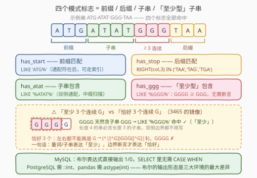
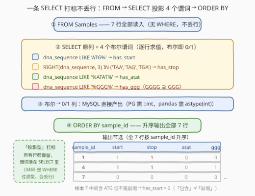

# DNA 模式识别

- **题目名称**：DNA 模式识别
- **链接**：[3475. DNA 模式识别](https://leetcode.cn/problems/dna-pattern-recognition/)
- **难度**：中等
- **标签**：数据库、SQL、Pandas、字符串匹配、`LIKE` 前缀/后缀/子串、布尔标志列

## 1. 题目概述

给定 `Samples` 表（每行一个 DNA 样本：主键 `sample_id`、由 `A/T/G/C` 组成的序列 `dna_sequence`、采集物种 `species`）。编写解决方案，为**每一个样本**判定四种生物学模式是否存在，输出 4 个标志列（存在为 `1`，不存在为 `0`）：

1. `has_start`：以 `ATG` 开头（常见的**起始密码子**）；
2. `has_stop`：以 `TAA`、`TAG` 或 `TGA` 结尾（**终止密码子**）；
3. `has_atat`：包含基序 `ATAT`（简单重复模式）；
4. `has_ggg`：有**至少 3 个连续**的 `G`（如 `GGG` 或 `GGGG`）。

返回**全部行**（不丢弃任何样本）外加 4 个标志列，按 `sample_id` **升序**排序。

**表结构**：

```text
表：Samples
+----------------+---------+
| Column Name    | Type    |
+----------------+---------+
| sample_id      | int     |  ← 唯一主键
| dna_sequence   | varchar |
| species        | varchar |
+----------------+---------+
```

**示例 1**：

```text
输入：
Samples 表：
+-----------+------------------+-----------+
| sample_id | dna_sequence     | species   |
+-----------+------------------+-----------+
| 1         | ATGCTAGCTAGCTAA  | Human     |
| 2         | GGGTCAATCATC     | Human     |
| 3         | ATATATCGTAGCTA   | Human     |
| 4         | ATGGGGTCATCATAA  | Mouse     |
| 5         | TCAGTCAGTCAG     | Mouse     |
| 6         | ATATCGCGCTAG     | Zebrafish |
| 7         | CGTATGCGTCGTA    | Zebrafish |
+-----------+------------------+-----------+

输出：
+-----------+------------------+-------------+----------+---------+---------+---------+
| sample_id | dna_sequence     | species     | has_start | has_stop | has_atat | has_ggg |
+-----------+------------------+-------------+----------+---------+---------+---------+
| 1         | ATGCTAGCTAGCTAA  | Human       | 1        | 1       | 0       | 0       |
| 2         | GGGTCAATCATC     | Human       | 0        | 0       | 0       | 1       |
| 3         | ATATATCGTAGCTA   | Human       | 0        | 0       | 1       | 0       |
| 4         | ATGGGGTCATCATAA  | Mouse       | 1        | 1       | 0       | 1       |
| 5         | TCAGTCAGTCAG     | Mouse       | 0        | 0       | 0       | 0       |
| 6         | ATATCGCGCTAG     | Zebrafish   | 0        | 1       | 1       | 0       |
| 7         | CGTATGCGTCGTA    | Zebrafish   | 0        | 0       | 0       | 0       |
+-----------+------------------+-------------+----------+---------+---------+---------+
```

**解释**（代表性的三行）：

| sample_id | 序列 | 判定 |
|-----------|------|------|
| 4 | `ATGGGGTCATCATAA` | `ATG` 开头 ✓、`TAA` 结尾 ✓、无 `ATAT`、含 `GGGG` ⊇ `GGG` ✓ → `1,1,0,1` |
| 3 | `ATATATCGTAGCTA` | 前缀是 `ATA` ≠ `ATG` ✗、结尾 `CTA` ✗、开头即 `ATAT` ✓ → `0,0,1,0` |
| 7 | `CGTATGCGTCGTA` | **中间**含 `ATG` 但**不是前缀** ✗、结尾 `GTA` ✗ → `0,0,0,0` |

> 💡 **读题关键**：① 这是**投影型**而非过滤型题目——所有 7 行都出现在输出里，4 个标志是 `SELECT` 里新增的列，不是 `WHERE` 的过滤条件；② `has_ggg` 是「**至少** 3 个连续 G」，`GGG` 与 `GGGG` 都算——这个「至少」正是本题与 3465「恰好 4 位」的分水岭；③ 样本 7 是视觉陷阱：`ATG` 出现在**中间**，但「以 ATG 开头」只看前 3 个字符。

---

## 2. 解题思路

### 2.1 暴力思路

把全表拉到应用层，对每行手写四个匹配函数：`startsWith(s, "ATG")`、`endsWith` 逐一比对三个终止密码子、双层循环找 `ATAT`、再逐位检查 `s[i]==s[i+1]==s[i+2]=='G'`。逻辑直白但全是重复造轮子——`LIKE`/`REGEXP` 本来就是干这个的。

SQL 侧的「暴力」则是另一种形态：对 4 个标志各写一条 `CASE WHEN dna_sequence LIKE … THEN 1 ELSE 0 END`（在 MySQL 里纯属多余，布尔本身就是 1/0），甚至为每个标志写一条独立子查询再 `JOIN` 回主表——把一条 `SELECT` 能干完的事拆成 5 趟扫描。

### 2.2 核心观察：四个模式 = 四类字符串谓词，「至少」≠「恰好」



把四个标志逐一翻译成字符串谓词，会发现它们正好覆盖了前缀、后缀、子串、**至少型子串**四类：

| 标志 | 模式类型 | SQL 谓词（MySQL） | 说明 |
|------|---------|------------------|------|
| `has_start` | **前缀**匹配 | `dna_sequence LIKE 'ATG%'` | 通配符只在后，**SARGable** |
| `has_stop` | **后缀**匹配（3 选 1） | `RIGHT(dna_sequence, 3) IN ('TAA','TAG','TGA')` | 也可写 3 个后缀 `LIKE` 的 `OR` |
| `has_atat` | **子串**包含 | `dna_sequence LIKE '%ATAT%'` | 双侧通配，必全表扫描 |
| `has_ggg` | **至少型**包含 | `dna_sequence LIKE '%GGG%'` | `GGGG ⊇ GGG`，**无需边界断言** |

**关键观察 1：「至少 n 个连续 X」= 包含子串 `XXX`**。长度 4 的 `GGGG` 天然包含长度 3 的子串 `GGG`，所以「至少 3 个连续 G」用 `'%GGG%'` 一击即中，左右边界都**不用**写。这与 3465 的「恰好 4 位」恰成镜像：那里的 `SN[0-9]{4}` 会被 `SN1234-56789` 骗过（子串语义命中了前 4 位），必须补 `([^0-9]|$)` 右边界；而本题的 `GGGG` **本来就应该**命中 `GGG`。一句话：**量词/子串表达「至少」，边界断言才表达「恰好」**。

**关键观察 2：布尔直接当 0/1**。MySQL 没有独立的布尔类型——`LIKE`、`IN`、比较运算的结果本身就是整数 `1`/`0`（`TRUE`/`FALSE` 只是 `1`/`0` 的别名），所以直接 `SELECT dna_sequence LIKE 'ATG%' AS has_start` 即可，**完全不需要 `CASE WHEN`**。PostgreSQL 有真正的 `boolean` 类型（渲染为 `t`/`f`），需 `::int` 显式转成 `1`/`0`；pandas 的 `str.startswith` 产出 `bool` dtype 列，需 `.astype(int)`。

**关键观察 3：终止密码子压不成字符类**。三个 stop codon 是 `TAA`、`TAG`、`TGA`，直觉想写 `T[AG][AG]`——但它会多匹配 `TGG`（色氨酸密码子）。老老实实用 `IN` 交替或 `OR`。

**关键观察 4：谓词活在 `SELECT` 里，不在 `WHERE` 里**。输出保留全部行，4 个谓词是投影列。这与 3465（`WHERE` 过滤丢行）形成「投影型 vs 过滤型」的对照。

> ⚠️ **三个高频翻车点**：
> 1. **「包含」当「前缀」**：样本 7 `CGTATGCGTCGTA` 中间有 `ATG`，`LIKE '%ATG%'` 会误报 `has_start=1`——前缀必须 `LIKE 'ATG%'`（无前导 `%`）；
> 2. **「至少」加多余断言**：给 `has_ggg` 写 `G{3}([^G]|$)` 反而漏掉 `GGGG`（第 4 个 G 会破坏右边界）——本题是「至少」，双侧边界都不要；
> 3. **忘记序列可能短于 3**：`RIGHT(col, 3)` 对长度不足 3 的串返回整串，不等于任何密码子 → 0，天然安全；但若手写 `SUBSTRING` + 偏移量逻辑就要自己防越界。

### 2.3 算法流程图



**逻辑执行步骤**：

| 步骤 | 子句 | 作用 | 本题对应 |
|------|------|------|---------|
| ① | `FROM Samples` | 读入全部行，**不过滤** | 7 行全部保留 |
| ② | `SELECT 原列 + 4 个布尔谓词` | 逐行求值，布尔即 0/1 | 生成 `has_start`/`has_stop`/`has_atat`/`has_ggg` |
| ③ | `ORDER BY sample_id` | 升序排序 | 1 → 2 → … → 7 |

> 💡 SQL 逻辑执行顺序为 `FROM → WHERE（本题没有）→ SELECT → ORDER BY`：谓词在 `SELECT` 阶段对尚未被投影掉的 `dna_sequence` 求值；`ORDER BY` 最后执行。注意 `ORDER BY` 不可省——「表恰好按 `sample_id` 有序」只是示例数据的巧合，存储顺序无保证。

### 2.4 示例演算

对示例 1 的 7 行逐一求值（`stop` 检查最后 3 个字符是否 ∈ {`TAA`,`TAG`,`TGA`}）：

| sample_id | 序列 | 前缀 = ATG? | 末 3 位 | 含 ATAT? | 含 GGG? | 四标志 |
|-----------|------|------------|---------|----------|---------|--------|
| 1 | `ATGCTAGCTAGCTAA` | ✓ `ATG…` | `TAA` ✓ | ✗ | ✗ | 1,1,0,0 |
| 2 | `GGGTCAATCATC` | ✗ `GGG…` | `ATC` ✗ | ✗ | ✓ `GGG` | 0,0,0,1 |
| 3 | `ATATATCGTAGCTA` | ✗ 前缀 `ATA` | `CTA` ✗ | ✓ 开头 `ATAT` | ✗ | 0,0,1,0 |
| 4 | `ATGGGGTCATCATAA` | ✓ | `TAA` ✓ | ✗ | ✓ `GGGG`⊇`GGG` | 1,1,0,1 |
| 5 | `TCAGTCAGTCAG` | ✗ | `CAG` ✗ | ✗ | ✗ | 0,0,0,0 |
| 6 | `ATATCGCGCTAG` | ✗ 前缀 `ATA` | `TAG` ✓ | ✓ | ✗ | 0,1,1,0 |
| 7 | `CGTATGCGTCGTA` | ✗（`ATG` 在中间） | `GTA` ✗ | ✗ | ✗ | 0,0,0,0 |

> 💡 样本 2 的 `GGGTCAATCATC` 是 `has_ggg` 的最小例证：开头 3 个 G 即命中；样本 4 的 `GGGG` 则说明「至少」语义下 4 个 G 也算——若误写成「恰好 3 个」的边界断言版本，样本 4 会从 1 错成 0。

---

## 3. 参考代码

### SQL（解法 A：纯 `LIKE` + `RIGHT … IN`，推荐）

```sql
SELECT sample_id,
       dna_sequence,
       species,
       dna_sequence LIKE 'ATG%'                        AS has_start,
       RIGHT(dna_sequence, 3) IN ('TAA', 'TAG', 'TGA') AS has_stop,
       dna_sequence LIKE '%ATAT%'                      AS has_atat,
       dna_sequence LIKE '%GGG%'                       AS has_ggg
FROM Samples
ORDER BY sample_id;
```

> 💡 **写法要点**：
> - **布尔即 1/0**：MySQL 中 `LIKE`/`IN` 的结果直接就是 `1`/`0`，不需要 `CASE WHEN` 或 `IF()`；
> - `RIGHT(dna_sequence, 3) IN (…)` 把「以三者之一结尾」压成一行，等价于 `(col LIKE '%TAA' OR col LIKE '%TAG' OR col LIKE '%TGA')`，语义「最后 3 个字符」一目了然；
> - `LIKE 'ATG%'` **没有前导通配符**——前缀匹配写错成 `'%ATG%'` 就会把样本 7 误判为 `has_start=1`。

### SQL（解法 B：`REGEXP` 版，MySQL 8）

```sql
SELECT sample_id, dna_sequence, species,
       dna_sequence REGEXP '^ATG'             AS has_start,
       dna_sequence REGEXP '(TAA|TAG|TGA)$'   AS has_stop,
       dna_sequence REGEXP 'ATAT'             AS has_atat,
       dna_sequence REGEXP 'G{3}'             AS has_ggg
FROM Samples
ORDER BY sample_id;
```

> 💡 `^`/`$` 锚定**整串**首尾（无锚点即子串语义）；`G{3}` 即 3 个连续 G，子串语义天然覆盖 `GGGG`。与解法 A 等价，但正则引擎开销大于简单通配符匹配——本题四个模式全是**字面量**（无交替、无字符类需求），`LIKE` 版更快也更可移植。

### SQL（解法 C：PostgreSQL）

```sql
SELECT sample_id, dna_sequence, species,
       (dna_sequence LIKE 'ATG%')::int                         AS has_start,
       (RIGHT(dna_sequence, 3) IN ('TAA', 'TAG', 'TGA'))::int  AS has_stop,
       (dna_sequence LIKE '%ATAT%')::int                       AS has_atat,
       (dna_sequence LIKE '%GGG%')::int                        AS has_ggg
FROM Samples
ORDER BY sample_id;
```

> 💡 PostgreSQL 的 `LIKE`/`IN` 结果是真 `boolean`（输出 `t`/`f`），必须 `::int` 才能得到题目要求的 `1`/`0`；也可用 `~ '^ATG'`、`~ '(TAA|TAG|TGA)$'`（PG 的 `~` 天生大小写敏感）。

### Python（pandas）

```python
import pandas as pd

def analyze_dna_patterns(samples: pd.DataFrame) -> pd.DataFrame:
    seq = samples['dna_sequence']
    return samples.assign(
        has_start=seq.str.startswith('ATG').astype(int),
        has_stop=seq.str.endswith(('TAA', 'TAG', 'TGA')).astype(int),
        has_atat=seq.str.contains('ATAT', regex=False).astype(int),
        has_ggg=seq.str.contains('GGG', regex=False).astype(int),
    ).sort_values('sample_id')
```

> 💡 **pandas 写法要点**：
> - `str.startswith` / `str.endswith` 对齐 Python 内置字符串方法，且 `endswith` 接受**元组**多后缀——`has_stop` 一行搞定；
> - `regex=False` 显式声明**字面量**匹配（`ATAT`/`GGG` 无正则元字符本可省略，但声明后更快也更防意外）；
> - `.astype(int)` 把 `bool` 列转成 `0`/`1`，对应 MySQL「布尔即整数」的行为；
> - `assign` 一次性追加 4 列并返回新 DataFrame，避免逐列赋值的链式索引隐患；`sort_values('sample_id')` 默认升序。

---

## 4. 复杂度分析

| 维度 | 复杂度 | 说明 |
|------|--------|------|
| 时间复杂度 | $O(n \cdot m)$ | $n$ 为行数、$m$ 为序列平均长度：每行 4 次**定长**子串扫描（前缀 3 字符、后缀 3、`ATAT` 4、`GGG` 3），单次近似常数，无回溯 |
| 空间复杂度 | $O(n)$ | 输出在原表基础上新增 4 个标志列；无额外中间结构 |

> ⚠️ 四个谓词中只有 `LIKE 'ATG%'` 是 **SARGable**（通配符在后，可用 B+ 树索引做前缀范围扫描）；`'%ATAT%'`、`'%GGG%'`、`RIGHT(…)` 均非 SARGable，必全表扫描。但本题是**投影型**——每行都要产出标志值，本来就不存在「跳过部分行」的可能，全表扫描是语义必然，谈不上优化缺失。

---

## 5. 扩展

### 5.1 「至少 n 个连续」vs「恰好 n 个」：边界断言的分水岭

本题 `has_ggg` 是「至少」：`'%GGG%'` 一发命中。若面试官把它改成「**恰好** 3 个连续 G」（`GGG` 但不是 `GGGG`），事情立刻变难：

- 只补**右边界** `GGG([^G]|$)` 不够——`ATGGGGT` 中后 3 个 G（位置 1–3）的右侧是 `T`，照样命中；
- 必须**双侧**都断言：`(^|[^G])G{3}([^G]|$)`——左边不能是 G、右边不能是 G 或串尾，`GGGG` 才会被正确排除。

对照 3465：那里「恰好 4 位」只需**右侧**一个 `([^0-9]|$)`，因为左边界被字面量 `SN`、`-` 天然隔开；而「恰好 n 个连续 G」的两侧都是**同一种字符**，双侧都得显式设防。三类语义一张表看清：

| 语义 | 模式（以 G 为例） | `GGGG` 命中? |
|------|------------------|--------------|
| 至少 3 个连续 G（本题） | `G{3}` / `'%GGG%'` | ✓ |
| 恰好 3 个连续 G | `(^|[^G])G{3}([^G]|$)` | ✗ |
| 恰好 4 位数字（3465 型，左侧有字面量） | `SN[0-9]{4}([^0-9]|$)` | —— |

### 5.2 从「后缀」到「读框」：真正的 ORF 识别

生物学上，基因的**开放阅读框**（ORF）= `ATG` 起始密码子 + **读框内**（从起始密码子起每 3 个碱基一组）出现的终止密码子。本题把 stop 简化成「后缀」，真实场景要在**任意位置**找 TAA/TAG/TGA 且落在读框上（位置与 ATG 的距离是 3 的倍数）。

正则在这里到头了：`REGEXP` 只能看「字符是什么」，看不到「位置在第几位」——**模 3 约束**不是模式能表达的，得靠 `POSITION`/`INSTR` + 算术：

```sql
SELECT sample_id, dna_sequence,
       POSITION('ATG' IN dna_sequence)                          AS start_pos,
       POSITION('TAG' IN dna_sequence)                          AS tag_pos,
       (POSITION('TAG' IN dna_sequence) - POSITION('ATG' IN dna_sequence)) % 3 AS frame_gap
FROM Samples
WHERE POSITION('ATG' IN dna_sequence) > 0;
```

`frame_gap = 0` 即该 `TAG` 落在 `ATG` 的读框上（严谨版还需对 `TAA`/`TGA` 同样求位置再取读框内最近者）。本题的「后缀判定」可视为这一套计算的最小简化。

---

## 6. 面试要点

1. **为什么 `LIKE '%GGG%'` 就能表达「至少 3 个连续 G」，不需要边界断言？**

   > 「至少」= 子串包含语义：长度 4 的 `GGGG` 天然包含子串 `GGG`，所以包含 `GGG` 与「存在 ≥3 个连续 G」互为充要。对比 3465 的「恰好 4 位」必须补 `([^0-9]|$)` 右边界——**量词与子串表达「至少」，边界断言才表达「恰好」**。若反过来给本题加 `G{3}([^G]|$)`，`GGGG` 反而漏判。

2. **本题的谓词为什么写在 `SELECT` 而不是 `WHERE`？**

   > 输出**保留全部行**，4 个标志是打在每行上的投影列，不是过滤条件；`WHERE` 会丢行（3465 型）。若面试官追问「只要 `has_start=1` 的行」，把查询包进派生表再 `WHERE has_start = 1` 即可——先投影后过滤，谓词只求值一次。

3. **`has_stop` 的三种写法如何取舍？**

   > ① 三个后缀 `OR`（`LIKE '%TAA' OR …`）最直白；② `RIGHT(col, 3) IN ('TAA','TAG','TGA')` 最紧凑，「最后 3 个字符」语义一目了然；③ `REGEXP '(TAA|TAG|TGA)$'` 锚点版。三者等价，①② 无正则引擎开销通常最快。顺带的坑：三个终止密码子**压不成** `T[AG][AG]`——那会多匹配 `TGG`（色氨酸）。

4. **MySQL 直接输出 1/0，PostgreSQL 和 pandas 为什么都要转换？**

   > MySQL 没有独立布尔类型，`LIKE`/`IN`/比较的结果就是整数 `1`/`0`（`TRUE` 是 `1` 的别名），`SELECT` 直接用。PostgreSQL 有真 `boolean`（输出 `t`/`f`），需 `::int`；pandas 的 `str.startswith` 产 `bool` dtype 列，需 `.astype(int)`。「布尔的输出形态」是三大环境差异最大的点，跨环境提交前先确认。

5. **为什么样本 7（`CGTATGCGTCGTA`）的 `has_start` 是 0？**

   > 序列**中间**（位置 3–5）有 `ATG`，但「以 ATG 开头」是**前缀**约束，只看前 3 个字符 `CGT`。`LIKE '%ATG%'`（包含）与 `LIKE 'ATG%'`（前缀）一字之差；样本 3 同理——以 `ATAT` 开头，前 3 字符 `ATA` ≠ `ATG`。「包含」与「前缀/后缀」是三类不同谓词，读题时先给每个模式归类。

> 💡 **一句话总结**：3475 = 4 个字符串谓词的投影 + 「布尔即 0/1」+ `ORDER BY`。最值得带走的一步：「**至少 n 个连续 X**」= 包含子串 `XXX`——与「恰好 n 个」需要（双侧）边界断言互为镜像。

---

## 7. 同类练习题

- [3465. 查找具有有效序列号的产品](https://leetcode.cn/problems/find-products-with-valid-serial-numbers/)（[题解](3465_查找具有有效序列号的产品.md)）：「恰好 n 位」需右边界断言，与本题「至少 n 个连续 G」互为镜像；同为 WHERE 过滤型与本题投影型的对照
- [3415. 查找具有三个连续数字的产品](https://leetcode.cn/problems/find-products-with-three-consecutive-digits/)（[题解](3415_查找具有三个连续数字的产品.md)）：`[0-9]{3}` 量词表达「3 个连续数字」，同为「至少型包含」匹配
- [3436. 查找合法邮箱](https://leetcode.cn/problems/find-valid-emails/)（[题解](3436_查找合法邮箱.md)）：锚定正则判合法 + MySQL collation 大小写敏感性的系统讨论
- [1517. 查找拥有有效邮箱的用户](https://leetcode.cn/problems/find-users-with-valid-e-mails/)（[题解](../1501-1600/1517_查找拥有有效邮箱的用户.md)）：锚定正则入门，`^…$` 全串校验的热身
- [1527. 患某种疾病的患者](https://leetcode.cn/problems/patients-with-a-condition/)（[题解](../1501-1600/1527_患某种疾病的患者.md)）：`LIKE '%DIAB1%'` 子串包含入门，体会通配符位置对语义的影响
