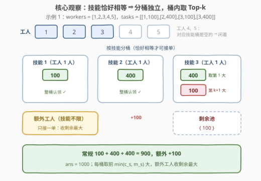
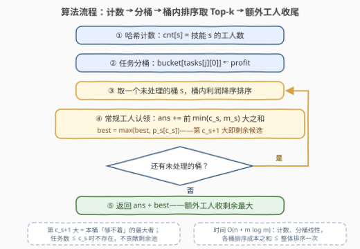

# LeetCode 最大化任务分配的利润 题解

## 1. 题目概述

- **标题 / 题号**：最大化任务分配的利润（#3476，medium）
- **链接**：https://leetcode.cn/problems/maximize-profit-from-task-assignment/
- **难度**：中等
- **标签**：贪心、数组、排序、堆（优先队列）

> ⚠️ 本题为 LeetCode 付费题（🔒），官方题面无法直接抓取；题意根据官方示例用例（`jsonExampleTestcases`）与官方 hints 重建，三个示例的输出均已用暴力枚举独立验证，但约束条件与函数签名按同类题惯例推断，可能与官方题面有出入。

**题意**：给定整数数组 `workers` 和二维整数数组 `tasks`：

- `workers[i]` 表示第 $i$ 个工人的技能等级；
- `tasks[j] = [skill_j, profit_j]` 表示第 $j$ 个任务需要技能等级 `skill_j`，完成后获得利润 `profit_j`。

分配规则：

- 每个工人**至多完成一个**任务，每个任务**至多分配给一个**工人；
- 工人只能完成所需技能与自身技能**恰好相等**的任务（$workers[i] = skill_j$）；
- 公司还额外雇佣了**一名自由职业者**（额外工人），技能不受限制，可以把**任意一个**未被分配的任务交给他（也可以不分配）。

返回可获得的**最大总利润**。

**示例 1**：

```text
输入：workers = [1,2,3,4,5], tasks = [[1,100],[2,400],[3,100],[3,400]]
输出：1000
解释：技能 1 的工人完成 [1,100]（+100）；技能 2 的工人完成 [2,400]（+400）；
      技能 3 的工人有两个任务可选，取利润大的 [3,400]（+400）；
      技能 4、5 的工人无匹配任务。额外工人拿走剩下的 [3,100]（+100）。
      合计 100 + 400 + 400 + 100 = 1000。
```

**示例 2**：

```text
输入：workers = [10,10000,100000000], tasks = [[1,100]]
输出：100
解释：没有工人的技能是 1，常规工人全部落空；额外工人完成 [1,100]。合计 100。
```

**示例 3**：

```text
输入：workers = [7], tasks = [[3,3],[3,3]]
输出：3
解释：技能 7 的工人无匹配任务；两个 [3,3] 都无人认领，额外工人拿走其一。合计 3。
```

**约束条件**（按同类题惯例推断）：

- $1 \le workers.length,\ tasks.length \le 10^5$
- $1 \le workers[i],\ skill_j \le 10^9$
- $1 \le profit_j \le 10^9$
- 答案上界 $10^5 \times 10^9 = 10^{14}$，超出 32 位整数范围，需用 64 位整数

> 💡 **读题关键**：① 技能**恰好相等**才能接单——不是 826 题那种「能力 ≥ 难度即可」，相等意味着工人与任务天然按技能值分成一个个互不相通的「桶」；② 每个任务只能做一次、每个工人只能接一单；③ 额外工人是全场唯一的「万能钥匙」，最后扫尾剩余任务中利润最大的一单。

## 2. 解题思路

### 2.1 暴力思路

枚举每个工人的选择（不接单，或接一个技能匹配且未被占用的任务），全部工人定下来后再让额外工人从剩余任务里挑最大的——组合数是指数级 $O((m+1)^n)$，$n = m = 10^5$ 时完全不可行。

另一条「正经」暴力是建**二分图最大权匹配**：左侧 $n$ 个工人加 1 名额外工人、右侧 $m$ 个任务、边权为利润，跑 KM 或费用流，复杂度约 $O(V^3) = (2\times 10^5)^3$，同样不可行——而且大材小用，本题「恰好相等」的结构比一般匹配问题特殊得多。

### 2.2 核心观察：分桶独立 + 桶内 Top-k + 额外工人收尾



官方三条 hints 恰好指向同一条贪心路线：**用哈希表按所需技能给任务分组** → **每个工人从自己技能的组里拿利润最高的任务** → **额外工人拿未分配任务中利润最高的**。展开成三个观察：

**观察 1（恰好相等 ⇒ 完全分桶）**：技能为 $s$ 的工人只能接所需技能为 $s$ 的任务。把任务按 `tasks[j][0]` 分桶后，**桶与桶之间毫无干涉**——$n$ 个工人的全局匹配问题坍缩成「每个桶内部自己解决 + 一个全局额外工人」。

**观察 2（桶内取 Top-k）**：设技能 $s$ 的工人数为 $c_s$，桶内 $m_s$ 个任务的利润降序为 $p_s^{(1)} \ge p_s^{(2)} \ge \cdots$。任何合法方案中，$s$ 桶被常规工人拿走的任务至多 $c_s$ 个，利润和不会超过**前 $\min(c_s, m_s)$ 大之和**。桶内最优解一目了然：排序、切前 $k$ 个。

**观察 3（额外工人收尾）**：常规工人拿完后，额外工人取**全部剩余任务的最大利润** $best$。答案即

$$\text{ans} \;=\; \sum_{s}\; \sum_{i=1}^{\min(c_s,\, m_s)} p_s^{(i)} \;+\; \max\bigl(\text{所有未被认领任务的利润}\bigr)$$

（若无剩余任务则 $best = 0$。）

> ⚠️ **为什么「多拿不亏」？** 直觉上容易担心：常规工人把大利润任务抢走，会不会挤掉额外工人的机会？不会——设某工人多拿走利润 $p$ 的任务，额外工人的选择至多从 $p$（它本来至多拿到 $p$）退到剩余次大 $r \le p$，总变化 $\ge p - p + r \ge 0$。所以「能拿就拿、且拿桶内最大的」永不吃亏。

**正确性（交换论证）**：考察任意最优解，设其额外工人接的任务为 $e$（或为空）。两种情形：

- **$e$ 未被贪心拿走**：贪心各桶取的是「无任何回避约束」下的前 $k_s$ 大，而最优解各桶的取法还须避开 $e$，逐桶比较贪心不劣；又因 $e$ 留在贪心的剩余池中，$best \ge p(e)$。两处合起来，贪心 ≥ 最优。
- **$e$ 恰被贪心在桶 $h$ 拿走**（排名 $r \le c_h$）：最优解在桶 $h$ 至多取 $c_h$ 个且须避开 $e$，其最好取法是「桶 $h$ 前 $c_h+1$ 大去掉 $e$」，总和加 $p(e)$ 恰等于**前 $c_h+1$ 大之和**——比贪心在桶 $h$ 的收获多出的部分恰是第 $c_h+1$ 大 $p_h^{(c_h+1)}$；而它未被贪心拿走，正躺在剩余池里被 $best$ 收走。两边相抵，贪心仍不劣。（桶 $h$ 任务数 $\le c_h$、被贪心整桶搬空时，最优解在桶 $h$ 的总收获加 $p(e)$ 也不超过整桶之和，结论直接成立。）

### 2.3 算法流程图



**执行步骤**：

| 步骤 | 动作 | 说明 |
|------|------|------|
| ① | 哈希计数 `cnt[s]` | 每种技能的工人数 |
| ② | 任务分桶 `bucket[s]` ← 利润 | 按所需技能分组 |
| ③ | 桶内利润降序排序 | Top-k 的前置 |
| ④ | 对每个桶 $s$：`ans +=` 前 $\min(c_s, m_s)$ 大之和 | 常规工人各取一单 |
| ⑤ | `best = max(best, p_s[c_s])` | 降序后第 $c_s+1$ 个即本桶剩余最大 |
| ⑥ | 返回 `ans + best` | 额外工人收尾 |

### 2.4 示例演算

以示例 1（`workers = [1,2,3,4,5]`，`tasks = [[1,100],[2,400],[3,100],[3,400]]`）走一遍：

| 技能桶 | 工人数 $c_s$ | 桶内利润（降序） | 常规工人取走 | 进入剩余池 |
|---|---|---|---|---|
| 1 | 1 | $[100]$ | $100$ | — |
| 2 | 1 | $[400]$ | $400$ | — |
| 3 | 1 | $[400, 100]$ | $400$（第 1 大） | $100$（第 $c_s+1$ 大） |
| 4 | 1 | $[\,]$（空桶） | — | — |
| 5 | 1 | $[\,]$（空桶） | — | — |

常规合计 $100 + 400 + 400 = 900$；剩余池 $\{100\}$，额外工人取 $best = 100$，**答案 $900 + 100 = 1000$**。

示例 2、3 都是「常规工人集体落空、全靠额外工人」的退化情形：前者技能 1 的桶里有任务但没人（$best = 100$），后者桶 3 有两个任务但 $c_3 = 0$，整桶剩余（$best = 3$）。

## 3. 参考代码

### C++

```cpp
class Solution {
  public:
    long long maxProfit(vector<int>& workers, vector<vector<int>>& tasks) {
        unordered_map<int, int> cnt;               // 技能 → 工人数量
        for (int w : workers) cnt[w]++;

        unordered_map<int, vector<int>> bucket;     // 技能 → 任务利润列表
        for (const auto& t : tasks) bucket[t[0]].push_back(t[1]);

        long long ans = 0;
        long long best = 0;                         // 剩余任务中的最大利润
        for (auto& [s, ps] : bucket) {
            sort(ps.begin(), ps.end(), greater<int>());
            int k = cnt.count(s) ? cnt[s] : 0;
            for (int i = 0; i < (int)ps.size(); i++) {
                if (i < k)  ans += ps[i];           // 前 k 大：常规工人认领
                else        best = max(best, (long long)ps[i]);
            }
        }
        return ans + best;                          // 额外工人收尾
    }
};
```

### Python

```python
class Solution:
    def maxProfit(self, workers: List[int], tasks: List[List[int]]) -> int:
        cnt = Counter(workers)                    # 技能 → 工人数量
        bucket = defaultdict(list)                # 技能 → 任务利润
        for s, p in tasks:
            bucket[s].append(p)

        ans, best = 0, 0
        for s, ps in bucket.items():
            ps.sort(reverse=True)
            k = cnt.get(s, 0)
            ans += sum(ps[:k])                    # 前 k 大：常规工人认领
            if len(ps) > k:
                best = max(best, ps[k])           # ps[k] 即本桶剩余最大
        return ans + best                         # 额外工人收尾
```

> 💡 `ps[k]` 恰好是本桶「够不着」的最大利润——降序排列后第 $k+1$ 个就是，无需再扫一遍剩余元素。

## 4. 复杂度分析

| 维度 | 复杂度 | 说明 |
|------|--------|------|
| 时间复杂度 | $O(n + m \log m)$ | 计数与分桶 $O(n + m)$；各桶排序成本之和 $\sum m_s \log m_s \le m \log m$ |
| 空间复杂度 | $O(n + m)$ | 哈希表存工人数与任务分桶 |

> 💡 若技能值域不大，可把哈希表换成数组、桶内排序换成计数排序，做到 $O(n + m + V)$；技能值域大（本题 $10^9$）时哈希 + 比较排序已经够用。

## 5. 扩展：小根堆流式版（对应官方 Heap 标签）

官方标签里的「堆（优先队列）」提示了另一条实现路径：给每个技能维护一个**容量为 $c_s$ 的小根堆**（[3478. 选出和最大的 K 个元素](3478_选出和最大的K个元素.md)同款「Top-K 守门员」结构），任务一个个流入：

- 该技能没有工人（$c_s = 0$）：连堆都不建，直接进剩余池；
- 堆未满：入堆，运行和 `sums[s] += p`；
- 堆已满且 $p >$ 堆顶：换血（`heapreplace`），被挤出的旧堆顶进剩余池；
- 堆已满且 $p \le$ 堆顶：挤不动，直接进剩余池。

```python
class Solution:
    def maxProfit(self, workers: List[int], tasks: List[List[int]]) -> int:
        cnt = Counter(workers)
        heaps, sums = defaultdict(list), defaultdict(int)
        best = 0
        for s, p in tasks:
            cap = cnt.get(s, 0)
            if cap == 0:                        # 无人认领，直接进剩余池
                best = max(best, p)
                continue
            h = heaps[s]
            if len(h) < cap:
                heapq.heappush(h, p)
                sums[s] += p
            elif p > h[0]:                      # 换血：旧堆顶被挤出
                evicted = heapq.heapreplace(h, p)
                sums[s] += p - evicted
                best = max(best, evicted)
            else:                               # 挤不动，同样无人认领
                best = max(best, p)
        return sum(sums.values()) + best
```

> ⚠️ 最容易漏的是最后的 `else` 分支：堆满且挤不动时，这个任务同样**无人认领**，必须进剩余池——少了它，额外工人会错过一些本可捡走的任务。

这一版的价值在于**在线性**：任务流式到达、无需预知全量，堆 + 运行和增量维护，单任务 $O(\log c_s)$，总体 $O(n + m \log m)$ 与排序版同阶（两个版本均已用暴力枚举对拍验证一致）。若把额外工人推广成 $t$ 名，只需把剩余池从「取最大」改成容量 $t$ 的小根堆，各桶取法不变。

## 6. 面试要点

1. **「恰好相等」和「大于等于」的匹配，解法差在哪？**

   > 恰好相等 ⇒ 工人与任务按技能值天然分桶、桶间独立，每桶取 Top-k 即最优（本题）；大于等于（826 题）⇒ 高技能工人会与低技能工人抢任务，需要把难度排序后维护「前缀最大利润」供每个工人统一查询。一字之差，套路完全不同。

2. **为什么桶内直接取前 $k$ 大？多余的工人要不要故意留任务给额外工人？**

   > 桶内被拿走的任务数 $\le c_s$，任何方案都被「前 $k$ 大之和」上界支配；「多拿不亏」：工人多拿 $p$，额外工人至多从 $p$ 退到剩余次大 $r \le p$，总变化 $\ge 0$。故意让工人闲着只会亏不会赚。

3. **额外工人为什么取「剩余最大」而不是「全局最大」？**

   > 全局利润最大的任务可能已被某个工人认领；额外工人只能从未认领的任务里挑。每个桶降序后第 $c_s + 1$ 大就是该桶对剩余池的全部贡献，取全体桶的 max 即可。

4. **如果额外工人有 $t$ 名怎么做？**

   > 各桶取法完全不变；剩余池从「取最大」改为「取前 $t$ 大之和」（容量 $t$ 的小根堆或整体排序）。正确性是同款交换论证：被贪心拿走的任务在「第 $k+1$ 大」处由剩余池的 Top-$t$ 兜底。

5. **溢出风险在哪？**

   > 任务数 $10^5$、利润上限 $10^9$，总利润上界 $10^{14}$；C++ 必须用 `long long` 累加并返回，Python 无此顾虑。

## 同类练习题

| # | 题目 | 与本题的关联 |
|---|------|-------------|
| 826 | [安排工作以达到最大收益](https://leetcode.cn/problems/most-profit-assigning-work/) | 姊妹题，「能力 ≥ 难度」版任务分配，体会匹配语义一字之差带来的解法差异 |
| 502 | [IPO](https://leetcode.cn/problems/ipo/) | 堆 + 贪心逐次挑当前可选的最大利润，「每次取剩余最大」的思想同源 |
| 2410 | [运动员和教练的匹配](https://leetcode.cn/problems/maximum-matching-of-players-with-trainers/) | 排序 + 双指针的最大匹配贪心，匹配类问题的另一常用套路 |
| 3462 | [提取至多K个元素的最大总和](../3401-3500/3462_提取至多K个元素的最大总和.md) | 同为「分组内取至多 k 个最大值之和」的贪心 + 交换论证 |
| 3478 | [选出和最大的 K 个元素](../3401-3500/3478_选出和最大的K个元素.md) | 小根堆流式维护 Top-K 的模板题，本文扩展节堆结构的出处 |
