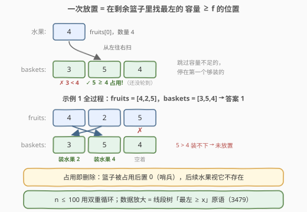
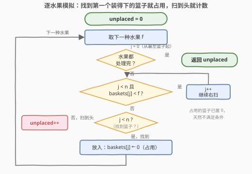

# 水果成篮 II

- **题目名称**：水果成篮 II
- **链接**：[3477. 水果成篮 II](https://leetcode.cn/problems/fruits-into-baskets-ii/)
- **难度**：简单
- **标签**：数组、模拟、线段树、二分查找、有序集合

## 1. 题目概述

给你两个长度为 `n` 的整数数组 `fruits` 和 `baskets`，其中 `fruits[i]` 表示第 `i` 种水果的**数量**，`baskets[j]` 表示第 `j` 个篮子的**容量**。

你需要对 `fruits` 数组**从左到右**按照以下规则放置水果：

1. 每种水果必须放入第一个**容量大于等于**该水果数量的**最左侧可用**篮子中；
2. 每个篮子只能装**一种**水果；
3. 如果一种水果**无法放入**任何篮子，它将保持**未放置**。

返回所有分配完成后，剩余**未放置的水果种类**的数量。

**示例 1**：

```text
输入：fruits = [4,2,5], baskets = [3,5,4]
输出：1
解释：
  fruits[0] = 4 放入 baskets[1] = 5（baskets[0] = 3 装不下，跳过）。
  fruits[1] = 2 放入 baskets[0] = 3。
  fruits[2] = 5 无法放入 baskets[2] = 4（容量不足）。
由于有一种水果未放置，返回 1。
```

**示例 2**：

```text
输入：fruits = [3,6,1], baskets = [6,4,7]
输出：0
解释：
  fruits[0] = 3 放入 baskets[0] = 6。
  fruits[1] = 6 无法放入 baskets[1] = 4（容量不足），但可以放入下一个可用篮子 baskets[2] = 7。
  fruits[2] = 1 放入 baskets[1] = 4。
由于所有水果都已成功放置，返回 0。
```

**约束条件**：

- `n == fruits.length == baskets.length`
- `1 <= n <= 100`
- `1 <= fruits[i], baskets[i] <= 1000`

---

## 2. 解题思路

### 2.1 暴力思路：双重循环照规则模拟

对每种水果 `f`（从左到右），再从左到右扫描 `baskets`：跳过**已占用**或**容量不足**（`baskets[j] < f`）的篮子，遇到第一个两者都满足的篮子就占用它；若一路扫到头都没找到，`unplaced++`。两层循环 `O(n²)`，`n <= 100` 至多 `10^4` 次比较，绰绰有余——**这就是本题的预期解法**。

实现上有个小技巧：**「占用」可以并入数值判定**。由于 `fruits[i] >= 1`，把已占用的篮子容量改成 `0`，它就永远不满足 `baskets[j] >= f`——不需要额外的 `used` 布尔数组，一个数组同时承担「容量」和「是否还在场」两种信息。

> ⚠️ **不要「聪明反被聪明误」**：本题**不是贪心 / DP**，放置规则由题面唯一确定（最左可用），没有任何决策空间。反例：`fruits = [2,3]`、`baskets = [3,2]`——按规则水果 2 进 basket 0，水果 3 放不下，答案 `1`；若自作主张让水果 2 挑「容量刚好合适」的 basket 1，水果 3 便能进 basket 0，答案变 `0`。**改放置策略就是改题**，老老实实模拟即可。

### 2.2 核心观察：「找最左可用篮子并占用」是一个可复用的原语



剥掉水果和篮子的外衣，每种水果执行的都是同一个原语：

> 在一个**支持删除**的序列里，找到**最左边**的值 ≥ f 的元素，然后**删除**它。

- **n <= 100**：双重循环就是这个原语的朴素实现（占用 = 置 0 哨兵）；
- **n 很大**：这正是线段树的招牌操作——维护**区间最大值**，从根**自顶向下二分**（左子树 max ≥ f 就往左，否则往右），直达「最左 ≥ f」的叶子，再单点置 −∞ 并上推，单次 `O(log n)`。姊妹题 [3479. 水果成篮 III](https://leetcode.cn/problems/fruits-into-baskets-iii/)（`n <= 10^5`）考察的就是这一步，详见第 5 节。

> 💡 **「占用即删除」是这类资源分配题的灵魂**：每个篮子只能装一种水果，被选中后立刻退出候选集。小数据用「置 0 哨兵 + 线性扫」，数据放大后换成「线段树 + 单点删除」，思路一脉相承。

### 2.3 算法流程图



外层遍历水果、内层从左向右扫篮子；判定条件合并为一个 `baskets[j] >= f`（占用过的篮子已置 0，天然不满足）；找到即占用并处理下一种水果，扫到头则 `unplaced++`。

---

## 3. 参考代码

### C++

```cpp
class Solution {
  public:
    int numOfUnplacedFruits(vector<int>& fruits, vector<int>& baskets) {
        int unplaced = 0;
        for (int f : fruits) {
            // 从左找第一个容量 >= f 的篮子；占用的篮子已置 0，自动被跳过
            auto it = find_if(baskets.begin(), baskets.end(),
                              [&](int b) { return b >= f; });
            if (it == baskets.end()) {
                unplaced++;
            } else {
                *it = 0;  // 占用：置 0 后容量恒小于任何水果数量（fruits[i] >= 1）
            }
        }
        return unplaced;
    }
};
```

### Python

```python
class Solution:
    def numOfUnplacedFruits(self, fruits: List[int], baskets: List[int]) -> int:
        unplaced = 0
        for f in fruits:
            for j, b in enumerate(baskets):
                if b >= f:          # 占用的篮子已置 0，不会被选中
                    baskets[j] = 0
                    break
            else:                   # for-else：内层未被 break，说明没有篮子装得下
                unplaced += 1
        return unplaced
```

---

## 4. 复杂度分析

| 维度 | 复杂度 | 说明 |
|------|--------|------|
| 时间复杂度 | O(n²) | 每种水果最坏从左到右扫完整个 `baskets`；`n <= 100` 至多 10⁴ 次比较 |
| 空间复杂度 | O(1) | 原地把占用篮子置 0，无额外数据结构（会修改输入数组，判题机允许） |

---

## 5. 扩展：n 放大到 10^5 —— 线段树「最左 ≥ x」（对应 3479. 水果成篮 III）

把同款题面的约束换成 `1 <= n <= 10^5`、`1 <= fruits[i], baskets[i] <= 10^9`，就是姊妹题 [3479. 水果成篮 III](https://leetcode.cn/problems/fruits-into-baskets-iii/)（中等）：O(n²) 的重复扫描会超时，需要把 2.2 的原语做成 `O(log n)`。维护**区间最大值**的线段树正好胜任：

1. **查询（自顶向下二分）**：若根的 max `< f`，说明没有任何篮子装得下，`unplaced++`；否则从根出发——**左子树 max ≥ f 就走左，否则走右**（右子树此时必满足，因为当前节点 max ≥ f 是不变量），落到叶子时恰好是**最左**的容量 ≥ f 的篮子，每层一次 O(1) 判断；
2. **删除（单点修改 + 上推）**：把该叶子改成 `-1`（哨兵，等价 −∞），自底向上重算祖先的 max。

每个水果 `O(log n)`，总计 `O(n log n)`。

### C++

```cpp
class Solution {
  public:
    int numOfUnplacedFruits(vector<int>& fruits, vector<int>& baskets) {
        int n = baskets.size();
        int sz = 1;                       // 补齐到 2 的幂，保证自顶向下二分时叶子有序
        while (sz < n) sz <<= 1;
        vector<int> mx(2 * sz, -1);       // -1 = 哨兵（等价 -∞），尾部 padding 永不匹配
        for (int i = 0; i < n; i++) mx[sz + i] = baskets[i];
        for (int i = sz - 1; i >= 1; i--) mx[i] = max(mx[2 * i], mx[2 * i + 1]);

        int unplaced = 0;
        for (int f : fruits) {
            if (mx[1] < f) { unplaced++; continue; }   // 全场最大值都装不下
            int i = 1;
            while (i < sz) i = (mx[2 * i] >= f) ? 2 * i : 2 * i + 1;  // 二分到最左叶子
            for (mx[i] = -1, i >>= 1; i; i >>= 1) mx[i] = max(mx[2 * i], mx[2 * i + 1]);
        }
        return unplaced;
    }
};
```

### Python

```python
class Solution:
    def numOfUnplacedFruits(self, fruits: List[int], baskets: List[int]) -> int:
        n = len(baskets)
        sz = 1
        while sz < n:
            sz <<= 1
        mx = [-1] * (2 * sz)
        mx[sz:sz + n] = baskets
        for i in range(sz - 1, 0, -1):
            mx[i] = max(mx[2 * i], mx[2 * i + 1])

        unplaced = 0
        for f in fruits:
            if mx[1] < f:
                unplaced += 1
                continue
            i = 1
            while i < sz:                             # 自顶向下二分：优先走左
                i = 2 * i if mx[2 * i] >= f else 2 * i + 1
            mx[i] = -1                                # 删除该篮子
            i >>= 1
            while i:
                mx[i] = max(mx[2 * i], mx[2 * i + 1])
                i >>= 1
        return unplaced
```

> ⚠️ 两个高频踩坑：
> 1. **不能用「按容量排序的有序集合」**（`multiset` / `SortedList` 存 (容量, 下标) 后 `lower_bound`）：那定位到的是「容量最小且 ≥ f」的篮子，而题目要的是「**位置最左**」。用 2.1 的反例 `fruits = [2,3]`、`baskets = [3,2]` 一试便知两者结果不同——位置语义必须靠**按下标建**的线段树（或树状数组上二分）保住。
> 2. **迭代式线段树要补齐到 2 的幂**：常见 `2n` 大小的迭代写法在 `n` 非 2 幂时叶子顺序与下标不一致，「从根向下走」会走错；把 `sz` 补到 2 的幂（如本文）或改用递归式线段树即可。

---

## 6. 面试要点

1. **为什么不能排序 `fruits` 或 `baskets` 来加速？**
   - 规则绑定「**位置最左**」，排序会破坏位置语义；且放置过程没有决策空间，换序即改答案（反例 `fruits=[2,3]`、`baskets=[3,2]`：按规则答案 1，换种放法答案 0）。本题是**确定性模拟**，不是贪心。

2. **「占用」为什么可以用置 0 表示？**
   - `fruits[i] >= 1`，容量 0 永远 `< f`，把「已删除」编码成「永不匹配的哨兵值」，一个数组同时携带容量与存在性两种信息。若题目允许 `f = 0`，哨兵需换成负数 / `used` 数组。

3. **如果 `n` 放大到 10^5 怎么办？**
   - 维护区间 max 的线段树：根 max `< f` 直接计数；否则自顶向下二分（左子树 max ≥ f 走左，否则走右）直达最左可用叶子，再单点置 −∞ 上推。每次 `O(log n)`，总 `O(n log n)`——即 3479 的正解。

4. **为什么按容量排序的 `multiset` / `SortedList` 是错的？**
   - `lower_bound` 找到的是「值最小且 ≥ f」的元素，对应「容量最紧的篮子」；题目要「位置最左」。两者语义不同，必须按下标建树、在树上二分位置。

5. **本题和 2286（订票 gather）、1606（找空闲服务器）有什么共性？**
   - 都是「按顺序找**第一个**满足容量条件的**可用**资源并占用，占用即删除」的骨架：小数据线性扫 / 有序集合，大数据线段树自顶向下二分。区别只在资源的顺序是线形（本题）、矩形行号（2286）还是环形（1606）。

---

## 7. 同类练习题

- [3479. 水果成篮 III](https://leetcode.cn/problems/fruits-into-baskets-iii/)：同款题面、`n <= 10^5`，必须上线段树「最左 ≥ x + 单点删除」，即本文第 5 节的完整版
- [2286. 以组为单位订音乐会的门票](https://leetcode.cn/problems/booking-concert-tickets-in-groups/)（[题解](../2201-2300/2286_以组为单位订音乐会的门票.md)）：线段树「区间最左满足容量 + 单点修改」的 Hard 经典（gather 操作）
- [1606. 找到处理最多请求的服务器](https://leetcode.cn/problems/find-servers-that-handled-most-number-of-requests/)（[题解](../1601-1700/1606_找到处理最多请求的服务器.md)）：有序集合找「环形顺序中第一个空闲服务器」，同一「最左可用」骨架的旋转版
- [904. 水果成篮](https://leetcode.cn/problems/fruit-into-baskets/)（[题解](../0901-1000/904_水果成篮.md)）：同名经典滑动窗口题（至多 2 种水果的最长子数组），与本题仅名字相关，注意区分
