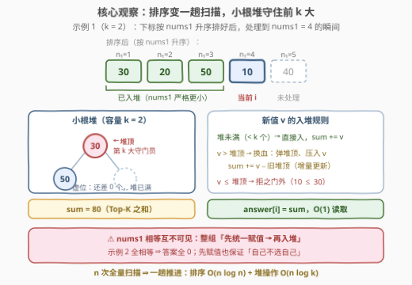
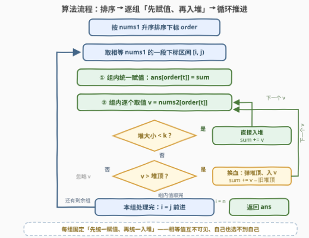

# LeetCode 选出和最大的 K 个元素 题解

## 1. 题目概述

- **标题 / 题号**：选出和最大的 K 个元素（#3478，medium）
- **链接**：https://leetcode.cn/problems/choose-k-elements-with-maximum-sum/
- **难度**：中等
- **标签**：数组、排序、堆（优先队列）、离线查询

**题意**：给定两个长度均为 $n$ 的整数数组 `nums1`、`nums2` 和一个正整数 $k$。对每个下标 $i$（从 $0$ 到 $n-1$）：

1. 找出所有满足 $nums1[j] < nums1[i]$ 的下标 $j$；
2. 从这些下标对应的 $nums2[j]$ 中选出**至多** $k$ 个，最大化总和。

返回长度为 $n$ 的数组 `answer`，其中 `answer[i]` 为对应下标的结果。

**示例 1**：

```text
输入：nums1 = [4,2,1,5,3], nums2 = [10,20,30,40,50], k = 2
输出：[80,30,0,80,50]
解释：
  i = 0：满足条件的是下标 [1,2,4]，选最大的两个 50 + 30 = 80
  i = 1：满足条件的是下标 [2]，只有 30
  i = 2：没有满足条件的下标，结果为 0
  i = 3：满足条件的是下标 [0,1,2,4]，选最大的两个 50 + 30 = 80
  i = 4：满足条件的是下标 [1,2]，选最大的两个 30 + 20 = 50
```

**示例 2**：

```text
输入：nums1 = [2,2,2,2], nums2 = [3,1,2,3], k = 1
输出：[0,0,0,0]
解释：所有元素相等，不存在严格更小的 nums1[j]，结果全为 0。
```

**约束**：

- $n == nums1.length == nums2.length$
- $1 \le n \le 10^5$
- $1 \le nums1[i], nums2[i] \le 10^6$
- $1 \le k \le n$

> ⚠️ 注意两点：① 「严格小于」意味着**相等不可见**——示例 2 全相等时答案全 0，这是本题最大的陷阱；② 「至多 $k$ 个」在候选不足 $k$ 个时全选，此时**不能**给答案补零凑数，直接取现有总和即可（$nums2[i] \ge 1$ 为正数，能多选就多选，「至多」自动退化为「恰好 $\min(k, 候选数)$」）。

## 2. 解题思路

### 2.1 暴力思路

对每个 $i$，扫描全部下标 $j$ 收集满足 $nums1[j] < nums1[i]$ 的 $nums2[j]$，排序后取前 $k$ 个求和。时间复杂度 $O(n^2 \log n)$，$n = 10^5$ 时约 $10^{10}$ 次操作，必然超时。

瓶颈在于：$n$ 个查询彼此独立，每个都从头扫一遍数组。但「$nums1[j] < nums1[i]$」这个条件与下标无关、只与**值的大小**有关——这是典型的可**离线**处理的查询。

### 2.2 核心观察：排序变一趟扫描 + 小根堆守住前 k 大



**观察 1：按 $nums1$ 排序后，查询区间变成前缀。** 把下标按 $nums1$ 值升序排序，处理到某个元素时，「所有 $nums1$ 严格更小的元素」恰好就是排在其前面的那些元素（**相等值除外**）。$n$ 次「全量扫描」被压缩成**一趟有序推进**——这是离线查询的经典套路（与「数组小菜一碟」式的离线批量处理同源）。

**观察 2：前 $k$ 大之和无需排序，小根堆 + 运行和即可流式维护。** 维护一个**大小至多 $k$ 的小根堆**，堆中保存目前已见 $nums2$ 值中最大的 $k$ 个，同时维护运行和 $\text{sum}$：

- 堆未满（大小 $< k$）：直接入堆，$\text{sum} \mathrel{+}= v$；
- 堆已满：若 $v > \text{堆顶}$，弹出堆顶、压入 $v$，$\text{sum} \mathrel{+}= v - \text{堆顶}$；否则忽略。

堆顶就是「第 $k$ 大」的**守门员**——比它大才有资格进堆。每个元素进出堆至多一次，单次 $O(\log k)$，全程 $O(n \log k)$。

> ⚠️ **相等值必须按「组」处理**：$nums1$ 相等的元素互不可见。正确顺序是——先把**整组**的 `answer` 赋成当前 $\text{sum}$（此刻堆里只有严格更小元素的贡献），**再**把组内的 $nums2$ 值入堆。若边赋值边入堆，同组后面的元素就能「看见」前面的，示例 2 会从全 0 错成非零。

### 2.3 算法流程图



**执行步骤**：

| 步骤 | 动作 | 说明 |
|------|------|------|
| ① | 按 $nums1$ 升序排序下标 | 得到处理顺序 `order` |
| ② | 取出一段相等的 $nums1$ 值对应的下标区间 $[i, j)$ | 相等值为一组 |
| ③ | 组内每个下标 `t`：`ans[order[t]] = sum` | 堆中是严格更小元素的 Top-K |
| ④ | 组内每个 $nums2$ 值入堆（容量 $k$ 小根堆） | 换出堆顶时同步增减 `sum` |
| ⑤ | 若还有剩余组，回到 ② | 否则返回 `ans` |

### 2.4 示例演算

以示例 1（`nums1 = [4,2,1,5,3]`，`nums2 = [10,20,30,40,50]`，$k = 2$）走一遍：

| 处理组（nums1 值） | 组内下标 | 赋值前堆（sum） | 赋值结果 | 入堆后堆（sum） |
|---|---|---|---|---|
| 1 | 2 | $\varnothing$（0） | `ans[2]=0` | $\{30\}$（30） |
| 2 | 1 | $\{30\}$（30） | `ans[1]=30` | $\{20,30\}$（50） |
| 3 | 4 | $\{20,30\}$（50） | `ans[4]=50` | $\{30,50\}$（80，50 换出 20） |
| 4 | 0 | $\{30,50\}$（80） | `ans[0]=80` | $\{30,50\}$（80，10 ≤ 30 被拒） |
| 5 | 3 | $\{30,50\}$（80） | `ans[3]=80` | $\{40,50\}$（90，40 换出 30） |

最终 `[80,30,0,80,50]`，与预期一致。注意第 5 行：`ans[3]` 赋值发生在 40 入堆**之前**，赋值用的 sum 是 80 而非 90——「自己不能选自己」正是通过「先赋值、后入堆」保证的。

## 3. 参考代码

### C++

```cpp
class Solution {
  public:
    vector<long long> findMaxSum(vector<int>& nums1, vector<int>& nums2, int k) {
        int n = nums1.size();
        vector<int> order(n);
        iota(order.begin(), order.end(), 0);
        sort(order.begin(), order.end(), [&](int a, int b) {
            return nums1[a] < nums1[b];
        });

        vector<long long> ans(n, 0);
        priority_queue<int, vector<int>, greater<int>> heap; // 小根堆：容量 k 的 Top-K
        long long sum = 0;

        int i = 0;
        while (i < n) {
            int j = i;
            while (j < n && nums1[order[j]] == nums1[order[i]]) {
                j++;
            }
            // 先统一赋值：此刻堆里只有 nums1 严格更小的元素
            for (int t = i; t < j; t++) {
                ans[order[t]] = sum;
            }
            // 再把本组的 nums2 值入堆
            for (int t = i; t < j; t++) {
                int v = nums2[order[t]];
                if ((int)heap.size() < k) {
                    heap.push(v);
                    sum += v;
                } else if (v > heap.top()) {
                    sum += (long long)v - heap.top();
                    heap.pop();
                    heap.push(v);
                }
            }
            i = j;
        }
        return ans;
    }
};
```

> 💡 返回类型是 `vector<long long>`：最坏和可达 $10^5 \times 10^6 = 10^{11}$，超出 `int` 范围，`sum` 也必须用 `long long` 累加。

### Python

```python
class Solution:
    def findMaxSum(self, nums1: List[int], nums2: List[int], k: int) -> List[int]:
        n = len(nums1)
        order = sorted(range(n), key=lambda i: nums1[i])

        ans = [0] * n
        heap = []  # 小根堆：容量 k 的 Top-K
        total = 0

        i = 0
        while i < n:
            j = i
            while j < n and nums1[order[j]] == nums1[order[i]]:
                j += 1
            for t in range(i, j):
                ans[order[t]] = total
            for t in range(i, j):
                v = nums2[order[t]]
                if len(heap) < k:
                    heapq.heappush(heap, v)
                    total += v
                elif v > heap[0]:
                    total += v - heapq.heapreplace(heap, v)
            i = j
        return ans
```

> 💡 `heapq.heapreplace(heap, v)` 一句话完成「弹出堆顶 + 压入新值」，比先 `heappop` 再 `heappush` 少一次调整；返回差值 `v - 旧堆顶` 同步维护总和。

## 4. 复杂度分析

| 维度 | 复杂度 | 说明 |
|------|--------|------|
| 时间复杂度 | $O(n \log n)$ | 排序 $O(n \log n)$；每个值至多进出堆一次，堆操作合计 $O(n \log k)$，$k \le n$ 故总体 $O(n \log n)$ |
| 空间复杂度 | $O(n)$ | 排序下标数组 $O(n)$ + 堆 $O(k)$（不计输出数组） |

## 5. 扩展：几个一改条件就变味的变体

1. **改成 $nums1[j] \le nums1[i]$（非严格）**：相等组内互选也合法，赋值时机改到整组入堆**之后**即可——「先赋值」与「后赋值」的一墙之隔，正是本题的考点。
2. **改成「恰好 $k$ 个，不足则结果为 $-1$」**：赋值时先检查堆的大小是否已达 $k$，不足 $k$ 则输出 $-1$。堆的大小本身就是「更小元素个数与 $k$ 的较小值」。
3. **在线版（流式到达，随时查询当前 Top-K 和）**：本题的堆 + 运行和结构原封不动就是答案——这正是 703「数据流第 K 大」的求和版。
4. **Top-K 之和的另一种求法**：不用堆，对排序后的 $nums2$ 做前缀和 + 二分也能做（离线询问「前 $k$ 大之和」），但那需要每次对候选集重新统计，无法增量维护——**堆的本质优势是「换血只动一个元素」**。

## 6. 面试要点

1. **为什么排序后就不需要双重循环了？**

   > 按 $nums1$ 升序排序后，「$nums1[j] < nums1[i]$ 的全体」在处理顺序上恰好构成 $i$ 的**前缀**（相等值排除在外）。$n$ 次独立的全量扫描合并为一趟有序推进，这是把「在线重复计算」变成「离线单调增量」的标准手法。

2. **为什么用小根堆而不是大根堆维护前 $k$ 大？**

   > 需要 $O(1)$ 找到「目前第 $k$ 大」来决定新元素能否入堆——它正是容量 $k$ 的小根堆的**堆顶**。大根堆的堆顶是最大值，无法直接淘汰第 $k$ 大。「求前 $k$ 大用小根堆、求前 $k$ 小用大根堆」，与直觉相反但恰好是这个道理。

3. **相等元素为什么必须整组处理？「先赋值、后入堆」防的是什么？**

   > 题目要求严格小于，相等值互不可见。若同组内边赋值边入堆，后处理的元素就能看到先处理元素的 $nums2$ 值。整组「先统一赋值、再统一入堆」保证赋值时刻堆内只有严格更小元素的贡献；同时这也天然排除了「自己选自己」。

4. **运行和 `sum` 为什么要同步维护，而不是每次查询时对堆求和？**

   > 对堆整体求和是 $O(k)$，$n$ 次查询退化为 $O(nk)$（最坏 $10^{10}$）。入堆/换堆顶时增量更新 $\text{sum} \mathrel{+}= v - \text{堆顶}$，每次 $O(1)$，查询直接读值。

5. **答案的最大值有多大？需要什么类型？**

   > 最坏 $k \cdot \max(nums2) = 10^5 \times 10^6 = 10^{11}$，超出 32 位整数上限，C++ 必须用 `long long` 累加并返回 `vector<long long>`（Python 无此顾虑）。

## 同类练习题

| # | 题目 | 与本题的关联 |
|---|------|-------------|
| 703 | [数据流中的第 K 大元素](https://leetcode.cn/problems/kth-largest-element-in-a-stream/) | 容量 $k$ 小根堆流式维护 Top-K 的入门模板，本题堆部分的纯化版 |
| 215 | [数组中的第 K 个最大元素](https://leetcode.cn/problems/kth-largest-element-in-an-array/) | 小根堆求第 $k$ 大的经典，理解「堆顶守门员」的由来 |
| 857 | [雇佣 K 名工人的最低成本](https://leetcode.cn/problems/minimum-cost-to-hire-k-workers/) | 按比值排序 + 小根堆维护 $k$ 个最大值的进阶综合，排序与堆的配合更深 |
| 3462 | [提取至多 K 个元素的最大总和](https://leetcode.cn/problems/maximum-sum-with-at-most-k-elements/)（[题解](3462_提取至多K个元素的最大总和.md)） | 同为「至多 $k$ 个最大值之和」的贪心，矩阵版 |
| 239 | [滑动窗口最大值](https://leetcode.cn/problems/sliding-window-maximum/) | 同为「滑动候选集 + 增量维护」结构，单调队列与本题小根堆互为对偶 |
