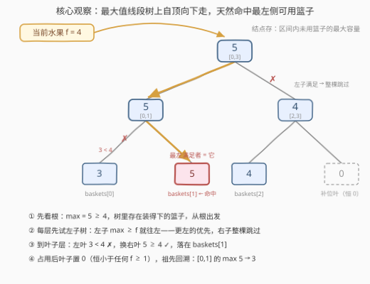
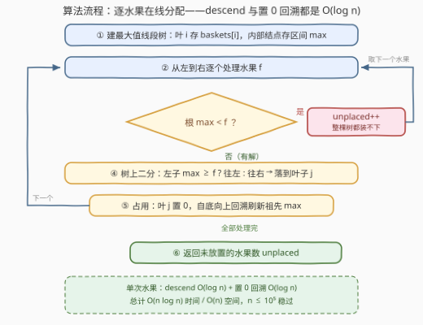

# 水果成篮 III

- **题目名称**：水果成篮 III
- **链接**：[3479. 水果成篮 III](https://leetcode.cn/problems/fruits-into-baskets-iii/)
- **难度**：中等
- **标签**：线段树、数组、二分查找、有序集合

## 1. 题目概述

给你两个长度为 $n$ 的整数数组 `fruits` 和 `baskets`，其中 `fruits[i]` 表示第 $i$ 种水果的**数量**，`baskets[j]` 表示第 $j$ 个篮子的**容量**。

你需要对 `fruits` 数组**从左到右**按照以下规则放置水果：

- 每种水果必须放入第一个**容量大于等于**该水果数量的**最左侧可用篮子**中；
- 每个篮子只能装**一种**水果；
- 如果一种水果**无法放入**任何篮子，它将保持**未放置**。

返回所有分配完成后，剩余**未放置的水果种类**的数量。

**示例 1**：

```text
输入：fruits = [4,2,5], baskets = [3,5,4]
输出：1
解释：
- fruits[0] = 4 放入 baskets[1] = 5（baskets[0] = 3 装不下，往右找）；
- fruits[1] = 2 放入 baskets[0] = 3（此时它是最左侧可用且容量足够的篮子）；
- fruits[2] = 5 无法放入 baskets[2] = 4，未放置。
```

**示例 2**：

```text
输入：fruits = [3,6,1], baskets = [6,4,7]
输出：0
解释：
- fruits[0] = 3 放入 baskets[0] = 6；
- fruits[1] = 6 装不进 baskets[1] = 4，放入 baskets[2] = 7；
- fruits[2] = 1 放入 baskets[1] = 4。
```

**约束**：$1 \le n \le 10^5$，$1 \le \text{fruits}[i], \text{baskets}[i] \le 10^9$。

> 💡 **读题关键**：这是一道**在线分配**问题——水果必须按给定顺序处理，每种水果的归宿取决于**之前水果占用之后**的篮子状态；「最左侧可用」锁定**下标维度**，「容量 ≥ 数量」又引入**值维度**。两个维度叠加 + 动态删除，正是线段树的主场。另外别被名字骗了：同名系列的 [904. 水果成篮](../0901-1000/904_水果成篮.md) 是滑动窗口题，与本题套路毫无关系。

---

## 2. 解题思路

### 2.1 暴力思路：逐水果线性扫描

直接模拟题意：维护 `used[j]` 标记篮子是否被占用；对每个水果 `f` 从左到右扫 `baskets`，找第一个 `!used[j] && baskets[j] >= f` 的篮子。逻辑与题意一一对应，写不出错。

问题是复杂度 $O(n^2)$：当大量前置篮子已被占用或容量不足时，每个水果都要重新扫过它们。最坏形如 `baskets` 与 `fruits` 全为同一个值——第 $i$ 个水果要跳过前 $i$ 个已用篮子，总比较次数 $\sum_{i=1}^{n} i \approx n^2/2$，$n = 10^5$ 时约 $5 \times 10^9$ 次，必然超时。

更关键的是，几类常见优化直觉在这里**全部失效**：

- **排序水果再贪心（比如先放数量大的）？** 不行——**处理顺序本身就是题目语义**。反例：`fruits = [3,5]`，`baskets = [5,4]`。按序处理：3 占走容量 5 的篮子，5 只剩容量 4 的篮子可挑，未放置，答案 1；若先放大的：5 进容量 5 的篮子，3 进容量 4 的篮子，答案 0。顺序换了，答案就变。
- **排序篮子 + 双指针？** 也不行——「最左侧」要求的是**原始下标**最小，而且占用状态随时间演进，双指针无法回退。
- **堆 / 并查集跳过链？** 这类结构只能回答「≥ 某下标的第一个可用位置」，回答不了「容量 ≥ f 的第一个可用位置」——多出来的**值维度**把它们挡在门外（对照 [1845. 座位预约管理系统](../1801-1900/1845_座位预约管理系统.md)，那里没有值约束所以最小堆就够）。

需要一个同时支持「按值过滤」「按下标取最左」、还能**动态删除**的数据结构。

### 2.2 核心观察：最大值线段树 + 树上二分



把每个水果的诉求写成一句话：**在所有「未占用」的篮子里，找容量 ≥ f 的最小下标**。三个观察把它翻译成线段树语言：

**观察 1：占用 = 删除。** 篮子一经使用永久出局，等价于把该位置的值改成 $-\infty$。实现时置 0 即可——因为 $1 \le \text{fruits}[i]$，0 永远小于任何水果数量，不会再被任何查询命中。这是**单点修改**。

**观察 2：「最左满足者」= 最大值线段树上的自顶向下二分（descend）。** 让线段树每个结点维护区间的**容量最大值** mx。查询 `f` 时从根出发，每层只做一个判断：

- 左子树 mx ≥ f → 进左子树（左边若有解，答案绝不去右边）；
- 否则 → 进右子树（左子树整体不合格，整棵跳过）。

进入某结点前，父层已保证该结点子树内存在容量 ≥ f 的叶子，因此这条路径必然终止于一个满足条件的叶子——且恰是**最左**的那个。

**观察 3：正确性是归纳的。** 设当前结点子树内有解：若左子树 mx ≥ f，则左子树内有解，而左子树内任意可行叶子都比右子树的全部叶子更左，答案必在左；若左子树 mx < f，左子树整棵无解，答案必在右。每层二选一，$O(\log n)$ 定位。特别地，先检查根的 mx < f 即可整体判「无处可放」。

> 💡 一句话：**结点维护「未用篮子的区间最大容量」，查询自顶向下「左子够就往左」**——值约束交给 max，最左约束交给遍历顺序，删除就是置 0。

### 2.3 算法流程图



| 步骤 | 操作 | 线段树上的动作 |
|------|------|----------------|
| ① | 建树 | 叶 i 存 `baskets[i]`，内部结点自底向上取 max，$O(n)$ |
| ② | 取下一个水果 f | —— |
| ③ | 可行性检查 | 若根 mx < f：`unplaced++`，回到 ② |
| ④ | 定位 | descend：左子 mx ≥ f ? 往左 : 往右，落到叶子 j |
| ⑤ | 占用 | 叶 j 置 0，自底向上回溯刷新祖先 mx，回到 ② |
| ⑥ | 结束 | 返回 `unplaced` |

### 2.4 示例演算

以示例 1（`fruits = [4,2,5]`，`baskets = [3,5,4]`）走一遍全过程。线段树补齐到 4 个叶子，补位叶恒为 0（不会被选中）：

| 水果 | 叶子状态 [b0, b1, b2, 补位] | 根 mx | descend 路径 | 结果 |
|------|------------------------------|-------|--------------|------|
| f=4 | [3, 5, 4, 0] | 5 | 根 5≥4 → 左（[0,1] 的 mx=5≥4）→ 叶 3<4 → 右叶 5 | 占 `baskets[1]`；[0,1] 的 mx 5→3 |
| f=2 | [3, 0, 4, 0] | 4 | 根 4≥2 → 左（[0,1] 的 mx=3≥2）→ 叶 3≥2 | 占 `baskets[0]`；[0,1] 的 mx 3→0 |
| f=5 | [0, 0, 4, 0] | 4 | 根 4 < 5，直接判死 | 未放置，unplaced=1 |

返回 1，与示例一致。注意 f=2 这步：`baskets[1]` 虽然原始容量 5 ≥ 2，但已被占用（叶子已置 0），根本不会进入候选——「占用 = 删除」保证了这一点。

---

## 3. 参考代码

### C++（迭代线段树：数组表示 + while 循环，无递归）

```cpp
class Solution {
public:
    int numOfUnplacedFruits(vector<int>& fruits, vector<int>& baskets) {
        int n = fruits.size();
        int size = 1;                        // 补齐到 2 的幂，多出的叶子恒为 0
        while (size < n) size <<= 1;
        vector<int> mx(2 * size, 0);
        for (int i = 0; i < n; ++i) mx[size + i] = baskets[i];
        for (int i = size - 1; i >= 1; --i) mx[i] = max(mx[2 * i], mx[2 * i + 1]);

        int unplaced = 0;
        for (int f : fruits) {
            if (mx[1] < f) { ++unplaced; continue; }   // 整棵树都装不下
            int node = 1;                              // descend：左子够就往左
            while (node < size)
                node = mx[2 * node] >= f ? 2 * node : 2 * node + 1;
            mx[node] = 0;                              // 占用：叶子置 0
            for (node >>= 1; node >= 1; node >>= 1)    // 自底向上回溯
                mx[node] = max(mx[2 * node], mx[2 * node + 1]);
        }
        return unplaced;
    }
};
```

> 💡 **写法要点**：
> - **满二叉树数组表示**：`mx[1]` 是根，`mx[size + i]` 是叶子 i，父子只靠下标乘 2；建树自底向上一层循环即可，$O(n)$；
> - **补位叶恒 0**：n 不是 2 的幂时补齐部分为 0，而水果数量 ≥ 1，这些叶子永远不会被 descend 选中；
> - **descend 与回溯都是纯 while 循环**，无递归开销；单个水果最多约 $2\log_2 n \approx 34$ 次结点访问（$n = 10^5$）。

### Python

```python
class Solution:
    def numOfUnplacedFruits(self, fruits: List[int], baskets: List[int]) -> int:
        n = len(fruits)
        size = 1
        while size < n:
            size <<= 1
        mx = [0] * (2 * size)
        mx[size:size + n] = baskets                  # 叶层切片赋值
        for i in range(size - 1, 0, -1):
            mx[i] = mx[2 * i] if mx[2 * i] >= mx[2 * i + 1] else mx[2 * i + 1]

        unplaced = 0
        for f in fruits:
            if mx[1] < f:
                unplaced += 1
                continue
            node = 1                                 # descend：左子够就往左
            while node < size:
                node = 2 * node if mx[2 * node] >= f else 2 * node + 1
            mx[node] = 0                             # 占用：叶子置 0
            node >>= 1
            while node:                              # 自底向上回溯
                l, r = mx[2 * node], mx[2 * node + 1]
                mx[node] = l if l >= r else r
                node >>= 1
        return unplaced
```

> 💡 Python 无内置线段树，手写**迭代版**比递归版快数倍；$n = 10^5$ 时全程约 $3 \times 10^6$ 次列表访问量级，轻松通过。

---

## 4. 复杂度分析

| 维度 | 复杂度 | 说明 |
|------|--------|------|
| 时间复杂度 | $O(n \log n)$ | 建树 $O(n)$；每个水果一次 descend $O(\log n)$ + 一次置 0 回溯 $O(\log n)$ |
| 空间复杂度 | $O(n)$ | 满二叉树数组 $2 \cdot \text{size} \le 4n$ |

对比暴力 $O(n^2)$：$n = 10^5$ 时从约 $5 \times 10^9$ 次比较降到 $3 \times 10^6$ 次结点访问量级，快 3 个数量级。

---

## 5. 扩展：官方提示的另一条实现——按 (容量, 下标) 排序 + 最小值线段树

官方 hints 给出一条等价路线，思路是把两个维度**分给不同的机制**：

1. 把 `baskets` 按 **(容量, 原下标)** 升序排序得到数组 B；
2. 建一棵维护「区间内最小原下标」的线段树，已用位置置 $+\infty$；
3. 对每个水果 f：先在 B 上**二分**出第一个容量 ≥ f 的位置 pos（容量有序 ⇒ B[pos..] 全部装得下 f），再查询 [pos, n−1] 的**最小原下标**——它就是最左可用篮子；若查询结果为 $+\infty$ 则未放置，否则占用该篮子（对应位置置 $+\infty$）。

与主线解法互为镜像：**主线把值约束放进结点 max、把「最左」交给 descend 的先左偏好；这条路线把值约束交给排序 + 二分、把「最左」放进结点 min**。复杂度同为 $O(n \log n)$，实现上多一次排序和一个二分，常数略大，但「二分定位 + 区间最值」的拆分思想值得收藏。

顺带一提本系列的「谱系」：[904. 水果成篮](https://leetcode.cn/problems/fruit-into-baskets/)（滑动窗口）、3477. 水果成篮 II（简单，模拟）、3479. 水果成篮 III（本题，线段树）——同名的三代题恰好是三种套路，被问到任何一个，都值得报出另外两个作对照。

---

## 6. 面试要点

1. **为什么不能把水果排序后贪心（比如先放数量大的）？**

   > 处理顺序是题目语义的一部分。反例 `fruits = [3,5]`、`baskets = [5,4]`：按序答案是 1（3 占走容量 5 的篮子，5 无处可去）；先放大的答案是 0。「在线」二字排除了所有重排输入的优化。

2. **descend 为什么恰好落在「最左」的满足位置？**

   > 归纳：进入结点时父层已保证其子树有解；若左子树 mx ≥ f，答案必在左子树（其中任意可行叶子都比右子树全部叶子更左）；否则左子树整棵无解，答案必在右子树。每层的判断都严格排除掉「更左但无解」或「有解但更右」的一侧。

3. **「删除篮子」为什么置 0 就够，什么时候必须置 −∞？**

   > 因为值域下界是 $\text{fruits}[i] \ge 1$，0 恒小于任何查询值，语义上等同于 $-\infty$。若水果数量可取 0 或负数（或把结构复用到带负值域的场景），置 0 不再安全，应显式置哨兵。**「哨兵必须比一切合法查询值更小」**是通用原则。

4. **为什么堆 / 并查集跳过链在这里失效，1845 却能用？**

   > 1845 维护的是「最小可用编号」，只有下标一个维度，堆顶或并查集 next 跳过链即可；本题多一个**容量维度**——要的是「容量 ≥ f 的最小下标」，堆无法按值过滤下标集合，并查集的跳过链也无法表达「某些位置对本次查询不合格」。两维度叠加正是线段树（或排序 + 树状数组）的适用信号。

5. **迭代版线段树相对递归版好在哪里？要注意什么？**

   > 本题的操作全是「从根出发」与「叶子到根路径」，天然适合数组表示的迭代实现：无递归开销、代码更短、Python 下提速明显。注意两点：size 要补齐到 2 的幂（补位叶置 0，不可被选中）；回溯要从叶逐层做 `mx[p] = max(children)` 直到根，不能中途停止。

---

## 7. 同类练习题

- [904. 水果成篮](https://leetcode.cn/problems/fruit-into-baskets/)（[题解](../0901-1000/904_水果成篮.md)）：同系列第 1 作却是滑动窗口题（至多 2 种类的最长子数组），体会同名系列的「貌合神离」
- [2286. 以组为单位订音乐会的门票](https://leetcode.cn/problems/booking-concert-tickets-in-groups/)（[题解](../2201-2300/2286_以组为单位订音乐会的门票.md)）：线段树维护每排余量并在树上二分找「最左能容纳的排」，与本题 descend 套路同源
- [1845. 座位预约管理系统](https://leetcode.cn/problems/seat-reservation-manager/)（[题解](../1801-1900/1845_座位预约管理系统.md)）：动态维护「最小可用编号」的单维度版（最小堆即可），对比本题加入容量维度后的结构升级
- [715. Range 模块](https://leetcode.cn/problems/range-module/)（[题解](../0701-0800/715_Range模块.md)）：维护区间可用状态的经典数据结构题（本仓库题解走有序集合 + 区间合并，同样可换线段树），适合补基本功
