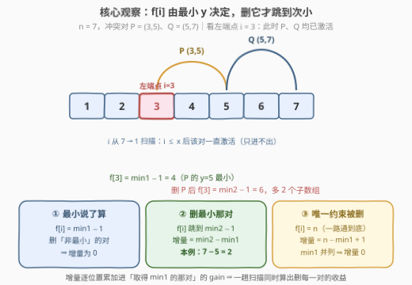
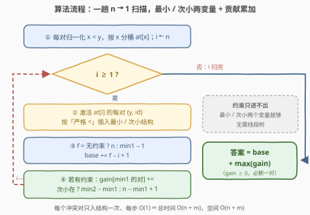

# LeetCode 删除一个冲突对后最大子数组数目 题解

## 1. 题目概述

- **标题 / 题号**：删除一个冲突对后最大子数组数目（#3480，hard）
- **链接**：https://leetcode.cn/problems/maximize-subarrays-after-removing-one-conflicting-pair/
- **难度**：困难
- **标签**：数组、枚举、贡献法、线段树

**题意**：给定整数 `n`，视为数组 `nums = [1, 2, ..., n]`（**值即下标**）。再给定二维数组 `conflictingPairs`，其中 `conflictingPairs[i] = [a, b]` 表示 `a` 和 `b` 构成一个**冲突对**。

要求从 `conflictingPairs` 中**删除恰好一个**冲突对，然后统计 `nums` 中满足「不同时包含任何剩余冲突对中的 `a` 与 `b`」的非空子数组数量。返回删除后可能得到的**最大**子数组数量。

**示例 1**：

```text
输入：n = 4, conflictingPairs = [[2,3],[1,4]]
输出：9
解释：删除 [2,3]，剩余冲突对只有 [1,4]。合法子数组共 9 个：
      [1], [2], [3], [4], [1,2], [2,3], [3,4], [1,2,3], [2,3,4]。
```

**示例 2**：

```text
输入：n = 5, conflictingPairs = [[1,2],[2,5],[3,5]]
输出：12
解释：删除 [1,2]，剩余 [2,5] 和 [3,5]，此时合法子数组共 12 个。
```

**约束**：

- `2 <= n <= 10^5`
- `1 <= conflictingPairs.length <= 2 * n`
- `1 <= conflictingPairs[i][j] <= n`
- `conflictingPairs[i][0] != conflictingPairs[i][1]`

> 💡 **读题关键**：① 值域恰为 `1..n` 且有序 ⇒ 一个冲突对就是一段「禁区区间」；② 子数组 `[i, j]` 非法 ⇔ 存在剩余冲突对 `(x, y)`（`x < y`）使 `i <= x` 且 `j >= y`——**区间包含**关系是全部突破口；③ 必须**恰好删一个**（`m >= 1` 保证总能删），删约束只会让合法子数组**变多**；④ 答案上界是 $\frac{n(n+1)}{2} \approx 5 \times 10^9$，C++ 必须 `long long`。

## 2. 解题思路

### 2.1 暴力思路

**单次计数怎么做**：固定左端点 $i$，问右端点 $j$ 最远能到哪？子数组 $[i, j]$ 含冲突对 $(x, y)$（$x < y$）当且仅当 $i \le x$ 且 $j \ge y$。于是定义

$$f[i] = \min\Big(n,\ \min\{\, y - 1 \ :\ \text{冲突对 } (x, y),\ x \ge i \,\}\Big)$$

即**以 $i$ 为左端点的最长合法子数组的右端点**。以 $i$ 开头的合法子数组恰有 $f[i] - i + 1$ 个（右端点可取 $i \dots f[i]$），总数为

$$\sum_{i=1}^{n} \big(f[i] - i + 1\big)$$

固定一组冲突对求一次总数，可以用「$i$ 从 $n$ 往 $1$ 扫、$x \ge i$ 的对逐个激活并维护最小 $y$」做到 $O(n + m)$。

**暴力在哪**：外面还要枚举删哪一对——共 $m$ 种选择，总时间 $O(m(n + m))$。最坏 $2 \times 10^5 \times 3 \times 10^5 = 6 \times 10^{10}$，不可接受。更朴素的逐子数组检查 $O(m^2 n^2)$ 就更不用提了。

### 2.2 核心观察：最小值 + 次小值 + 贡献法



把「删掉某一对 $p$ 之后的答案」拆成 $\text{base} + \text{gain}(p)$，而所有 $\text{gain}(p)$ 可以在**同一趟从 $n$ 到 $1$ 的扫描**里同时累加出来。

**观察 1（$f[i]$ 只由最小 $y$ 决定）**：设 $\text{min1}$ 为「$x \ge i$ 的所有已激活冲突对」中 $y$ 的最小值。由于 $y \le n$，有 $y - 1 \le n - 1 < n$，所以 $f[i] = \text{min1} - 1$（无激活对时 $f[i] = n$）。**删掉不是最小的那对，$f[i]$ 纹丝不动。**

**观察 2（删掉取得最小的那对，$f[i]$ 跳到次小）**：设 $\text{min2}$ 为次小 $y$（来自另一对）。删掉取得 $\text{min1}$ 的那对 $p$ 后，$f[i]$ 变为 $\text{min2} - 1$。于是**在该位置上**删 $p$ 的增量为：

- 有 $\ge 2$ 对激活时：$\text{min2} - \text{min1}$；
- $p$ 是唯一激活的约束时：$n - \text{min1} + 1$（$f[i]$ 直接变 $n$）；
- $\text{min1}$ 并列（两对 $y$ 相同）时：$\text{min2} = \text{min1}$，增量为 $0$——删谁都一样，自动正确。

**观察 3（贡献法：增量是逐位置求和）**：删 $p$ 后的答案 $= \sum_i (f_p[i] - i + 1) = \text{base} + \sum_i (f_p[i] - f[i])$。逐位置看，只有「$p$ 恰好是该位置取得 $\text{min1}$ 的那对」时贡献非零。于是扫描 $i = n \to 1$，每步只维护 $(\text{min1}, \text{min2})$ 两个量，把该步的增量累加到 $\text{gain}[\text{min1 的对编号}]$ 上即可。

$$\text{answer} = \text{base} + \max_p \text{gain}(p)$$

> 💡 「最小值 + 次小值成对维护」是**删掉一个约束求最优**类问题的通用套路：被删对象只在「自己是当前瓶颈」的位置产生增量，瓶颈换人时增量交给次小值接管。对比 [3113. 边界元素是最大值的子数组数目](https://leetcode.cn/problems/find-the-number-of-subarrays-where-boundary-elements-are-maximum/) 中「最大值 + 次大值」的计数，结构如出一辙。

### 2.3 算法流程图



整体是一趟扫描：先把每对归一化为 $(x, y) = (\min, \max)$ 并按 $x$ 分桶；$i$ 从 $n$ 递减到 $1$，每步把 $x = i$ 的对插入「最小 / 次小」结构（**只进不出**，两个变量就够），随后累加 $\text{base}$ 与 $\text{gain}$；扫完取 $\text{base} + \max(\text{gain})$。

### 2.4 示例演算

以示例 2（$n = 5$，$p_0 = (1,2)$、$p_1 = (2,5)$、$p_2 = (3,5)$）走一遍：

| $i$ | 新激活 | min1（对） | min2（对） | $f[i]$ | 计入 base | 增量计入 |
|---|---|---|---|---|---|---|
| 5 | — | — | — | 5 | 1 | — |
| 4 | — | — | — | 5 | 2 | — |
| 3 | $p_2$ ($y{=}5$) | 5 ($p_2$) | — | 4 | 2 | $\text{gain}[p_2] \mathrel{+}= 5 - 5 + 1 = 1$ |
| 2 | $p_1$ ($y{=}5$) | 5 ($p_2$) | 5 ($p_1$) | 4 | 3 | $\text{gain}[p_2] \mathrel{+}= 5 - 5 = 0$ |
| 1 | $p_0$ ($y{=}2$) | 2 ($p_0$) | 5 ($p_2$) | 1 | 1 | $\text{gain}[p_0] \mathrel{+}= 5 - 2 = 3$ |

$\text{base} = 1 + 2 + 2 + 3 + 1 = 9$，$\text{gain} = [3, 0, 1]$，答案 $= 9 + 3 = 12$ ✓（删 $p_0 = [1,2]$，与示例一致）。

注意 $i = 2$ 一行：$p_1$ 与 $p_2$ 的 $y$ 并列为 $5$，此时删 $p_2$ 的增量为 $0$（$p_1$ 还压着同样的右边界），删 $p_1$ 也一样——结构里 min1、min2 并列时增量自然算出 $0$，**重复冲突对无需任何特判**。

## 3. 参考代码

### C++

```cpp
class Solution {
  public:
    long long maxSubarrays(int n, vector<vector<int>>& conflictingPairs) {
        int m = conflictingPairs.size();
        vector<vector<pair<int, int>>> at(n + 1);      // at[x]：左端为 x 的 (y, 对编号)
        for (int i = 0; i < m; i++) {
            int a = conflictingPairs[i][0], b = conflictingPairs[i][1];
            if (a > b) swap(a, b);
            at[a].push_back({b, i});
        }
        int m1y = 0, m1id = -1, m2y = 0, m2id = -1;   // 最小 / 次小：(y, 对编号)
        vector<long long> gain(m, 0);
        long long base = 0;
        for (int i = n; i >= 1; i--) {
            for (auto [y, id] : at[i]) {              // i ≤ x 的对恰好全部激活
                if (m1id < 0 || y < m1y) { m2y = m1y; m2id = m1id; m1y = y; m1id = id; }
                else if (m2id < 0 || y < m2y) { m2y = y; m2id = id; }
            }
            int f;
            if (m1id < 0) f = n;                      // 无约束：一路通到 n
            else {
                f = m1y - 1;
                gain[m1id] += (m2id < 0) ? (long long)(n - m1y + 1)
                                         : (long long)(m2y - m1y);
            }
            base += f - i + 1;
        }
        return base + *max_element(gain.begin(), gain.end());
    }
};
```

### Python

```python
class Solution:
    def maxSubarrays(self, n: int, conflictingPairs: List[List[int]]) -> int:
        m = len(conflictingPairs)
        at = [[] for _ in range(n + 1)]               # at[x]：(y, 对编号)
        for idx, (a, b) in enumerate(conflictingPairs):
            x, y = (a, b) if a < b else (b, a)
            at[x].append((y, idx))

        m1y = m1id = m2y = m2id = None                # 最小 / 次小
        gain = [0] * m
        base = 0
        for i in range(n, 0, -1):
            for y, idx in at[i]:
                if m1y is None or y < m1y:
                    m2y, m2id = m1y, m1id
                    m1y, m1id = y, idx
                elif m2y is None or y < m2y:
                    m2y, m2id = y, idx
            if m1y is None:
                f = n                                 # 无约束
            else:
                f = m1y - 1
                gain[m1id] += (n - m1y + 1) if m2y is None else (m2y - m1y)
            base += f - i + 1
        return base + max(gain)
```

> ⚠️ **三个易错点**：① C++ 返回 `long long`，`base` 最坏 $\frac{n(n+1)}{2} \approx 5 \times 10^9$，`gain` 单项也要用 64 位累加；② 插入比较必须用**严格小于**——$y$ 并列时次小与最小相等，增量自动为 $0$，天然处理重复对；③ 增量是**逐位置求和**（贡献法），不是取最大——删一对的收益遍布「它当瓶颈」的整段左端点区间，漏加一个位置就错。

## 4. 复杂度分析

| 维度 | 复杂度 | 说明 |
|------|--------|------|
| 时间复杂度 | $O(n + m)$ | $i$ 单趟从 $n$ 扫到 $1$；每个冲突对恰好插入「最小/次小」结构一次，每次 $O(1)$ |
| 空间复杂度 | $O(n + m)$ | 桶 `at` 与 `gain` 数组 |
| 数据范围验证 | — | $n \le 10^5$、$m \le 2n$ ⇒ 约 $3 \times 10^5$ 次基本操作；答案上界 $\approx 5 \times 10^9$ 需 64 位整数 |

> 💡 官方提示给的是线段树（$O((n+m)\log n)$），本题由于约束恰好都挂在「前缀」上且只需查询当前最小/次小，两个变量即可替代整棵线段树——数据范围 $n \le 10^5$ 本身也暗示线性解的存在。

## 5. 扩展：线段树做法与一般化

**（a）官方提示的线段树版本**：初始 $f[i] = n$；把冲突对按 $y$ **从大到小**排序，依次对前缀 $[1, x]$ 做「$f$ 与 $y - 1$ 取 min」的区间更新——同一位置只会被越来越小的值覆盖。区间 chmin + 全局求和用 Segment Tree Beats（吉司机线段树）维护，总复杂度 $O((n + m) \log n)$。「删一对」的增量同样可以在这套结构上离线统计。本题的「最小 + 次小」扫描正是该结构在**前缀约束**下的退化特例。

**（b）什么时候两个变量不够**：若冲突对从「前缀 $[1, x]$ 上限制右端点」一般化为「任意区间上限制」的约束（激活/失活不满足只进不出的单调性），最小/次小无法再用两个变量增量维护，就必须上 Segment Tree Beats 或离线扫描线。判断「约束是否具有只进不出的单调性」是选择数据结构的第一步。

**（c）「至多删一对」的变体**：若把「恰好删一个」改成「至多删一个」，由于 $\text{gain} \ge 0$（删约束只会更好），答案不变，仍是 $\text{base} + \max(\text{gain}, 0)$；若改成「删恰好 $k$ 对」，则需对每对维护「当瓶颈的完整区间」后做 $k$ 大增益选取，复杂度上升一个量级。

## 6. 面试要点

1. **$f[i]$ 的公式怎么来的？为什么与 $n$ 取 min 可以省掉？**
   - $[i, j]$ 含 $(x, y)$ ⇔ $i \le x$ 且 $j \ge y$；固定 $i$ 后所有 $x \ge i$ 的对共同压制右边界。又 $y \le n \Rightarrow y - 1 \le n - 1 < n$，故 $f[i] = \text{min1} - 1$ 恒不被 $n$ 截断。

2. **为什么删「非最小」的对不影响任何 $f[i]$？**
   - $f[i]$ 由最小 $y$ 决定，删别的对 min1 不动。因此删 $p$ 的增量只在「$p$ 是该位置取得 min1 的那对」处非零——这正是所有 gain 能在一趟扫描里同时算完的原因。

3. **增量为什么是求和而不是取最大？**
   - 删 $p$ 后答案 $= \text{base} + \sum_i (f_p[i] - f[i])$，是逐位置增量之和；删一对的收益分布在它当瓶颈的一整段左端点区间上，取 max 会漏掉绝大多数贡献。

4. **$y$ 并列 / 输入含重复冲突对时为什么不出错？**
   - 插入用严格小于：并列时次小 == 最小，增量 $= \text{min2} - \text{min1} = 0$，无论删哪只重复对结果一致，无需特判。

5. **为什么不用线段树？**
   - $i$ 从 $n$ 到 $1$ 扫描时约束只激活不消失（只进不出），且每次只需要「当前最小 / 次小」两个值——两个变量就是线段树在该场景下的全部信息量。约束失去单调性时才需要 Segment Tree Beats。

## 同类练习题

| # | 题目 | 与本题的关联 |
|---|------|-------------|
| 3113 | [边界元素是最大值的子数组数目](https://leetcode.cn/problems/find-the-number-of-subarrays-where-boundary-elements-are-maximum/) | 同款「最大值 + 次大值」成对维护的子数组计数 |
| 907 | [子数组的最小值之和](https://leetcode.cn/problems/sum-of-subarray-minimums/) | 贡献法拆「每个元素在多少子数组中当最小值」的经典入门 |
| 2104 | [子数组范围和](https://leetcode.cn/problems/sum-of-subarray-ranges/) | 区间 min/max 的贡献求和，可对照体会「按端点拆贡献」 |
| 1493 | [删掉一个元素以后全为 1 的最长子数组](https://leetcode.cn/problems/longest-subarray-of-1s-after-deleting-one-element/) | 「删除恰好一个」约束的滑动窗口版入门 |
| 3 | [无重复字符的最长子串](https://leetcode.cn/problems/longest-substring-without-repeating-characters/) | 同为「先求每个左端点的最长合法右端点 $f[i]$，再 $\sum$ 计数」的套路（本仓库已有题解） |
