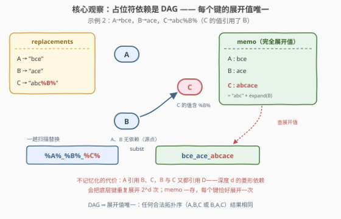
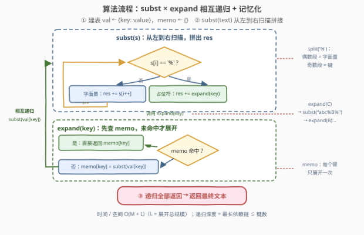

# 应用替换

- **题目名称**：应用替换
- **链接**：[3481. 应用替换](https://leetcode.cn/problems/apply-substitutions/)
- **难度**：中等
- **标签**：深度优先搜索、广度优先搜索、图、拓扑排序、数组、哈希表、字符串、记忆化

> ⚠️ 本题为 LeetCode **付费题**（`isPaidOnly`）。下方题意描述、示例与约束依据官方示例用例与 hints 重建，可能与官方题面有出入；算法输出已与两个官方样例逐一核对一致。

## 1. 题目概述

给定二维字符串数组 `replacements`（每个元素为一对 `[key, value]`）和字符串 `text`。

`text` 中形如 `%X%` 的子串称为**占位符**（`X` 是 `replacements` 中的某个键）。**替换**的含义：把子串 `%X%` 整体删掉，在原位置插入键 `X` 的替换值。

麻烦在于**替换值本身也可能含占位符**——需要递归地展开到没有任何占位符为止。

题目保证：

- 键互不相同，占位符引用的键都在 `replacements` 中；
- **依赖关系无环**（不会出现 A 的值含 `%B%`、B 的值又含 `%A%`）；
- 全部替换完成后 `text` 不再含任何占位符。

返回最终字符串。

**示例 1（官方样例）**：

```text
输入：replacements = [["A","abc"],["B","def"]], text = "%A%_%B%"
输出："abc_def"
解释：%A% → "abc"，%B% → "def"，占位符之间 的 "_" 原样保留。
```

**示例 2（官方样例）**：

```text
输入：replacements = [["A","bce"],["B","ace"],["C","abc%B%"]], text = "%A%_%B%_%C%"
输出："bce_ace_abcace"
解释：C 的值 "abc%B%" 内部又含 %B%：先把 C 展开为 "abc" + "ace" = "abcace"，
      再把 text 中的 %A%、%B%、%C% 分别换成 "bce"、"ace"、"abcace"。
```

**约束条件**（依据样例与 hints 重建，量级待确认）：

- $1 \le \text{replacements.length} \le 100$；
- 键、值与 `text` 中，`%` 只作为占位符分隔符**成对**出现（键与值本身不含孤立的 `%`）；
- 依赖关系构成**有向无环图**。

> 💡 **读题关键**：本题的本质是「**带依赖的字符串宏展开**」——像 C 语言宏那样，`#define C abc%B%` 展开时还要继续展开 `B`。两个官方 hint 把路线挑明了：① 建依赖图（值含 `%X%` 就连边 `X → 键`）+ 拓扑排序；② 按序把每个键展开成**完全展开值**，最后替换 `text`。

---

## 2. 解题思路

### 2.1 暴力思路

两种直白写法，各有各的坑：

1. **逐层重扫**：反复扫描 `text`，每趟把当前出现的占位符全部换成**原值**（不是展开值），直到串里没有 `%`。无环保证它一定会停，但每趟都要全串重扫、重新解析，中间串被反复拼接拆开，总代价约 $O(\text{深度} \times \text{答案长})$，且代码里「扫描—替换—重扫」的循环很难写干净。
2. **递归展开、不记忆化**：从 `text` 出发，遇到 `%X%` 就递归展开 `X` 的值。致命伤是**菱形依赖**：设 `D = "x"`，`C = "%D%%D%"`，`B = "%D%%D%"`，`A = "%B%%C%"`——`D` 会被重复展开 $4$ 次；深度为 $d$ 的满菱形结构会把底层键展开 $2^d$ 次，**指数爆炸**。

两种暴力的病根相同：**同一个键的展开工作被重复做了**。

### 2.2 核心观察：依赖是 DAG，键的展开值唯一——记忆化 + 相互递归



**观察 1：依赖关系是一张 DAG。** 把每个键看成节点；若键 `Y` 的值里含 `%X%`，就连一条 `X → Y` 的边（语义：`X` 必须先于 `Y` 展开）。题目保证无环，所以这张图是 **DAG**，合法的展开顺序（拓扑序）一定存在。

**观察 2：每个键的「完全展开值」唯一，与展开顺序无关。** $\mathrm{expand}(k)$ 只依赖 `k` 的值以及它引用的键的展开值——对 DAG 归纳可知唯一。于是 **每个键只需展开一次**，结果存进 `memo` 哈希表处处复用，指数爆炸直接消失。这正是官方 hint 2 说的「按拓扑序处理每个键」的等价形式：**记忆化 DFS = 按需的拓扑排序**。

**观察 3：解析占位符不需要正则。** 因为 `%` 只作为成对的分隔符出现，对任意串 `s` 执行 `s.split('%')` 后，**偶数下标段是字面量、奇数下标段是键**——例如 `"abc%B%".split('%')` 得 `['abc', 'B', '']`。一对 `subst` / `expand` **相互递归**的函数即可完成全部工作：

- `subst(s)`：把 `s` 里的占位符换成展开值；
- `expand(key)`：返回 `key` 的完全展开值 = `subst(val[key])`，先查 `memo`。

> ⚠️ **两个易错点**：① 替换的是键的**完全展开值**而非原值——`%C%` 直接换 `"abc%B%"` 会把 `%B%` 漏进答案；② `expand` 必须先查 `memo` 再递归，否则菱形依赖照样指数级。

### 2.3 算法流程图



**逻辑执行步骤**：

| 步骤 | 动作 | 说明 |
|------|------|------|
| ① | 建表 `val[key]`，`memo` 置空 | 键 → 原值的哈希表 |
| ② | 调 `subst(text)` | 从左到右扫描，字面量直接追加 |
| ③ | 遇到 `%key%` → 调 `expand(key)` | `memo` 命中直接返回；未命中则 `subst(val[key])` 后写回 `memo` |
| ④ | `subst(text)` 拼接完成 | 返回结果即最终文本 |

> 💡 递归的形状就是依赖链：`expand(C)` → `subst("abc%B%")` → `expand(B)`……回溯的路上把每层的 `memo` 填好。递归深度 = 最长依赖链长度 ≤ 键数，本题规模下无爆栈之虞（链条极长时可换 2.5 节的迭代拓扑排序）。

### 2.4 示例演算

以示例 2 演算（调用按发生顺序）：

| 调用 | `val[key]` | `split('%')` | 展开 | `memo` 变化 |
|------|-----------|--------------|------|------------|
| `subst("%A%_%B%_%C%")` | —— | `['','A','_','B','_','C','']` | 逐段拼接，遇键转 `expand` | —— |
| `expand(A)` | `"bce"` | `['bce']` | `"bce"` | `A: "bce"` |
| `expand(B)` | `"ace"` | `['ace']` | `"ace"` | `B: "ace"` |
| `expand(C)` | `"abc%B%"` | `['abc','B','']` | `"abc" + expand(B) = "abcace"` | `C: "abcace"` |

拼接结果：`"" + "bce" + "_" + "ace" + "_" + "abcace" + ""` = `"bce_ace_abcace"`，与官方输出一致。

---

## 3. 参考代码

### C++

```cpp
class Solution {
public:
    string applySubstitutions(vector<vector<string>>& replacements, string text) {
        unordered_map<string, string> val, memo;
        for (auto& r : replacements) val[r[0]] = r[1];

        function<string(const string&)> expand;
        function<string(const string&)> subst = [&](const string& s) {
            string res;
            size_t i = 0;
            while (i < s.size()) {
                if (s[i] == '%') {
                    size_t j = s.find('%', i + 1);
                    res += expand(s.substr(i + 1, j - i - 1));
                    i = j + 1;
                } else {
                    res += s[i++];
                }
            }
            return res;
        };
        expand = [&](const string& key) {
            auto it = memo.find(key);
            if (it != memo.end()) return it->second;
            return memo[key] = subst(val[key]);
        };

        return subst(text);
    }
};
```

> 💡 `subst` 手写 `find('%')` 配对取键；`expand` 是标准的「查 memo → 未命中递归 → 写回」三步。两个函数相互递归：先声明 `expand` 再定义两个 lambda，调用时二者都已就绪。状态全部放在局部变量里，天然免于多次调用的残留污染。

### Python

```python
class Solution:
    def applySubstitutions(self, replacements: List[List[str]], text: str) -> str:
        val = dict(replacements)
        memo = {}

        def subst(s: str) -> str:
            res = []
            for i, part in enumerate(s.split('%')):
                res.append(part if i % 2 == 0 else expand(part))
            return ''.join(res)

        def expand(key: str) -> str:
            if key not in memo:
                memo[key] = subst(val[key])
            return memo[key]

        return subst(text)
```

> 💡 `split('%')` 的奇偶下标直接区分字面量与键，省去手写扫描；列表收集 + 一次 `join`，避免字符串反复重建。

---

## 4. 复杂度分析

| 维度 | 复杂度 | 说明 |
|------|--------|------|
| 时间复杂度 | $O(M + L)$ | $M$ 为输入总长（全部原值 + `text`），$L$ 为**产出总规模**（各键完全展开值长度之和 + 最终答案长度）：记忆化保证每个键只展开一次，每次拼接的字符最终都落入某个 `memo` 值或答案里 |
| 空间复杂度 | $O(M + L)$ | `val` + `memo` + 结果串；递归栈深度 = 最长依赖链 ≤ 键数 |

> ⚠️ 对照暴力解：无记忆化递归在菱形依赖下最坏 $O(2^d)$（$d$ 为依赖深度）；逐层重扫为 $O(d \cdot L)$。记忆化把两者一起压到线性于产出规模。

---

## 5. 扩展：拓扑排序（Kahn）写法与环检测

官方 hint 给的是拓扑排序路线——**迭代**、无递归深度顾虑，链式依赖极长时更稳。边方向：`X → Y` 当且仅当 `Y` 的值引用了 `%X%`；`Y` 的入度 = 它的值里占位符的个数。入度归零即「所有依赖已展开」，可以立即展开：

```python
from collections import defaultdict, deque

class Solution:
    def applySubstitutions(self, replacements: List[List[str]], text: str) -> str:
        val = dict(replacements)
        adj = defaultdict(list)
        indeg = {k: 0 for k in val}
        for k, v in val.items():
            for i, part in enumerate(v.split('%')):
                if i % 2 == 1:
                    adj[part].append(k)
                    indeg[k] += 1

        memo = {}
        q = deque(k for k in val if indeg[k] == 0)
        while q:
            k = q.popleft()
            memo[k] = ''.join(
                p if i % 2 == 0 else memo[p]
                for i, p in enumerate(val[k].split('%'))
            )
            for nxt in adj[k]:
                indeg[nxt] -= 1
                if indeg[nxt] == 0:
                    q.append(nxt)

        return ''.join(
            p if i % 2 == 0 else memo[p]
            for i, p in enumerate(text.split('%'))
        )
```

> 💡 两个细节：① 同一键引用两次 `%X%%X%` 会让入度 +2，`adj[X]` 里也相应出现两次，减完恰好归零；② **环检测免费赠送**——循环结束后若 `len(memo) < len(val)`，说明存在环（题目保证不会，但防御性检查一行搞定）。递归版对应的检测手段是三色标记 DFS（`visiting` 状态遇回边即有环）。

---

## 6. 面试要点

1. **为什么递归展开不记忆化会指数爆炸？**

   > 菱形依赖：`A` 引用 `B`、`C`，`B`、`C` 又都引用 `D`……深度 $d$ 的满二叉引用图会把底层键重复展开 $2^d$ 次。`memo` 一存，每个键恰好展开一次，总代价线性于产出规模。

2. **为什么每个键的展开值与替换顺序无关？**

   > 依赖图是 DAG，$\mathrm{expand}(k)$ 是其引用键展开值的纯函数，对 DAG 高度归纳即得唯一性。这也解释了任何合法拓扑序（如示例 2 的 `A,B,C` 或 `B,A,C`）产出完全相同。

3. **解析 `%X%` 需要正则吗？**

   > 不需要。`%` 只作成对分隔符出现，`split('%')` 后偶数下标是字面量、奇数下标是键；C++ 手写 `find('%')` 配对即可。顺带的健壮性检查：`split` 结果长度为偶数说明 `%` 不配对，输入非法。

4. **递归深度会不会爆栈？**

   > 深度 = 最长依赖链 ≤ 键数。本题量级无忧；若键数上到 $10^5$ 且链式依赖，Python 默认递归上限（1000）会爆，换第 5 节的 Kahn 迭代版即可彻底规避。

5. **题目里哪些保证是算法正确性的前提？**

   > ① **无环**——保证展开必然终止、拓扑序存在；② **占位符都指向存在的键**——保证 `val[key]` 不落空；③ **替换完成后无占位符**——保证答案里没有残留。工程化场景（如模板引擎）三者都要自检：环用三色 DFS / Kahn 剩余节点，缺键查 `val`，残留 `%` 查最终串。

---

## 7. 同类练习题

- [207. 课程表](https://leetcode.cn/problems/course-schedule/)（[题解](../0201-0300/207_课程表.md)）：拓扑排序判环入门——本题「依赖图 + 无环保证」的同款基础设施
- [210. 课程表 II](https://leetcode.cn/problems/course-schedule-ii/)（[题解](../0201-0300/210_课程表II.md)）：输出一条合法拓扑序，对应 hint「按拓扑序逐键展开」的实现路线
- [394. 字符串解码](https://leetcode.cn/problems/decode-string/)（[题解](../0301-0400/394_字符串解码.md)）：嵌套结构的递归展开，「串里套串」与本题「值里套占位符」同构
- [399. 除法求值](https://leetcode.cn/problems/evaluate-division/)（[题解](../0301-0400/399_除法求值.md)）：先建图再在图上做查询的 DFS，与「建依赖图 + 按需展开」同一套路
