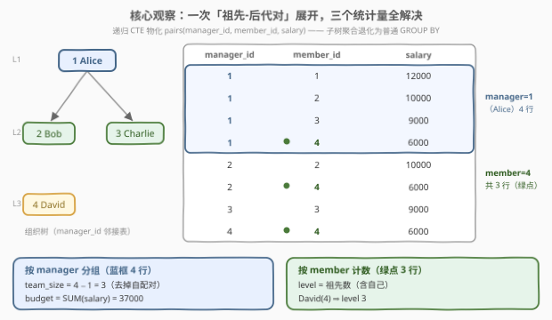
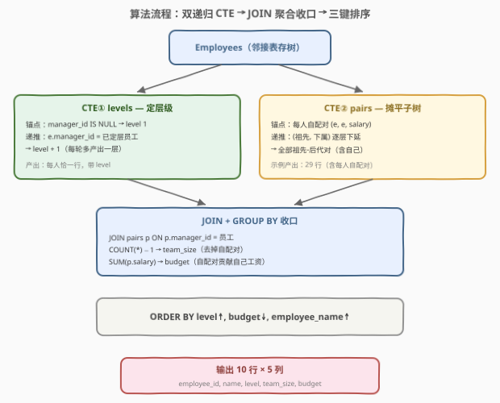

# LeetCode 分析组织层级 题解

## 1. 题目概述

- **标题 / 题号**：分析组织层级（#3482，hard）
- **链接**：https://leetcode.cn/problems/analyze-organization-hierarchy/
- **难度**：困难
- **标签**：数据库、SQL、递归 CTE、树、组织层级、子树聚合、pandas

**表结构**：`Employees`

```sql
CREATE TABLE Employees (
    employee_id    INT,
    employee_name  VARCHAR(30),
    manager_id     INT,     -- 顶级经理（CEO）的 manager_id 为 NULL
    salary         INT,
    department     VARCHAR(30)
);
```

`employee_id` 是主键。每一行记录一名员工的 ID、姓名、其经理的 ID、薪水与部门。组织结构是一棵**以 CEO 为根的树**（`manager_id` 构成典型的**邻接表**存储）。

**目标**：一次查询回答三个问题：

1. **层级 `level`**：每名员工在组织中的层级——CEO 为 1，CEO 的直接下属为 2，以此类推（树上该节点的**深度 + 1**）；
2. **团队大小 `team_size`**：每名员工作为经理时，手下**直接 + 间接下属**的总人数（其**子树大小 − 1**）；
3. **薪资预算 `budget`**：每名经理控制的总薪资预算——**自己 + 所有手下（含间接）的工资之和**（其**子树薪水和**）。

返回 `employee_id, employee_name, level, team_size, budget`，按 **`level` 升序 → `budget` 降序 → `employee_name` 升序** 排序。

**示例 1**：

```text
输入：Employees 表
+-------------+---------------+------------+--------+-------------+
| employee_id | employee_name | manager_id | salary | department  |
+-------------+---------------+------------+--------+-------------+
| 1           | Alice         | null       | 12000  | Executive   |
| 2           | Bob           | 1          | 10000  | Sales       |
| 3           | Charlie       | 1          | 10000  | Engineering |
| 4           | David         | 2          | 7500   | Sales       |
| 5           | Eva           | 2          | 7500   | Sales       |
| 6           | Frank         | 3          | 9000   | Engineering |
| 7           | Grace         | 3          | 8500   | Engineering |
| 8           | Hank          | 4          | 6000   | Sales       |
| 9           | Ivy           | 6          | 7000   | Engineering |
| 10          | Judy          | 6          | 7000   | Engineering |
+-------------+---------------+------------+--------+-------------+

输出：
+-------------+---------------+-------+-----------+--------+
| employee_id | employee_name | level | team_size | budget |
+-------------+---------------+-------+-----------+--------+
| 1           | Alice         | 1     | 9         | 84500  |
| 3           | Charlie       | 2     | 4         | 41500  |
| 2           | Bob           | 2     | 3         | 31000  |
| 6           | Frank         | 3     | 2         | 23000  |
| 4           | David         | 3     | 1         | 13500  |
| 7           | Grace         | 3     | 0         | 8500   |
| 5           | Eva           | 3     | 0         | 7500   |
| 9           | Ivy           | 4     | 0         | 7000   |
| 10          | Judy          | 4     | 0         | 7000   |
| 8           | Hank          | 4     | 0         | 6000   |
+-------------+---------------+-------+-----------+--------+
```

**解释**：

- **层级**：Alice 是 CEO（层级 1）；Bob、Charlie 是她的直接下属（层级 2）；David、Eva、Frank、Grace 层级 3；Hank、Ivy、Judy 层级 4；
- **团队大小**：Alice 手下 9 人（全公司除她之外）；Charlie 手下 4 人（Frank、Grace、Ivy、Judy）；Bob 手下 3 人（David、Eva、Hank）；David 手下 1 人（Hank）；Frank 手下 2 人（Ivy、Judy）；叶子员工为 0；
- **预算**：Alice = 全员工资总和 $12000 + 72500 = 84500$；Charlie = $10000 + 23000 + 8500 = 41500$；没有下属的员工预算即自己的工资。

> 💡 **审题关键**：这是 SQL 里典型的「**邻接表存树 + 树上统计**」母题。三个任务翻译成树的语言：`level` = 节点深度 + 1（**自顶向下**传播），`team_size` = 子树大小 − 1，`budget` = 子树和（**自底向上**聚合）。SQL 的 `GROUP BY` 只能按**直接**经理分组，跨多层的「子树」聚合必须借助**递归 CTE**（MySQL 8+）把隐藏的层级关系显式物化出来。

## 2. 解题思路

### 2.1 暴力思路：应用层逐人向上爬

最直觉的做法是把整张表拉回程序，逐个员工处理：

```text
for e in employees:                       # 层级：沿 manager_id 一路向上数
    level[e] = 1; cur = e
    while cur.manager_id is not NULL:
        cur = manager(cur); level[e] += 1

for m in employees:                       # 团队/预算：逐人判断祖先
    for e in employees:
        if m 是 e 的祖先（e 沿 manager 链能到达 m）:
            team_size[m] += 1; budget[m] += salary[e]
    budget[m] += salary[m]
```

每个员工向上爬一遍是 $O(n \cdot h)$（$h$ 为树高）；「判祖先」双重循环更是 $O(n^2 \cdot h)$。SQL 侧的对应「暴力」是**逐层自连接**——但树深未知，需要 join 多少次写不进一条静态语句；而且即便知道深度 $h$，也要手写 $h$ 层嵌套 JOIN。

> ⚠️ 暴力的启示：难点在于 `GROUP BY manager_id` 只能看到**直接**下属，「子树」这个跨多层的概念在扁平表上不可见。突破口是把树「摊平」——用递归 CTE 物化出**全部祖先-后代对**，之后一切都退化为普通聚合。

### 2.2 核心观察：一次「祖先-后代对」展开，三个问题全解决



关键观察有三条：

| 观察 | 内容 | 带来的做法 |
|------|------|-----------|
| **递归 CTE 天然做树的遍历** | 锚点从 CEO（`manager_id IS NULL`）出发，递推部分按 `e.manager_id = 已定层员工` 接孩子——每往下走一层 `level + 1`，层级顺带传下去 | CTE① `levels`：每人恰一行，带上正确 `level` |
| **子树聚合 = 祖先-后代对摊平** | 把所有 `(祖先, 后代)` 对（**含每人自己配自己**）物化成表 `pairs`，则「经理 $m$ 的子树」恰好是 `pairs.manager_id = m` 的那些行——**树上难以表达的子树和，变成普通 `GROUP BY`** | CTE② `pairs`：锚点自配对 `(e, e)`，递推 `(祖先, 下属)` 逐层下延 |
| **自配对一举三得** | 锚点让每人至少有一行 `manager_id = 自己`：① `budget` 天然含自己工资；② `team_size = COUNT − 1` 去掉自己；③ 后续 JOIN 不会丢行 | 收口聚合直接写 `COUNT(*) - 1` 与 `SUM(salary)`，无需 `COALESCE` 兜底 |

三条观察合起来，整道题坍缩成「**两个递归 CTE + 一次 JOIN 聚合 + 一遍排序**」：

```sql
WITH RECURSIVE levels AS (          -- ① 定层级：自顶向下逐层 +1
    SELECT employee_id, employee_name, salary, 1 AS level
    FROM Employees
    WHERE manager_id IS NULL
    UNION ALL
    SELECT e.employee_id, e.employee_name, e.salary, l.level + 1
    FROM Employees e
    JOIN levels l ON e.manager_id = l.employee_id
),
pairs AS (                          -- ② 摊平：全部祖先-后代对（含自配对）
    SELECT employee_id AS manager_id, employee_id AS member_id, salary
    FROM Employees
    UNION ALL
    SELECT p.manager_id, e.employee_id, e.salary
    FROM pairs p
    JOIN Employees e ON e.manager_id = p.member_id
)
SELECT l.employee_id, l.employee_name, l.level,
       COUNT(*) - 1 AS team_size,   -- 去掉自配对那行
       SUM(p.salary) AS budget      -- 自配对那行贡献了自己的工资
FROM levels l
JOIN pairs p ON p.manager_id = l.employee_id
GROUP BY l.employee_id, l.employee_name, l.level
ORDER BY l.level ASC, budget DESC, l.employee_name ASC;
```

> 💡 **递归 CTE 的执行模型**是「半不动点迭代」：锚点（`UNION ALL` 前半）产生初始行集；递推部分（后半，引用 CTE 自身）反复作用于已有行集，直到不再产生新行为止。`levels` 的迭代轮数 = 树高 $h$，第 $k$ 轮恰好产出第 $k$ 层员工；`pairs` 同理，第 $k$ 轮产出所有「距离为 $k-1$」的祖先后代对。
>
> 另一个细节：`WITH RECURSIVE` 关键字作用于**整个 WITH 子句**，所以 `levels` 和 `pairs` 两个 CTE 写在一个 `WITH RECURSIVE` 下即可，各自独立递归、互不干扰（`pairs` 并不引用 `levels`）。

### 2.3 算法流程图



| 步骤 | SQL 片段 | 作用 | 示例数据流 |
|------|----------|------|-----------|
| ① 行源 | `FROM Employees` | 读入 10 行邻接表 | 10 行原始员工记录 |
| ② 定层级 | CTE① `levels` 递归下探 | 每人恰一行，带上 `level` | 10 行 × `level`（1~4） |
| ③ 摊平 | CTE② `pairs` 递归下延 | 物化全部祖先-后代对（含自配对） | 29 行 `(manager_id, member_id, salary)` |
| ④ 聚合收口 | `JOIN pairs ON manager_id = 员工` + `GROUP BY` | `COUNT(*) - 1` → `team_size`；`SUM(salary)` → `budget` | 10 行 × 5 列 |
| ⑤ 三键排序 | `ORDER BY level↑, budget↓, name↑` | 层级升序、同级预算降序、并列名字升序 | 示例输出顺序 |

> 💡 示例的 `pairs` 共 29 行：Alice 作为经理有 10 行（全公司），Bob 4 行（Bob、David、Eva、Hank），Charlie 5 行，David 2 行，Frank 3 行，其余叶子各 1 行——$10+4+5+2+3+1 \times 5 = 29$，即「每人贡献给每个祖先（含自己）一行」，也等于 $\sum_{e} \text{level}(e) = 1+2+2+3+3+3+3+4+4+4$。

### 2.4 示例演算

对示例数据逐步走一遍（`pairs` 按经理分组）：

| 经理 | pairs 中 `manager_id = 经理` 的成员集合 | 行数 | team_size = 行数 − 1 | budget = Σsalary |
|------|--------------------------------------|------|---------------------|------------------|
| **Alice** | 全部 10 人 | 10 | 9 | $12000+10000+10000+7500+7500+9000+8500+6000+7000+7000 = 84500$ |
| **Charlie** | Charlie, Frank, Grace, Ivy, Judy | 5 | 4 | $10000+9000+8500+7000+7000 = 41500$ |
| **Bob** | Bob, David, Eva, Hank | 4 | 3 | $10000+7500+7500+6000 = 31000$ |
| **Frank** | Frank, Ivy, Judy | 3 | 2 | $9000+7000+7000 = 23000$ |
| **David** | David, Hank | 2 | 1 | $7500+6000 = 13500$ |
| Eva / Grace / Hank / Ivy / Judy | 仅自己 | 1 | 0 | 自己的工资 |

层级侧（CTE① 逐轮产出）：第 1 轮锚点产出 Alice（level 1）；第 2 轮产出 Bob、Charlie（level 2）；第 3 轮产出 David、Eva、Frank、Grace（level 3）；第 4 轮产出 Hank、Ivy、Judy（level 4）。

最后按 `level↑, budget↓, name↑` 落座：层级 2 中 Charlie（41500）排在 Bob（31000）之前；层级 4 中 Ivy 与 Judy 预算同为 7000，按姓名升序 Ivy 在前——与示例输出完全一致。

## 3. 参考代码

### SQL（解法 A：双递归 CTE，推荐）

```sql
# Write your MySQL query statement below
WITH RECURSIVE levels AS (
    SELECT employee_id, employee_name, salary, 1 AS level
    FROM Employees
    WHERE manager_id IS NULL
    UNION ALL
    SELECT e.employee_id, e.employee_name, e.salary, l.level + 1
    FROM Employees e
    JOIN levels l ON e.manager_id = l.employee_id
),
pairs AS (
    SELECT employee_id AS manager_id, employee_id AS member_id, salary
    FROM Employees
    UNION ALL
    SELECT p.manager_id, e.employee_id, e.salary
    FROM pairs p
    JOIN Employees e ON e.manager_id = p.member_id
)
SELECT l.employee_id, l.employee_name, l.level,
       COUNT(*) - 1 AS team_size,
       SUM(p.salary) AS budget
FROM levels l
JOIN pairs p ON p.manager_id = l.employee_id
GROUP BY l.employee_id, l.employee_name, l.level
ORDER BY l.level ASC, budget DESC, l.employee_name ASC;
```

> 💡 **写法要点**：
> - **两个 CTE 各司其职**：`levels` 管「每人一层」（自顶向下），`pairs` 管「子树摊平」（含自配对），职责清晰、面试好讲；
> - `COUNT(*) - 1` 与 `SUM(p.salary)` 全靠自配对成立——少了它，`budget` 要额外 `+ e.salary`、叶子员工会在 JOIN 中整行丢失；
> - `ORDER BY` 引用聚合别名 `budget` 是合法的（`ORDER BY` 在 `SELECT` 之后求值）。

### SQL（解法 B：单 CTE 巧解——level = 祖先计数）

```sql
# Write your MySQL query statement below
WITH RECURSIVE pairs AS (
    SELECT employee_id AS manager_id, employee_id AS member_id, salary
    FROM Employees
    UNION ALL
    SELECT p.manager_id, e.employee_id, e.salary
    FROM pairs p
    JOIN Employees e ON e.manager_id = p.member_id
)
SELECT e.employee_id, e.employee_name,
       lv.level,
       agg.team_size,
       agg.budget
FROM Employees e
JOIN (
    SELECT member_id, COUNT(*) AS level
    FROM pairs
    GROUP BY member_id
) lv  ON lv.member_id  = e.employee_id
JOIN (
    SELECT manager_id, COUNT(*) - 1 AS team_size, SUM(salary) AS budget
    FROM pairs
    GROUP BY manager_id
) agg ON agg.manager_id = e.employee_id
ORDER BY lv.level ASC, agg.budget DESC, e.employee_name ASC;
```

> 💡 **解法 B 的取舍**：
> - 巧在「**层级 = 祖先个数（含自己）**」：员工 $e$ 的 `level` 恰好等于 `pairs` 中 `member_id = e` 的行数——CEO 只有自配对 1 行（level 1），David 有 `(Alice,David) (Bob,David) (David,David)` 共 3 行（level 3）。于是 `levels` CTE 整个省掉，一个 `pairs` 两次聚合收口；
> - 代价是 `pairs` 被引用两次（按 `member_id` 聚合一次、按 `manager_id` 聚合一次），多数引擎会将其物化复用，语义上没问题，但可读性略逊于解法 A；
> - 这也是「生成一次、多角度聚合」的典型范式——中间表只管摊平事实，统计口径交给外层。

### Python（pandas）

```python
import pandas as pd
from collections import deque


def analyze_organization_hierarchy(employees: pd.DataFrame) -> pd.DataFrame:
    df = employees[["employee_id", "employee_name", "manager_id", "salary"]].copy()

    # 邻接表 → 孩子表（CEO 的 manager_id 为 NaN，天然被跳过）
    children = {}
    for eid, mid in zip(df["employee_id"], df["manager_id"]):
        if pd.notna(mid):
            children.setdefault(int(mid), []).append(eid)

    # ① BFS 定层级：对应 SQL 的 CTE levels
    root = int(df.loc[df["manager_id"].isna(), "employee_id"].iloc[0])
    level = {root: 1}
    q = deque([root])
    while q:
        u = q.popleft()
        for v in children.get(u, []):
            level[v] = level[u] + 1
            q.append(v)

    # ② 自底向上累计子树和：按层级降序处理，把 (团队人数+1, 子树预算) 推给经理
    team = {eid: 0 for eid in df["employee_id"]}
    budget = dict(zip(df["employee_id"], df["salary"]))
    boss = dict(zip(df["employee_id"], df["manager_id"]))
    for eid in sorted(level, key=lambda x: -level[x]):
        m = boss[eid]
        if pd.notna(m):
            m = int(m)
            team[m] += team[eid] + 1
            budget[m] += budget[eid]

    df["level"] = df["employee_id"].map(level)
    df["team_size"] = df["employee_id"].map(team)
    df["budget"] = df["employee_id"].map(budget)

    return df.sort_values(
        ["level", "budget", "employee_name"], ascending=[True, False, True]
    )[["employee_id", "employee_name", "level", "team_size", "budget"]].reset_index(drop=True)
```

> 💡 **pandas 对照**（函数签名 `analyze_organization_hierarchy(employees)` 取自官方代码骨架）：
> - BFS 定层对应 CTE①；「按层级降序处理、向经理累加」对应子树和的**迭代后序遍历**——处理到某人时其所有下属（层级更深）已累计完毕，$O(n)$ 一遍完成，**无需**像 SQL 那样展开成 $O(n \cdot h)$ 的祖先-后代对；
> - `pd.notna(m)` 兜住 CEO（`manager_id` 为 `NaN`，不再向上累加）；
> - 这是应用层 DFS 与 SQL 声明式展开的复杂度分水岭，面试值得主动对比。

## 4. 复杂度分析

设 $n$ 为员工数，$h$ 为组织树的高度（最大层级）。

| 维度 | 复杂度 | 说明 |
|------|--------|------|
| **时间（CTE① levels）** | $O(n)$ | 每人恰产出 1 行，递归轮数 = $h$ |
| **时间（CTE② pairs）** | $O(n \cdot h)$ | 行数 = $\sum_e \text{level}(e)$：链状组织（每人只有一个下属）最坏 $O(n^2)$，平衡组织 $O(n \log n)$，扁平组织 $O(n)$ |
| **时间（聚合收口）** | $O(n \cdot h)$ | JOIN 与 GROUP BY 的输入即 `pairs` 的 $n \cdot h$ 行 |
| **空间** | $O(n \cdot h)$ | `pairs` 物化的中间结果集 |
| **pandas 版** | 时间 $O(n \log n)$（排序主导），空间 $O(n)$ | 每人只被「向上推」一次，无需展开 |

> ⚠️ SQL 版把「子树和」摊平成祖先-后代对，是**声明式范式下的标准 trade-off**：换来了纯集合式聚合的简洁，付出 $h$ 倍中间结果。若组织极深（如链状 10 万人的「传销式」结构），应改在应用层做一次后序 DFS（如 pandas 版），或预先物化路径/嵌套集结构。

## 5. 扩展：递归 CTE 的语法要点与树存储模型

**MySQL 8 递归 CTE 约束**（面试常追问）：

- `WITH RECURSIVE` 关键字作用于**整个 WITH 子句**，其后列出的所有 CTE 都可以使用递归（本题两个 CTE 共享一个关键字）；
- 递推部分对 CTE 自身的引用**只能出现一次**（不能再与自身 JOIN）；本题 `FROM pairs p JOIN Employees e ...` 合法，`FROM pairs p1 JOIN pairs p2 ...` 非法；
- 递归深度受 `cte_max_recursion_depth`（默认 1000）限制——本题递归轮数 = 树高，深层组织需留意；
- 锚点与递推部分的列数/类型必须一致，`UNION ALL`（不去重）比 `UNION`（每轮去重、可能大幅变慢）更常用；
- 防死循环：若 `manager_id` 构成环（数据脏），递推永远产生新行——生产环境可加「路径上限」或在递推里检测重复，本题题设保证是树可不管。

**树的存储模型对比**（为什么「子树聚合」值得单独一讲）：

| 模型 | 找层级 | 找子树 | 适用 |
|------|--------|--------|------|
| **邻接表**（本题：存 `manager_id`） | 递归 CTE 逐层下探 | 递归 CTE 摊平祖先-后代对 | 写多读少、结构常变 |
| **物化路径**（存 `1/3/6/` 形式的路径串） | `LENGTH(path) - LENGTH(REPLACE(path,'/',''))` 数分隔符 | `WHERE path LIKE '1/3/%'` 前缀匹配 | 读多写少，子树查询一条索引搞定 |
| **嵌套集**（存 `lft/rgt` 编号） | 需另存深度列 | `lft BETWEEN 祖先.lft AND 祖先.rgt` | 极读多写少，子树/祖先都是范围查询 |

本题若改用物化路径，`budget` 退化为一个自 JOIN + 前缀 LIKE，代价是每次组织变动要重写整条路径——**没有免费午餐**，存储模型即查询复杂度的预先分配。

## 6. 面试要点

1. **为什么一个普通 `GROUP BY manager_id` 做不出 `team_size` 和 `budget`？**

   > `GROUP BY manager_id` 只能把**直接**下属聚到一起（子树的第一层）；而 `team_size` / `budget` 需要的是**整个子树**（直接 + 间接下属），跨任意多层。扁平表上「子树」这个概念不可见，必须先用递归 CTE 沿 `manager_id` 把层级关系展开（物化祖先-后代对），之后才能退化成普通聚合。

2. **`pairs` 的锚点为什么要「每人自己配自己」？去掉会影响什么？**

   > 三处全崩：① `budget` 少算经理自己的工资（题目要求含自己）；② `team_size` 不能再用 `COUNT - 1`（没了那行基准）；③ 叶子员工作为 `manager_id` 在 `pairs` 中一行都没有，JOIN 直接把他们从结果里丢掉，还得补 `COALESCE` 兜底。自配对让「每人的子树（含自己）」恰好等于 `pairs` 中以他为经理的行集，三个细节一次解决。

3. **递归 CTE 是怎么执行的？和普通 CTE 有何区别？**

   > 半不动点迭代：先执行锚点得到初始行集 $R_0$，再反复执行递推部分（以当前结果为输入）得到 $R_1, R_2, \dots$，直到某轮不再产生新行为止，最终结果是各轮的并集。普通 CTE 只是一次子查询的别名；递归 CTE 允许在其定义内部引用自身，本质是用声明式语法写出了「迭代」。本题 `levels` 的第 $k$ 轮恰好产出第 $k$ 层员工。

4. **组织是一条链（每个经理只有一个下属）时，这套 SQL 会怎样？**

   > `pairs` 的行数退化到 $\sum_e \text{level}(e) = O(n^2)$，且递归轮数 = 树高 $n$，可能撞上 `cte_max_recursion_depth` 默认值 1000。此时应改用应用层一次后序遍历（每人把累计值向上推一次，$O(n)$），或改用物化路径/嵌套集的存储模型。复杂度上 $O(n \cdot h)$ 是摊平范式对树高 $h$ 的固有税。

5. **解法 B 里 `level = COUNT(*)`（按 member 计数）为什么成立？**

   > `pairs` 中 `member_id = e` 的每一行都对应 $e$ 的一个**祖先（含自己）**：CEO 的祖先只有自己 → 1 行 → level 1；David 的祖先是 Alice、Bob、自己 → 3 行 → level 3。而「祖先数（含自己）」正是「从根到该节点的节点数」= 层级。这是「同一张中间表换个键聚合就是另一个统计量」的漂亮例子，也是解法 B 能省掉整个 `levels` CTE 的根据。

> 💡 **一句话总结**：3482 = 「邻接表存树 + 子树统计」母题的递归 CTE 版——CTE① 自顶向下逐层 +1 定 `level`，CTE② 自配对锚点 + 逐层下延物化全部祖先-后代对，把子树大小/子树和坍缩成 `COUNT(*) - 1` 与 `SUM(salary)` 的普通 GROUP BY，最后三键排序收尾。记住「锚点自配对」与「摊平的 $O(n \cdot h)$ 代价」两个考点，一族组织架构题（608 / 570 / 1270 / 1978）全部通杀。

## 同类练习题

| # | 题目 | 与本题的关联 |
|---|------|-------------|
| 608 | [树节点](https://leetcode.cn/problems/tree-node/)（[站内题解](../0601-0700/608_树节点.md)） | 邻接表判根/叶/中间节点——`manager_id IS NULL` 与 `NOT IN` 的最小母题 |
| 570 | [至少有 5 名直接下属的经理](https://leetcode.cn/problems/managers-with-at-least-5-direct-reports/) | `GROUP BY manager_id` 数**直接**下属——本题 `team_size` 只算第一层的退化版 |
| 1270 | [向公司 CEO 汇报工作的所有人 🔒](https://leetcode.cn/problems/all-people-report-to-the-given-manager/)（[站内题解](../1201-1300/1270_向公司CEO汇报工作的所有人.md)） | 固定深度为 2 的「手下找手下的手下」——两层 JOIN 即可，正好体会递归 CTE 面对未知深度时的不可替代性 |
| 1978 | [上级经理已离职的公司员工](https://leetcode.cn/problems/employees-whose-manager-left-the-company/)（[站内题解](../1901-2000/1978_上级经理已离职的公司员工.md)） | 层级表与在职表的差集判断——`manager_id` 引用完整性的反面考法 |
