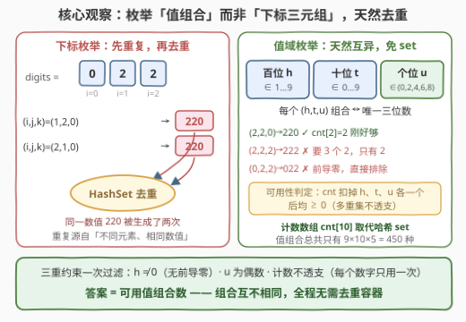
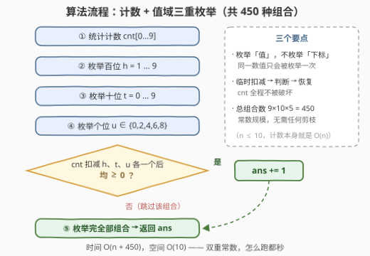

# LeetCode 不同三位偶数的数目 题解

## 1. 题目概述

- **标题 / 题号**：不同三位偶数的数目（#3483，easy）
- **链接**：https://leetcode.cn/problems/unique-3-digit-even-numbers/
- **难度**：简单
- **标签**：数组、哈希表、枚举、计数

**题意**：给你一个数字数组 `digits`，你需要从中选择**三个数字**组成一个**三位偶数**，你的任务是求出**不同**三位偶数的数量。

注意：

- 每个数字在三位偶数中都只能使用**一次**——但数组中**重复出现的数字各自算一个元素**（数组里有两个 `2`，就能用两次 `2`）；
- **不能有前导零**（百位不能是 `0`）。

**示例 1**：

```text
输入：digits = [1,2,3,4]
输出：12
解释：可以形成的 12 个不同的三位偶数是 124, 132, 134, 142, 214, 234,
      312, 314, 324, 342, 412 和 432。注意，不能形成 222，因为数字 2 只有一个。
```

**示例 2**：

```text
输入：digits = [0,2,2]
输出：2
解释：可以形成的三位偶数是 202 和 220。注意，数字 2 可以使用两次，
      因为数组中有两个 2。
```

**示例 3**：

```text
输入：digits = [6,6,6]
输出：1
解释：只能形成 666。
```

**示例 4**：

```text
输入：digits = [1,3,5]
输出：0
解释：无法形成三位偶数（个位凑不出偶数）。
```

**约束**：

- `3 <= digits.length <= 10`
- `0 <= digits[i] <= 9`

> 💡 **读题关键**：① 「每个数字只能用一次」约束的是**多重集可用性**——`[6,6,6]` 能拼 `666`，`[1,2,3,4]` 不能拼 `222`；② 求的是**不同数值的个数**，同一数值拼出多少遍都只算一次；③ 百位非零与个位为偶，是两条**逐位过滤**的硬约束。

## 2. 解题思路

### 2.1 暴力思路：三重下标枚举 + 哈希去重

最直白的做法：枚举所有**有序下标三元组** `(i, j, k)`（三者互不相同），拼出数值 $d_i \times 100 + d_j \times 10 + d_k$，过滤掉「百位为 0」与「个位为奇数」的，塞进 `HashSet` 里，最后返回集合大小。

```text
for i ≠ j ≠ k:
    if d[i] != 0 and d[k] % 2 == 0:
        set.add(d[i]*100 + d[j]*10 + d[k])
return set.size()
```

`n ≤ 10` 时下标三元组至多 $10 \times 9 \times 8 = 720$ 个，怎么跑都通过。但注意它**必须带一个去重集合**：`[0,2,2]` 里下标 `(1,2,0)` 与 `(2,1,0)` 拼出的都是 `220`——两个 `2` 是**不同元素、相同数值**，重复由此而生。

### 2.2 核心观察：枚举「值组合」而非「下标三元组」



**换一个枚举对象，去重就免费拿到了**：不去枚举「用了哪些元素」，而是直接枚举「三位数每个数位取什么值」：

- **百位** $h \in \{1, \dots, 9\}$（9 种，排除前导零）；
- **十位** $t \in \{0, \dots, 9\}$（10 种）；
- **个位** $u \in \{0, 2, 4, 6, 8\}$（5 种，偶数）。

值组合 $(h, t, u)$ 与三位数 $100h + 10t + u$ **一一对应**——枚举出的每个组合天然互不相同，**根本不需要任何去重容器**。这与 2.1 的对照正是经典套路：**「按值枚举」自带去重，「按下标枚举」靠容器去重**（47. 全排列 II 的排序同层剪枝是同一思想的搜索版）。

剩下的唯一问题：值组合 $(h,t,u)$ 是否**拼得出**？这用**计数数组** $cnt[0..9]$ 判定——把 $h$、$t$、$u$ 各从 $cnt$ 里**临时扣减一个**，三者扣完后均非负即可用。例如 `cnt = {0:1, 2:2}`：

- $(2,2,0)$：用掉两个 `2`、一个 `0`，恰好够 → `220` ✓
- $(2,2,2)$：要用三个 `2`，只有两个 → `222` ✗
- $(0,2,2)$：百位为 0，前导零，循环从 $h=1$ 起根本不会枚举到 → 天然排除

> 💡 扣减判定等价于**多重集包含**：需求多重集 $\{h, t, u\}$（带重复计数）逐数字不超过库存 $cnt$。这正是「数组里有两个 2 就能用两次 2」的精确数学表达。

> ⚠️ 实现时若采用「临时扣减 → 判断 → 恢复」的写法，判断完务必**加回去**；更稳的写法是每次为当前组合单独构造需求计数 `need`，与 `cnt` 逐数字比较，完全不动 `cnt`。

### 2.3 算法流程图



流程只有五步：统计计数 → 三重值域循环 → 逐组合做扣减判定 → 可用则累加 → 返回答案。全程没有搜索、没有回溯栈、没有哈希集合，是一个**纯枚举 + 计数**的过程。

### 2.4 示例演算

以 `digits = [0,2,2]`（`cnt = {0:1, 2:2}`）为例，$h$ 只能取 2（其余数字库存为 0），列出全部候选组合：

| 组合 (h,t,u) | 数值 | 判定 | 说明 |
|--------------|------|------|------|
| (2,0,0) | 200 | ✗ | 需要两个 `0`，库存只有 1 个 |
| (2,0,2) | 202 | ✓ | 一个 `0` + 两个 `2`，恰好够 |
| (2,2,0) | 220 | ✓ | 同上，恰好够 |
| (2,2,2) | 222 | ✗ | 需要三个 `2`，库存只有 2 个 |

答案是 **2**（`202` 与 `220`）。再验证 `[6,6,6]`：唯一存活的组合是 $(6,6,6)$ → 答案 1；`[1,3,5]`：个位没有任何偶数可选 → 答案 0。

> 💡 全体候选的上界：$9 \times 10 \times 5 = 450$ 种组合。`[1,2,3,4]` 的答案是 12，只占值域的一小部分——大量组合被「库存不足」筛掉，这正是**枚举值域 + 计数过滤**的典型形态：候选空间是常数，过滤是 $O(1)$。

## 3. 参考代码

### C++（解法一：值域枚举 + 计数判定，推荐）

```cpp
class Solution {
  public:
    int totalNumbers(vector<int>& digits) {
        int cnt[10] = {};
        for (int d : digits) cnt[d]++;

        int ans = 0;
        for (int h = 1; h <= 9; ++h)
            for (int t = 0; t <= 9; ++t)
                for (int u : {0, 2, 4, 6, 8}) {
                    cnt[h]--; cnt[t]--; cnt[u]--;
                    if (cnt[h] >= 0 && cnt[t] >= 0 && cnt[u] >= 0) ++ans;
                    cnt[h]++; cnt[t]++; cnt[u]++;
                }
        return ans;
    }
};
```

> 💡 **写法要点**：
> - 临时扣减后**立即恢复**（三减三加夹一个判断），`cnt` 在每轮循环开头都完好如初；
> - $h$ 从 1 起循环、$u$ 只遍历偶数，两条题目约束直接**熔进循环结构**，连 `if` 都省了；
> - `cnt[t]--` 即使把不存在的数字减成 −1 也无妨——判断非负时自然被筛掉，恢复后归零，不影响后续。

### C++（解法二：下标三重循环 + set，暴力对照）

```cpp
class Solution {
  public:
    int totalNumbers(vector<int>& digits) {
        int n = digits.size();
        unordered_set<int> seen;
        for (int i = 0; i < n; ++i)
            for (int j = 0; j < n; ++j)
                for (int k = 0; k < n; ++k) {
                    if (i == j || j == k || i == k) continue;
                    if (digits[i] == 0 || digits[k] % 2) continue;
                    seen.insert(digits[i] * 100 + digits[j] * 10 + digits[k]);
                }
        return seen.size();
    }
};
```

### Python（值域枚举版）

```python
class Solution:
    def totalNumbers(self, digits: List[int]) -> int:
        cnt = Counter(digits)
        ans = 0
        for h in range(1, 10):
            for t in range(10):
                for u in (0, 2, 4, 6, 8):
                    need = Counter((h, t, u))
                    if all(need[d] <= cnt[d] for d in need):
                        ans += 1
        return ans
```

> 💡 Python 版用 `Counter((h, t, u))` 构造需求多重集再逐键比较，天然处理「三位同值」的重叠计数，且完全不修改 `cnt`，比扣减恢复更不易写错。

### Python（itertools.permutations 暴力版）

```python
class Solution:
    def totalNumbers(self, digits: List[int]) -> int:
        seen = set()
        for i, j, k in permutations(range(len(digits)), 3):
            if digits[i] and digits[k] % 2 == 0:
                seen.add(digits[i] * 100 + digits[j] * 10 + digits[k])
        return len(seen)
```

## 4. 复杂度分析

| 维度 | 复杂度 | 说明 |
|------|--------|------|
| 时间复杂度 | $O(n + 450)$ | 统计计数 $O(n)$；值域三重循环 $9 \times 10 \times 5 = 450$ 种组合，每种判定 $O(1)$，均为常数 |
| 空间复杂度 | $O(1)$ | 计数数组固定 10 格；对比暴力版需要 $O(450)$ 的哈希集合存去重数值 |

> ⚠️ 暴力版的时间是 $O(n^3)$（$n \le 10$ 时至多 720 个下标三元组）加哈希插入——在本题规模下同样是常数，但值域枚举版把「候选空间」与「输入规模」**解耦**了：哪怕 `digits` 长到 $10^5$，值域枚举依旧是 450 种组合（当然那时该换容斥/数位 DP 直接算）。

## 5. 扩展：从「枚举组合」到「数位计数」

本题是「统计满足约束的数」家族的最小成员，规模一变大，套路就要升级：

- **K 位版**（位数为 K、库存任意的多重集）：值域枚举变成 $O(10^K)$，需要**按位乘法计数**或状压已用数字的数位 DP；
- **各位互异 + 无前导零**（357. 统计各位数字都不同的数字个数）：排列数逐位相乘即可；
- **[1, N] 区间内满足约束的数**（1012 / 2376）：数位 DP 模板题——逐位试填 + 已用数字位掩码 + 上界贴合标志。

一条清晰的能力阶梯：**本题（值域枚举）→ 357（排列计数）→ 1012/2376（数位 DP）**。面试中被追问「如果 N 很大 / 位数是 K」时，按这个方向答即可。

## 6. 面试要点

1. **为什么值域枚举不需要去重，下标枚举需要？**

   > 值组合 $(h,t,u)$ 与三位数一一对应，枚举对象本身就是「不同的数值」；下标枚举的对象是「不同的元素三元组」，`[0,2,2]` 的 `(1,2,0)` 与 `(2,1,0)` 元素不同但数值相同，所以必须靠 `HashSet` 兜底。一句话：**枚举「值」自带去重，枚举「下标」靠容器去重**。

2. **「每个数字只能用一次」在代码里如何精确表达？**

   > 多重集包含判定：需求 `need[d] ≤ cnt[d]` 逐数字成立（或临时扣减后非负再恢复）。关键在**按值的计数**而不是布尔存在性——`[6,6,6]` 能拼 `666`、`[1,2,3,4]` 不能拼 `222`，差别全在 `cnt` 的次数上。

3. **两条硬约束（无前导零、偶数）放在哪一层最优雅？**

   > 熔进循环结构：百位从 1 开始、个位只遍历 `{0,2,4,6,8}`。约束进入枚举空间本身，比在循环体内 `if` 过滤更省、也更不容易漏——尤其「前导零」若漏判，`[0,2,2]` 会多算出 `022` 这类非法值。

4. **扣减恢复版与 need 计数版，各有什么坑？**

   > 扣减恢复版省内存但**忘了恢复**就全盘皆错（`cnt` 被上一个组合污染）；need 版每轮新建计数、完全不动 `cnt`，正确性一目了然，代价是常数略大。450 次循环里这点开销无感，优先选**不易错**的写法。

5. **如果 `digits` 长度放宽到 $10^5$、仍统计不同三位偶数个数呢？**

   > 值域枚举照旧（候选空间与输入规模无关），只是统计 `cnt` 从逐个数变成 $O(n)$ 扫一遍——时间 $O(n + 450)$ 依然成立。真正会失效的是**暴力下标枚举**（$O(n^3)$ 直接爆炸），这再次说明「枚举对象选值域」的可扩展性。

> 💡 **一句话总结**：3483 = 值域枚举 $(h,t,u)$ + 计数组判多重集可用性，450 种组合常数扫完，去重天然免费——「按值枚举」是这道题最值得带走的思想。

## 同类练习题

| # | 题目 | 与本题的关联 |
|---|------|-------------|
| 47 | [全排列 II](https://leetcode.cn/problems/permutations-ii/)（[题解](../0001-0100/47_全排列II.md)） | 同一思想在搜索侧的镜像——重复元素全排列的去重，排序 + 同层剪枝是「按值枚举」的回溯版 |
| 357 | [统计各位数字都不同的数字个数](https://leetcode.cn/problems/count-numbers-with-unique-digits/)（[题解](../0301-0400/357_统计各位数字都不同的数字个数.md)） | 位数变大后从枚举升级为逐位排列计数，承接第 5 节的能力阶梯 |
| 1012 | [至少有 1 位重复的数字](https://leetcode.cn/problems/numbers-with-repeated-digits/)（[题解](../1001-1100/1012_至少有1位重复的数字.md)） | 正难则反（总数 − 不重复数）+ 数位 DP，本题多重集约束的高阶形态 |
| 2376 | [统计特殊整数](https://leetcode.cn/problems/count-special-integers/)（[题解](../2301-2400/2376_统计特殊整数.md)） | 位掩码记录已用数字的数位 DP 模板，K 位版「数字只能用一次」的通用解 |
| 90 | [子集 II](https://leetcode.cn/problems/subsets-ii/)（[题解](../0001-0100/90_子集II.md)） | 另一道「重复元素 + 求不重复方案」的入门题，对照体会去重位置的选取 |
