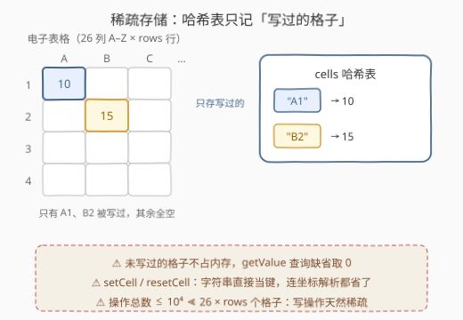
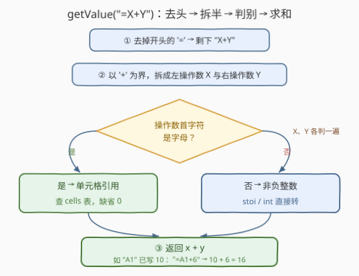

# LeetCode 设计电子表格 题解

## 1. 题目概述

- **标题 / 题号**：设计电子表格（#3484，medium）
- **链接**：https://leetcode.cn/problems/design-spreadsheet/
- **难度**：中等
- **标签**：设计、哈希表、字符串

**题意**：实现一个电子表格 `Spreadsheet`：网格共 **26 列**（`'A'` 到 `'Z'`）和指定行数 `rows`，每个单元格存一个 0 到 $10^5$ 的整数，初始全为 0。支持：

- `Spreadsheet(rows)`：初始化 `rows` 行 × 26 列，所有单元格为 0；
- `setCell(cell, value)`：把单元格 `cell` 设为 `value`。引用格式 `"AX"`——一个大写字母（列）+ 一个从 1 开始的行号，如 `"A1"`、`"B10"`；
- `resetCell(cell)`：把 `cell` 重置为 0；
- `getValue(formula)`：计算公式值。公式固定为 `"=X+Y"`，`X`、`Y` **要么是单元格引用，要么是非负整数**，返回二者之和。引用未经 `setCell` 设置的单元格时按 0 计。

**示例 1**：

```text
输入：
["Spreadsheet", "getValue", "setCell", "getValue", "setCell", "getValue", "resetCell", "getValue"]
[[3], ["=5+7"], ["A1", 10], ["=A1+6"], ["B2", 15], ["=A1+B2"], ["A1"], ["=A1+B2"]]

输出：
[null, 12, null, 16, null, 25, null, 15]

解释：
Spreadsheet(3)                 // 3 行 26 列，全 0
getValue("=5+7")                // 5 + 7 = 12
setCell("A1", 10)               // A1 = 10
getValue("=A1+6")               // 10 + 6 = 16
setCell("B2", 15)               // B2 = 15
getValue("=A1+B2")              // 10 + 15 = 25
resetCell("A1")                 // A1 回到 0
getValue("=A1+B2")              // 0 + 15 = 15
```

**约束**：

- $1 \le \text{rows} \le 10^3$
- $0 \le \text{value} \le 10^5$
- 公式保证采用 `"=X+Y"` 格式，`X`、`Y` 为合法单元格引用或 $\le 10^5$ 的非负整数
- 单元格引用由一个大写字母 `'A'`–`'Z'` 和一个 $1 \le \text{行号} \le \text{rows}$ 组成
- `setCell`、`resetCell`、`getValue` 总调用次数不超过 $10^4$

> 💡 **读题关键**：① 公式**只有一层加法、恰好两个操作数**，没有嵌套、没有依赖传播——这是「存储选型 + 字符串轻解析」的模拟设计题，不是 631 那种带级联更新的硬核 Excel；② 未设置的单元格值为 0，这个「缺省语义」正是哈希表 `get(key, 0)` 的天然行为，不用预填任何东西。

## 2. 解题思路

### 2.1 朴素思路：整表二维数组

最直接的存储是开一个 `rows × 26` 的二维数组，每次操作把 `"AX"` 解析成下标（列 = `cell[0] - 'A'`，行 = `stoi(cell.substr(1)) - 1`）再读写：

- 三个操作都是一次字符串解析 + 一次数组访问，单次 $O(L)$（$L$ 为引用串长度）；
- 空间固定 $O(26 \cdot \text{rows})$：`rows = 10^3` 时是 26000 个格子，而总操作数至多 $10^4$——**绝大多数格子从未被写过**，纯属「为不存在的数据买单」；
- 每个操作（包括根本不需要理解结构的 `setCell`/`resetCell`）都被迫做一遍坐标解析。

数组版正确性毫无问题（本题规模下也够用），它输在**扩展性**：若 `rows` 放大到 $10^9$ 或列数不固定，整表数组直接爆内存。理想结构的空间应只随「写过的格子数」增长。

### 2.2 核心观察：稀疏哈希表——只记写过的格子

把「单元格引用字符串」本身当作哈希表的键：



| 操作 | 做法 | 解析成本 |
|------|------|---------|
| `setCell(cell, v)` | `cells[cell] = v` | **零解析**：字符串直接做键 |
| `resetCell(cell)` | `cells[cell] = 0` | **零解析** |
| `getValue(f)` | 解析 `"=X+Y"`，逐个判别 `X`、`Y` | 唯一需要「看懂」格式的操作 |

三个关键点：

1. **键不必是坐标**：`"A1"` 本身就是唯一、可直接哈希的标识。只有当存储必须按下标访问（二维数组）时才需要解析；哈希表让 `setCell`/`resetCell` 完全跳过解析。
2. **缺省 0 白送**：题目规定未设置的单元格值为 0——哈希表「查不到就当 0」（`dict.get(k, 0)`）恰好就是这个语义，**不需要也不应该**在初始化时把 26000 个格子填 0。
3. **判别规则一句话**：操作数首字符**是字母 → 单元格引用**（查表，缺省 0）；**是数字 → 非负整数**（直接转 int）。引用必以 `'A'`–`'Z'` 开头、非负整数必以数字开头，两种形态首字符互斥，判别无歧义。

### 2.3 算法流程：getValue 的拆半求值



公式固定 `"=X+Y"`，处理分三步：

1. **去头**：剥掉开头的 `'='`，剩下 `"X+Y"`；
2. **拆半**：按 `'+'` 切成左操作数 `X` 与右操作数 `Y`；
3. **判别求值**：对每个操作数用「首字符是否为字母」分流——引用查哈希表（缺省 0），字面量转整数——返回两数之和。

> ⚠️ 实现细节：数值都是**非负**的（不带正负号），`'+'` 只可能作为分隔符出现一次，所以朴素的 `find('+')` / `split('+')` 不会切错。行号最多 4 位（`rows ≤ 10^3`）、数值最多 6 位（$\le 10^5$），整个公式串长 $L \le 13$，解析成本视为常数。

### 2.4 示例演算

以示例 1 走一遍，重点看哈希表的变化与 `getValue` 的三次判别：

| 操作 | 哈希表 `cells` | getValue 内部 | 返回 |
|------|---------------|--------------|------|
| `Spreadsheet(3)` | `{}`（空，一切缺省 0） | — | null |
| `getValue("=5+7")` | `{}` | `5`、`7` 首字符都是数字 → 双字面量，5+7 | **12** |
| `setCell("A1", 10)` | `{"A1": 10}` | — | null |
| `getValue("=A1+6")` | `{"A1": 10}` | `A1` 字母→查表得 10；`6` 数字→6 | **16** |
| `setCell("B2", 15)` | `{"A1": 10, "B2": 15}` | — | null |
| `getValue("=A1+B2")` | 同上 | 双引用：10+15 | **25** |
| `resetCell("A1")` | `{"A1": 0, "B2": 15}` | — | null |
| `getValue("=A1+B2")` | 同上 | `A1` 仍在表中但值已是 0：0+15 | **15** |

> 💡 注意 `resetCell` 的实现选择：把键**置 0**（保留键）与**删掉键**（`erase`/`pop`）语义等价——因为缺省就是 0。两种写法都对，置 0 少一次哈希删除。

## 3. 参考代码

### C++

```cpp
class Spreadsheet {
  public:
    Spreadsheet(int rows) {
        // 行数只约束输入合法性，题目保证引用合法；
        // 缺省 0 的语义由哈希表 get 语义天然提供，无需预填
    }

    void setCell(string cell, int value) {
        cells[cell] = value;              // 字符串直接做键，免解析
    }

    void resetCell(string cell) {
        cells[cell] = 0;                  // 置 0 与删键等价（缺省即 0）
    }

    int getValue(string formula) {
        // "=X+Y" → 去掉 '='，按 '+' 拆两半
        string body = formula.substr(1);
        size_t plus = body.find('+');
        return operand(body.substr(0, plus)) + operand(body.substr(plus + 1));
    }

  private:
    unordered_map<string, int> cells;

    int operand(const string& s) {
        if (isalpha(s[0])) {              // 首字符是字母 → 单元格引用
            auto it = cells.find(s);
            return it == cells.end() ? 0 : it->second;
        }
        return stoi(s);                   // 首字符是数字 → 非负整数
    }
};
```

### Python

```python
class Spreadsheet:
    def __init__(self, rows: int):
        self.cells = {}                   # {引用字符串: 值}，缺省 0

    def setCell(self, cell: str, value: int) -> None:
        self.cells[cell] = value          # 字符串直接做键，免解析

    def resetCell(self, cell: str) -> None:
        self.cells[cell] = 0              # 置 0 与删键等价（缺省即 0）

    def getValue(self, formula: str) -> int:
        def operand(s: str) -> int:
            if s[0].isalpha():            # 首字符是字母 → 单元格引用
                return self.cells.get(s, 0)
            return int(s)                 # 首字符是数字 → 非负整数

        x, y = formula[1:].split('+')     # 去掉 '='，按 '+' 拆两半
        return operand(x) + operand(y)
```

> 💡 **为什么构造函数是空的**：`rows` 只约束「哪些引用合法」，题目保证输入总合法；缺省 0 由 `get(key, 0)` 承担，初始化无需预填任何格子。这是本题最反直觉的一步——**什么都不做**恰恰是最优实现。

## 4. 复杂度分析

设 $L$ 为公式串长（本题 $L \le 13$，视为常数），$D$ 为被 `setCell` 写过的不同格子数：

| 维度 | 复杂度 | 说明 |
|------|--------|------|
| `setCell` 时间 | $O(1)$ | 一次哈希写入 |
| `resetCell` 时间 | $O(1)$ | 一次哈希写入（置 0） |
| `getValue` 时间 | $O(L)$ | 去头 + 拆半 + 两次判别求值，$L \le 13$ 视为常数 |
| 空间 | $O(D)$ | $D \le$ 操作总数 $10^4$，与 $26 \times \text{rows}$ 无关 |

对比整表数组版：单次操作同为 $O(1)$，但空间从固定的 $O(26 \cdot \text{rows})$（最多 26000 格）降到 $O(\text{写过的格子数})$——这正是稀疏结构的意义。

实测：示例 1 输出 `[null, 12, null, 16, null, 25, null, 15]` ✓；与二维数组实现对拍随机操作序列（`setCell`/`resetCell`/`getValue` 交错，覆盖双字面量、混合、双引用、未设置引用、reset 后再查）全部一致。

## 5. 扩展：数组版与它的 Hard 亲戚

**数组版**（`rows` 较小、哈希开销敏感时同样优秀）：

```cpp
class Spreadsheet {
    vector<vector<int>> g;                // rows × 26

  public:
    Spreadsheet(int rows) : g(rows, vector<int>(26, 0)) {}

    void setCell(string cell, int value) {
        g[stoi(cell.substr(1)) - 1][cell[0] - 'A'] = value;
    }

    void resetCell(string cell) {
        g[stoi(cell.substr(1)) - 1][cell[0] - 'A'] = 0;
    }

    int getValue(string formula) {
        string body = formula.substr(1);
        size_t plus = body.find('+');
        return val(body.substr(0, plus)) + val(body.substr(plus + 1));
    }

  private:
    int val(const string& s) {
        if (isalpha(s[0])) return g[stoi(s.substr(1)) - 1][s[0] - 'A'];
        return stoi(s);
    }
};
```

**[631. 设计 Excel 求和公式](https://leetcode.cn/problems/design-excel-sum-formula/)**（困难）是本题的「完全体」亲戚，它把本题的三处简化逐一撕掉：

| 本题（3484） | 631 的升级 |
|------|------|
| 公式只有 `X+Y` 两个操作数 | 一个格子可引用**矩形区间**（如 `A1:B3`）整体求和 |
| 无依赖传播：`getValue` 每次现场求值 | 格子存的就是公式，`set` 修改后**所有引用它的格子要级联更新** |
| 无循环引用问题 | 需维护引用计数，改值时逐格增减贡献 |

631 的经典做法是每个格子存「数字或公式」，公式记录对每个源格子的引用计数（区间拆成逐格 +1），`set` 时先把旧公式的贡献逐格减掉、再写新值——本质是一张**显式依赖图**上的增量传播。本题可以看作 631 砍掉依赖图后剩下的「存储 + 解析」骨架。

## 6. 面试要点

1. **为什么用哈希表而不是二维数组？**

   - 单次操作两者都是 $O(1)$，差别在**空间与耦合**：数组空间固定 $O(26 \cdot \text{rows})$ 且每个操作都要解析坐标；哈希表空间只与写过的格子数相关，`set`/`reset` 直接拿字符串当键、零解析。当 `rows` 很大或写操作稀疏时，哈希表是唯一可行选择。

2. **怎么判别操作数是单元格引用还是整数？**

   - 看首字符：`'A'`–`'Z'` 字母 → 引用（查表，缺省 0）；数字 → 字面量（直接转 int）。两种形态首字符互斥，无需完整词法分析。

3. **未设置的单元格为什么不用预填 0？**

   - 题目规定缺省值就是 0，哈希表的 `get(key, default)` 天然表达「不存在即 0」。预填反而把稀疏表撑成稠密，丢掉哈希方案的全部优势；构造函数甚至不需要保存 `rows`。

4. **`resetCell` 是置 0 还是删键？**

   - 语义等价（缺省即 0），任选其一，均 $O(1)$。若面试官追问省内存，删键更彻底——表大小只保留「最后一次写是 `setCell`」的格子。

5. **如果公式扩展成 `"=X+Y+Z"` 甚至四则混合呢？**

   - 多项加法：把拆半升级为按 `'+'` 全切再逐项求和（本题 `split('+')` 的写法天然兼容）；四则混合则要引入优先级或调度场算法转逆波兰式求值——那是 224/227「基本计算器」系列的领域。再进一步支持单元格间依赖传播，就进入 631 的范畴。

## 同类练习题

| # | 题目 | 与本题的关联 |
|---|------|-------------|
| 631 | [设计 Excel 求和公式](https://leetcode.cn/problems/design-excel-sum-formula/) | 本题的 Hard 完全体——矩形区间求和 + 修改级联传播，依赖图上的增量更新 |
| 1396 | [设计地铁系统](https://leetcode.cn/problems/design-underground-system/) | 同样以「字符串直接做键」的哈希表支撑设计题，双哈希嵌套记录区间统计 |
| 2043 | [简易银行系统](https://leetcode.cn/problems/simple-bank-system/) | 设计题的输入校验分寸感（本题输入保证合法，2043 需要自己查非法账号） |
| 2013 | [检测正方形](https://leetcode.cn/problems/detect-squares/) | 哈希表存稀疏点集 + 按键检索，稀疏思想的另一舞台 |
| 706 | [设计哈希映射](https://leetcode.cn/problems/design-hashmap/) | 反向练习——自己动手实现被本题当黑盒用的哈希映射 |
