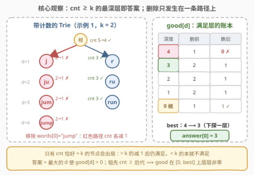
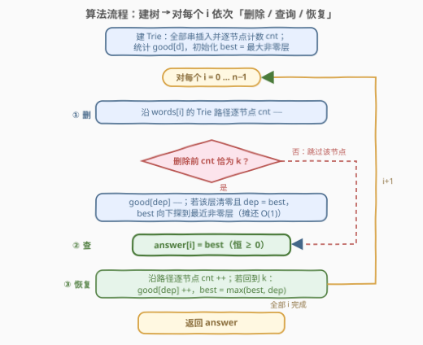

# LeetCode 删除元素后 K 个字符串的最长公共前缀 题解

## 1. 题目概述

- **标题 / 题号**：删除元素后 K 个字符串的最长公共前缀（#3485，hard）
- **链接**：https://leetcode.cn/problems/longest-common-prefix-of-k-strings-after-removal/
- **难度**：困难
- **标签**：字典树（Trie）、数组、字符串

**题意**：给你一个字符串数组 `words` 和一个整数 `k`。

对于范围 `[0, words.length - 1]` 中的每个下标 `i`，在**移除第 `i` 个元素**后的剩余数组中，找出任意 `k` 个字符串（`k` 个下标**互不相同**）的**最长公共前缀**的**长度**。

返回数组 `answer`，其中 `answer[i]` 是移除第 `i` 个元素后的答案；若移除后剩余字符串少于 `k` 个，`answer[i] = 0`。

一个字符串的**前缀**是从字符串开头延伸到字符串内任意位置的子字符串。

**示例 1**：

```text
输入：words = ["jump","run","run","jump","run"], k = 2
输出：[3,4,4,3,4]
解释：
- 移除 words[0]="jump" 后剩 ["run","run","jump","run"]，"run" 出现 3 次，
  任取两个的最长公共前缀是 "run"（长度 3）；
- 移除 words[1]="run" 后剩 ["jump","run","jump","run"]，两个 "jump" 的
  最长公共前缀是 "jump"（长度 4）；
- 移除 words[2]="run" 后同上，长度 4；
- 移除 words[3]="jump" 后剩 ["jump","run","run","run"]，"run" 出现 3 次，长度 3；
- 移除 words[4]="run" 后剩 ["jump","run","run","jump"]，两个 "jump" 的
  最长公共前缀长度 4。
```

**示例 2**：

```text
输入：words = ["dog","racer","car"], k = 2
输出：[0,0,0]
解释：移除任何元素后，剩余字符串两两首字符都不相同，最长公共前缀长度均为 0。
```

**约束**：

- $1 \le k \le \text{words.length} \le 10^5$
- $1 \le \text{words}[i].\text{length} \le 10^4$
- $\sum_i \text{words}[i].\text{length} \le 10^5$
- `words[i]` 仅由小写英文字母组成

> 💡 **读题关键**：① 答案衡量的是「**恰好挑 k 个**串」的 LCP，不是全部串——本质是**第 k 深的公共前缀有多长**；② 共 `n` 次查询，每次都基于「完整数组减去一个串」，结构几乎不变；③ $\sum |\text{words}[i]| \le 10^5$ 强烈暗示算法应**线性于总字符数**。

## 2. 解题思路

### 2.1 暴力思路：枚举 k 元组合

按题面直译：对每个 `i`，枚举剩余 $n-1$ 个串的所有 $k$ 元组合，逐组合求 LCP 取最大：

```text
for i in 0..n-1:
    for words 中剩余串的每个 k 元组合 C(n-1, k) 个:
        逐字符比较求该组合的 LCP，更新 answer[i]
```

组合数 $\binom{n-1}{k}$ 在 $n = 10^5$ 时是天文数字，完全不可行。退一步用「排序 + 连续 k 窗口」优化单次查询：共享前缀 $p$ 的 $k$ 个串在字典序下必然**连续**（排在它们中间的串也共享 $p$），所以固定 `i` 时只需排序剩余串、对每个连续 $k$ 窗口求一次 LCP——单次 $O(n \log n)$，总计 $O(n^2 \log n) \approx 10^{11}$，依然毫无希望。

慢的根源是**重复劳动**：每次只删一个串，前缀结构几乎纹丝不动，暴力却把整个问题推倒重算。破局点是把「k 个串的公共前缀」物化成一棵带计数的 Trie，让「删除一个串」变成**只碰一条路径**的增量操作。

### 2.2 核心观察：带计数的 Trie + 「恰好等于 k」的阈值



**观察一（前缀结构计数化）**：把全部字符串插入 Trie，为每个节点 $u$ 维护 `cnt[u]` = 经过 $u$ 的字符串个数（即「以 root→$u$ 路径为前缀的串数」，根的 `cnt` 为 $n$，对应空前缀）。于是：

> 「存在 $k$ 个串，公共前缀长度 $\ge d$」 ⟺ 「存在深度 $d$ 的节点，`cnt` $\ge k$」。

**观察二（层计数 good 与全局最优 best）**：令 $\text{good}[d]$ = 深度 $d$ 上 `cnt` $\ge k$ 的**节点数**，则当前答案 = 最大的 $d$ 使 $\text{good}[d] > 0$，记作 `best`。由于**祖先的 cnt ≥ 后代的 cnt**（经过深节点的串必然先经过浅节点），一条路径上「满足 $\ge k$」的深度是前缀段，进而全局 $\text{good}[d] > 0$ 在 $[0, \text{best}]$ 上**连续非零**——这条连续性正是后面摊还分析的基石。

**观察三（删除只影响一条路径，且只有「恰好 = k」的节点会出局）**：移除 `words[i]` 就是沿其 Trie 路径把每个节点 `cnt--`：

| 节点删除前的 cnt | 减 1 后 | 对 good 的影响 |
|------------------|---------|----------------|
| $> k$ | 仍 $\ge k$ | 不变（依然满足） |
| $= k$ | $k - 1$ | 该层 $\text{good}[d]$ 减 1（**唯一会出局的情形**） |
| $< k$ | 仍 $< k$ | 不变（本来就不算数） |

又因路径上 `cnt` 单调不增，「恰好 $=k$」的节点在路径上是**连续一段**。查询 `answer[i]` 只需求出删除后的 `best`；随后立刻沿路径 `cnt++` 恢复——恢复是删除的严格逆操作，`good` 逐项回到原状，下一个查询又从干净状态出发。

**观察四（best 的 O(1) 维护）**：

- **删除时**：若某层 $\text{good}[d]$ 减到 0 且 $d = \text{best}$，`best` 向下探到最近的非零层。由观察二的连续性，下探途中跳过的零层**全部是被本次删除清零的路径层**（其余层不动），所以这次下探的总代价 $\le |\text{words}[i]|$——虽然单看像 $O(\max|\text{words}|)$，摊还后每字符 $O(1)$。
- **恢复时**：`cnt` 回到 $k$ 的层 $\text{good}[d]$ 加 1，并执行 `best = max(best, d)` 即可，无需任何扫描。

> ⚠️ **特判 $n = k$**：移除任意一个串后只剩 $k-1$ 个，连「空前缀」都凑不齐 $k$ 个，答案全 0，直接返回。而 $n > k$ 时根的 `cnt` 删后仍 $\ge k$，$\text{good}[0] \ge 1$ 恒成立，`best` 不会跌成 $-1$——根也因此**无需**参与删除/恢复循环。

### 2.3 算法流程图



整体三阶段：**建树计数 → 初始化 good 与 best → 对每个 i 执行「删除（维护 good/best）→ 记录 answer[i] → 恢复（维护 good/best）」**。注意删除与恢复都必须在**下一次查询前**把状态完全复原，否则误差会跨查询累积。

### 2.4 示例演算

以 `words = ["jump","run","run","jump","run"]`，`k = 2` 为例。建树后各节点计数：根 5；`r/ru/run` 各 3；`j/ju/jum/jump` 各 2。初始 $\text{good} = [1, 2, 2, 2, 1]$（下标即深度），`best = 4`。

| i | 移除的串 | 路径上 cnt 恰为 2 的节点 | good 的变化 | best | answer[i] |
|---|----------|--------------------------|-------------|------|-----------|
| 0 | `"jump"` | `j, ju, jum, jump`（全 2→1） | 深度 1–4 各减 1，**深度 4 清零** | 4→3 | 3 |
| 1 | `"run"` | 无（`r/ru/run` 均 3→2，仍 ≥ k） | 不变 | 4 | 4 |
| 2 | `"run"` | 无 | 不变 | 4 | 4 |
| 3 | `"jump"` | 同 i = 0 | 深度 4 清零 | 4→3 | 3 |
| 4 | `"run"` | 无 | 不变 | 4 | 4 |

输出 `[3,4,4,3,4]` ✓。特别注意 i = 1：`"run"` 的路径计数从 3 降到 2，**没有触碰 good**——这正是「只有恰好等于 k 才出局」的价值：删除一个「多数派」串根本不影响答案。

## 3. 参考代码

### C++（数组 Trie + 摊还下探）

```cpp
class Solution {
  public:
    vector<int> longestCommonPrefix(vector<string>& words, int k) {
        int n = words.size();
        vector<int> ans(n, 0);
        if (n <= k) return ans;              // 移除任意一个后都凑不齐 k 个

        // 26 叉数组 Trie：ch[u][c] = 孩子编号，-1 表示无
        vector<array<int, 26>> ch(1);
        ch[0].fill(-1);
        vector<int> cnt = {n}, dep = {0};     // 根 = 空前缀，覆盖全部 n 个串
        for (auto& w : words) {
            int u = 0;
            for (char c : w) {
                int d = c - 'a';
                if (ch[u][d] < 0) {
                    ch[u][d] = ch.size();
                    ch.emplace_back();
                    ch.back().fill(-1);
                    cnt.push_back(0);
                    dep.push_back(dep[u] + 1);
                }
                u = ch[u][d];
                cnt[u]++;
            }
        }

        int maxLen = 0;
        for (auto& w : words) maxLen = max(maxLen, (int)w.size());

        vector<int> good(maxLen + 1, 0);      // good[d]：深度 d 且 cnt ≥ k 的节点数
        for (size_t u = 0; u < cnt.size(); ++u)
            if (cnt[u] >= k) good[dep[u]]++;

        int best = -1;                        // 最大的 good[d] > 0 的 d
        for (int d = 0; d <= maxLen; ++d)
            if (good[d] > 0) best = d;

        for (int i = 0; i < n; ++i) {
            int u = 0;
            for (char c : words[i]) {         // 阶段一：沿路径删除
                u = ch[u][c - 'a'];
                if (cnt[u] == k) {            // 恰好 = k：减 1 后出局
                    int d = dep[u];
                    if (--good[d] == 0 && d == best)
                        while (best >= 0 && good[best] == 0) --best;
                }
                --cnt[u];
            }
            ans[i] = best;                    // best ≥ 0 恒成立（根层始终满足）

            u = 0;
            for (char c : words[i]) {         // 阶段二：沿路径恢复
                u = ch[u][c - 'a'];
                if (++cnt[u] == k) {          // 回到 k：重新计入 good
                    int d = dep[u];
                    if (++good[d] == 1 && d > best) best = d;
                }
            }
        }
        return ans;
    }
};
```

### Python（dict Trie + 预存路径）

```python
class Solution:
    def longestCommonPrefix(self, words: List[str], k: int) -> List[int]:
        n = len(words)
        if n <= k:                            # 移除任意一个后都凑不齐 k 个
            return [0] * n

        ch, cnt, dep, paths = [{}], [0], [0], []
        for w in words:                       # 建 Trie，顺手记录每个串的节点路径
            u, path = 0, [0]
            for c in w:
                if c not in ch[u]:
                    ch[u][c] = len(ch)
                    ch.append({})
                    cnt.append(0)
                    dep.append(dep[u] + 1)
                u = ch[u][c]
                path.append(u)
            paths.append(path)
            for node in path:                 # 根也计数：根 = 空前缀
                cnt[node] += 1

        max_len = max(map(len, words))
        good = [0] * (max_len + 1)            # good[d]：深度 d 且 cnt ≥ k 的节点数
        for u in range(len(cnt)):
            if cnt[u] >= k:
                good[dep[u]] += 1
        best = -1
        for d in range(max_len + 1):
            if good[d]:
                best = d

        ans = [0] * n
        for i in range(n):
            for u in paths[i][1:]:            # 阶段一：沿路径删除
                if cnt[u] == k:               # 恰好 = k：减 1 后出局
                    d = dep[u]
                    good[d] -= 1
                    if good[d] == 0 and d == best:
                        while best >= 0 and good[best] == 0:
                            best -= 1
                cnt[u] -= 1
            ans[i] = best                     # best ≥ 0 恒成立（根层始终满足）

            for u in paths[i][1:]:            # 阶段二：沿路径恢复
                cnt[u] += 1
                if cnt[u] == k:               # 回到 k：重新计入 good
                    d = dep[u]
                    good[d] += 1
                    if d > best:
                        best = d
        return ans
```

> 💡 **写法要点**：① Python 版在建树时把每个串的节点路径存进 `paths`，删/查/恢复三次遍历都不再做字典查找，常数显著降低；② 删除阶段判断 `cnt[u] == k` 必须在自减**之前**（判断的是出局前的值），恢复阶段判断 `++cnt[u] == k` 在自增**之后**——两者互为镜像，别写串；③ `best` 下探的 `while` 看似最坏 $O(\max|\text{words}|)$，摊还后总量线性（见 4 节），无需担心被卡。

## 4. 复杂度分析

| 维度 | 复杂度 | 说明 |
|------|--------|------|
| 时间复杂度 | $O\big(\sum_i \|\text{words}[i]\|\big)$ | 建 Trie 一遍；每个 $i$ 的删除、恢复各 $O(\|\text{words}[i]\|)$；`best` 下探摊还 $O(\|\text{words}[i]\|)$（下探跳过的零层全在被删路径上） |
| 空间复杂度（C++ 数组 Trie） | $O(26 \cdot \sum_i \|\text{words}[i]\|)$ | 至多 $\sum \|\text{words}\|$ 个节点、每节点 26 个孩子指针，$\le 2.6 \times 10^6$ 个 int，约 10 MB |
| 空间复杂度（Python dict Trie） | $O\big(\sum_i \|\text{words}[i]\|\big)$ | 每个节点只存实际出现过的孩子 |
| 附加数组 | $O(\max \|\text{words}[i]\|)$ | `good` 按深度开桶 |

> ⚠️ **摊还论证**（下探为何不超时）：初始时 $\text{good}[d]$ 在 $[0, D]$ 上连续非零（祖先 cnt ≥ 后代 cnt）；单次查询前只发生过一次路径删除，因此 $[0, D]$ 内的零层**全部**来自本次被删路径，`best` 下探跳过的层也不例外——单次下探代价 $\le$ 路径长度，全体求和即 $\sum_i \|\text{words}[i]\|$。这是「均摊到字符级」的经典论证，与 KMP 失配指针的摊还同味。

## 5. 扩展：multiset 写法与 k = 1 的直觉

**multiset 写法（官方 hint 的原始意图）**：不维护 `good` 数组，而是把**所有 `cnt` $\ge k$ 的节点的深度**放进一个 `multiset`。删除时对每个出局的节点 `erase(find(dep))`，`answer[i] = *rbegin()`（multiset 为空则 0）；恢复时 `insert(dep)`。正确性等价，但每次出局/回归都要 $O(\log)$，总复杂度 $O(\sum \|\text{words}\| \cdot \log)$——比 `good` 数组 + 摊还下探多一个对数因子，胜在无需摊还论证、极难写错。面试时先写 multiset 版保底、再口头升级 `good` 数组版，是稳妥的展示路径。

**k = 1 的直觉特例**：任取 1 个串与其自身的 LCP 就是整个串，所以 `k = 1` 时 `answer[i]` = 除 `words[i]` 外最长串的长度。通用算法在 `k = 1` 时自然退化成这个语义（所有 `cnt ≥ 1` 的节点都满足，`best` 即最深节点），无需单独处理——这也侧面印证了「节点计数 ≥ k」建模的一般性。

## 6. 面试要点

1. **为什么维护 good 时只关心「cnt 恰好等于 k」的节点？**

   > 移除一个串使路径上每个节点 `cnt` 恰减 1。`> k` 的节点减完仍 $\ge k$，是否满足的判定不变；`< k` 的本来就出局。只有恰好 $= k$ 的节点跨越了阈值，才会让「该层满足节点数」发生变化。抓住这一点，「删除」就被压缩成了对一段连续路径层的增量更新。

2. **best 下探的 while 循环最坏 O(maxLen)，总复杂度为什么还是线性？**

   > 关键在连续性：祖先 cnt ≥ 后代 cnt ⟹ 若深度 $d$ 有满足节点，则所有更浅的深度也有 ⟹ 初始 $\text{good}$ 在 $[0, D]$ 连续非零。单次查询只叠加了一次路径删除，故查询时刻 $[0, D]$ 内的零层全来自本次被删路径——下探跳过的每一层都对应路径上的一个字符，代价被路径长度兜底。全部查询求和即 $O(\sum \|\text{words}\|)$。

3. **恢复时为什么 `best = max(best, dep)` 就够了，不用重新扫描？**

   > 恢复结束后 `good` 与删除前逐项相同，「真实最大非零层」必然回到原值。分两种情形验证 `max` 不漏：若原 `best` 层未被本次清零，则 `best` 全程未降，`max` 保持；若被清零，说明该层唯一的满足节点恰在被删路径上、深度即原 `best`，恢复时它会重新计入 `good`，即恢复的最大深度 $d_2 \ge$ 原 `best`，`max` 把它拉回来。两种情形都不会让 `best` 超过原值（恢复不制造新的非零层）。

4. **根节点（空前缀）为什么不参与删除/恢复循环？n = k 为什么要特判？**

   > $n > k$ 时根的 `cnt` 从 $n$ 减到 $n - 1$ 仍 $\ge k$，`good[0]` 恒非零，`best` 永远 $\ge 0$（答案至少为 0 的语义由此兜底），删不删它都不影响判定，跳过可省一半无谓操作。而 $n = k$ 时删任意一个串后连根层都不满足，`best` 会跌成 $-1$，与其在循环里到处判空，不如入口处直接返回全 0。

5. **如果面试官把「移除第 i 个」改成「任意移除至多一个」，问题怎么变？**

   > 「任意移除至多一个」= 移除收益最大的那个：全局答案 = $\max(\text{best}_{\text{不动}}, \max_i \text{answer}[i])$，而 $\max_i \text{answer}[i]$ 恰是本题已算出的东西——只需在返回前多取一个 $\max$。反过来，若改成「必须移除恰好一个」，就是本题本身；改成「移除任意多个再选 k 个」，则答案 = 全局 `best`（不移除最优，因为删串只会减少每个节点的 cnt）。本题的增量框架对这三类变体都是零成本复用。

> 💡 **一句话总结**：3485 = 「带计数的 Trie 把 k 个串的 LCP 变成节点计数 ≥ k」+「删除/恢复只碰一条路径、只有恰好 = k 的节点出局」+「good 层数组 + 摊还下探维护 best」，线性于总字符数收工。

## 同类练习题

| # | 题目 | 与本题的关联 |
|---|------|-------------|
| 208 | [实现 Trie (前缀树)](https://leetcode.cn/problems/implement-trie-prefix-tree/)（[题解](../0201-0300/208_实现Trie.md)） | 本题的基础设施——insert / search / startsWith 三件套，先手熟节点与边的基本表达 |
| 1804 | [实现 Trie（前缀树）II](https://leetcode.cn/problems/implement-trie-ii-prefix-tree/) | 为 Trie 节点维护「插入/删除/前缀计数」三组计数的模板题，正是本题 `cnt` 增减的裸练习 |
| 3043 | [最长公共前缀的长度](https://leetcode.cn/problems/find-the-length-of-the-longest-common-prefix/)（[题解](../3001-3100/3043_最长公共前缀的长度.md)） | Trie 上「深度即 LCP 长度」的静态版——对照本题体会加入计数与删除后的动态化 |
| 3460 | [最多删除一次后的最长公共前缀](https://leetcode.cn/problems/longest-common-prefix-after-at-most-one-removal/)（[题解](../3401-3500/3460_最多删除一次后的最长公共前缀.md)） | 同挂「删除 + LCP」招牌的双指针亲戚——两串间删一个字符续配前缀，与本题的批量删除互为镜像 |
| 14 | [最长公共前缀](https://leetcode.cn/problems/longest-common-prefix/)（[题解](../0001-0100/14_最长公共前缀.md)） | 一族字符串 LCP 的祖宗题（纵向扫描），感受从「全体 LCP」到「任选 k 个 LCP」再到「删除后任选 k 个」的谱系演进 |
