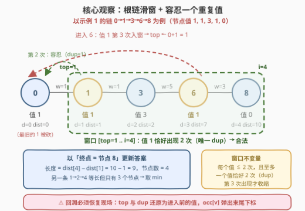
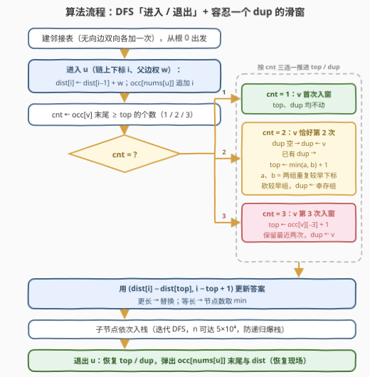

# 最长特殊路径 II

- **题目名称**：最长特殊路径 II
- **链接**：[3486. 最长特殊路径 II](https://leetcode.cn/problems/longest-special-path-ii/)
- **难度**：困难
- **标签**：树、深度优先搜索、数组、哈希表、前缀和
- **关联**：[3425. 最长特殊路径](https://leetcode.cn/problems/longest-special-path/)（[站内题解](./3425_最长特殊路径.md)）是本题的严格版——窗口内值必须互不相同；本题放宽为「最多允许一个值出现两次」，滑窗从「一出现重复就砍」升级为「容忍一个重复组、第 3 次出现才砍」

## 1. 题目概述

给你一棵**根节点为节点 0** 的无向树，树中有 $n$ 个节点，编号 $0$ 到 $n-1$，通过长度为 $n-1$ 的二维数组 `edges` 表示，其中 `edges[i] = [ui, vi, lengthi]` 表示节点 $u_i$ 和 $v_i$ 之间有一条**长度**为 $length_i$ 的边。同时给你整数数组 `nums`，其中 `nums[i]` 表示节点 $i$ 的值。

**特殊路径**指的是树中一条**从祖先节点往下到后代节点**的路径，路径中所有节点值都是唯一的，**最多允许有一个值出现两次**。

返回长度为 2 的数组 `result`：

- `result[0]`：最长特殊路径的**长度**（路径上边权之和）；
- `result[1]`：所有**最长**特殊路径中的**最少**节点数目。

**示例 1**：

```text
输入：edges = [[0,1,1],[1,2,3],[1,3,1],[2,4,6],[4,7,2],[3,5,2],[3,6,5],[6,8,3]], nums = [1,1,0,3,1,2,1,1,0]
输出：[9,3]
解释：最长特殊路径为 1 -> 2 -> 4 和 1 -> 3 -> 6 -> 8，长度均为 9；其中节点数最少的路径含 3 个节点。
```

**示例 2**：

```text
输入：edges = [[1,0,3],[0,2,4],[0,3,5]], nums = [1,1,0,2]
输出：[5,2]
解释：最长路径为 0 -> 3，长度 5、节点数 2。
```

**约束条件**：

- $2 \le n \le 5 \times 10^4$
- $edges.length = n - 1$
- $0 \le u_i, v_i < n$
- $1 \le length_i \le 10^3$
- $0 \le nums[i] \le 5 \times 10^4$
- 输入保证 `edges` 是一棵有效的树

> 💡 **读题关键**：① 与 3425 的唯一差别：「值互不相同」放宽为「**最多一个值出现两次**」——等价于窗口内**每个值出现次数 $\le 2$，且次数恰好为 2 的值至多一个**（出现 3 次仍然非法）；② 答案仍是**双关键字**：长度优先、等长时节点数取最小；③ $n \ge 2$ 且任意一条边的两端要么异值、要么恰好构成唯一重复组，所以答案长度至少为 $1$，单点路径 $(0, 1)$ 只是初始化兜底。

---

## 2. 解题思路

### 2.1 暴力思路：枚举所有祖先—后代对

树上的竖直路径共有 $O(n^2)$ 条。对每条路径统计各值出现次数、验证「每值 $\le 2$ 且重复值至多一个」需 $O(n)$，总复杂度 $O(n^3)$；即使把检查摊进 DFS 做成增量，$O(n^2)$ 条路径在 $n = 5 \times 10^4$ 时也是 $2.5 \times 10^9$ 量级，必然超时。

但暴力再次揭示了问题的结构：**所有候选路径都是「根到当前节点」链上的连续区段**——这提示沿 DFS 根路径做增量维护，对每个终点只求「合法区段的最大长度」。

### 2.2 核心观察：根链滑窗 + 容忍一个重复值



**观察一（路径都长在根链上）**：与 3425 相同——以当前节点 $u$（链上下标 $i$）为**终点**的特殊路径，一定是根链上一段连续区段 $[s, i]$。

**观察二（前缀和 O(1) 算区段长度）**：沿链维护边权前缀和 $dist[\,]$，区段长度 $= dist[i] - dist[s]$，节点数 $= i - s + 1$。

**观察三（本题新意：合法窗口 = 每值 $\le 2$ 次、重复值至多一个）**：维护窗口起点 `top` 与**当前窗口内出现两次的那个值** `dup`（可为空）。为知道「某个值在窗口内出现了几次」，给每个值维护**出现下标列表** `occ[v]`（值 $v$ 在当前链上出现过的所有下标，天然升序；被 `top` 甩在身后的旧下标也留着，回溯时有用）。进入下标 $i$、值 $v$ 时，先 `occ[v].push(i)`，再数 **`occ[v]` 末尾有多少个下标 $\ge top$**（记作 `cnt`，由不变量保证只可能是 1/2/3）：

| cnt | 含义 | 动作 |
|-----|------|------|
| 1 | $v$ 首次入窗 | 无冲突，`top`、`dup` 不动 |
| 2 | $v$ 恰好出现 2 次 | 若 `dup` 为空 → `dup = v`；否则窗口内将出现**两组重复**，设 $a = occ[v][-2]$（$v$ 两次中较早者）、$b = occ[\,dup\,][-2]$（旧 dup 两次中较早者），`top ← min(a, b) + 1`——砍掉较早那组的前一次，`dup` = 幸存的那组 |
| 3 | $v$ 出现 3 次 | `top ← occ[v][-3] + 1`，保留最近两次，`dup = v` |

三条正确性要点：

- **合法性保持**：`top` 前移只会**减少**其它值的窗口内计数，不会制造新冲突；而每次前移的量恰好消除当前唯一的冲突（第 3 次出现，或第二个重复组）。
- **极大性（最小 top）**：固定终点时，$[s, i]$ 合法 $\Rightarrow [s, i-1]$ 合法（去掉末端只会更宽松），故最小合法 `top` 随终点加深**单调不减**——滑窗只需前移。上面两种前移量都恰好是「恢复合法的最小步长」：若 $top \le \min(a,b)$，两组重复都还在窗口内，仍非法；$top = \min(a,b)+1$ 恰好砍掉一组。第 3 次出现同理，$top \le occ[v][-3]$ 时 $v$ 仍有 3 次在窗。
- **不漏「等长但节点更少」**：边权 $\ge 1 \Rightarrow dist$ 沿链**严格递增** $\Rightarrow$ 同一终点下不同起点的区段长度必不相同，等长必同窗口；跨终点的等长由全局双关键字比较覆盖。

**回溯换分支时必须恢复现场**：`top`、`dup` 还原为进入前的值，`occ[v]` 弹出末尾下标，`dist` 弹出——兄弟分支要基于父节点处的旧窗口独立计算。

### 2.3 算法流程图



| 步骤 | 操作 | 说明 |
|------|------|------|
| ① 建图 | 无向边双向加入邻接表 | DFS 用，记录父亲防回头 |
| ② 进入 $u$ | $dist[i] = dist[i-1] + w$；$occ[nums[u]]$ 追加 $i$ | $w$ 为父边权，根节点 $dist[0]=0$ |
| ③ 数 cnt | `occ[v]` 末尾 $\ge top$ 的个数（1/2/3） | 由不变量保证上限为 3，扫描 O(1) |
| ④ 推窗口 | 按 2.2 三分支推进 `top` / `dup` | `top` 在同一链上单调不减 |
| ⑤ 更新答案 | $(dist[i]-dist[top],\ i-top+1)$ | 更长直接替换；等长节点数取 min |
| ⑥ 递归子节点 | 依次入栈 / 递归 | $n$ 达 $5\times10^4$，链状树深度同量级，Python 建议迭代 |
| ⑦ 退出 $u$ | 弹出 $dist$、$occ[v]$ 末尾；恢复 `top` 与 `dup` | **回溯恢复现场**，换分支前必须做 |

**边界（天然兼容，无需特判）**：

- 全部节点值两两不同：`cnt` 恒为 1，窗口永不收缩，退化为 3425 的全异值情形；
- 相邻父子同值：本题**不再收缩**——单条边两端同值恰好构成唯一重复组，路径仍合法（对比 3425 在此处会立刻砍成单点，这是两题最容易混淆的点）；
- 同一值三连：`top` 跳到 $occ[v][-3]+1$，窗口退化为「最近两个 $v$」；
- `top` 恒满足 $top \le i$（前移量至多砍到 $i$ 自身之前），区段永远非空，下标不会越界。

### 2.4 示例演算

用**示例 1** 走一遍（先走链 $0 \to 1 \to 3 \to 6 \to 8$，回溯后再走 $1 \to 2 \to 4 \to 7$）。表中 `cnt` 为进入该节点后其值在 `occ` 末尾 $\ge top$ 的个数：

| 步骤 | 进入节点（值） | $i$ | cnt | 动作 | 候选 $(dist[i]-dist[top],\ 节点数)$ | 答案 |
|------|---------------|-----|-----|------|-----------------------------------|------|
| ① | 0（值 1） | 0 | 1 | — | $(0,\ 1)$ | $(0, 1)$ |
| ② | 1（值 1） | 1 | 2 | dup 空 → $dup = 1$，top 不动 | $(1,\ 2)$ | $(1, 2)$ |
| ③ | 3（值 3） | 2 | 1 | — | $(2,\ 3)$ | $(2, 3)$ |
| ④ | 6（值 1） | 3 | 3 | $top \leftarrow 0+1 = 1$，dup = 1 | $(7-1,\ 3) = (6,\ 3)$ | $(6, 3)$ |
| ⑤ | 8（值 0） | 4 | 1 | — | $(10-1,\ 4) = (9,\ 4)$ | $(9, 4)$ |
| ⑥ | 2（值 0）† | 2 | 1 | 现场已恢复（top=0、dup=1） | $(4,\ 3)$ | $(9, 4)$ |
| ⑦ | 4（值 1） | 3 | 3 | $top \leftarrow 0+1 = 1$ | $(10-1,\ 3) = (9,\ 3)$ | $(9, 3)$，等长节点数取 min |
| ⑧ | 7（值 1） | 4 | 3 | $top \leftarrow 1+1 = 2$ | $(12-4,\ 3) = (8,\ 3)$ | $(9, 3)$ |

> † 回溯出 8、6、3、2 的过程中 `top`、`dup`、`occ` 均已还原为进入 2 之前的值（此时 `top = 0`、`dup = 1`、`occ[1] = [0, 1]`），故进入 2 时窗口是整条链 $0 \to 1 \to 2$（值 1, 1, 0，唯一重复值 1）。
> ⑦ 正是答案来源之一：$1 \to 2 \to 4$ 长度 9、节点 3 个；与 ⑤ 的 $1 \to 3 \to 6 \to 8$（长度 9、节点 4 个）等长，取更少节点数。

最终返回 `[9, 3]`，与官方一致。

---

## 3. 参考代码

### C++

```cpp
class Solution {
  public:
    vector<int> longestSpecialPath(vector<vector<int>>& edges, vector<int>& nums) {
        int n = nums.size();
        vector<vector<pair<int, int>>> adj(n);
        for (auto& e : edges) {
            adj[e[0]].push_back({e[1], e[2]});
            adj[e[1]].push_back({e[0], e[2]});
        }
        int maxV = *max_element(nums.begin(), nums.end());
        vector<vector<int>> occ(maxV + 1);   // 值 -> 当前链上出现过的下标（升序）
        vector<long long> dist;              // 边权前缀和
        long long bestLen = 0;
        int bestNodes = 1, top = 0, dup = -1;
        // 帧结构：{节点, 父亲, 邻接表迭代下标, 进入前 top, 进入前 dup}
        vector<array<int, 5>> st;

        auto enter = [&](int u, int parent, int w) {
            int oldTop = top, oldDup = dup;
            int d = dist.size();
            dist.push_back(d == 0 ? 0LL : dist[d - 1] + w);
            int v = nums[u];
            auto& ls = occ[v];
            ls.push_back(d);
            int cnt = 0;                      // 末尾有多少个下标 >= top（只可能 1/2/3）
            for (int k = (int)ls.size() - 1; k >= 0 && ls[k] >= top; --k) ++cnt;
            if (cnt == 2) {                   // v 在窗口内恰好出现 2 次
                if (dup == -1) dup = v;
                else {
                    int a = ls[ls.size() - 2];             // v 两次中较早的下标
                    int b = occ[dup][occ[dup].size() - 2]; // 旧 dup 两次中较早的下标
                    if (a < b) top = a + 1;                // 砍掉 v 的前一次，dup 不变
                    else { top = b + 1; dup = v; }         // 砍掉旧 dup 的前一次
                }
            } else if (cnt == 3) {            // v 在窗口内出现 3 次：保留最近两次
                top = ls[ls.size() - 3] + 1;
                dup = v;
            }
            long long len = dist[d] - dist[top];
            int c = d - top + 1;
            if (len > bestLen || (len == bestLen && c < bestNodes)) {
                bestLen = len;
                bestNodes = c;
            }
            st.push_back({u, parent, 0, oldTop, oldDup});
        };
        auto exitFrame = [&]() {              // 回溯：恢复现场
            auto f = st.back();
            st.pop_back();
            occ[nums[f[0]]].pop_back();
            dist.pop_back();
            top = f[3];
            dup = f[4];
        };

        enter(0, -1, 0);
        while (!st.empty()) {
            auto& f = st.back();
            int nv = -1, nw = 0;
            while (f[2] < (int)adj[f[0]].size()) {
                auto [v, w] = adj[f[0]][f[2]++];
                if (v == f[1]) continue;      // 跳过父亲
                nv = v;
                nw = w;
                break;
            }
            if (nv >= 0) enter(nv, f[0], nw);
            else exitFrame();
        }
        return {(int)bestLen, bestNodes};
    }
};
```

### Python

```python
class Solution:
    def longestSpecialPath(self, edges: List[List[int]], nums: List[int]) -> List[int]:
        n = len(nums)
        adj = [[] for _ in range(n)]
        for u, v, w in edges:
            adj[u].append((v, w))
            adj[v].append((u, w))

        occ = {}                  # 值 -> 当前链上出现过的下标列表（升序）
        dist = []                 # 边权前缀和
        top, dup = 0, None        # 窗口起点 / 窗口内出现 2 次的那个值
        best_len, best_nodes = 0, 1
        stack = []                # [节点, 父亲, 迭代下标, 进入前 top, 进入前 dup]

        def enter(u: int, parent: int, w: int) -> None:
            nonlocal top, dup, best_len, best_nodes
            old_top, old_dup = top, dup
            d = len(dist)
            dist.append(dist[-1] + w if d else 0)
            v = nums[u]
            ls = occ.setdefault(v, [])
            ls.append(d)
            cnt = 0               # 末尾有多少个下标 >= top（只可能 1/2/3）
            for k in range(len(ls) - 1, -1, -1):
                if ls[k] < top:
                    break
                cnt += 1
            if cnt == 2:          # v 在窗口内恰好出现 2 次
                if dup is None:
                    dup = v
                else:
                    a = ls[-2]                # v 两次中较早的下标
                    b = occ[dup][-2]          # 旧 dup 两次中较早的下标
                    if a < b:
                        top = a + 1           # 砍掉 v 的前一次，dup 不变
                    else:
                        top = b + 1           # 砍掉旧 dup 的前一次
                        dup = v
            elif cnt == 3:        # v 在窗口内出现 3 次：保留最近两次
                top = ls[-3] + 1
                dup = v
            length = dist[d] - dist[top]
            c = d - top + 1
            if length > best_len or (length == best_len and c < best_nodes):
                best_len, best_nodes = length, c
            stack.append([u, parent, 0, old_top, old_dup])

        def exit_frame() -> None:  # 回溯：恢复现场
            nonlocal top, dup
            u, _, _, saved_top, saved_dup = stack.pop()
            ls = occ[nums[u]]
            ls.pop()
            if not ls:
                del occ[nums[u]]
            dist.pop()
            top, dup = saved_top, saved_dup

        enter(0, -1, 0)
        while stack:
            f = stack[-1]
            adj_u = adj[f[0]]
            nxt, nw = -1, 0
            while f[2] < len(adj_u):
                v, w = adj_u[f[2]]
                f[2] += 1
                if v != f[1]:
                    nxt, nw = v, w
                    break
            if nxt >= 0:
                enter(nxt, f[0], nw)
            else:
                exit_frame()
        return [best_len, best_nodes]
```

> 💡 **实现细节**：① 与 3425 的最大结构差异：`last[v]`（单值最近下标）升级为 `occ[v]`（下标列表）——因为「cnt=2 且已有 dup」时需要 $occ[dup][-2]$ 这个「倒数第二个出现位置」，单个 `last` 记不住；② `cnt` 的倒序扫描受不变量保护（窗口合法 ⇒ 每值至多 2 次在窗），最多看 4 个元素即停，均摊 O(1)；③ 被砍掉的旧下标**不必**从 `occ[v]` 里删除，回溯时它们会重新变得合法（兄弟分支的 `top` 更小），删了反而难恢复；④ 两份代码均用显式栈迭代 DFS 防 5×10⁴ 深度爆栈，`enter`/`exit` 成对互逆；⑤ 答案比较是双关键字：先比长度、等长取节点数小。

---

## 4. 复杂度分析

设 $n$ 为节点数、$V = \max nums[i] \le 5 \times 10^4$。

| 维度 | 复杂度 | 说明 |
|------|--------|------|
| **时间** | $O(n)$ | 每条树边被进入、退出各一次；`cnt` 扫描与哈希操作均摊 O(1) |
| **空间** | $O(n + V)$ | 邻接表 $O(n)$；任意时刻 `occ` 各列表合计存的是当前链的下标 $\le n$；C++ 值域数组 $O(V)$ |
| **对比暴力** | 枚举祖先—后代对 $O(n^2)$ 起 | 滑窗把「每个终点的最优起点」摊还成总量线性 |

> 💡 答案长度上界：链长 $\le (n-1) \times 10^3 = 5 \times 10^7$，C++ 用 `long long` 存前缀和求稳；比较与返回时转回 `int`。

---

## 5. 面试要点

1. **与 3425 只差一句题意，代码差在哪？**

   > 三处：`last[v]` → `occ[v]` 下标列表（要能取到倒数第二次出现）；新增 `dup` 标记（窗口内唯一重复值是谁）；收缩触发从「第 2 次出现」变成两类——「第 3 次出现」与「第二个重复组出现」。若只加 `occ` 不加 `dup`，两组重复共存时不知道该砍哪组。

2. **cnt=2 且已有 dup 时，为什么 `top ← min(a, b) + 1` 是对的？**

   > 合法性：$top \le \min(a,b)$ 时两组重复都完整留在窗口内（两个 dup，非法），而 $top = \min(a,b)+1$ 恰好砍掉较早那组的前一次，另一组不受影响（$b > a$ 时 $top = a+1 \le b$）。最小性：这是恢复合法的最小前移量，且 `top` 前移只会减少其它值的计数、不会引入新冲突，故不需要再检查第二遍。

3. **为什么每个终点只查极大窗口，不会漏「等长但节点更少」的路径？**

   > 边权 $\ge 1$ ⇒ `dist` 沿链严格递增 ⇒ 同一终点下不同起点的区段长度两两不同，「等长」必是同一窗口；跨终点的等长路径由全局 `(长度, 节点数)` 双关键字比较覆盖。若边权允许为 0，该论证失效，需要额外比较所有等长窗口——本题约束帮了忙。

4. **回溯时要恢复哪些状态？漏掉 `dup` 会怎样？**

   > 四样：`top`、`dup`、`occ[v]` 末尾、`dist` 末尾。漏 `dup` 最隐蔽：回溯到兄弟分支后，窗口里可能根本没有那个重复值，但过期的 `dup` 标记会让下一次 cnt=2 时误判「已有重复组」而提前砍窗口，答案偏小。

5. **如何推广：「每个值最多出现 $c$ 次」或「至多 $k$ 组重复」？**

   > 本质都是维护窗口内各值的计数，`top` 前移到「消除越界」的位置：$c$ 次上限对应「第 $c+1$ 次出现时 `top ← occ[v][-(c+1)]+1`」；$k$ 组重复对应维护各组「较早下标」的有序结构，取第 $k+1$ 小决定 `top`（本题 $k=1$ 退化为一个 `dup` 变量）。数组版可先做 2958（每值至多 K 次）练手。

---

## 6. 同类练习题

- [3425. 最长特殊路径](https://leetcode.cn/problems/longest-special-path/)（[站内题解](./3425_最长特殊路径.md)）：本题的严格版原型——「一出现重复就砍」的树上滑窗，先掌握它再看本题的 `dup` 容忍机制
- [2958. 最多 K 个重复元素的最长子数组 I](https://leetcode.cn/problems/length-of-longest-subarray-with-at-most-k-frequency/)（[站内题解](../2901-3000/2958_最多K个重复元素的最长子数组.md)）：数组版「每值至多 K 次」滑窗，本题「每值 ≤ 2 次」的线性原型，无回溯负担
- [3. 无重复字符的最长子串](https://leetcode.cn/problems/longest-substring-without-repeating-characters/)（[站内题解](../0001-0100/3_无重复字符的最长子串.md)）：值互异滑窗的一维鼻祖，对照理解树上版为何要多出「回溯恢复现场」
- [437. 路径总和 III](https://leetcode.cn/problems/path-sum-iii/)（[站内题解](../0401-0500/437_路径总和III.md)）：同为「DFS 根路径 + 哈希增量维护」，进子树前打标记、回溯时撤销的套路完全一致
