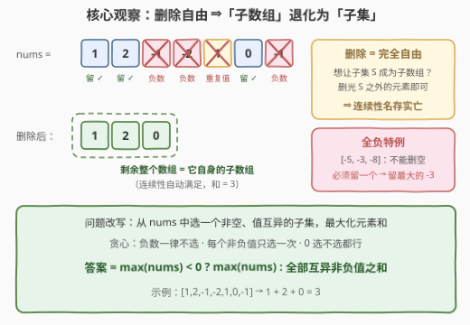
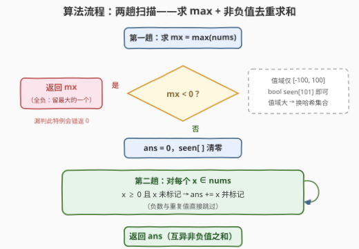

# LeetCode 删除后的最大子数组元素和 题解

## 1. 题目概述

- **标题 / 题号**：删除后的最大子数组元素和（#3487，easy）
- **链接**：https://leetcode.cn/problems/maximum-unique-subarray-sum-after-deletion/
- **难度**：简单
- **标签**：贪心、数组、哈希表

**题意**：给你一个整数数组 `nums`。你可以从数组 `nums` 中**删除任意数量的元素**，但不能将其变为**空**数组。执行删除操作后，选出 `nums` 中满足下述条件的一个**子数组**：

- 子数组中的所有元素**互不相同**；
- **最大化**子数组的元素和。

返回子数组的**最大元素和**。

子数组是数组的一个**连续、非空**的元素序列。

**示例 1**：

```text
输入：nums = [1,2,3,4,5]
输出：15
解释：不删除任何元素，选中整个数组得到最大元素和。
```

**示例 2**：

```text
输入：nums = [1,1,0,1,1]
输出：1
解释：删除元素 nums[0] == 1、nums[1] == 1、nums[2] == 0 和 nums[3] == 1。
      选中整个数组 [1] 得到最大元素和。
```

**示例 3**：

```text
输入：nums = [1,2,-1,-2,1,0,-1]
输出：3
解释：删除元素 nums[2] == -1 和 nums[3] == -2，
      从 [1, 2, 1, 0, -1] 中选中子数组 [2, 1] 以获得最大元素和。
```

**约束**：

- $1 \le nums.length \le 100$
- $-100 \le nums[i] \le 100$

> 💡 **读题关键**：① 删除元素的**数量与位置完全自由**，唯一硬约束是「不能删空」；② 「子数组」要求**连续**，但这是对**删除之后**的数组而言的——两条组合起来正是本题的题眼（见 2.2）。

## 2. 解题思路

### 2.1 暴力思路：枚举保留集合

最直白的做法：枚举「保留哪些元素」的每一种方案（子集），检查保留下来的元素是否**值互异**，若互异则求和，取全局最大。

```text
for 每个非空子集 S ⊆ nums:
    if S 中的值互不相同:
        ans = max(ans, sum(S))
```

子集共有 $2^n$ 个，$n = 100$ 时约 $10^{30}$ 种，**完全不可行**；换成「枚举删除方案、再对剩余数组跑最大互异子数组和」也一样爆炸——删除方案本身就是 $2^n$ 级。必须先利用「删除自由」这条性质把问题**降维**。

### 2.2 核心观察：删除自由 → 「子数组」退化为「子集」



**题目的两步操作要合并起来看**：删除是任意的，选子数组也是任意的。若我想让某个集合 $S$（`nums` 的一个子集）成为最终的子数组，只需**把 $S$ 之外的所有元素删光**——剩下的整个数组就是 $S$，而「整个数组」是它自身的子数组。

> 💡 换句话说：**「先任意删、再选连续段」等价于「直接从 `nums` 里任选一个非空子集」**——连续性约束在任意删除面前名存实亡。示例 3 的官方解释选中 `[2, 1]` 只是「没删干净」的一种等价写法：保留 $\{1, 2\}$、删光其余，同样是和为 3 的合法答案。

于是问题被改写为：

> 从 `nums` 中选一个**非空**、**值互异**的子集，最大化元素和。

接下来只剩三个贪心决策：

| 元素类别 | 选不选 | 原因 |
|----------|--------|------|
| 负数 | **不选** | 加进来只会让和变小 |
| 正数 | **每个不同值选一次** | 同值选两次违反互异；一个值出现多次也只贡献一次 |
| 0 | 选不选都行 | 和不变；选一次合法（与其余值互异） |

只剩一个边界情况：**全是负数**时「一个都不选」是不行的（子集必须非空）——此时只能「亏得最少」，保留最大的那个元素，答案即 $\max(nums)$。

> ⚠️ 「互异」约束的是**值**而不是元素：`[1,1,0,1,1]` 里四个 `1` 是不同元素、相同值，只有一个能进入答案（示例 2 的答案 1 由此而来）。

### 2.3 算法流程图



流程只有两步：先扫一遍求 $\max$，若 $\max < 0$ 直接返回（全负特例）；否则再扫一遍，用**哈希集合**（或值域布尔数组）对非负值去重累加。值域 $[-100, 100]$ 很小，用 `bool seen[101]` 即可，连哈希函数都省了。

### 2.4 示例演算

以 `nums = [1,2,-1,-2,1,0,-1]` 为例逐元素决策：

| 下标 | 值 | 决策 | 贡献 | 说明 |
|------|-----|------|------|------|
| 0 | 1 | 选 | $+1$ | 首次出现 |
| 1 | 2 | 选 | $+2$ | 首次出现 |
| 2 | -1 | 不选 | $0$ | 负数 |
| 3 | -2 | 不选 | $0$ | 负数 |
| 4 | 1 | 不选 | $0$ | 值 1 已选过（互异） |
| 5 | 0 | 选（或不选） | $0$ | 和不变 |
| 6 | -1 | 不选 | $0$ | 负数 |

答案 $= 1 + 2 + 0 = 3$ ✓。再验证两个特例：`[1,2,3,4,5]` 全为互异正数 → $15$；`[-5,-3,-8]` 全负 → $\max = -3$（必须保留一个，亏得最少）。

## 3. 参考代码

### C++（值域布尔数组版）

```cpp
class Solution {
  public:
    int maxSum(vector<int>& nums) {
        int mx = *max_element(nums.begin(), nums.end());
        if (mx < 0) return mx;

        bool seen[101] = {};
        int ans = 0;
        for (int x : nums)
            if (x >= 0 && !seen[x]) {
                seen[x] = true;
                ans += x;
            }
        return ans;
    }
};
```

> 💡 **写法要点**：
> - 第一行的特判承担「全负」分支：数组里一个非负数都没有时，只能保留恰好一个元素，保留最大的 $\max(nums)$ 才亏得最少；
> - 值域固定为 $[-100,100]$，非负部分只需 `bool seen[101]`，比 `unordered_set` 更省更快；值域放宽后换哈希集合，主逻辑不变。

### Python（set 一行版）

```python
class Solution:
    def maxSum(self, nums: List[int]) -> int:
        mx = max(nums)
        if mx < 0:
            return mx
        return sum(x for x in set(nums) if x >= 0)
```

> 💡 `set(nums)` 先按值去重，再过滤非负求和——两行贪心决策（去重、去负）在集合层面一次完成；全负特判同样不可省。

## 4. 复杂度分析

| 维度 | 复杂度 | 说明 |
|------|--------|------|
| 时间复杂度 | $O(n)$ | 两次线性扫描：求 $\max$ 一遍、去重累加一遍 |
| 空间复杂度 | $O(V)$ | 去重标记占值域大小 $V = 201$（C++ 布尔数组；Python `set` 至多 $O(n)$ 个元素），本题规模下视为常数 |

> ⚠️ 对比暴力枚举子集的 $O(2^n \cdot n)$，这里把「选哪些元素」的指数级决策压缩成了「每个值选/不选」的 $O(1)$ 贪心——前提正是 2.2 的等价改写，否则连「子集」这个对象都不该出现。

## 5. 扩展：删除的自由度决定「连续」的约束力

本题的秒杀钥匙是**删除完全自由**。一旦删除受限，连续性立刻恢复约束力，套路随之改变：

- **不能删除**（只能在原数组上选现成子数组）：1695. 删除子数组的最大得分——「值互异子数组最大和」的正统版本，**滑动窗口 + 哈希**，$O(n)$；
- **删除受限**（只能删光某个值的全部出现）：3410. 删除所有值为某个元素后的最大子数组——枚举被删值 + 前缀/DP 处理剩余数组；
- **本题**（任意删除）：连续性失效，退化为**按值贪心**，代码量趋近于零。

一条清晰的谱系：**删除越自由，「子数组」越接近「子集」，算法越简单**。面试被追问「这题和 1695 什么区别」时，答「删除自由度——自由删除让子数组退化成子集」即可一语中的。

## 6. 面试要点

1. **为什么「子数组」的连续约束可以无视？**

   > 删除任意数量的元素意味着：想让集合 $S$ 成为子数组，删光 $S$ 之外的元素，剩余的整个数组就是 $S$，而整个数组是自身的子数组。所以「先任意删、再选连续段」=「任选非空子集」。

2. **全负数组为什么必须特判？**

   > 子集（子数组）非空是硬约束。全负时无法通过「什么都不选」避开亏损，只能保留恰好一个元素让亏损最小——即 $\max(nums)$。漏掉这个特判，全负用例会错误地返回 0（0 来自空集，非法）。

3. **重复值怎么处理？为什么按「值」去重而不是按下标？**

   > 互异约束在**值**层面：`[1,1,0,1,1]` 中值 1 出现 4 次，无论保留哪个下标上的 1，和都只算一次。用哈希集合/布尔数组按值标记即可，与下标无关。

4. **如果值域不是 $[-100,100]$ 而是 $10^9$ 量级呢？**

   > 把 C++ 的布尔数组换成 `unordered_set`，Python 保持 `set` 不变；时间仍是 $O(n)$，空间从 $O(V)$ 变为 $O(\min(n, V))$。算法本身与值域无关，这也是「先想等价改写、再谈实现」的好处。

5. **本题与 1695（删除子数组的最大得分）的本质区别？**

   > 1695 不允许删除，必须在**原数组**上选连续且值互异的子数组，需用滑动窗口维护窗口内互异；本题允许任意删除，连续性失效，退化为按值贪心。一句话：**删除的自由度决定它是「子数组问题」还是「子集问题」**。

> 💡 **一句话总结**：3487 = 「任意删除 ⇒ 子数组退化为子集」+ 两个贪心决策（负数不选、非负值各选一次）+ 一个全负特判（返回 $\max$），两趟线性扫描收工。

## 同类练习题

| # | 题目 | 与本题的关联 |
|---|------|-------------|
| 1695 | [删除子数组的最大得分](https://leetcode.cn/problems/maximum-erasure-value/)（[题解](../1601-1700/1695_删除子数组的最大得分.md)） | 本题的「无删除」正统版——值互异子数组最大和，滑动窗口 $O(n)$，对照体会连续性约束恢复后的解法 |
| 3410 | [删除所有值为某个元素后的最大子数组和](https://leetcode.cn/problems/maximize-subarray-sum-after-removing-all-occurrences-of-one-element/)（[题解](../3401-3500/3410_删除所有值为某个元素后的最大子数组和.md)） | 删除受限（只删光某个值）时连续性仍在，正好位于「1695 ↔ 3487」谱系的中间档 |
| 1748 | [唯一元素的和](https://leetcode.cn/problems/sum-of-unique-elements/)（[题解](../1701-1800/1748_唯一元素的和.md)） | 哈希按值统计的基础题，热身「恰好出现一次的值」的计数写法 |
| 53 | [最大子数组和](https://leetcode.cn/problems/maximum-subarray/)（[题解](../0001-0100/53_最大子数组和.md)） | 「子数组最大和」的祖宗题（Kadane），感受无删除、无互异约束时的经典形态 |
