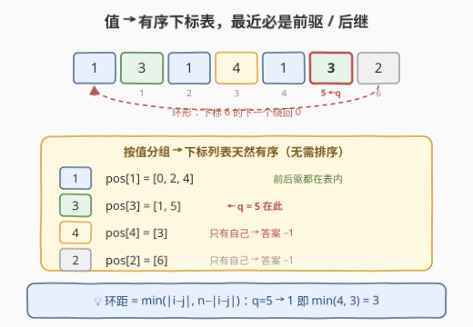
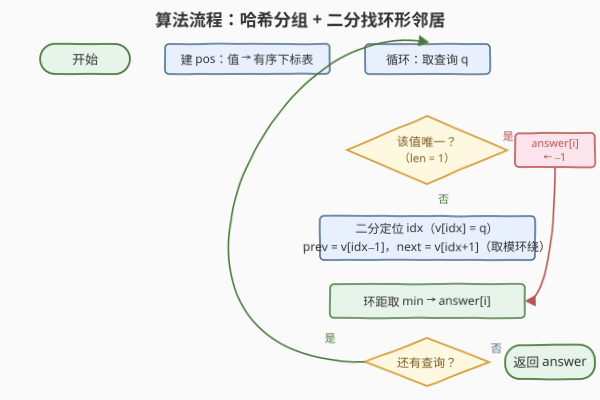
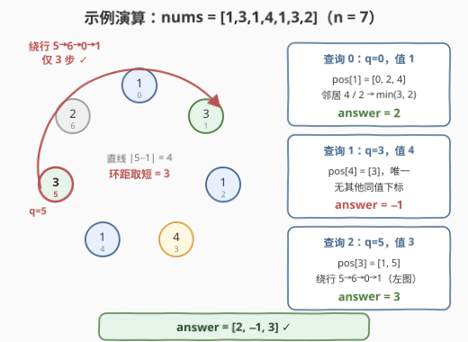

# LeetCode 距离最小相等元素查询 题解

## 1. 题目概述

- **标题 / 题号**：距离最小相等元素查询（#3488，medium）
- **链接**：https://leetcode.cn/problems/closest-equal-element-queries/
- **难度**：中等
- **标签**：数组、哈希表、二分查找

**题意**：给你一个**环形**数组 `nums` 和一个数组 `queries`。对于每个查询 `i`，你需要找到：数组 `nums` 中下标 `queries[i]` 处的元素与**任意**其他下标 `j`（满足 `nums[j] == nums[queries[i]]` 且 $j \ne queries[i]$）之间的**最小**距离。如果不存在这样的下标 `j`，则该查询的结果为 `-1`。返回数组 `answer`，`answer[i]` 表示查询 `i` 的结果。

**「环形」意味着距离可以绕圈计算**：下标 $i$ 与 $j$ 之间的环上距离为

$$\text{ringdist}(i, j) = \min\big(\,|i-j|,\ \ n - |i-j|\,\big)$$

即沿环两个方向走，取较短的那个。

**示例 1**：

```text
输入：nums = [1,3,1,4,1,3,2], queries = [0,3,5]
输出：[2,-1,3]
解释：
查询 0：nums[0] = 1。最近的相同值下标为 2，距离为 2。
查询 1：nums[3] = 4。不存在其他包含值 4 的下标，结果为 -1。
查询 2：nums[5] = 3。最近的相同值下标为 1，距离为 3（沿环 5 -> 6 -> 0 -> 1）。
```

**示例 2**：

```text
输入：nums = [1,2,3,4], queries = [0,1,2,3]
输出：[-1,-1,-1,-1]
解释：每个值都唯一，所有查询结果均为 -1。
```

**约束**：

- $1 \le queries.length \le nums.length \le 10^5$
- $1 \le nums[i] \le 10^6$
- $0 \le queries[i] < nums.length$

> 💡 **读题关键**：① 距离是**环上的**——`5` 与 `1` 在 `n = 7` 的环上距离不是 $4$ 而是 $\min(4, 3) = 3$；② 每次查询只关心**同值**下标，自然想到按值分组；③ 数据范围 $10^5$ 级别，$O(nq)$ 的两两枚举必然超时。

## 2. 解题思路

### 2.1 暴力思路：沿环双向扩散

对每个查询 $q$，从 $q$ 出发沿环的两个方向各逐格走一步，最先撞到的相同值就是答案；两个方向都走完半圈仍无相遇则返回 `-1`：

```python
for q in queries:
    ans = n  # 不可能超过半圈
    for d in range(1, n // 2 + 1):
        if nums[(q + d) % n] == nums[q] or nums[(q - d) % n] == nums[q]:
            ans = d
            break
    answer.append(-1 if ans == n and (n < 2 or ...) else ans)
```

单次查询最坏 $O(n)$，总体 $O(nq)$，在 $n, q \le 10^5$ 时高达 $10^{10}$ 量级，必然超时。问题出在：每个查询都从零开始"找邻居"，大量信息被重复计算。

### 2.2 核心观察：同值下标排成有序表，最近必是前驱 / 后继



**第一步：按值分组。** 用哈希表把每个值映射到它的下标列表：`pos[v] = [所有满足 nums[i] == v 的 i]`。由于下标按下标顺序录入，每个列表**天然有序**，无需排序。

**第二步：最近者必是"前驱 / 后继"。** 固定查询 $q$，设 $v = pos[nums[q]]$（长度 $m$）。把环从 $q$ 处"剪开"拉直：

- 从 $q$ 出发沿**顺时针**方向遇到的第一个同值下标，就是 $v$ 中 $q$ 的**后继**（若 $q$ 恰是表中最后一个，环绕到表头 $v[0]$）；
- 沿**逆时针**方向的第一个同值下标，就是 $q$ 的**前驱**（若 $q$ 是表头，环绕到表尾 $v[m-1]$）。

环上其余同值下标都在这两个"第一名"**之后**，弧长只会更长。而环距恰为 $\min(\text{顺时针弧}, \text{逆时针弧})$，所以：

$$answer[i] = \min\Big(\text{ringdist}\big(q,\ v_{\text{prev}}\big),\ \text{ringdist}\big(q,\ v_{\text{next}}\big)\Big)$$

在有序表 $v$ 中定位 $q$ 的位置只需**二分查找**——这正是"哈希分组 + 二分"的由来。

> ⚠️ **两个边界**：① $m = 1$（该值只出现一次）直接返回 `-1`；② $m = 2$ 时前驱与后继是**同一个**元素（环上仅剩另一个），取模下标公式天然正确，无需特判。若 $m = n$（所有元素相同），最近距离恒为 $1$（相邻即同值），公式同样覆盖。

### 2.3 算法流程图



1. 遍历 `nums`，建哈希表 `pos`：值 → 有序下标列表；
2. 依次处理每个查询 `q`；
3. 取 `v = pos[nums[q]]`：长度为 1 → 该查询答案 `-1`；
4. 否则在 `v` 中二分定位 `idx`（`v[idx] == q`），取模求出前驱 `prev` 与后继 `next`；
5. 用环距公式 $\min(|i-j|, n-|i-j|)$ 分别计算 `q` 到二者的距离，取较小者作为该查询答案；
6. 处理完所有查询后返回 `answer`。

### 2.4 示例演算



以**示例 1**（`nums = [1,3,1,4,1,3,2]`，$n = 7$）走一遍。先建表：`pos[1] = [0,2,4]`、`pos[3] = [1,5]`、`pos[4] = [3]`、`pos[2] = [6]`。

| 查询 | $q$ | 值 | $v = pos[\cdot]$ | 前驱 / 后继 | 环距 | answer |
|---|---|---|---|---|---|---|
| 0 | 0 | 1 | $[0,2,4]$ | $4$（环绕）/ $2$ | $\min(\text{rd}(0,4),\ \text{rd}(0,2)) = \min(3, 2)$ | **2** |
| 1 | 3 | 4 | $[3]$ | —（唯一） | — | **-1** |
| 2 | 5 | 3 | $[1,5]$ | $1$ / $1$（$m=2$ 同一元素） | $\text{rd}(5,1) = \min(4, 3)$ | **3** |

三次查询逐一验证：

- **查询 0**：`idx = 0`，前驱环绕到 `v[2] = 4`，环距 $\min(4, 7-4) = 3$；后继 `v[1] = 2`，环距 $\min(2, 5) = 2$。取较小者 $2$ ✓
- **查询 1**：值 4 只出现一次，无其他下标，返回 `-1` ✓
- **查询 2**：`idx = 1`，前驱 `v[0] = 1`；后继环绕回 `v[0] = 1`（同一个）。环距 $\min(|5-1|, 7-|5-1|) = \min(4, 3) = 3$——这正是"沿环 5→6→0→1 走 3 步"的绕行路径 ✓

## 3. 参考代码

### C++

```cpp
class Solution {
  public:
    vector<int> solveQueries(vector<int>& nums, vector<int>& queries) {
        int n = nums.size();
        unordered_map<int, vector<int>> pos;
        for (int i = 0; i < n; ++i) {
            pos[nums[i]].push_back(i);      // 按下标顺序录入，天然有序
        }

        auto ringDist = [&](int a, int b) {
            int d = abs(a - b);
            return min(d, n - d);           // 环上距离：两个方向取短
        };

        vector<int> answer;
        answer.reserve(queries.size());
        for (int q : queries) {
            vector<int>& v = pos[nums[q]];
            if (v.size() == 1) {            // 该值只出现一次
                answer.push_back(-1);
                continue;
            }
            int m = v.size();
            int idx = lower_bound(v.begin(), v.end(), q) - v.begin();
            int prev = v[(idx - 1 + m) % m];   // 前驱：idx=0 时环绕到表尾
            int next = v[(idx + 1) % m];        // 后继：表尾环绕回表头
            answer.push_back(min(ringDist(q, prev), ringDist(q, next)));
        }
        return answer;
    }
};
```

### Python

```python
class Solution:
    def solveQueries(self, nums: List[int], queries: List[int]) -> List[int]:
        n = len(nums)
        pos = defaultdict(list)
        for i, x in enumerate(nums):
            pos[x].append(i)                # 按下标顺序录入，天然有序

        def ring_dist(a: int, b: int) -> int:
            d = abs(a - b)
            return min(d, n - d)            # 环上距离：两个方向取短

        answer = []
        for q in queries:
            v = pos[nums[q]]
            if len(v) == 1:                 # 该值只出现一次
                answer.append(-1)
                continue
            idx = bisect_left(v, q)
            prev = v[idx - 1]               # idx=0 时 v[-1] 恰为表尾，天然环绕
            nxt = v[(idx + 1) % len(v)]     # 后继：表尾环绕回表头
            answer.append(min(ring_dist(q, prev), ring_dist(q, nxt)))
        return answer
```

> 💡 Python 中 `v[idx - 1]` 在 `idx = 0` 时自动取 `v[-1]`（表尾元素），与"环绕"语义恰好一致，是个顺手的巧合；C++ 无此特性，需写 `(idx - 1 + m) % m`。

## 4. 复杂度分析

| 维度 | 复杂度 | 说明 |
|------|--------|------|
| 时间 | $O(n + q\log n)$ | 建哈希表一遍 $O(n)$；每次查询在长度 $m \le n$ 的有序表上二分 $O(\log m)$，共 $q$ 次 |
| 空间 | $O(n)$ | 哈希表中所有下标列表长度之和恰为 $n$；输出数组 $O(q)$ 不计 |

## 5. 扩展：去掉二分的 $O(n + q)$ 预处理

二分可以完全消掉：**离线预处理每个下标的答案**。对每个值的下标列表 $v$（长度 $m \ge 2$），环上相邻的对 $(v[k],\ v[(k+1) \bmod m])$（含表尾绕表头）互相松弛一次即可——因为 2.2 已证最近者必是环形邻居：

```python
class Solution:
    def solveQueries(self, nums: List[int], queries: List[int]) -> List[int]:
        n = len(nums)
        pos = defaultdict(list)
        for i, x in enumerate(nums):
            pos[x].append(i)

        INF = n + 1                          # 哨兵：环距最大不超过 n // 2
        best = [INF] * n
        for v in pos.values():
            m = len(v)
            if m == 1:
                continue
            for k in range(m):               # 环形相邻对（含尾绕头）
                a, b = v[k], v[(k + 1) % m]
                d = min(abs(a - b), n - abs(a - b))
                best[a] = min(best[a], d)
                best[b] = min(best[b], d)

        return [best[q] if best[q] < INF else -1 for q in queries]
```

每个下标至多被两对相邻关系松弛，总时间 $O(n + q)$，空间 $O(n)$。两种写法复杂度都绰绰有余，**哈希 + 二分**更贴近"逐查询回答"的题面，**预处理**则更适合查询极多（甚至在线）的场景。

## 6. 面试要点

- **Q1：环形数组中下标 $i$ 与 $j$ 的距离怎么定义？**
  答：$\text{ringdist}(i,j) = \min(|i-j|,\ n-|i-j|)$。环上从一个下标到另一个有两条路——正向走 $|i-j|$ 步、反向走 $n-|i-j|$ 步，取短者。$n = 7$ 时下标 $5$ 与 $1$ 的距离是 $\min(4,3) = 3$，而不是 $4$。
- **Q2：为什么最近的同值下标一定是有序下标表中的前驱或后继？**
  答：从 $q$ 出发沿环某个方向遇到的**第一个**同值下标，就是有序表中（环形意义的）前驱或后继；环上其余同值下标都排在这个"第一名"之后，弧长只会更长。环距等于两个方向最短弧，故最近者必为前驱/后继之一，只需检查这两个候选。
- **Q3：前驱、后继的取模公式是什么？$m = 2$ 时会不会出问题？**
  答：设二分定位得 `idx`，前驱 `v[(idx-1+m)%m]`、后继 `v[(idx+1)%m]`。$m = 2$ 时两者指向同一个元素（环上仅剩的另一个），`min` 不受影响；$m = n$（全相同）时最近距离为 1，公式同样正确。唯一需特判的是 $m = 1$，直接返回 `-1`。
- **Q4：哈希表里的下标列表为什么不用排序？**
  答：建表时按下标 $0 \dots n-1$ 顺序遍历、依次 `push_back`，同一值的所有下标按录入顺序自然递增。注意哈希表**键的遍历顺序**无序，但每个**列表内部**必然有序，二分的前提依然成立。
- **Q5：能否做到查询 $O(1)$？**
  答：可以。离线预处理 `best[i]`：对每个值的长为 $m \ge 2$ 的下标列表，枚举环形相邻对（含表尾绕表头）互相松弛环距；未被松弛过的下标（值唯一）答案为 `-1`。总复杂度 $O(n+q)$，代价是必须先看全数组，适合批量/在线查询场景。

## 同类练习题

| # | 题目 | 与本题的关联 |
|---|------|-------------|
| 219 | [存在重复元素 II](https://leetcode.cn/problems/contains-duplicate-ii/) | 哈希记录每个值最近一次出现的下标，判断同值距离是否不超过 k——本题的"在线判别"版 |
| 503 | [下一个更大元素 II](https://leetcode.cn/problems/next-greater-element-ii/) | 环形数组经典题，对比"取模环绕"与"拼接翻倍"两种环建模手法 |
| 34 | [在排序数组中查找元素的第一个和最后一个位置](https://leetcode.cn/problems/find-first-and-last-position-of-element-in-sorted-array/) | 纯有序数组二分定位训练，巩固 `lower_bound` / `bisect_left` 手感 |
| 220 | [存在重复元素 III](https://leetcode.cn/problems/contains-duplicate-iii/) | 滑动窗口 + 有序结构找"最接近的值"，是"最近距离查询"思想的进阶变体 |
