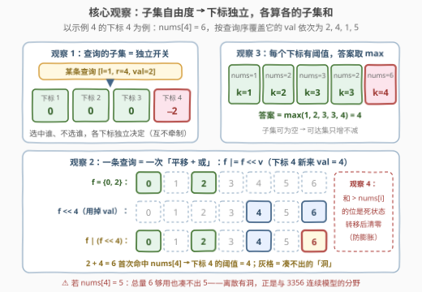
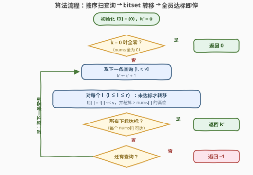

# 零数组变换 IV

- **题目名称**：零数组变换 IV
- **链接**：[3489. 零数组变换 IV](https://leetcode.cn/problems/zero-array-transformation-iv/)
- **难度**：中等
- **标签**：数组、动态规划、位运算（bitset）
- **关联**：[3355. 零数组变换 I](https://leetcode.cn/problems/zero-array-transformation-i/)（[站内题解](../3301-3400/3355_零数组变换I.md)）、[3356. 零数组变换 II](https://leetcode.cn/problems/zero-array-transformation-ii/)（[站内题解](../3301-3400/3356_零数组变换II.md)）、[3362. 零数组变换 III](https://leetcode.cn/problems/zero-array-transformation-iii/)（[站内题解](../3301-3400/3362_零数组变换III.md)）的续作——前三代「至多减 val、可任取 $0 \sim val$」保证了可减量**连续**，覆盖总量够就行；本题改成「选中的下标**恰好**减 val」，连续性崩塌，差分判定失效，换**子集和背包**登场

## 1. 题目概述

给你一个长度为 $n$ 的整数数组 `nums` 和一个二维数组 `queries`，其中 `queries[i] = [l_i, r_i, val_i]`。

每个 `queries[i]` 表示在 `nums` 上执行以下操作：

- 从数组 `nums` 中选择范围 $[l_i, r_i]$ 内的一个**下标子集**（可为空）；
- 将每个**选中**下标处的值减去**正好** $val_i$。

**零数组**是指所有元素都等于 0 的数组。

返回使得按顺序执行**前 $k$ 个**查询后，`nums` 能转变为零数组的最小非负值 $k$。如果不存在这样的 $k$，返回 $-1$。

**示例 1**：

```text
输入：nums = [2,0,2], queries = [[0,2,1],[0,2,1],[1,1,3]]
输出：2
解释：查询 0 选子集 {0,2} 各减 1 得 [1,0,1]；查询 1 再选 {0,2} 各减 1 得 [0,0,0]，
     故最小 k = 2。
```

**示例 2**：

```text
输入：nums = [4,3,2,1], queries = [[1,3,2],[0,2,1]]
输出：-1
解释：下标 0 只被查询 1 覆盖（val = 1），子集和至多凑出 1 < 4，永远到不了 0。
```

**示例 3**：

```text
输入：nums = [1,2,3,2,1], queries = [[0,1,1],[1,2,1],[2,3,2],[3,4,1],[4,4,1]]
输出：4
```

**示例 4**：

```text
输入：nums = [1,2,3,2,6], queries = [[0,1,1],[0,2,1],[1,4,2],[4,4,4],[3,4,1],[4,4,5]]
输出：4
解释：下标 4 的 val 集合为 {2,4,1,5}：前 3 条查询后可达和只有 {0,2}；
     第 4 条（val = 4）加入后 2+4=6 首次可达——下标 4 是最后达标者，k = 4。
```

**约束条件**：

- $1 \le nums.length \le 10$
- $0 \le nums[i] \le 1000$
- $1 \le queries.length \le 1000$
- $0 \le l_i \le r_i < nums.length$
- $1 \le val_i \le 10$

> ⚠️ **读题关键**：① 与 3356「最多减 val、独立任取」不同，本题每个被覆盖下标面对的是**二选一**——要么不减、要么**恰好**减 $val_i$，可减总量是 val 集合的**子集和**，不再连续（如 $\{2,2\}$ 只能凑出 $0/2/4$，凑不出 1）；② 子集可为空，意味着「不使用某条查询」永远合法——这是后面单调性的来源；③ 数据范围骤缩（$n \le 10$、$nums[i] \le 1000$、$val \le 10$），$m \cdot n \cdot \max nums \approx 10^7$，出题人摆明车马请你做背包 DP。

---

## 2. 解题思路

### 2.1 暴力思路：枚举子集必然爆炸

「能否归零」最原始的问法是**构造**：每条查询的子集怎么选？逐条二选一（每个下标选/不选），组合数天文数字。即便先退一步——发现每个下标独立（见观察一），对单个下标枚举其 val 集合的子集仍是 $2^{\text{覆盖数}}$，最坏 $2^{1000}$。

**换视角**：可行性不需要构造方案，只需回答「val 集合能否凑出**恰好** $nums[i]$」——这是 **0/1 背包可达性**问题，DP 一趟把**所有**可达和全部点亮，子集枚举的指数墙瞬间塌掉。

### 2.2 核心观察：下标独立 + 子集和 bitset 背包



**观察一（子集自由度 ⇒ 下标彻底独立）**：查询 $j$ 的子集 $S_j$ 是 $[l_j, r_j]$ 的**任意**子集——「下标 $i$ 是否 $\in S_j$」与其他下标的选择毫无关系。于是全局问题干净地分解为 $n$ 个独立子问题：

> 下标 $i$（用前 $k$ 条查询）能归零 $\iff$ $nums[i]$ 是集合 $\{val_j : j < k,\ l_j \le i \le r_j\}$ 的**子集和**。

**观察二（可达性 DP，一行转移）**：记 $f_i$ 为下标 $i$ 的可达和集合，第 $s$ 位为 1 表示「已处理的 val 能凑出和 $s$」。初值 $f_i = \{0\}$（空子集）；每来一条覆盖 $i$ 的查询（值为 $v$）：

$$f_i \ \leftarrow\ f_i \cup \{s + v : s \in f_i\} \quad\Longleftrightarrow\quad f_i \mathrel{|}= f_i \ll v$$

这就是 0/1 背包的 bitset 写法：一次平移 + 一次按位或，$O(\max nums / 64)$ 个机器字搞定一条查询对一个下标的全部更新。

**观察三（单调性 ⇒ 阈值取 max）**：子集可为空 ⇒ 可达集合随 $k$ **只增不减**。每个下标存在阈值 $k_i$ = 首次凑出 $nums[i]$ 的最小查询数，全局答案就是 $\max_i k_i$（木桶效应——最晚凑出的下标说了算）。按序处理查询、每步更新覆盖下标、全员达标即停，增量式天然求出每个阈值，**连 3356 那层二分都省了**。

**观察四（裁剪高位）**：$val$ 全为正，和只会越加越大——一旦超过 $nums[i]$ 就永远回不来，是死状态。转移后把高于 $nums[i]$ 的位清零（`f &= (1 << (nums[i]+1)) - 1`）：Python 大整数不膨胀、位运算恒快；C++ 固定 `bitset<1001>` 移位溢出自动丢弃，同理。

> 💡 **数据范围的暗示**：$n \le 10$、$m \le 1000$、$nums[i] \le 1000$——出题人给纯布尔 DP 留足了路；bitset 只是把 $10^7$ 次布尔转移压成约 $1.6 \times 10^5$ 次字操作的锦上添花。

### 2.3 算法流程图



**执行步骤**：

| 步骤 | 动作 | 说明 |
|------|------|------|
| ① | 初始化 $f_i = \{0\}$（空子集），检查 $k=0$ | `nums` 本身全零直接返回 0 |
| ② | 按序取下一条查询 $[l, r, v]$ | 当前已用查询数 $k' \mathrel{+}= 1$ |
| ③ | 对每个 $i \in [l, r]$：若 $nums[i]$ 尚未可达，$f_i \mathrel{|}= f_i \ll v$ 并裁剪高位 | 已达标下标跳过（可达集只增不减，冻结即可） |
| ④ | 检查所有下标是否 $nums[i] \in f_i$ | 达标 → 返回 $k'$ |
| ⑤ | 还有查询 → 回到 ②；否则返回 $-1$ | |

### 2.4 示例演算

以信息量最大的示例 4（`nums = [1,2,3,2,6]`）走一遍，每个下标独立算阈值：

| 下标 $i$ | $nums[i]$ | 覆盖它的 val（按查询序） | 可达和的扩张 | 阈值 $k_i$ |
|---|---|---|---|---|
| 0 | 1 | 1, 1 | $\{0\} \to \{0,1\}$ ✓ | 1 |
| 1 | 2 | 1, 1, 2 | $\{0\} \to \{0,1\} \to \{0,1,2\}$ ✓ | 2 |
| 2 | 3 | 1, 2 | $\{0\} \to \{0,1\} \to \{0,1,2,3\}$ ✓ | 3 |
| 3 | 2 | 2, 1 | $\{0\} \to \{0,2\}$ ✓ | 3 |
| 4 | 6 | 2, 4, 1, 5 | $\{0\} \to \{0,2\} \to \{0,2,4,6\}$ ✓ | 4 |

答案 $= \max(1,2,3,3,4) = 4$。注意下标 4 的关键一步：第 3 条查询后只有 $\{0,2\}$，第 4 条（val = 4）带来 $\{4,6\}$——$2+4=6$ 恰好命中。

> ⚠️ **「总量够」≠「凑得出」**：假想 $nums[4] = 5$——按 3356 的连续模型，$k=4$ 时覆盖总量 $2+4=6 \ge 5$ 判定可行；但本题可达和是 $\{0,2,4,6\}$，**根本没有 5**，要等到 $k=5$（val = 5）才能凑出。离散的洞，正是背包存在的理由。

---

## 3. 参考代码

### C++

```cpp
class Solution {
  public:
    int minZeroArray(vector<int>& nums, vector<vector<int>>& queries) {
        int n = nums.size(), m = queries.size();
        // f[i] 的第 s 位 = 1：下标 i 已处理的 val 能凑出子集和 s
        vector<bitset<1001>> f(n);
        for (int i = 0; i < n; i++) f[i][0] = 1; // 空子集，和 0 恒可达

        auto allZero = [&]() {
            for (int i = 0; i < n; i++)
                if (!f[i][nums[i]]) return false;
            return true;
        };
        if (allZero()) return 0; // nums 本身全零

        for (int k = 0; k < m; k++) {
            int l = queries[k][0], r = queries[k][1], v = queries[k][2];
            for (int i = l; i <= r; i++) {
                if (f[i][nums[i]]) continue; // 已达标：可达集只增不减，冻结即可
                f[i] |= f[i] << v;            // 不用 v / 用 v（和 +v），0/1 背包一笔转移
            }
            if (allZero()) return k + 1;
        }
        return -1;
    }
};
```

> 💡 `f[i] |= f[i] << v` 一行即「不用这条查询的 val（保留旧和）∪ 用它（每个可达和 $+v$）」；`bitset<1001>` 移位溢出的高位自动丢弃，天然完成「高于 1000 的和不需要」的裁剪。

### Python

```python
class Solution:
    def minZeroArray(self, nums: List[int], queries: List[List[int]]) -> int:
        n = len(nums)
        masks = [1] * n                             # bit s = 1：和 s 可达；空子集 => 和 0
        caps = [(1 << (t + 1)) - 1 for t in nums]   # 只保留 0..nums[i] 位，防大整数膨胀

        def ok():
            return all(masks[i] >> nums[i] & 1 for i in range(n))

        if ok():
            return 0
        for k, (l, r, v) in enumerate(queries):
            for i in range(l, r + 1):
                if masks[i] >> nums[i] & 1:
                    continue                        # 已达标，跳过
                masks[i] = (masks[i] | (masks[i] << v)) & caps[i]
            if ok():
                return k + 1
        return -1
```

> 💡 Python 整数本身就是任意长 bitset：`<< v` 平移即「用掉 val」，`|` 合并即「用或不用」，`& caps[i]` 裁掉永远到不了 $nums[i]$ 的高位死状态。

---

## 4. 复杂度分析

| 维度 | 复杂度 | 说明 |
|------|--------|------|
| 时间复杂度 | $O(m \cdot n \cdot \lceil \max nums / 64 \rceil)$ | 每条查询至多给 $n$ 个下标各做一次 bitset 平移/或（1001 位 ≈ 16 个机器字），约 $1000 \times 10 \times 16 \approx 1.6 \times 10^5$ 次字操作；不用 bitset 的纯布尔 DP 也仅 $O(m \cdot n \cdot \max nums) \approx 10^7$ |
| 空间复杂度 | $O(n \cdot \lceil \max nums / 64 \rceil)$ | $n$ 个 1001 位 bitset ≈ 160 个机器字，忽略不计 |

---

## 5. 扩展：零数组 I→IV，一部「自由度进化史」

| 题号 | 每条查询给下标的「券」 | 可减总量 | 求什么 | 主套路 |
|------|----------------------|----------|--------|--------|
| 3355 I | 减 1 或不减 | $[0, cnt_i]$ 连续 | 判定 | 差分计数 |
| 3356 II | 任取 $[0, val_j]$ | $[0, cov_i]$ 连续 | 最小 $k$ | 二分 + 差分 |
| 3362 III | 减 1 或不减 | $[0, cnt_i]$ 连续 | 删最多 | 扫描线 + 堆贪心 |
| **3489 IV** | **不减或恰好 $val_j$** | **子集和，离散** | **最小 $k$** | **下标独立 + bitset 背包** |

前三代的券是**连续区间**（II 官方明说「减少的数值可以独立选择」，即可任取 $[0, val]$），所以「覆盖总量 $\ge nums[i]$」就是可行性的全部；IV 把券改成**离散两点 $\{0, val\}$**，可减总量塌缩成子集和——总量够不再等于凑得出。**连续 ⇒ 计数/差分；离散 ⇒ 背包**，一念之差换掉整套算法。

另一条暗线：3356 需要**二分** $k$，因为它的判定（差分打点 + 前缀和还原）不可增量维护，只能整段重算；IV 的 bitset 背包**天生增量**——一条查询 = 一次平移或，边扫边查即可。**二分与否取决于判定能否低成本递推，而非「最小 $k$」这个问法本身。**

---

## 6. 面试要点

1. **为什么 3355/3356 的差分判定在本题失效？**

   > 那两题每条查询给下标的可减量是**连续区间**（I 为 $[0,1]$，II 为 $[0,val]$），可减总量 $cov_i$ 够用即可可行。本题是「选中才减、恰好减 $val$」，可减量是 val 集合的**子集和**——离散、有洞（$\{2,2\}$ 凑不出 1），「总量够」推不出「凑得出」，必须做背包可达性。

2. **为什么每个下标可以独立处理？全局不会互相牵制吗？**

   > 查询 $j$ 的子集 $S_j \subseteq [l_j, r_j]$ 可以是**任意**子集，「下标 $i$ 是否入选」对每个 $i$ 是独立开关。各下标的可用 val 集合与选择互不影响，全局可行性 = $n$ 个独立子集和问题的与。

3. **为什么不需要像 3356 那样二分 $k$？**

   > 子集可为空 ⇒ 「不用某条查询」永远合法 ⇒ 每个下标的可达集合随 $k$ 只增不减 ⇒ 存在阈值 $k_i$，答案 $= \max_i k_i$。bitset 背包对一条查询只做一次平移或，**增量维护**零成本，边扫边查直接得到首个全员达标时刻；二分反而多一个 $\log$。

4. **`f |= f << v` 这一行为什么对？高位裁剪为什么安全？**

   > 左侧保留「不用 $v$」的全部旧和，右侧是「每个旧和 $+v$」，按位或恰好是背包转移在 bitset 上的投影。裁剪安全是因为 $val \ge 1$：和只增不减，超过 $nums[i]$ 的状态永远回不到目标位，砍掉只是清理死状态（顺带保证 Python 大整数不膨胀、C++ `bitset<1001>` 移位天然丢弃）。

5. **两个边界出口分别是什么？**

   > $k = 0$：`nums` 本身全零时返回 0（空子集和 0 恒可达，先查再进循环，勿漏）；$k = m$：扫完全部查询仍有下标凑不出（如示例 2 的下标 0 只有一张 val=1 的券，够不到 4）返回 $-1$。

---

## 7. 同类练习题

- [3355. 零数组变换 I](https://leetcode.cn/problems/zero-array-transformation-i/)（[站内题解](../3301-3400/3355_零数组变换I.md)）：系列起点，「减 1 券」连续可减，差分计数判定——理解本题为何换背包的最佳对照
- [3356. 零数组变换 II](https://leetcode.cn/problems/zero-array-transformation-ii/)（[站内题解](../3301-3400/3356_零数组变换II.md)）：同为「最小 $k$」，但券可任取 $[0,val]$、判定不可增量维护，需二分 + 差分——与本题「增量背包免二分」互为镜像
- [3362. 零数组变换 III](https://leetcode.cn/problems/zero-array-transformation-iii/)（[站内题解](../3301-3400/3362_零数组变换III.md)）：同系列换问法（删最多查询），扫描线 + 堆贪心
- [416. 分割等和子集](https://leetcode.cn/problems/partition-equal-subset-sum/)（[站内题解](../0401-0500/416_分割等和子集.md)）：子集和 0/1 背包的原型题，`f |= f << v` 位运算优化的发源地
- [494. 目标和](https://leetcode.cn/problems/target-sum/)（[站内题解](../0401-0500/494_目标和.md)）：子集和变形（转化为凑 $(\text{sum}+\text{target})/2$），与本题同考「恰好命中」的可达性
