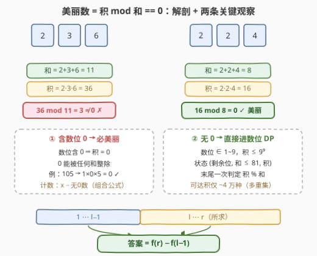
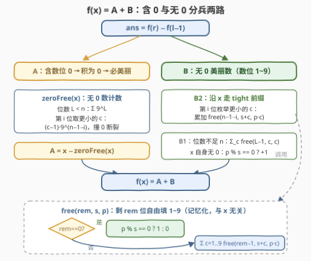

# 统计美丽整数的数目

- **题目名称**：统计美丽整数的数目
- **链接**：[3490. 统计美丽整数的数目](https://leetcode.cn/problems/count-beautiful-numbers/)
- **难度**：困难
- **标签**：动态规划、数位 DP、数学

## 1. 题目概述

给你两个正整数 $l$ 和 $r$。如果一个正整数**每一位上的数字的乘积**能被**这些数字之和**整除，则认为该整数是一个**美丽整数**。统计并返回 $l$ 和 $r$ 之间（**包括** $l$ 和 $r$）的美丽数目。

**示例 1**：

```text
输入：l = 10, r = 20
输出：2
解释：范围内的美丽数为 10 和 20（含数位 0，积为 0，必被整除）；
      11~19 的数位积均小于数位和且不整除。
```

**示例 2**：

```text
输入：l = 1, r = 15
输出：10
解释：1~9 每个数积 = 和 = 自身，自然整除；10 含数位 0，积为 0；
      11~15 均不满足（如 15：积 5、和 6，不整除）。
```

**约束条件**：

- $1 \le l \le r < 10^9$

> 💡 **读题关键**：三件事决定了本题的解法形态——① 判定对象是**十进制数位**的和与积，是与数值大小无关的「数位属性」；② 区间计数且**无数值单调性**（美丽数在数轴上杂乱分布：11 不是、22 是、33 不是），只能走「前缀相减 + 数位 DP」；③ $r < 10^9$ 意味着**至多 9 个数位**：数位和 $\le 81$，无数位 0 时数位积 $\le 9^9$——这两个小上界正是全题的命门。

---

## 2. 解题思路

### 2.1 暴力思路：逐数判定

```text
ans = 0
for n in [l, r]:
    ds = 十进制数位(n)
    ans += (prod(ds) % sum(ds) == 0)
return ans
```

单个数判定 $O(9)$，但区间长度最坏 $10^9$，总量 $10^{10}$ 级，直接超时。美丽数在数轴上**不单调、不成段**，二分与跳跃都无从下手；计数问题的万能前缀分解才是出路：

$$\text{ans} = f(r) - f(l-1), \qquad f(x) = \#\{\, n \in [1, x] : n \text{ 美丽} \,\}$$

于是问题归约为：**给定上界 $x$，数出 $[1,x]$ 内的美丽数**——这正是数位 DP 的标准战场。

### 2.2 核心观察：0 数位是「免检通道」，乘积本身就能当状态



**观察一：含数位 0 的数，全部美丽。** 数位积一旦含 0 就等于 0，而 $0 = s \times 0$，任何正整数 $s$ 都整除 0。例：$10$（积 0、和 1）、$105$（积 0、和 6）。设 $\text{zeroFree}(x)$ 为 $[1,x]$ 中**不含**数位 0 的数的个数，则这部分贡献为 $x - \text{zeroFree}(x)$——纯组合计数，根本不用进 DP：

$$\text{zeroFree}(x) = \underbrace{\sum_{L=1}^{n-1} 9^L}_{\text{位数不足 } n} + \underbrace{\big(\text{恰好 } n \text{ 位且} \le x \text{ 的无 0 数}\big)}_{\text{沿 } x \text{ 的数位走 tight 前缀}}$$

后者逐位处理：第 $i$ 位取更小的数字 $c \in [1, d_i - 1]$ 时，后面 $n-1-i$ 位任取 $1 \sim 9$，贡献 $(d_i - 1) \cdot 9^{n-1-i}$；前缀中途撞到 $d_i = 0$ 则无 0 数路径断裂。

**观察二：不含 0 的数，数位积可以直接当 DP 状态。** 剩下的数数位取值 $1 \sim 9$，积不超过 $9^9 = 387{,}420{,}489 < 2^{29}$，和不超过 $81$——都是**普通整数能装下的小量**。于是从高位往低位填数，状态只需三元组：

$$\text{free}(\textit{rem},\ s,\ p) = \text{还剩 rem 位可自由填 1\sim9，已累积数位和 s、数位积 p 时，最终 } p \bmod s = 0 \text{ 的填法数}$$

转移就是枚举下一位 $c \in [1,9]$：$(s, p) \to (s + c,\ p \cdot c)$；终止时一次取模判定 $p \bmod s = 0$。

> ⚠️ **状态数为什么不会是 $9^9$ 量级？** 乘法满足交换律，$p$ 只由所选数位的**多重集**决定；大小 $\le 9$ 的数字多重集一共 $\binom{18}{9} = 48{,}620$ 种，不同的多重集还会碰撞出相同的 $(s, p)$（如 $\{2,9\}$ 与 $\{3,6\}$ 都是和 11、积 18）。实测 $f(10^9-1)$ 全程只触及约 **4.2 万**个状态——这就是本题能在几十毫秒内跑完的原因。

> ⚠️ **tight 路径上第 $i$ 位枚举 $c < d_i$ 时，$c = 0$ 的分支去哪了？** 被「观察一」整体吸收：含 0 的数在 A 部分按 $x - \text{zeroFree}(x)$ 全数计入，B 部分只管无 0 数，两边不重不漏。

### 2.3 算法流程图



$f(x) = A + B$ 双轨并行：A 轨用组合计数处理「含 0」的免检通道；B 轨用带 tight 前缀的数位 DP 处理「无 0」的硬骨头。记忆化的 `free` 与上界 $x$ 无关，$f(r)$ 与 $f(l-1)$ 两次查询**共用同一份缓存**。

### 2.4 示例演算：$f(20) - f(9)$

| 步骤 | 计算 | 结果 |
|------|------|------|
| $f(9)$ | 1~9 全部积 = 和 = 自身 | $9$ |
| A：$\text{zeroFree}(20)$ | 1 位无 0 数 $9$ 个；2 位 tight：首位取 $c < 2$ 贡献 $1 \times 9 = 9$（即 11~19），走 2 后遇 0 断裂 | $18$ |
| A：含 0 贡献 | $20 - 18$（即 10、20） | $2$ |
| B1：1 位无 0 美丽数 | $c \bmod c = 0$ 恒成立 | $9$ |
| B2：2 位 tight | 首位 $c = 1 < 2$：$\text{free}(1, 1, 1)$ 枚举第二位 $c'$，$(1 \cdot c') \bmod (1 + c')$ 均不为 0，全灭；tight 走 2 后遇 0 断裂 | $0$ |
| 汇总 | $f(20) = 2 + 9 + 0 = 11$，答案 $= 11 - 9$ | **2** ✓ |

> 💡 **密度彩蛋**：$f(10^9 - 1) = 670{,}349{,}658$——约 **67%** 的数是美丽数。其中含 0 数位的有 $564{,}151{,}950$ 个（$56.4\%$，光免检通道就过了一半多），无 0 的美丽数「只有」$106{,}197{,}708$ 个。位数越多躲开 0 越难（$L$ 位数的无 0 占比 $(9/10)^{L-1}$ 递减），这正是免检通道占比如此之高的原因。

---

## 3. 参考代码

### C++

```cpp
class Solution {
    unordered_map<long long, long long> memo;   // free 状态与上界无关，两次查询共用

    long long free_(int rem, int s, long long prod) {
        if (rem == 0) return prod % s == 0 ? 1 : 0;
        long long key = ((long long)(rem * 82 + s) << 29) | prod;  // prod <= 9^9 < 2^29
        auto it = memo.find(key);
        if (it != memo.end()) return it->second;
        long long res = 0;
        for (int d = 1; d <= 9; ++d)
            res += free_(rem - 1, s + d, prod * d);
        memo.emplace(key, res);
        return res;
    }

    long long pw9(int k) {
        long long v = 1;
        while (k--) v *= 9;
        return v;
    }

    long long count(long long x) {              // [1, x] 内美丽数个数
        if (x <= 0) return 0;
        string str = to_string(x);
        int n = str.size();

        long long zeroFree = 0;                 // [1, x] 中不含 0 数位的个数
        for (int L = 1; L < n; ++L) zeroFree += pw9(L);
        int i = 0;
        for (; i < n; ++i) {
            if (str[i] == '0') break;           // 前缀撞 0，无 0 数路径断裂
            zeroFree += (long long)(str[i] - '1') * pw9(n - 1 - i);
        }
        if (i == n) ++zeroFree;                 // x 自身无 0
        long long ans = x - zeroFree;           // A：含 0 → 积为 0 → 必美丽

        for (int L = 1; L < n; ++L)             // B1：不足 n 位的无 0 数
            for (int d = 1; d <= 9; ++d)
                ans += free_(L - 1, d, d);
        int s = 0;                              // B2：恰好 n 位且 <= x
        long long p = 1;
        for (i = 0; i < n; ++i) {
            if (str[i] == '0') break;
            for (int d = 1; d < str[i] - '0'; ++d)
                ans += free_(n - 1 - i, s + d, p * d);
            s += str[i] - '0';
            p *= str[i] - '0';
        }
        if (i == n && p % s == 0) ++ans;        // 检查 x 自身
        return ans;
    }

public:
    int beautifulNumbers(int l, int r) {
        memo.clear();
        return (int)(count(r) - count(l - 1));
    }
};
```

### Python

```python
from functools import lru_cache


@lru_cache(maxsize=None)
def _free(rem, s, p):
    """还剩 rem 个数位可自由填 1~9；当前数位和 s、数位积 p。
    返回最终满足「积 % 和 == 0」的填法数（与上界无关，可全局记忆化）。"""
    if rem == 0:
        return 1 if p % s == 0 else 0
    return sum(_free(rem - 1, s + d, p * d) for d in range(1, 10))


class Solution:
    def beautifulNumbers(self, l: int, r: int) -> int:
        return self._count(r) - self._count(l - 1)

    @staticmethod
    def _count(x):
        """[1, x] 中美丽数的个数。"""
        if x <= 0:
            return 0
        digs = list(map(int, str(x)))
        n = len(digs)

        # A：含数位 0 的数（积为 0，必美丽）= x − 无 0 数个数
        zero_free = sum(9 ** L for L in range(1, n))       # 位数不足 n 的无 0 数
        for i in range(n):                                 # 恰好 n 位且 <= x 的无 0 数
            if digs[i] == 0:
                break
            zero_free += (digs[i] - 1) * 9 ** (n - 1 - i)
        else:
            zero_free += 1
        ans = x - zero_free

        # B：不含 0 的美丽数（数位取 1~9）
        for L in range(1, n):                              # B1：位数不足 n
            for d in range(1, 10):
                ans += _free(L - 1, d, d)
        s, p = 0, 1                                        # B2：恰好 n 位，沿 x 走 tight 前缀
        for i in range(n):
            if digs[i] == 0:                               # 前缀撞 0，路径断裂
                break
            for d in range(1, digs[i]):                    # 第 i 位取 d < digs[i]，其后自由
                ans += _free(n - 1 - i, s + d, p * d)
            s += digs[i]
            p *= digs[i]
        else:                                              # x 自身无 0，直接判定
            if p % s == 0:
                ans += 1
        return ans
```

> 💡 C++ 用 `unordered_map` 做记忆化：key 把 $(rem, s)$ 压进高位、$p$（$< 2^{29}$）放低位，单个 `long long` 装下；Python 直接用 `lru_cache` 缓存三元组。实测最坏用例（$l=1,\ r=10^9-1$）：C++ 约 3ms，Python 约 0.07s。

---

## 4. 复杂度分析

| 维度 | 复杂度 | 说明 |
|------|--------|------|
| 时间复杂度 | $O\!\left(9 \cdot D \cdot \binom{D+9}{9}\right)$，$D=9$ 时约 $3.9 \times 10^6$ | 状态 $(\textit{rem}, s, p)$ 上界 $D \cdot \binom{D+9}{9}$（数字多重集计数），每状态 9 次转移；实测仅触达约 $4.2 \times 10^4$ 个状态，另加 tight 前缀 $O(D^2)$ |
| 空间复杂度 | $O\!\left(D \cdot \binom{D+9}{9}\right) \approx 4.4 \times 10^5$ | 记忆化表条目数上界（哈希表），实测约 $4.2 \times 10^4$ |

> ⚠️ **数值范围核对（防溢出）**：$p \le 9^9 < 2^{29}$；转移中 $p \cdot d \le 9^{10} < 2^{30}$；C++ 的 key $= (rem \cdot 82 + s) \ll 29 \,|\, p < 2^{39}$——均在 `long long` 安全范围；最终答案 $\le r < 10^9$ 恰好落在 `int` 内。

---

## 5. 扩展：范围更大时，换成「质因数签名」

「直接跟踪乘积」吃的是 $D \le 9$ 的红利。一旦范围放大到 $r \le 10^{18}$（18 位），积上界 $9^{18} \approx 2 \times 10^{17}$ 虽仍在 `int64` 内，但多重集上界涨到 $\binom{27}{9} \approx 4.7 \times 10^6$，状态数与常数都开始难受。此时应改跟踪**质因数指数签名**：

- 无 0 数的积只含质因子 $2, 3, 5, 7$（$1 \sim 9$ 的质因子全在这四个里），即 $p = 2^a 3^b 5^c 7^d$；
- 判定「$s \mid p$」不需要 $p$ 本身，只需四个指数**封顶比较**：和 $\le 162$ 时，指数超过 $(7, 4, 3, 2)$ 的部分对整除判定毫无影响（$2^7 = 128 \le 162 < 256$，$3^4 = 81 \le 162 < 243$，$5^3 = 125 \le 162$，$7^2 = 49$）；
- 于是状态变成 $(\textit{rem},\ s,\ \text{封顶签名})$，签名仅 $8 \times 5 \times 4 \times 3 = 480$ 种——**与乘积的数值大小彻底解耦**，范围再大也不怕。

签名法还顺带解释了一个可爱的现象：若数位和 $s$ 含有大于 7 的质因子（如 $s = 11, 13, 22$），则无 0 数的积永远不可能被 $s$ 整除——**数位和为 11 的无 0 数全是「丑数」**，例如 $29$（和 11、积 18）、$1235$（和 11、积 30）都不美丽。本题范围内（和 $\le 81$）同理有 $s \in \{11, 13, 17, 19, 22, 23, \dots\}$ 整批判死刑。

另有一族常见写法是**枚举数位和 $s$、跟踪积 $\bmod s$**：对每个 $s$ 单独跑一遍数位 DP，状态 $(\textit{pos}, \text{和}, \text{积} \bmod s)$，含 0 数位天然落入 $\text{积} \equiv 0$ 的吸收态，写法统一无需分类讨论；代价是状态带 $s^2$ 量级且逐 $s$ 重复建 DP，总开销比前两种都大——三种实现复杂度递增：签名 $<$ 直接乘积 $<$ 逐 $s$ 取模，但代码长度恰好反序，面试时按需取舍。

---

## 6. 面试要点

1. **为什么含 0 数位可以不进 DP，直接整体计数？**

   > 数位积一含 0 即为 0，而任何正整数都整除 0（$0 = s \cdot 0$），与数位和是多少无关。这部分数目是 $x - \text{zeroFree}(x)$，其中无 0 数个数用「按位数分桶 + tight 前缀」纯组合地算出。免检通道剥离后，DP 里只剩数位 $1 \sim 9$，积恒正、状态干净——这是全题最重要的化简。

2. **数位积最多 $9^9 \approx 3.9 \times 10^8$，为什么实际状态只有几万个？**

   > 乘法交换律使积只依赖数位的**多重集**而非排列；$\le 9$ 个数位的多重集只有 $\binom{18}{9} = 48{,}620$ 种，多重集之间还会碰撞出相同 $(s, p)$（$\{2,9\}$ 与 $\{3,6\}$ 同为和 11 积 18）。状态数由「可达值」而非「值域」决定——数位 DP 的状态数远小于直觉，多半都源于这类结构性坍缩。

3. **记忆化为什么能跨 $f(r)$、$f(l-1)$ 共享？tight 部分为什么不记忆化？**

   > `free(rem, s, p)` 只描述「剩余自由位数 + 已累积的和/积」，与上界 $x$ 毫无关系，两次前缀查询自然共用一份缓存。而 tight 前缀每一步都贴着 $x$ 的数位走，本质是一条 $O(D)$ 长的显式路径（每步派生 $O(9)$ 个自由子问题），没有重复子问题，记忆化无意义——这就是数位 DP 的标准「tight 剥离」。

4. **数位和为 11 的无 0 数为什么不可能是美丽数？**

   > 无 0 数的积，其质因子只能来自 $1 \sim 9$ 的质因子集合 $\{2,3,5,7\}$；11 是大于 7 的质数，不在其中，故 $11 \nmid p$。同理一切含 $>7$ 质因子的数位和（13、17、19、22…）整批排除——「积的质因子被数位取值封死」是整除类判定里的关键结构。

5. **如果 $r$ 放大到 $10^{18}$，现在的代码还能撑住吗？**

   > 积 $\le 9^{18} \approx 2 \times 10^{17}$ 仍在 `int64` 内、不会溢出，但多重集上界涨到 $\binom{27}{9} \approx 4.7 \times 10^6$，状态数与常数都明显变大。稳妥做法是改跟踪质因数指数的**封顶签名**（和 $\le 162$ 时仅 $8 \times 5 \times 4 \times 3 = 480$ 种），状态数与乘积数值解耦，见第 5 节。

> 💡 **一句话总结**：3490 = 前缀相减 $f(r) - f(l-1)$ + 「含 0 免检、无 0 进 DP」的分工——A 轨组合计数吃掉 $56\%$ 的免检通道，B 轨用 $(\text{剩余位}, \text{和}, \text{积})$ 三元组记忆化，状态被多重集碰撞压到 4 万个。

---

## 7. 同类练习题

- [233. 数字 1 的个数](https://leetcode.cn/problems/number-of-digit-one/)（[题解](../0201-0300/233_数字1的个数.md)）：数位 DP 计数入门，按位拆贡献——与本题同属「数位属性 × 上界计数」家族
- [902. 最大为 N 的数字组合](https://leetcode.cn/problems/numbers-at-most-n-given-digit-set/)（[题解](../0901-1000/902_最大为N的数字组合.md)）：数位只能取给定集合的 $\le N$ 计数，正是本题 B 轨「数位限定 $1 \sim 9$」的抽象版
- [1012. 至少有 1 位重复的数字](https://leetcode.cn/problems/numbers-with-repeated-digits/)（[题解](../1001-1100/1012_至少有1位重复的数字.md)）：正难则反——总数减补集（无重复数位），与本题「$x - \text{zeroFree}(x)$」同款减法套路
- [2376. 统计特殊整数](https://leetcode.cn/problems/count-special-integers/)（[题解](../2301-2400/2376_统计特殊整数.md)）：前缀相减 + 掩码记忆化的数位 DP 大成之作
- [2801. 统计范围内的步进数字数目](https://leetcode.cn/problems/count-stepping-numbers-in-range/)（[题解](../2801-2900/2801_统计范围内的步进数字数目.md)）：前缀相减 + 数位间约束的状态转移，另一类「数位属性」计数
