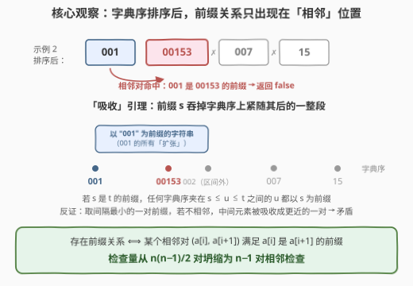
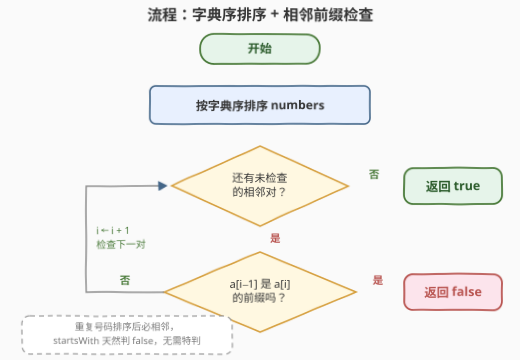
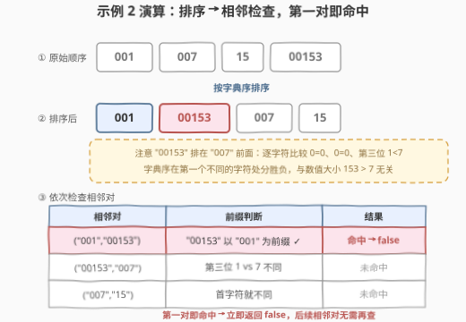

# LeetCode 电话号码前缀 题解

## 1. 题目概述

- **标题 / 题号**：电话号码前缀（#3491，easy）
- **链接**：https://leetcode.cn/problems/phone-number-prefix/
- **难度**：简单
- **标签**：字典树、数组、字符串、排序

> ⚠️ 本题为 LeetCode 付费题（Plus 会员专享），题意描述根据官方示例用例与 hints 重建，并已与社区镜像 doocs/leetcode 的官方中文翻译交叉核对（题意、示例、约束与函数签名 `phonePrefix` 均一致，出入风险较低）。

**题意**：给你一个字符串数组 `numbers` 表示电话号码。如果**没有**电话号码是任何**其他**电话号码的**前缀**，返回 `true`；否则返回 `false`。

**示例 1**：

```text
输入：numbers = ["1","2","4","3"]
输出：true
解释：没有数字是其它数字的前缀，所以输出为 true。
```

**示例 2**：

```text
输入：numbers = ["001","007","15","00153"]
输出：false
解释：字符串 "001" 是字符串 "00153" 的前缀。因此，输出是 false。
```

**约束**：

- $2 \le \text{numbers.length} \le 50$
- $1 \le \text{numbers[i].length} \le 50$
- 所有号码只包含 `'0'` 到 `'9'` 的数位

> 💡 **读题关键**：① 号码是**字符串**而非整数——前导零参与比较，`"001"` 与 `"1"` 是两个不同号码，前缀判断必须按字符逐位进行；② 这是**存在性判定**——只要出现一对前缀关系立刻 `false`，不需要计数、也不需要找出是哪一对；③ 两个**完全相同**的号码也互为前缀（`"12"` 是 `"12"` 的前缀），同样返回 `false`——这正是 `startsWith` 对相等字符串返回 `true` 的自然语义。

## 2. 解题思路

### 2.1 暴力思路：枚举所有数对

题面直译：枚举所有有序对 $(i, j)$（$i \ne j$），判断 `numbers[i]` 是否为 `numbers[j]` 的前缀，命中任意一对即返回 `false`。

共 $\binom{n}{2} = 1225$ 对（$n = 50$），每对前缀判断至多 $O(m)$（$m = 50$），总计约 $6 \times 10^4$ 次字符比较——本题规模下轻松通过。但它检查了大量**注定无关**的对：`"15"` 与 `"007"` 首字符就不同，永远构不成前缀关系。如何把「无关对」成批地排除掉？

### 2.2 核心观察：字典序排序后，前缀关系只会出现在「相邻」位置

先按**字典序**给号码排序（注意：字典序 ≠ 数值序，见 2.4）。此时有：

> **引理（吸收）**：若 $s$ 是 $t$ 的前缀，则任何满足 $s \le u \le t$（字典序）的字符串 $u$ 也以 $s$ 为前缀。

**直觉**：以 $s$ 为前缀的字符串（$s$ 的所有「扩张」）在字典序上恰好连成一段区间——从 $s$ 本身开始，到 $s$ 的直接后继为止。$s$ 把这段区间整个「吸收」了，夹在 $s$ 与 $t$ 之间的 $u$ 无处可逃，必然落进这段区间。

> **推论（相邻性）**：排序后若存在前缀对 $a_i, a_j$（$i < j$，$a_i$ 是 $a_j$ 的前缀），取**间隔最小**的一对，必有 $j = i + 1$——否则 $a_i \le a_{i+1} \le a_j$，由引理 $a_i$ 也是 $a_{i+1}$ 的前缀，$(i, i+1)$ 是更近的前缀对，与最小性矛盾。

于是得到等价转化：

$$\text{存在前缀关系} \iff \text{排序后某个相邻对 } (a_i, a_{i+1}) \text{ 满足 } a_i \text{ 是 } a_{i+1} \text{ 的前缀}$$

1225 对的检查坍缩为 **$n - 1 = 49$ 次相邻检查**。



> 💡 **直观理解**：前缀关系在字典序中是「局部」的——一个字符串的所有扩张紧挨着它排在后面。排序正是把这种局部性整理出来：远处的号码首字符大概率就不同，构不成前缀；而真正的前缀对，排序后必然贴在一起。

### 2.3 算法流程：排序 + 相邻前缀检查

1. 将 `numbers` 按**字典序**升序排序；
2. 从左到右检查每个相邻对 $(a_{i-1}, a_i)$：若 $a_i$ 以 $a_{i-1}$ 为前缀，返回 `false`；
3. 所有相邻对通过检查，返回 `true`。



> ⚠️ **实现要点**：排序必须用**字典序**（各语言字符串的默认比较就是），不能按长度、更不能按数值排序——引理依赖的是字典序的「吸收」性质。相等的重复号码排序后必然相邻，`startsWith` 返回 `true`，恰好覆盖「重复也判 `false`」的语义，无需特判。

### 2.4 示例演算：示例 2

`numbers = ["001","007","15","00153"]`，按字典序排序：

| 原始顺序 | → 字典序排序后 |
|----------|----------------|
| `"001"`, `"007"`, `"15"`, `"00153"` | `"001"`, `"00153"`, `"007"`, `"15"` |

> ⚠️ 注意 `"00153"` 排在 `"007"` **前面**：逐字符比较 `0 = 0`、`0 = 0`、第三位 `1 < 7`，即 `"00153" < "007"`——字典序在**第一个不同的字符**处见分晓，与数值大小 $153 > 7$ 无关。这也是「号码必须当字符串处理」的又一佐证。

依次检查相邻对：

| 相邻对 | 前缀判断 | 结果 |
|--------|----------|------|
| `("001", "00153")` | `"00153"` 以 `"001"` 为前缀 ✓ | **命中 → 返回 `false`** |
| `("00153", "007")` | 第三位 `1` vs `7` 不同 | 未命中 |
| `("007", "15")` | 首字符就不同 | 未命中 |

第一个相邻对即命中，返回 `false` ✓。示例 1 排序后为 `["1","2","3","4"]`，三个相邻对首字符互不相同，全部通过，返回 `true` ✓。



## 3. 参考代码

### C++

```cpp
class Solution {
  public:
    bool phonePrefix(vector<string>& numbers) {
        sort(numbers.begin(), numbers.end());            // 字典序排序
        for (int i = 1; i < (int)numbers.size(); ++i)
            if (numbers[i].starts_with(numbers[i - 1]))   // C++20
                return false;
        return true;
    }
};
```

> 💡 `starts_with` 是 C++20 起的 `basic_string` 成员；C++17 可用 `numbers[i].compare(0, numbers[i-1].size(), numbers[i-1]) == 0` 等价替换（`compare` 只在左串前缀段与参数完全相等时返回 0，天然就是前缀判断）。

### Python

```python
class Solution:
    def phonePrefix(self, numbers: List[str]) -> bool:
        numbers.sort()                                    # 字典序排序
        return all(not b.startswith(a) for a, b in zip(numbers, numbers[1:]))
```

## 4. 复杂度分析

| 维度 | 复杂度 | 说明 |
|------|--------|------|
| 时间复杂度 | $O(n \cdot m \cdot \log n)$ | 排序做 $O(n \log n)$ 次字符串比较、每次至多 $O(m)$；相邻检查 $n-1$ 对、每对 $O(m)$ |
| 空间复杂度 | $O(1)$ / $O(n)$ | 原地快排仅递归栈；Python timsort 需 $O(n)$ 辅助数组 |
| 暴力对照 | $O(n^2 \cdot m)$ | $\binom{n}{2} \approx 1225$ 对逐一判断；$n \le 50$ 也能过，相邻检查把它降到 $n - 1$ 对 |

其中 $n$ 是号码个数，$m$ 是号码最大长度。

## 5. 扩展：Trie（字典树）——放大到 $10^5$ 量级仍是 $O(n \cdot m)$

本题标签里的**字典树**指向它的经典出身——POJ 3630 / UVa 11362 的 **Phone List**：电话公司检验号码表是否「一致」（无号码是另一号码的前缀），规模 $10^4$ 号码。把所有号码依次插入 Trie，插入过程中两种情况即判死：

- 插入号码 $s$ **途中**踩到一个「单词结尾」标记——已插入的**更短**号码是 $s$ 的前缀 → `false`；
- 走到 $s$ 的**末尾**时发现该节点已有结尾标记（重复号码）或已有孩子（$s$ 是某个**更长**号码的前缀）→ `false`；
- 全部插入成功 → `true`。

### C++（Trie 版）

```cpp
struct Node {
    Node* next[10] = {};
    bool end = false;
};

class Solution {
  public:
    bool phonePrefix(vector<string>& numbers) {
        Node root;
        for (const string& s : numbers) {
            Node* cur = &root;
            for (char c : s) {
                if (cur->end) return false;        // 途中遇结尾：已有更短号码是 s 的前缀
                Node*& nxt = cur->next[c - '0'];
                if (!nxt) nxt = new Node();
                cur = nxt;
            }
            if (cur->end) return false;            // 重复号码
            for (Node* child : cur->next)
                if (child) return false;           // s 是更长号码的前缀
            cur->end = true;
        }
        return true;
    }
};
```

### Python（Trie 版，嵌套字典）

```python
class Solution:
    def phonePrefix(self, numbers: List[str]) -> bool:
        root, END = {}, '#'
        for s in numbers:
            cur = root
            for c in s:
                if END in cur:                     # 途中遇结尾：更短号码是 s 的前缀
                    return False
                cur = cur.setdefault(c, {})
            if cur:                                # 非空：重复（END）或 s 是更长号码的前缀
                return False
            cur[END] = True
        return True
```

**两种解法怎么选**：排序相邻判定 $O(nm\log n)$ 时间、$O(1)$ 额外空间，代码只有几行；Trie $O(nm)$ 时间但要付出 $O(nm)$ 的树空间。本题 $n \le 50$ 两者都是瞬杀——面试中说清「排序 + 相邻」的证明，再补一句「数据放大可换 Trie」，就是完整答案。

## 6. 面试要点

1. **为什么排序后只检查相邻对就够？**

   > 吸收引理：若 $s$ 是 $t$ 的前缀，则字典序介于 $s$ 与 $t$ 之间的任何 $u$ 都以 $s$ 为前缀（以 $s$ 为前缀的串在字典序上连成一段，$s$ 吸收了整段区间）。反证：取排序后间隔最小的前缀对 $(i, j)$，若 $j > i + 1$，则 $a_{i+1}$ 被吸收，$(i, i+1)$ 是更近的前缀对，矛盾。故前缀对必然相邻。

2. **字典序比较和数值比较有什么区别？**

   > 字典序逐字符比较，在第一个不同的字符处分出大小；数值比较先看位数再看大小。`"00153" < "007"`（第三位 `1 < 7`）但 $153 > 7$；`"2" > "15"`（首位 `2 > 1`）但 $2 < 15$。号码含前导零、且要判前缀，决定了必须用字符串语义处理。

3. **重复号码怎么处理？**

   > 两个相同字符串互为前缀，返回 `false`。排序后重复号码必然相邻，`startsWith` 对相等字符串返回 `true`，天然覆盖该语义——不需要任何特判（Trie 版里对应「落点已有结尾标记」）。

4. **排序 + 相邻检查 与 Trie 各自的适用场景？**

   > 排序版 $O(nm\log n)$ 时间、$O(1)$ 额外空间、代码极短，是一般规模的首选；Trie 版 $O(nm)$ 时间、$O(nm)$ 空间，号码数 $10^5$ 量级时更稳（还免去排序的 $O(n \log n)$ 比较因子）。两者都是把「$n^2$ 对」降为「$n$ 次线性检查」——前者靠排序整理局部性，后者靠前缀树共享路径。

5. **「排序 + 相邻前缀检查」这个套路还能用在哪？**

   > 1233. 删除子文件夹：路径按字典序排序后，子文件夹必与父文件夹相邻，逐个检查 `startsWith` 即可筛掉子目录——与本题完全同构。凡是「判断一组字符串之间是否存在前缀（包含）关系」的存在性问题，都值得先想排序相邻化。

## 同类练习题

| # | 题目 | 与本题的关联 |
|---|------|-------------|
| 1233 | [删除子文件夹](https://leetcode.cn/problems/remove-sub-folders-from-the-filesystem/)（[站内题解](../1201-1300/1233_删除子文件夹.md)） | 完全同构的「排序 + 相邻前缀判断」——路径排序后子文件夹必与父文件夹相邻 |
| 208 | [实现 Trie](https://leetcode.cn/problems/implement-trie-prefix-tree/)（[站内题解](../0201-0300/208_实现Trie.md)） | 第 5 节字典树解法的手撕基础模板 |
| 14 | [最长公共前缀](https://leetcode.cn/problems/longest-common-prefix/)（[站内题解](../0001-0100/14_最长公共前缀.md)） | 前缀的「公共」维度——纵向逐位比较多串公共前缀，对照本题「一串是否为另一串的前缀」 |
| 3042 | [统计前后缀下标对 I](https://leetcode.cn/problems/count-prefix-and-suffix-pairs-i/)（[站内题解](../3001-3100/3042_统计前后缀下标对I.md)） | 前缀关系从「存在性判定」升级为「计数」 |
| 3045 | [统计前后缀下标对 II](https://leetcode.cn/problems/count-prefix-and-suffix-pairs-ii/)（[站内题解](../3001-3100/3045_统计前后缀下标对II.md)） | 数据放大后用 Z 函数 / 哈希 $O(n)$ 判前缀——同一判定问题的工程化升级 |
