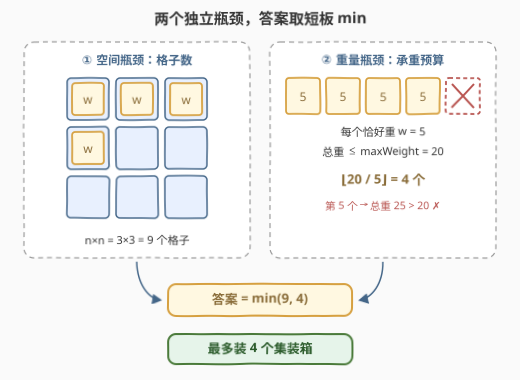
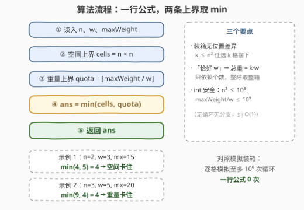

# LeetCode 船上可以装载的最大集装箱数量 题解

## 1. 题目概述

- **标题 / 题号**：船上可以装载的最大集装箱数量（#3492，easy）
- **链接**：https://leetcode.cn/problems/maximum-containers-on-a-ship/
- **难度**：简单
- **标签**：数学

**题意**：给你一个正整数 `n`，表示船上的一个 $n \times n$ 的货物甲板。甲板上的**每个单元格**可以装载一个重量**恰好**为 `w` 的集装箱。

然而，如果将所有集装箱装载到甲板上，其总重量不能超过船的最大承载重量 `maxWeight`。

请返回可以装载到船上的**最大**集装箱数量。

**示例 1**：

```text
输入：n = 2, w = 3, maxWeight = 15
输出：4
解释：甲板有 4 个单元格，每个集装箱的重量为 3。将所有集装箱装载后，
      总重量为 12，未超过 maxWeight。
```

**示例 2**：

```text
输入：n = 3, w = 5, maxWeight = 20
输出：4
解释：甲板有 9 个单元格，每个集装箱的重量为 5。可以装载的最大集装箱
      数量为 4，此时总重量不超过 maxWeight。
```

**约束**：

- `1 <= n <= 1000`
- `1 <= w <= 1000`
- `1 <= maxWeight <= 10^9`

> 💡 **读题关键**：三个量撑起整道题——格子数 $n^2$、单箱重 $w$、总重上限 $\text{maxWeight}$。「每个单元格至多一个」「每个箱子**恰好**重 $w$」说明集装箱**完全同质**：装几个、装在哪个格子，彼此互不影响。这正是答案能写成一个公式的根源。

## 2. 解题思路

### 2.1 暴力思路：逐格模拟装箱

最直白的做法：从左上角逐格装，每装一个箱子，已用格子数 +1、累计重量 +$w$；一旦「格子装满」或「再装一个就超重」就停下：

```text
count = 0, total = 0
while count < n*n and total + w <= maxWeight:
    count += 1
    total += w
return count
```

正确性没问题，循环次数为 $\min(n^2, \lfloor \text{maxWeight}/w \rfloor) \le 10^6$，提交也能过。但每一轮循环做的都是**一模一样的判断**——第 $k$ 个箱子能不能装，与前面 $k-1$ 个装在哪、怎么装毫无关系，只取决于 $k$ 本身。逐个模拟是对「同质性」的浪费。

中间档是**二分答案**：装 $k$ 个可行 $\Leftrightarrow k \le n^2$ 且 $k \cdot w \le \text{maxWeight}$，可行性关于 $k$ 单调，二分 $O(\log)$ 出最大可行 $k$。但判定条件本身就是线性的，何必二分——直接解不等式即可。

### 2.2 核心观察：两条独立上界，直接取 min



把「装 $k$ 个集装箱可行」翻译成数学语言：

$$\text{feasible}(k) \iff k \le n^2 \;\;\text{且}\;\; k \cdot w \le \text{maxWeight}$$

- **必要性**：格子只有 $n^2$ 个、每格至多一个 → $k \le n^2$；每箱恰重 $w$，装 $k$ 个总重恰为 $kw$ → $kw \le \text{maxWeight}$。
- **充分性**：任选 $k \le n^2$ 个格子摆下即可——集装箱无位置差异，装载方案永远存在。

可行 $k$ 恰好是区间 $\left[0,\ \min\left(n^2, \lfloor \text{maxWeight}/w \rfloor\right)\right]$ 内的全部整数，取右端点即最大值：

$$\text{ans} = \min\left(n^2,\ \left\lfloor \frac{\text{maxWeight}}{w} \right\rfloor\right)$$

这是**木桶效应**的数学形态：空间与重量是两条**互不耦合**的约束，各自给出一个线性上界，同时满足即取 min。示例 1 是空间先卡住（$4 < 5$），示例 2 是重量先卡住（$4 < 9$）——谁短谁说了算。

> ⚠️ 「**恰好**为 $w$」是公式的护城河：总重 $= kw$ **只依赖个数**，与摆放位置、与选哪些格子都无关。若箱重可选轻重，重量侧就不再是整除，得换贪心（轻者先装，见第 7 节的 1710 / 1833）；若格子承重不一，空间侧也不是 $n^2$ 了。

> 💡 整除必须**向下取整**：$\lfloor \text{maxWeight}/w \rfloor$ 是「预算内买得起的整箱数」。$\text{maxWeight}=20, w=5$ 恰好整除得 4；若 $\text{maxWeight}=22$，仍然只能装 4——剩下的 2 买不起一整箱，只能闲置。

### 2.3 算法流程图



流程共五步：读入 → 算空间上界 → 算重量上界 → 取 min → 返回。没有循环、没有分支、没有搜索——**一行公式就是全部**。

### 2.4 示例演算

| 场景 | 空间上界 $n^2$ | 重量上界 $\lfloor \text{maxWeight}/w \rfloor$ | 答案 = min | 卡在哪 |
|------|----------------|----------------------------------------------|------------|--------|
| 示例 1：$n=2, w=3, \text{mx}=15$ | $4$ | $5$ | **4** | 空间（4 格全装，总重 12 ≤ 15） |
| 示例 2：$n=3, w=5, \text{mx}=20$ | $9$ | $4$ | **4** | 重量（装 4 个总重 20，预算用满） |
| 边界：$n=1000, w=1000, \text{mx}=1$ | $10^6$ | $0$ | **0** | 重量（一整箱都买不起） |

> 💡 两个示例恰好一人卡一个瓶颈：这就是「短板决定」的完整展示。边界行说明答案可以为 0——预算连一个整箱都不够时，$\lfloor 1/1000 \rfloor = 0$。

## 3. 参考代码

### C++

```cpp
class Solution {
  public:
    int maxContainers(int n, int w, int maxWeight) {
        return min(n * n, maxWeight / w);
    }
};
```

### Python

```python
class Solution:
    def maxContainers(self, n: int, w: int, maxWeight: int) -> int:
        return min(n * n, maxWeight // w)
```

> 💡 C++ 的 `/` 作用在两个非负整数上即整除，与 Python 的 `//` 语义一致；本题三个参数均为正，不存在「向零取整」的方向歧义。

## 4. 复杂度分析

| 维度 | 复杂度 | 说明 |
|------|--------|------|
| 时间复杂度 | $O(1)$ | 一次乘法 + 一次整除 + 一次 min；对照模拟版为 $O\!\left(\min(n^2, \lfloor \text{maxWeight}/w \rfloor)\right) \le 10^6$ |
| 空间复杂度 | $O(1)$ | 无任何辅助数据结构 |

> ⚠️ **数值范围核对（防溢出）**：$n \le 1000 \Rightarrow n^2 \le 10^6$；$\text{maxWeight} \le 10^9$ 且 $w \ge 1 \Rightarrow \text{maxWeight}/w \le 10^9$。两者都在 32 位 `int`（上限约 $2.1 \times 10^9$）之内，min 的结果更小，全程无溢出风险。

## 5. 扩展：min 公式何时失效

公式 $\min(n^2, \lfloor \text{maxWeight}/w \rfloor)$ 成立依赖三根支柱，抽掉任何一根都要换武器：

- **同质箱**（每箱恰重 $w$）：抽掉 → 箱重不同，改为**轻者先装**的贪心（1710 / 1833 / 2279 都在这一族，排序后逐个装到装不下为止）；
- **无位置差异**：抽掉 → 某些格子装不了或承重不同，变成**带约束的分派问题**（多重背包 / 匹配的味道）；
- **约束解耦**：抽掉 → 空间与重量相互影响（如装载顺序影响限载），需要**二分答案 + 贪心判定**（875 / 1870 一族）。

本题是该家族的「零阶版本」：把退化情形的公式写对，是所有后续变形的地基。

## 6. 面试要点

1. **为什么答案直接取 min，完全不用考虑摆放位置？**

   > 装箱可行性只由数量 $k$ 决定：$k \le n^2$ 保证有格子放（集装箱无位置差异，任选 $k$ 格即可）；$k \cdot w \le \text{maxWeight}$ 保证不超载（每箱恰重 $w$，总重 $= kw$ 只依赖个数）。两个条件独立且各自线性，可行域是 $\left[0, \min(n^2, \lfloor \text{maxWeight}/w \rfloor)\right]$ 内的整数，取右端点即最大值。

2. **⌊maxWeight/w⌋ 为什么向下取整？预算 22、箱重 5 能装几个？**

   > 4 个。装 5 个总重 25 超预算，剩余预算 2 买不起整箱——「恰好为 $w$」排除了装半箱的可能。整除向下取整正是「预算内整箱数」的定义，C++ `/` 与 Python `//` 在正数上行为一致。

3. **一行代码会有溢出问题吗？**

   > 不会。$n^2 \le 10^6$、$\text{maxWeight}/w \le 10^9$，均远小于 $2^{31}-1 \approx 2.1 \times 10^9$。但若约束放宽（如 $n \le 10^5$ 或 $\text{maxWeight} \le 10^{18}$），`n * n` 与中间乘法须换 `long long`——面试时主动报出各值的上界是加分项。

4. **如果每个集装箱重量不同，怎么改？**

   > min 公式失效：总重不再只依赖个数。转贪心——按重量升序排序，逐个装入直到下一个装不下（1833 雪糕的最大数量是同构题；1710 按「单元数降序」是其镜像）。若再加「每个格子只能装特定种类」等约束，退到背包 DP。

5. **这题和二分答案有什么关系？**

   > 可行性 $\text{feasible}(k) = (k \le n^2 \text{ 且 } kw \le \text{maxWeight})$ 关于 $k$ 单调，天然可二分——但它是线性的，直接解不等式得到解析解，二分属于杀鸡用牛刀。能识别「单调判定 ⇔ 可直接解出」的分界，是刷二分答案题（875 / 1870）反向训练出的能力。

> 💡 **一句话总结**：3492 = $\min(n^2, \lfloor \text{maxWeight}/w \rfloor)$——两条解耦约束各给一个线性上界，短板即答案；「每个箱子恰好重 $w$」是整个公式成立的题眼。

## 同类练习题

| # | 题目 | 与本题的关联 |
|---|------|-------------|
| 1710 | [卡车上的最大单元数](https://leetcode.cn/problems/maximum-units-on-a-truck/)（[题解](../1701-1800/1710_卡车上的最大单元数.md)） | 箱子单元数不同 → 按单元数降序贪心，本题 min 公式在「异质箱」下的直接升级版 |
| 1833 | [雪糕的最大数量](https://leetcode.cn/problems/maximum-ice-cream-bars/)（[题解](../1801-1900/1833_雪糕的最大数量.md)） | 预算内买最多雪糕，价格不同 → 排序贪心；本题是其「所有价格相同」的退化特例 |
| 2279 | [装满石头的背包的最大数量](https://leetcode.cn/problems/maximum-bags-with-full-capacity-of-rocks/)（[题解](../2201-2300/2279_装满石头的背包的最大数量.md)） | 额外石头预算下装满最多背包，按差额升序贪心——预算分配家族的另一形态 |
| 2600 | [K 件物品的最大和](https://leetcode.cn/problems/k-items-with-the-maximum-sum/)（[题解](../2501-2600/2600_K件物品的最大和.md)） | 三类限量物品取 K 件最大化总和，逐段 $\min(\text{各类剩余}, K)$ 分配——同样是「上界取小」的计数直觉 |
