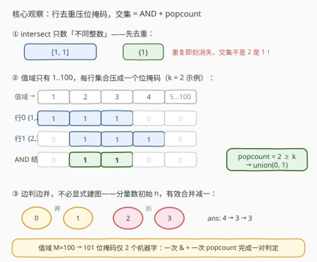
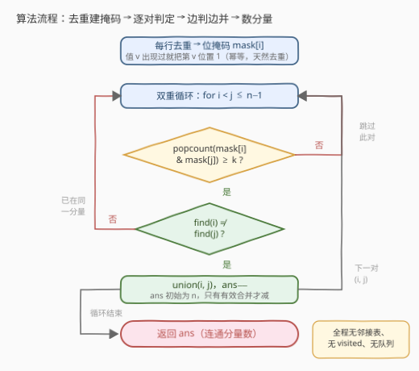

# LeetCode 属性图 题解

## 1. 题目概述

- **标题 / 题号**：属性图（#3493，medium）
- **链接**：https://leetcode.cn/problems/properties-graph/
- **难度**：中等
- **标签**：并查集、图、位运算、哈希表、数组

**题意**：给你一个二维整数数组 `properties`（维度 $n \times m$）和一个整数 $k$。

定义 $\text{intersect}(a, b)$ 为数组 $a$ 与 $b$ 中**共有的不同整数**的数量。构造一张无向图：节点 $i$ 对应 `properties[i]`，**当且仅当** $\text{intersect}(\text{properties}[i], \text{properties}[j]) \ge k$（$i \ne j$）时，节点 $i$ 与 $j$ 之间有边。返回图中**连通分量的数量**。

**示例 1**：

```text
输入：properties = [[1,2],[1,1],[3,4],[4,5],[5,6],[7,7]], k = 1
输出：3
解释：生成的图有 3 个连通分量：{0,1}、{2,3,4}、{5}。
```

**示例 2**：

```text
输入：properties = [[1,2,3],[2,3,4],[4,3,5]], k = 2
输出：1
解释：任意相邻两行都恰好共享 {2,3} 或 {3,4} 两个不同值，整张图连通。
```

**示例 3**：

```text
输入：properties = [[1,1],[1,1]], k = 2
输出：2
解释：intersect([1,1],[1,1]) = 1（不同整数只有 1 这一个），小于 k=2，无边。
```

**约束**：

- $1 \le n = \text{properties.length} \le 100$
- $1 \le m = \text{properties}[i].\text{length} \le 100$
- $1 \le \text{properties}[i][j] \le 100$
- $1 \le k \le m$

> 💡 **读题关键**：① intersect 数的是**不同整数**的个数——`[1,1]` 与 `[1,1]` 的交集是 **1** 而不是 2，行内重复不影响结果，这是全题最大的陷阱；② 图是**隐式**给出的：边不在输入里，要自己按「交集大小 ≥ k」逐对判定；③ 求的是**连通分量个数**，不关心分量内部结构——这是并查集的经典信号。

## 2. 解题思路

### 2.1 暴力思路：显式建图 + DFS/BFS

最直接的做法分两步：

1. **建图**：双重循环枚举所有下标对 $(i, j)$（$i < j$），求两行的共同值集合，大小 $\ge k$ 就往邻接表里加一条无向边；
2. **数分量**：对每个未访问节点出发做一次 DFS/BFS，启动次数即连通分量数。

求两行交集本身若再写双重循环逐元素比对（还要用一个 `used` 集合保证「不同整数」不重复计数），是 $O(m^2)$ 一对；即便先建哈希集合再求交集，一对也是 $O(m)$。总计 $O(n^2 \cdot m)$ 建图 + $O(n^2)$ 遍历，在 $n, m \le 100$ 的规模下约 $10^6$ 次操作，能够通过。

但这份「能过」的代码有三个可收敛的冗余：交集判定的常数（哈希集合逐元素探查）、显式邻接表的存储、以及「先建完图再遍历」的两阶段结构。

### 2.2 核心观察：去重位掩码 + 并查集



三个观察把暴力版逐层收紧：

**观察一：先去重，重复即刻消失。** intersect 只数**不同**整数，行内出现多少次都无关——把每行压成一个**集合**，$[1,1]$ 与 $[1,1]$ 的交集立刻退化为 $\{1\}$。示例 3 的陷阱在建模层面就被拆掉，不需要任何「去重计数」逻辑。

**观察二：值域只有 1..100，集合可以压成一个整数。** 每行去重后的集合 $\{v_1, v_2, \dots\}$ 编码为第 $v$ 位为 1 的**位掩码**（Python 用大整数、C++ 用 `bitset<101>`）。于是两行的交集大小变成一条表达式：

$$\text{intersect}(i, j) = \text{popcount}(\text{mask}_i \,\&\, \text{mask}_j)$$

一次按位与 + 一次计 1 个数，101 位仅两个机器字，比哈希集合求交集快一个量级还省内存。

**观察三：不必显式建图。** 边在「逐对判定」中产生，而连通分量只关心「谁和谁连着」——这正是**并查集**（DSU）的形状：判定 $(i,j)$ 有边时顺手 `union(i, j)`，全部判定完，数一数不同的根即为答案。甚至不用真的数：分量数初始为 $n$，每次**有效合并**（两根不同）减一，循环结束返回即可。

> 💡 「隐式图 + 逐对判边 + 只问分量数」是并查集的黄金场景：邻接表、visited 数组、队列全部消失，代码只剩「判一次、并一次」。

### 2.3 算法流程图



流程是一条**单循环主线**：每行去重建掩码 → 双重循环 $i < j$ → popcount 判定 → 达标则合并（有效合并才 `ans--`）→ 结束返回 `ans`。没有图遍历阶段、没有回溯，判定与合并在同一趟里完成。

### 2.4 示例演算

以示例 1（`k = 1`）为例，各行去重后的掩码与两两交集大小：

| 行 | 去重集合 | 与右侧各行的交集大小 |
|----|----------|----------------------|
| 0 | {1,2} | (0,1)=**1** ✓ · (0,2)=0 · (0,3)=0 · (0,4)=0 · (0,5)=0 |
| 1 | {1} | (1,2)=0 · (1,3)=0 · (1,4)=0 · (1,5)=0 |
| 2 | {3,4} | (2,3)=**1** ✓ · (2,4)=0 · (2,5)=0 |
| 3 | {4,5} | (3,4)=**1** ✓ · (3,5)=0 |
| 4 | {5,6} | (4,5)=0 |
| 5 | {7} | — |

判定产生 3 条边：$(0,1)$、$(2,3)$、$(3,4)$，依次合并后 `ans` 从 6 减到 3，对应分量 $\{0,1\}$、$\{2,3,4\}$、$\{5\}$——与期望输出一致。注意 `(1,2)`：行 1 的 $\{1\}$ 与行 2 的 $\{3,4\}$ 无共同值，即使 $k=1$ 也无边，说明「$k$ 小」并不等于「图稠密」。

再验证示例 2（`k = 2`）：$(0,1)$ 交集 $\{2,3\}$、$(1,2)$ 交集 $\{3,4\}$，大小均为 2 达标，两次有效合并后 `ans = 3 - 2 = 1` ✓。

## 3. 参考代码

### C++（位掩码 + 并查集）

```cpp
class Solution {
  public:
    vector<int> fa;

    int find(int x) { return fa[x] == x ? x : fa[x] = find(fa[x]); }

    int numberOfComponents(vector<vector<int>>& properties, int k) {
        int n = properties.size();
        fa.resize(n);
        iota(fa.begin(), fa.end(), 0);   // 初始 n 个分量

        // 每行去重压成位掩码：值 v 出现过就把第 v 位置 1
        vector<bitset<101>> mask(n);
        for (int i = 0; i < n; ++i)
            for (int v : properties[i]) mask[i][v] = 1;

        int ans = n;                      // 每次有效合并减一
        for (int i = 0; i < n; ++i)
            for (int j = i + 1; j < n; ++j)
                if ((mask[i] & mask[j]).count() >= k
                        && find(i) != find(j)) {
                    fa[find(i)] = find(j);
                    --ans;
                }
        return ans;
    }
};
```

> 💡 **写法要点**：
> - `bitset<101>` 恰好覆盖值域 1..100（下标 0 弃用），`&` 与 `.count()` 各为常数时间的字级操作；
> - 掩码的**重复置位天然幂等**——`mask[i][v] = 1` 写多少次都是一个 bit，「行内去重」根本不用单独写；
> - `find(i) != find(j)` 的短路放在 `&&` 后半段：交集不达标时连根都不查，省下大量路径压缩开销。

### Python（大整数位掩码 + 并查集）

```python
class Solution:
    def numberOfComponents(self, properties: List[List[int]], k: int) -> int:
        n = len(properties)
        fa = list(range(n))

        def find(x: int) -> int:
            while fa[x] != x:
                fa[x] = fa[fa[x]]        # 路径减半
                x = fa[x]
            return x

        masks = []
        for row in properties:
            m = 0
            for v in set(row):           # 去重后逐位置 1
                m |= 1 << v
            masks.append(m)

        ans = n
        for i in range(n):
            for j in range(i + 1, n):
                if (masks[i] & masks[j]).bit_count() >= k:
                    ri, rj = find(i), find(j)
                    if ri != rj:
                        fa[ri] = rj
                        ans -= 1
        return ans
```

> 💡 Python 的 `int` 即任意精度位串：`1 << v` 置位、`&` 求交、`bit_count()`（3.10+，旧版本可用 `bin(x).count('1')`）数 1。若不想碰位运算，`len(set(a) & set(b))` 一行同样能过——这正是官方 hint 给出的写法，位掩码只是它的常数优化。

## 4. 复杂度分析

| 维度 | 复杂度 | 说明 |
|------|--------|------|
| 时间复杂度 | $O\!\left(n \cdot m + n^2 \cdot \left\lceil M/64 \right\rceil\right)$ | 建掩码 $O(n \cdot m)$；$n^2/2$ 个下标对，每对一次按位与 + popcount，$M = 100$ 时仅 2 个机器字；DSU 带路径压缩近似 $O(1)$ |
| 空间复杂度 | $O(n \cdot \lceil M/64 \rceil + n)$ | $n$ 个 101 位掩码 + 并查集父指针数组 |

> ⚠️ 对照暴力版：哈希集合求交集是 $O(n^2 \cdot m) \approx 10^6$ 次哈希探查，位掩码版约 $5 \times 10^3$ 对 $\times$ 常数字操作，快约两个数量级。两者在本题规模下都能通过——**位掩码的价值在常数与内存，不在渐进**；面试中先讲对正确性（去重！），再谈这个优化。

## 5. 扩展：$k = 1$ 时的按值分组优化

当 $k = 1$ 时，「共享至少一个值」有一个免两两判定的刻画：**按值反查行**。对每个值 $v \in [1, 100]$，收集含有 $v$ 的行下标列表 $L_v$——$L_v$ 内任意两行至少共享 $v$，必然同分量，把 $L_v$ **链式合并**（相邻两两 union）即可：

```python
pos = [[] for _ in range(101)]
for i, row in enumerate(properties):
    for v in set(row):
        pos[v].append(i)
for lst in pos:                    # k = 1 时
    for a, b in zip(lst, lst[1:]):
        union(a, b)
```

复杂度 $O(n \cdot m)$，与 $n^2$ 无关——$n$ 放大到 $10^5$ 依旧轻松。但注意它**不能推广到 $k \ge 2$**：行 $i$ 与 $j$ 分别和同一行共享两个不同的值，不等于它们彼此共享任何值（例如 $\{1,2\}$、$\{1,3\}$、$\{2,3\}$ 与中间行共享数各为 1）。$k \ge 2$ 时两两判定（或对每个 $v$ 的 $L_v$ 内所有行对计数共享值数）仍是主流做法。这一对照恰好说明：**特殊阈值可能改变问题的组合结构**，套用前先验证等价性。

## 6. 面试要点

1. **`[1,1]` 与 `[1,1]` 的 intersect 是多少？为什么这是本题最大的坑？**

   > 是 **1**——intersect 统计**不同**整数的个数，与出现次数无关。若按多重集比对或直接数相等元素对，示例 3 会算出 2 而错答 1。正确建模是先把每行**去重成集合**（或位掩码的幂等置位），重复即刻消失。

2. **为什么选并查集而不是建邻接表 + DFS/BFS？**

   > 图是隐式的，边在逐对判定中才产生；题目只要**分量个数**，不要分量内部结构。DSU「判一次并一次」把建图与遍历合并成单趟，省掉邻接表与 visited，代码量和内存同时下降。若后续要频繁回答「任意两点是否连通」的在线查询，DSU 更是唯一顺手的选择。

3. **位掩码优化依赖什么前提？值域变大怎么办？**

   > 依赖值域 $M$ 小（本题 $M = 100$，101 位仅两个机器字）。值域到 $10^9$ 时退回**哈希集合求交集** $O(n^2 \cdot m)$，或两行各自**排序后双指针**归并求交集 $O(n^2 \cdot m \log m)$ 免哈希——渐近不变，常数与可移植性各有取舍。

4. **分量数是怎么在循环里维护出来的？**

   > 初始 `ans = n`（每行自成一个分量）；每次 union 前检查 `find(i) != find(j)`，**只有真正合并了两个不同根**才 `--ans`。循环结束 `ans` 恰为分量数——避免最后再遍历一遍数根，也避免同根重复 union 把答案多减。

5. **双重循环 $i < j$ 而不是全对枚举，除了减半还有什么意义？**

   > 无向图的边是对称的，$(i,j)$ 与 $(j,i)$ 是同一条边，全对枚举除了翻倍还会触发同一条边的**重复合并**——虽然第 4 点的异根检查能挡住错误计数，但 $i < j$ 从源头消除冗余判定，是更干净的写法。

> 💡 **一句话总结**：3493 = 行去重压位掩码 + 两两 popcount 判边 + 并查集边判边并数分量；正确性的灵魂在「不同整数」，优化的灵魂在「值域只有 100」。

## 同类练习题

| # | 题目 | 与本题的关联 |
|---|------|-------------|
| 547 | [省份数量](https://leetcode.cn/problems/number-of-provinces/)（[题解](../0501-0600/547_省份数量.md)） | 连通分量计数的纯图模板题，本题去掉「隐式建边」后的形态 |
| 721 | [账户合并](https://leetcode.cn/problems/accounts-merge/)（[题解](../0701-0800/721_账户合并.md)） | 同样是「行与行共享元素则合并」的并查集 + 哈希，还需组内收集排序，本题的工程化近亲 |
| 1971 | [寻找图中是否存在路径](https://leetcode.cn/problems/find-if-path-exists-in-graph/)（[题解](../1901-2000/1971_寻找图中是否存在路径.md)） | 连通性判定单查询，DSU 与 BFS 两种写法的直接对照 |
| 1319 | [连通网络的操作次数](https://leetcode.cn/problems/number-of-operations-to-make-network-connected/) | 分量数 − 1 = 还需的额外边数，连通分量计数的经典应用 |
| 1202 | [交换字符串中的元素](https://leetcode.cn/problems/smallest-string-with-swaps/) | 按可交换关系并查集分组、组内重排，「隐式关系 → 分组」套路的另一形态 |
