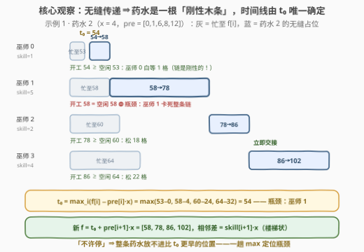
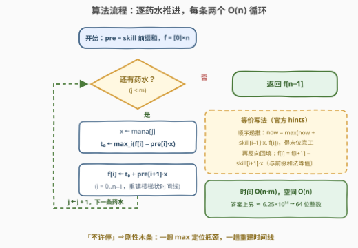

# LeetCode 酿造药水需要的最少总时间 题解

## 1. 题目概述

- **标题 / 题号**：酿造药水需要的最少总时间（#3494，medium）
- **链接**：https://leetcode.cn/problems/find-the-minimum-amount-of-time-to-brew-potions/
- **难度**：中等
- **标签**：数组、前缀和、模拟

**题意**：$n$ 个巫师排成一条**顺序固定**的流水线，必须按 $0, 1, \dots, m-1$ 的顺序酿造 $m$ 个药水。第 $i$ 个巫师处理第 $j$ 个药水耗时

$$\text{time}(i, j) = \text{skill}[i] \times \text{mana}[j]$$

每个药水必须**依次流过所有巫师**，且规则非常苛刻：**当前巫师一完成，药水必须立即交给下一个巫师开工**——中途不允许任何停留等待。求酿造完全部药水所需的最短总时间（即最后一条药水离开最后一位巫师的时刻）。

**示例 1**：

```text
输入：skill = [1,5,2,4], mana = [5,1,4,2]
输出：110
解释：
  药水 0：t = 0   开工 → 各巫师完成于 5, 30, 40, 60
  药水 1：t = 52  开工 → 53, 58, 60, 64
  药水 2：t = 54  开工 → 58, 78, 86, 102
  药水 3：t = 86  开工 → 88, 98, 102, 110
```

**示例 2**：

```text
输入：skill = [1,1,1], mana = [1,1,1]
输出：5
解释：三条药水的准备分别从 t = 0, 1, 2 开始，于 t = 3, 4, 5 完成。
```

**约束**：

- $1 \le n, m \le 5000$
- $1 \le \text{skill}[i], \text{mana}[j] \le 5000$

> ⚠️ 温和的数据范围藏着两个坑：① $n \times m$ 可达 $2.5 \times 10^7$，算法必须控制在 $O(nm)$ 且常数不能大；② 总时间上界约为 $\left(\sum \text{skill}\right) \times \left(\sum \text{mana}\right) \le 6.25 \times 10^{14}$，超出 32 位整数——连中间量 $\text{pre}[i] \times x$ 本身就有 $1.25 \times 10^{11}$，C++ 必须全程 `long long`。

## 2. 解题思路

### 2.1 朴素思路：一个会悄悄出错的经典 DP

看到「流水线 + 逐个加工」，最容易想到经典流水线 DP：设 $g[i][j]$ 为巫师 $i$ 完成药水 $j$ 的最早时刻，

$$g[i][j] = \max\big(g[i-1][j],\ g[i][j-1]\big) + \text{skill}[i] \times \text{mana}[j]$$

即「上一位传来的时刻」与「本巫师腾出手的时刻」取较大者。用它跑示例 2、3 能蒙对（5、21），但跑示例 1 会得到 **88 ≠ 110**——错在哪？

这个 DP 隐含允许**药水在巫师之间排队等待**：$g[0][1] = 6$ 意味着药水 1 在 $t=6$ 就离开巫师 0，哪怕巫师 3 要到 $t=60$ 才腾出手。而题意是「不许停」：药水 1 是一整条刚性链，它必须在巫师 3 空闲的那一刻恰好到达巫师 3，于是整条链被迫推迟到 $t=52$ 才能从巫师 0 开工。**下游瓶颈会沿着无缝链条回溯，推迟所有人的开工**——这正是经典 DP 漏掉的自由度，也是本题全部的难点所在。

### 2.2 核心观察：无缝传递 ⇒ 一条药水的整条时间线由开工时刻唯一确定



设 $\text{pre}[i] = \text{skill}[0] + \cdots + \text{skill}[i-1]$（$\text{pre}[0] = 0$，即 `skill` 的前缀和——本题标签的由来）。因为全程不许停，药水 $j$（法力值 $x$）一旦在时刻 $t_0$ 于巫师 $0$ 开工，它在每位巫师处的开工/完成时刻就被**完全钉死**：

- 到达巫师 $i$ 并开工的时刻：$s_i = t_0 + \text{pre}[i] \cdot x$；
- 离开巫师 $i$ 的时刻：$t_0 + \text{pre}[i+1] \cdot x$。

整条药水像**一根不可弯曲的刚性木条**，唯一能选的只是把它放在时间轴的哪个位置。设 $f[i]$ 为巫师 $i$ 酿完前 $j$ 条药水的时刻（初始全 $0$），可行性只要求「药水到达时巫师恰好腾出了手」：$s_i \ge f[i]$，即 $t_0 \ge f[i] - \text{pre}[i] \cdot x$。于是最早开工时刻与各巫师新空闲时刻都是**一趟 max** 的事：

$$t_0 = \max_{0 \le i < n}\big(f[i] - \text{pre}[i] \cdot x\big) \qquad f_{\text{new}}[i] = t_0 + \text{pre}[i+1] \cdot x$$

取到最大值的巫师 $k^*$ 就是**瓶颈**：药水恰好卡着它腾手的瞬间到达，其他巫师一律带着空隙干等（见上图：药水 2 被巫师 1 卡死，巫师 0 明明 53 就空闲却必须等到 54）。以示例 1 的药水 2 验证（$x=4$，$f=[53,58,60,64]$，$\text{pre}=[0,1,6,8,12]$）：

$$t_0 = \max(53-0,\ 58-4,\ 60-24,\ 64-32) = \max(53, 54, 36, 32) = 54$$

瓶颈是巫师 1（$58 - 1 \times 4 = 54$），各巫师完成于 $58, 78, 86, 102$——与题面时间表逐格吻合。

> 💡 **$f$ 的不变式**：每轮更新后 $f$ 呈「楼梯」状，$f[i+1] - f[i] = \text{skill}[i+1] \cdot x$——正是上一条药水的无缝完成时间线。官方 hints 的写法（顺序递推 $\text{now} = \max(\text{now} + \text{skill}[i-1] \cdot x,\ f[i])$ 求出末位完工，再反向回填 $f[i] = f[i+1] - \text{skill}[i+1] \cdot x$）与上式逐药水等值：两者展开后都等于 $\max_k\big(f[k] + (\text{pre}[n] - \text{pre}[k]) \cdot x\big)$。⚠️ 注意它与 2.1 的经典 DP 只差「空闲时刻取无缝楼梯 $f$，而非允许等待的 $g$」一步之遥，极易写混。

### 2.3 算法流程图



**执行步骤**：

| 步骤 | 动作 | 说明 |
|------|------|------|
| ① | 预处理 $\text{pre}[0..n]$ | `skill` 前缀和，$\text{pre}[0] = 0$ |
| ② | 取下一条药水 $x = \text{mana}[j]$ | $j$ 从 $0$ 到 $m-1$，顺序固定无需排序 |
| ③ | $t_0 \leftarrow \max_i(f[i] - \text{pre}[i] \cdot x)$ | 初值取 $0$（时间非负），一趟定位瓶颈与最早开工 |
| ④ | $f[i] \leftarrow t_0 + \text{pre}[i+1] \cdot x$ | 一趟重建无缝时间线（恢复楼梯状） |
| ⑤ | 若还有药水回到 ② | 否则输出 $f[n-1]$ |

### 2.4 示例演算

示例 1（$n=4$，$\text{pre}=[0,1,6,8,12]$）全程演算：

| 药水 $j$ | $x$ | 逐项 $f[i] - \text{pre}[i] \cdot x$ | $t_0$ | 新 $f = [\,t_0{+}x,\ t_0{+}6x,\ t_0{+}8x,\ t_0{+}12x\,]$ |
|---|---|---|---|---|
| 0 | 5 | $(0, -5, -30, -40)$ → $0$ | 0 | $[5, 30, 40, 60]$ |
| 1 | 1 | $(5, 29, 34, 52)$ → $52$ | 52 | $[53, 58, 60, 64]$ |
| 2 | 4 | $(53, 54, 36, 32)$ → $54$ | 54 | $[58, 78, 86, 102]$ |
| 3 | 2 | $(58, 76, 74, 86)$ → $86$ | 86 | $[88, 98, 102, 110]$ |

答案 $f[3] = 110$，与示例一致；每行新 $f$ 也与题面给出的时间表逐格对得上。注意四条药水的瓶颈分别在巫师 0（无约束）、3、1、3——**瓶颈的位置随 $f$ 与 $x$ 的相对大小漂移**，每条药水都必须重新取一趟 max，无法一劳永逸。

## 3. 参考代码

### C++

```cpp
class Solution {
  public:
    long long minTime(vector<int>& skill, vector<int>& mana) {
        int n = skill.size(), m = mana.size();
        vector<long long> pre(n + 1, 0);
        for (int i = 0; i < n; i++) {
            pre[i + 1] = pre[i] + skill[i];
        }
        vector<long long> f(n, 0);              // 巫师 i 酿完目前为止最后一条药水的时刻
        for (int x : mana) {
            long long t0 = 0;                   // 最早开工时刻（时间非负）
            for (int i = 0; i < n; i++) {
                t0 = max(t0, f[i] - pre[i] * x);
            }
            for (int i = 0; i < n; i++) {
                f[i] = t0 + pre[i + 1] * x;     // 重建无缝时间线（楼梯状）
            }
        }
        return f[n - 1];
    }
};
```

> 💡 溢出红线：`pre[i] * x` 最大 $2.5\times10^7 \times 5\times10^3 = 1.25\times10^{11}$，`f` 最大约 $6.25\times10^{14}$，`int` 必爆——`pre`、`f`、`t0` 全程 `long long`。

### Python

```python
import numpy as np

class Solution:
    def minTime(self, skill: List[int], mana: List[int]) -> int:
        n = len(skill)
        pre = np.zeros(n + 1, dtype=np.int64)
        pre[1:] = np.cumsum(skill)
        f = np.zeros(n, dtype=np.int64)            # 巫师 i 的空闲时刻
        for x in mana:
            t0 = int(np.max(f - pre[:n] * x))      # 一趟 max 定位瓶颈
            f = t0 + pre[1:] * x                   # 一趟重建无缝时间线
        return int(f[-1])
```

> 💡 Python 版说明：$n = m = 5000$ 时纯 Python 双层循环约 $5\times10^7$ 次迭代，实测约 4 s，在时限边缘试探；把每条药水的「一趟 max + 一趟重建」整体交给 numpy 向量化后只剩 $m$ 次数组运算，实测毫秒级。注意显式 `dtype=np.int64`——默认 int32 装不下 $6.25\times10^{14}$。

## 4. 复杂度分析

| 维度 | 复杂度 | 说明 |
|------|--------|------|
| **时间复杂度** | $O(nm)$ | 每条药水两趟 $O(n)$：一趟取 max 求 $t_0$，一趟更新 $f$；$n = m = 5000$ 时约 $5\times10^7$ 次基本运算 |
| **空间复杂度** | $O(n)$ | `pre` 与 `f` 均为 $O(n)$（numpy 版同为 $O(n)$ 向量化缓冲） |

## 5. 扩展：三种「等待政策」下的流水线

1. **允许无限排队（2.1 的经典 DP）**：示例 1 会算出 $88 < 110$——「不许停」的代价是真实存在的。等待让上游巫师提前完工（巫师 0 在 $t=6$ 而非 $53$ 就做完药水 1），后续药水得以更早开工。经典 DP 求的是这个更松的问题，与本题答案一般不相等。
2. **官方 hints 的顺序递推写法**：无需 `pre` 数组——从 $\text{now} = f[0]$ 出发顺序取 $\max$ 得到末位完工时刻，再反向回填 $f[i] = f[i+1] - \text{skill}[i+1] \cdot x$。它与前缀和写法逐药水等值（见 2.2 的展开式），本质是「先算刚性木条的右端点，再从右端点反推每个切割点」。
3. **顺序可选的 no-wait 流水线**：若药水酿造顺序可自选，一般 no-wait flow shop 的 makespan 最小化是 NP-hard 问题；本题顺序被题目定死、且加工时间可分解为 $\text{skill}[i] \cdot \text{mana}[j]$ 的乘积结构，按序逐条处理即最优，无需任何排序决策。

## 6. 面试要点

1. **为什么经典流水线 DP 在这里会出错？**

   > 它隐含允许药水在巫师之间排队等待，而题目禁止中途停留。示例 1 中它让药水 1 于 $t=6$ 离开巫师 0（答案 88），实际上巫师 3 直到 $t=60$ 才空闲，刚性链条迫使药水 1 推迟到 $t=52$ 才开工（答案 110）。下游瓶颈会沿无缝链条**回溯**推迟所有上游开工——这是经典 DP 漏掉的关键约束。

2. **为什么 $t_0 = \max_i(f[i] - \text{pre}[i] \cdot x)$ 就是最早开工时刻？**

   > 充要性直接可得：无缝传递下药水到达巫师 $i$ 的时刻是 $t_0 + \text{pre}[i] \cdot x$（前缀和的用处），它不早于 $f[i]$ 等价于 $t_0 \ge f[i] - \text{pre}[i] \cdot x$。全部 $n$ 个约束的交集就是 $t_0$ 的下界，取等即可行且最优。

3. **$f$ 数组维护的不变式是什么？为什么要整趟更新而不能只更新末位？**

   > 每轮结束 $f$ 恰是上一条药水的无缝完成时间线，呈楼梯状：$f[i+1] - f[i] = \text{skill}[i+1] \cdot x$。下一条药水的瓶颈可能在任何位置，需要**所有**巫师的空闲时刻参与取 max，只记末位会把上游瓶颈（如示例 1 药水 2 的巫师 1）丢掉。

4. **本题的数值范围有什么陷阱？**

   > 答案上界 $\left(\sum \text{skill}\right) \times \left(\sum \text{mana}\right) \le 6.25 \times 10^{14}$，中间量 $\text{pre}[i] \cdot x \le 1.25 \times 10^{11}$，都远超 32 位。C++ 全程 `long long`；numpy 必须显式 `int64`（默认 `int32` 在部分平台会静默溢出）。

5. **如果 `mana` 是流式到达（边到边酿），算法还适用吗？**

   > 完全适用。算法只依赖「已酿酒水留下的 $f$ 楼梯」，对每条新药水 $O(n)$ 处理，天然在线；这也说明它本质是一个**状态压缩的模拟**——把整条流水线的全部历史压缩进 $n$ 个空闲时刻。

## 同类练习题

| # | 题目 | 与本题的关联 |
|---|------|-------------|
| 1701 | [平均等待时间](https://leetcode.cn/problems/average-waiting-time/) | 同款「维护服务台空闲时刻 + 逐顾客推进」的模拟，本题的单机入门版 |
| 1834 | [单线程 CPU](https://leetcode.cn/problems/single-threaded-cpu/) | 按时间线模拟 + 就绪队列按优先级调度，模拟题的中坚模板 |
| 2402 | [会议室 III](https://leetcode.cn/problems/meeting-rooms-iii/) | 多机空闲时刻的维护与分配（堆/有序集合），与 $f$ 数组的思路同源 |
| 621 | [任务调度器](https://leetcode.cn/problems/task-scheduler/) | 同为「下界由最紧资源决定」的构造式贪心，与瓶颈巫师的思想相通 |
