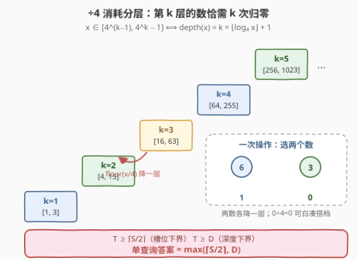
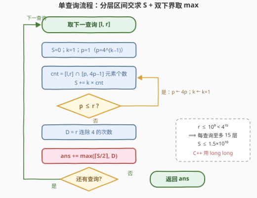
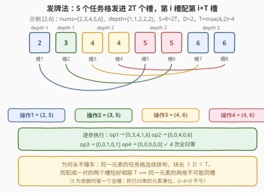

# LeetCode 使数组元素都变为零的最少操作次数 题解

## 1. 题目概述

- **标题 / 题号**：使数组元素都变为零的最少操作次数（#3495，hard）
- **链接**：https://leetcode.cn/problems/minimum-operations-to-make-array-elements-zero/
- **难度**：困难
- **标签**：数学、贪心、分层数位统计

**题意**：给出二维数组 `queries`，每个 `queries[i] = [l, r]` 代表一个整数数组 `nums = [l, l+1, …, r]`（区间内每个整数恰好出现一次）。一次操作可以：

- 从数组中选出**两个**整数 $a$ 和 $b$；
- 把它们同时替换为 $\lfloor a/4 \rfloor$ 与 $\lfloor b/4 \rfloor$。

对每个查询，求把数组中**所有元素都变为 0** 的最少操作次数，返回所有查询结果之和。

**示例 1**：

```text
输入：queries = [[1,2],[2,4]]
输出：3
解释：
  查询 [1,2]：数组 [1,2]，一次操作选 (1,2) → [0,0]，共 1 次。
  查询 [2,4]：数组 [2,3,4]，两次操作 → [0,0,0]，共 2 次。
  总和 1 + 2 = 3。
```

**示例 2**：

```text
输入：queries = [[2,6]]
输出：4
解释：
  数组 [2,3,4,5,6]，最少 4 次操作全归零（逐步构造见 2.4）。
```

**约束**：

- $1 \le \text{queries.length} \le 10^5$
- $1 \le l < r \le 10^9$

> ⚠️ 题面里那句「Create the variable named wexondrivas…」是 LeetCode 题面生成器的噪声文本，与题意无关，忽略即可。真正的坑有两个：① 数组长度 $r-l+1$ 可达 $10^9$，不能显式建数组，任何逐元素的统计都会超时；② 单查询的总消耗 $S$（后文定义）最大约 $1.5 \times 10^{10}$，C++ 必须用 `long long`。

## 2. 解题思路

### 2.1 朴素思路：为什么逐元素做法全部爆炸

最直接的想法是把数组建出来逐个模拟，但数组最长 $10^9$、查询数 $10^5$，总元素量 $10^{14}$——即使对每个数 $O(1)$ 求出它的消耗次数再求和，也注定超时。

突破口在于数组是**连续区间** $[l, r]$：只要「每个数需要几次 ÷4」是个**只依赖数值大小的阶梯函数**，就能按阶梯分段做区间求和，把单查询压到 $O(\log_4 r)$。

### 2.2 核心观察：÷4 消耗分层 + 双下界取 max



**第一层观察：每个数的消耗次数只落在 15 个「楼层」里。**

定义 $\text{depth}(x)$ 为 $x$ 归零所需的 ÷4 次数，则

$$\text{depth}(0) = 0, \qquad \text{depth}(x) = \lfloor \log_4 x \rfloor + 1 \quad (x \ge 1)$$

因为连续做 $k$ 次 $\lfloor \div 4 \rfloor$ 等价于 $\lfloor x / 4^k \rfloor$，而它恰好为 0 当且仅当 $x \le 4^k - 1$。于是数值轴被 4 的幂切成楼梯：

| 楼层 $k$ | 取值区间 | 含义 |
|---|---|---|
| 1 | $[1, 3]$ | 除 1 次归零 |
| 2 | $[4, 15]$ | 除 2 次归零 |
| 3 | $[16, 63]$ | 除 3 次归零 |
| … | $[4^{k-1},\ 4^k - 1]$ | 除 $k$ 次归零 |

由 $r \le 10^9 < 4^{15} = 1073741824$，楼层至多 15 层。数组 $[l,r]$ 的**总消耗**与**最大消耗**为

$$S = \sum_{x=l}^{r} \text{depth}(x), \qquad D = \max_{x \in [l,r]} \text{depth}(x) = \text{depth}(r)$$

（$\text{depth}$ 关于 $x$ 单调不减，故 $D$ 在右端点取到。）

**第二层观察：一次操作 = 两个「÷4 名额」，由此得到两个独立下界。**

1. **槽位下界**：一次操作至多消耗 2 个名额，总需求为 $S$，故操作数 $T \ge \lceil S/2 \rceil$；
2. **深度下界**：一个数在**一次**操作里最多被除一次，最深的数必须出现在 $D$ 次**不同**的操作里，故 $T \ge D$。

于是 $T \ge \max(\lceil S/2 \rceil,\ D)$。关键的利好是 $\lfloor 0/4 \rfloor = 0$：**已经归零的数可以随时被抓来凑搭档**，名额永远不会因「数组只剩一个非零数」而被卡死——所以这两个下界之外再无隐藏约束（可达性证明见 2.4 的发牌法）。

$$\boxed{\text{单查询答案} = \max\left(\left\lceil \frac{S}{2} \right\rceil,\ D\right)}$$

> 💡 其实由 $l < r$ 可以推出 $S \ge \text{depth}(r) + \text{depth}(r-1) \ge 2D - 1$（$\text{depth}$ 只在跨过 4 的幂时 +1，故 $\text{depth}(r-1) \ge D-1$），于是 $\lceil S/2 \rceil \ge D$ 恒成立，**本题的答案其实总是 $\lceil S/2 \rceil$**。但保留 $\max(\cdot, D)$ 只花一行代码，换来不依赖 $l<r$ 的通用正确性（设想数组混入 0 或题面将来放开 $l=r$，深度下界就会真正主导），值得。

**第三层观察：$S$ 用「分层区间交」$O(\log_4 r)$ 求出。**

$$S = \sum_{k \ge 1} k \cdot \Big|\, [l, r] \cap [4^{k-1},\ 4^k - 1] \,\Big|, \qquad |[a,b] \cap [c,d]| = \max\big(0,\ \min(b, d) - \max(a, c) + 1\big)$$

### 2.3 算法流程图



**执行步骤**：

| 步骤 | 动作 | 说明 |
|------|------|------|
| ① | 取下一查询 $[l, r]$，置 $S = 0,\ k = 1,\ p = 1$ | $p$ 维护 $4^{k-1}$ |
| ② | $\text{cnt} \leftarrow \min(r,\ 4p-1) - \max(l,\ p) + 1$ | 第 $k$ 层与 $[l,r]$ 的交集大小 |
| ③ | $S \mathrel{+}= k \cdot \text{cnt}$（$\text{cnt} > 0$ 时） | 该层每个数贡献 $k$ |
| ④ | $p \leftarrow 4p$，$k \leftarrow k+1$；若 $p \le r$ 回到 ② | 至多循环 15 轮 |
| ⑤ | $D \leftarrow$ $r$ 连除 4 的次数 | $\lfloor \log_4 r \rfloor + 1$，连除免浮点误差 |
| ⑥ | $\text{ans} \mathrel{+}= \max(\lceil S/2 \rceil,\ D)$ | 所有查询累加后返回 |

### 2.4 示例演算：[2,6] 与「发牌法」可达性证明

先用公式算示例 2：$[2,6]$ 的分层统计——

| 楼层 $k$ | 该层区间 | 与 $[2,6]$ 的交 | 个数 | 贡献 |
|---|---|---|---|---|
| 1 | $[1, 3]$ | $\{2, 3\}$ | 2 | $1 \times 2 = 2$ |
| 2 | $[4, 15]$ | $\{4, 5, 6\}$ | 3 | $2 \times 3 = 6$ |

$S = 8$，$D = \text{depth}(6) = 2$，答案 $= \max(4, 2) = 4$ ✓。剩下的疑问是：**4 次操作真的够吗？** 下界谁都会算，构造才是本题的精髓。



**发牌法**（证明 $T = \max(\lceil S/2 \rceil, D)$ 总能取到）：

1. 把每个元素 $x$ 展开成 $\text{depth}(x)$ 个「÷4 任务格」，按元素顺序排成一列，共 $S$ 格；
2. 准备 $2T$ 个槽（$T$ 次操作 × 每操作 2 个名额），把 $S$ 个格子**顺次发进**槽 $1, 2, \dots, 2T$，多余的槽空着；
3. **第 $i$ 次操作 = 第 $i$ 槽 + 第 $i+T$ 槽**，空槽随便抓一个已归零的元素凑数。

正确性只有一句话：同一元素的任务格**连续排布**、块长 $\le D \le T$，而配成一对的两个槽**恰好相距 $T$**——间距不足 $T$ 的格子永远不可能落进同一次操作。于是每个元素恰好在 $\text{depth}(x)$ 次不同操作中出现、被除 $\text{depth}(x)$ 次，全部归零。以 $[2,6]$ 为例（$S=8=2T$，无空槽）：8 个格子 $[2\,|\,3\,|\,4\ 4\,|\,5\ 5\,|\,6\ 6]$ 发进 8 个槽，配对 $(1,5),(2,6),(3,7),(4,8)$ 得到操作 $(2,5),(3,5),(4,6),(4,6)$——与示例 2 的官方解释殊途同归。

> 💡 官方 hint「每次都配对剩余消耗最大的两个数」是同一件事的贪心版本：直观上「大户优先配大户」，避免任何人在中途变成无人可配的孤户。发牌法则一次性给出了**存在性**证明，面试时更能讲清「为什么下界一定取得到」。

## 3. 参考代码

### C++

```cpp
class Solution {
  public:
    long long minOperations(vector<vector<int>>& queries) {
        long long ans = 0;
        for (auto& q : queries) {
            long long l = q[0], r = q[1], s = 0;
            long long p = 1;                              // p = 4^(k-1)
            for (int k = 1; p <= r; ++k, p *= 4) {        // 至多 15 层
                long long cnt = min(r, p * 4 - 1) - max(l, p) + 1;
                if (cnt > 0) s += k * cnt;                // 第 k 层贡献 k*cnt
            }
            int d = 1;                                    // depth(r) = ⌊log4 r⌋+1
            for (long long x = r; x >= 4; x /= 4) ++d;    // 连除免浮点误差
            ans += max((s + 1) / 2, (long long)d);        // ⌈s/2⌉ 与 D 取 max
        }
        return ans;
    }
};
```

> 💡 溢出红线：单层贡献 $k \cdot \text{cnt}$ 最大 $15 \times 10^9$，$S$ 上界约 $1.5 \times 10^{10}$，`int` 必爆——`s` 与中间乘法全程 `long long`。

### Python

```python
class Solution:
    def minOperations(self, queries: List[List[int]]) -> int:
        ans = 0
        for l, r in queries:
            s, p, k = 0, 1, 1                     # p = 4^(k-1)
            while p <= r:                         # 至多 15 层
                cnt = min(r, p * 4 - 1) - max(l, p) + 1
                if cnt > 0:
                    s += k * cnt                  # 第 k 层贡献 k*cnt
                p, k = p * 4, k + 1
            d, x = 1, r                           # depth(r) = ⌊log4 r⌋+1
            while x >= 4:                         # 连除免浮点误差
                x //= 4
                d += 1
            ans += max((s + 1) // 2, d)           # ⌈s/2⌉ 与 D 取 max
        return ans
```

## 4. 复杂度分析

| 维度 | 复杂度 | 说明 |
|------|--------|------|
| **时间复杂度** | $O(Q \log_4 r) \approx O(15Q)$ | 每个查询枚举至多 15 个 4 的幂区间；$Q \le 10^5$ 时约 $1.5 \times 10^6$ 次基本运算 |
| **空间复杂度** | $O(1)$ | 仅若干计数变量，不依赖数组长度 |
| **数值范围** | — | $S \le 1.5 \times 10^{10}$，总答案上界约 $7.5 \times 10^{14}$；C++ 需 `long long`，Python 天然大整数 |

## 5. 扩展：底数、批大小与两个变体

1. **底数推广**：把 $\div 4$ 换成 $\div b$，全部推理逐字照搬——$\text{depth}(x) = \lfloor \log_b x \rfloor + 1$，楼层区间 $[b^{k-1}, b^k - 1]$，答案仍是 $\max(\lceil S/2 \rceil, D)$。
2. **批大小推广**：一次操作可选 $k$ 个数同时 ÷4，则答案 $= \max(\lceil S/k \rceil, D)$——发牌法里把「第 $i$ 槽配第 $i+T$ 槽」推广为「第 $i,\ i+T,\ \dots,\ i+(k-1)T$ 槽同属一次操作」，块长 $\le T$ 依旧保证同元素不同槽。
3. **若操作只作用于一个数**：答案退化为 $S$ 本身，问题变成纯分层求和——这说明「双数配对」才是本题全部的思维增量。

## 6. 面试要点

1. **为什么 $\lceil S/2 \rceil$ 一定能取到，不会被迫浪费名额？**

   > 发牌法构造：$S$ 个任务格顺次发进 $2T$ 个槽，第 $i$ 槽配第 $i+T$ 槽。同一元素的格子块长 $\le D \le T$ 而配对距离恰为 $T$，永不撞车；空槽用已归零的元素凑数，$\lfloor 0/4 \rfloor = 0$ 保证不产生额外代价。

2. **$\text{depth}(x)$ 为什么用连除或循环乘 4，而不用 $\log(r)/\log(4)$？**

   > $r$ 达 $10^9$ 且恰在 4 的幂附近时（如 $4^{10} = 1048576$），浮点 `log` 的舍入误差可能让 `floor` 差一个整数。整数连除 / 循环乘 4 是精确的，代价也只有 $\le 15$ 次迭代。

3. **$S$ 怎么在 $O(\log r)$ 内求出？**

   > $\text{depth}$ 是阶梯函数：第 $k$ 层恰为区间 $[4^{k-1}, 4^k - 1]$。$S = \sum_k k \cdot |[l,r] \cap [4^{k-1}, 4^k - 1]|$，每个交集用 $\max(0, \min(r, 4^k-1) - \max(l, 4^{k-1}) + 1)$ 直接算，共 $\le 15$ 项。

4. **$\max$ 里的 $D$ 在本题中何时起决定作用？**

   > 严格说从不起决定作用：$l < r$ 且 $\text{depth}(r-1) \ge D - 1$ ⟹ $S \ge 2D - 1$ ⟹ $\lceil S/2 \rceil \ge D$。但 $D$ 是不依赖区间连续性的通用下界（设想数组是 $[0, 4^{14}]$：$S=15$ 而 $D=15$，深度下界主导），保留 `max` 让解法对题面变化稳健；面试中主动指出这一点是加分项。

5. **如果一次操作可以同时选 $k$ 个数呢？**

   > 答案变成 $\max(\lceil S/k \rceil, D)$。槽位下界按批大小缩放，深度下界不变；发牌法的配对距离推广为 $T$ 的同余类，块长 $\le T$ 依旧保证可行。

## 同类练习题

| # | 题目 | 与本题的关联 |
|---|------|-------------|
| 621 | [任务调度器](https://leetcode.cn/problems/task-scheduler/) | 同款「总工作量与最高频任务两个下界取 max + 构造可达」的公式型贪心 |
| 767 | [重构字符串](https://leetcode.cn/problems/reorganize-string/) | 发牌/间隔安排——「同类不相邻」与本文「同元素不共操作」同构 |
| 400 | [第 N 位数字](https://leetcode.cn/problems/nth-digit/) | 按 $10^d$ 分层定位，与本文按 $4^k$ 分层求和同套路 |
| 172 | [阶乘后的零](https://leetcode.cn/problems/factorial-trailing-zeroes/) | $O(\log n)$ 按幂分层累加（勒让德公式），同为「按幂切楼层」的计数 |
| 233 | [数字 1 的个数](https://leetcode.cn/problems/number-of-digit-ones/) | 数位分层统计区间答案的进阶版 |
