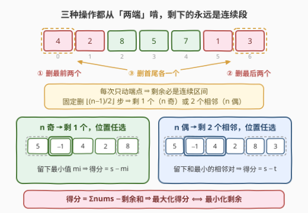
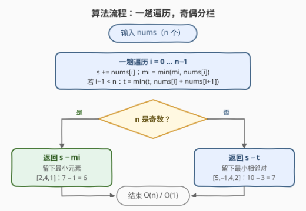

# 最大化配对删除后的得分

- **题目名称**：最大化配对删除后的得分
- **链接**：[3496. 最大化配对删除后的得分](https://leetcode.cn/problems/maximize-score-after-pair-deletions/)
- **难度**：中等
- **标签**：贪心、数组

## 1. 题目概述

> ⚠️ 本题为 LeetCode 付费题，官方接口不返回题面。以下题意依据官方 hints 与示例用例重建，并参考社区维护的题面转载（doocs/leetcode 仓库）及公开 AC 代码交叉核对，可能与官方题面有出入。

给定一个整数数组 `nums`。只要数组中元素**超过两个**，你就**必须**重复执行以下三种操作之一：

1. 删除**最前面的两个**元素；
2. 删除**最后面的两个**元素；
3. 删除**第一个和最后一个**元素（首尾各删一个）。

每次操作，被删除的**两个元素之和**计入总分。返回你能获得的**最高**分数。

**示例 1**：

```text
输入：nums = [2,4,1]
输出：6
解释：
  删最前两个 (2+4)=6，剩 [1]；
  删最后两个 (4+1)=5，剩 [2]；
  删首尾     (2+1)=3，剩 [4]。
  删最前两个得分最高，总分为 6。
```

**示例 2**：

```text
输入：nums = [5,-1,4,2]
输出：7
解释：
  删首尾     (5+2)=7，剩 [-1,4]；
  删最前两个 (5+(-1))=4，剩 [4,2]；
  删最后两个 (4+2)=6，剩 [5,-1]。
  删首尾得分最高，总分为 7。
```

**约束条件**：

- $1 \le n \le 10^5$
- $-10^4 \le \text{nums}[i] \le 10^4$

> 💡 **读题关键**：① 操作**必须**执行到只剩 1 或 2 个元素为止，不能见好就收——哪怕数组里全是负数也得硬着头皮删；② 三种操作全都只从**两端**动刀，中间元素永远原地不动——这是全题的命门；③ $n = 1$ 或 $n = 2$ 时不满足「超过两个」，0 次操作，得分为 0。

---

## 2. 解题思路

### 2.1 暴力思路：三叉决策树 / 区间 DP

每一步有 3 种删法，全程 $k = \left\lfloor \frac{n-1}{2} \right\rfloor$ 步，DFS 枚举整棵决策树复杂度 $O(3^k)$——$n = 10^5$ 时是天文数字。

换个方向想区间 DP：设 $f(l, r)$ 为剩余区间 $[l, r]$ 时继续操作能拿到的最大后续得分，则

$$f(l,r) = \max\begin{cases} \text{nums}[l] + \text{nums}[l{+}1] + f(l{+}2,\, r) \\ \text{nums}[r{-}1] + \text{nums}[r] + f(l,\, r{-}2) \\ \text{nums}[l] + \text{nums}[r] + f(l{+}1,\, r{-}1) \end{cases}$$

状态数 $O(n^2)$，$n = 10^5$ 同样存不下。两条路都走死，说明这题不该「顺着删」硬算，而该**倒过来想**。

### 2.2 核心观察：逆向思维——先想清楚「留下什么」



三个观察环环相扣：

**观察一（剩余必连续）**：三种操作都只删端点，中间元素纹丝不动。归纳可知任意时刻剩余元素都是原数组的一段**连续区间** $[l, r]$。

**观察二（终态只有两种）**：每步恰删 2 个，又必须删到只剩 1 或 2 个为止，共 $k = \left\lfloor \frac{n-1}{2} \right\rfloor$ 步，最终剩余 $n - 2k$ 个元素：$n$ 为奇数剩 **1 个**，$n$ 为偶数剩 **2 个**（由观察一，这 2 个必然相邻）。

**观察三（位置任选）**：这是最精妙的一步——**剩下的那 1 个元素可以停在下标任意处；剩下的那对相邻元素也可以是任意一对**。

> **构造证明**：设最终剩余区间 $[l, r]$（长度 1 或 2），设全程删了 $f$ 次「最前两个」、$b$ 次「最后两个」、$e$ 次「首尾各一」。从左端共删 $2f + e = l$ 个，从右端共删 $2b + e = n - 1 - r$ 个。两式相加得
> $$l + (n - 1 - r) = n - (r - l + 1) = 2k$$
> 是偶数，即 $l$ 与 $n-1-r$ **同奇偶**：两者都为偶时取 $e = 0$、$f = l/2$、$b = (n-1-r)/2$；两者都为奇时取 $e = 1$、$f = (l-1)/2$、$b = (n-2-r)/2$——总有非负整数解。任何 $[l, r]$ 都构造得出（操作顺序随意，比如先删完左端再删右端，每步所需的元素都恰好暴露在端点上）。
>
> 其中「首尾各删一个」的 $e$ 正是**奇偶配平器**：若没有它（比如只许删前两/后两），$l$ 必须是偶数，$n$ 为奇数时就只能剩下标为偶数的元素——最小值若恰好在奇数下标（如 `[9,1,5]` 中的 1），公式 $s - \min$ 直接错。

**逆向思维收口**：每个元素要么被删（进得分）、要么留到最后（进「损耗」），于是

$$\text{总分} = \sum \text{nums} - \text{剩余元素之和} \qquad \Longrightarrow \qquad \text{最大化得分} \iff \text{最小化剩余之和}$$

结合观察三，答案一行写出：

- $n$ 为奇数：留下 $\min(\text{nums})$，得分 $s - \text{mi}$；
- $n$ 为偶数：留下和最小的一对相邻元素 $t = \min_i \big(\text{nums}[i] + \text{nums}[i{+}1]\big)$，得分 $s - t$。

用官方示例验证：示例 1 `[2,4,1]`：$s = 7$，$\text{mi} = 1$，得分 $7 - 1 = 6$ ✓（对应删 $(2,4)$ 剩 `[1]`）。示例 2 `[5,-1,4,2]`：$s = 10$，$t = \min(5{-}1,\, -1{+}4,\, 4{+}2) = 3$（对 $(-1, 4)$），得分 $10 - 3 = 7$ ✓（对应删首尾 $(5,2)$ 剩 `[-1,4]`，恰好 1 步 $= \left\lfloor 3/2 \right\rfloor$，与官方解释逐字吻合）。

### 2.3 算法流程图



**执行步骤**：

| 步骤 | 动作 | 说明 |
|------|------|------|
| ① | 一趟遍历 | 同时累计 $s$（总和）、$\text{mi}$（最小值）、$t$（最小相邻和） |
| ② | 判断 $n$ 奇偶 | 奇数走 ③，偶数走 ④ |
| ③ | 返回 $s - \text{mi}$ | 终态剩 1 个，留最小元素 |
| ④ | 返回 $s - t$ | 终态剩 2 个，留和最小的相邻对 |

### 2.4 示例演算

示例 2 `[5,-1,4,2]`（$n = 4$ 偶，仅 1 步操作）的全部候选终态：

| 操作 | 删除对 | 剩余 | 剩余和 | 得分 $= 10 -$ 剩余和 |
|------|--------|------|--------|----------------------|
| 删最前两个 | $(5, -1)$ | $[4, 2]$ | 6 | 4 |
| 删最后两个 | $(4, 2)$ | $[5, -1]$ | 4 | 6 |
| 删首尾 | $(5, 2)$ | $[-1, 4]$ | **3** ← 最小 | **7** ✓ |

示例 1 `[2,4,1]`（$n = 3$ 奇，1 步）：剩余单元素 $\in \{1, 2, 4\}$（分别删 $(2,4)$、$(4,1)$、$(2,1)$），取最小 1，得分 $7 - 1 = 6$ ✓。注意正中间的 4（下标 1）也留得下——靠的正是「首尾删」这步奇偶配平（删 $(2,1)$，首尾各贡献 1 个删除）。

---

## 3. 参考代码

### C++

```cpp
class Solution {
  public:
    int maxScore(vector<int>& nums) {
        int n = nums.size();
        long long s = 0;
        int mi = INT_MAX, t = INT_MAX;
        for (int i = 0; i < n; ++i) {
            s += nums[i];
            mi = min(mi, nums[i]);
            if (i + 1 < n) {
                t = min(t, nums[i] + nums[i + 1]);
            }
        }
        return n % 2 ? s - mi : s - t;
    }
};
```

> 💡 溢出红线：$|s| \le 10^5 \times 10^4 = 10^9$，`int` 勉强装得下（$< 2^{31}-1 \approx 2.1 \times 10^9$）但余量不足 3 倍——累计用 `long long` 最稳；返回值域 $[-10^9 - 2 \times 10^4,\ 10^9 + 2 \times 10^4]$，收窄回 `int` 安全。哨兵 `INT_MAX` 不会泄漏：$n \ge 1$ 时 `mi` 必被更新；$n \ge 2$ 时 `t` 必被更新；$n = 1$ 走奇数分支根本用不到 `t`。

### Python

```python
class Solution:
    def maxScore(self, nums: List[int]) -> int:
        s = sum(nums)
        if len(nums) % 2:
            return s - min(nums)
        return s - min(nums[i] + nums[i + 1] for i in range(len(nums) - 1))
```

> 💡 边界自检：$n = 1$ 走奇数分支返回 $a_0 - a_0 = 0$；$n = 2$ 走偶数分支返回 $(a_0 + a_1) - (a_0 + a_1) = 0$——都与「0 次操作、得分 0」的题意吻合，无需特判。

---

## 4. 复杂度分析

| 维度 | 复杂度 | 说明 |
|------|--------|------|
| **时间复杂度** | $O(n)$ | 一趟遍历同时维护 $s$、$\text{mi}$、$t$ 三个统计量 |
| **空间复杂度** | $O(1)$ | 仅三个滚动变量 |

---

## 5. 扩展：一字之差，结论崩塌

1. **去掉「首尾各删一个」**（只留删前两/删后两）：从左端删除的个数必须是偶数，$n$ 为奇数时只能剩下标为偶数的元素——最小值若在奇数下标（如 `[9,1,5]` 的 1 在下标 1），$s - \min$ 直接错。「首尾删」一次操作同时向左右各贡献 1 个删除，正是打破奇偶枷锁的配平器。
2. **把「删前两/删后两」换成「删任意两个相邻元素」**：剩余不再保证连续，`[1,100,100,1]` 可以删中间的 $(100,100)$ 剩两端 $[1,1]$（和 2）$<$ 最小相邻对和 101，「留最小相邻对」不再最优，需按下标奇偶结构（剩余对必为「偶 $i$ 奇 $j$」）重新建模。
3. **把「必须」改成「可以」**（随时可停）：全负数组里你会想一步不删（保住 0 分而不是删负数对倒扣），问题退化为「从两端删若干对、只删正和对」的贪心/DP 杂交体，与本题已不是一个物种——「必须执行」正是把自由度压死、让终态只剩「留什么」一个决策的关键约束。

---

## 6. 面试要点

1. **为什么剩余元素一定是原数组的连续区间？**

   > 三种操作都只从两端删除，中间元素既不移动也不被删。对操作次数归纳：初始 $[0, n-1]$ 是连续区间；每次删除只可能收缩左右边界，连续性保持。

2. **为什么任意位置的单元素 / 任意相邻对都能成为终态？**

   > 设剩余 $[l, r]$，删前两 $f$ 次、删后两 $b$ 次、删首尾 $e$ 次，则 $2f + e = l$，$2b + e = n-1-r$。两式相加为 $2k$（偶），故 $l$ 与 $n-1-r$ 同奇偶，总可用 $e \in \{0, 1\}$ 配平出非负整数解。首尾删是奇偶配平器——没有它，$n$ 奇时只能剩偶数下标元素。

3. **逆向思维为什么成立？**

   > 每个元素要么被删进得分、要么留作剩余，二者互斥完备，故总分 $= \sum \text{nums} - $ 剩余和，与删除顺序无关。于是最大化得分 $\iff$ 最小化剩余和，把过程问题变成终态选择问题。

4. **「必须执行」这个条件重要吗？**

   > 重要。它固定了操作次数 $\lfloor (n-1)/2 \rfloor$ 与终态元素个数（1 或 2），把决策压缩成「留哪 1 个 / 留哪一对」。若可提前停，全负数组的最优解是 0 步不删，题目的结构就散了（见第 5 节扩展 3）。

5. **数值范围有什么陷阱？边界输入怎么处理？**

   > $|s| \le 10^9$，`int` 险够、`long long` 稳。$n = 1 / 2$ 时不满足「超过两个」，0 次操作得 0 分——奇偶两个公式分别自动给出 $a_0 - a_0 = 0$ 与 $(a_0 + a_1) - (a_0 + a_1) = 0$，无需特判。

---

## 7. 同类练习题

- [1423. 可获得的最大点数](https://leetcode.cn/problems/maximum-points-you-can-obtain-from-cards/)：从两端抽 $k$ 张牌最大化得分 $\iff$ 最小化剩余 $n-k$ 长连续段之和——与本题「逆向思维 + 连续剩余」完全同构
- [1658. 将 x 减到 0 的最小操作数](https://leetcode.cn/problems/minimum-operations-to-reduce-x-to-zero/)：同款「只能从两端删 + 剩余必连续」的结构，换成定和目标的滑窗转化
- [2171. 拿出最少数目的魔法豆](https://leetcode.cn/problems/removing-minimum-number-of-magic-beans/)：正向操作难想时反过来枚举「留下什么基准值」的逆向贪心
- [1005. K 次取反后最大化的数组和](https://leetcode.cn/problems/maximize-sum-of-array-after-k-negations/)：从「操作对总和的净贡献」视角切入的贪心
- [1717. 删除子字符串的最大得分](https://leetcode.cn/problems/maximum-score-from-removing-substrings/)：「删除配对换得分」的栈式贪心形态，对照本题的端点配对
