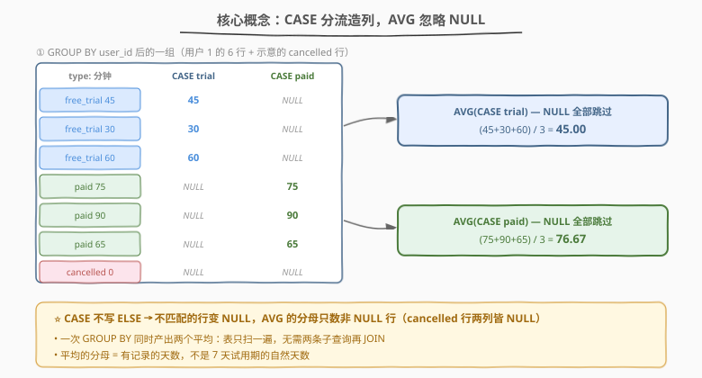
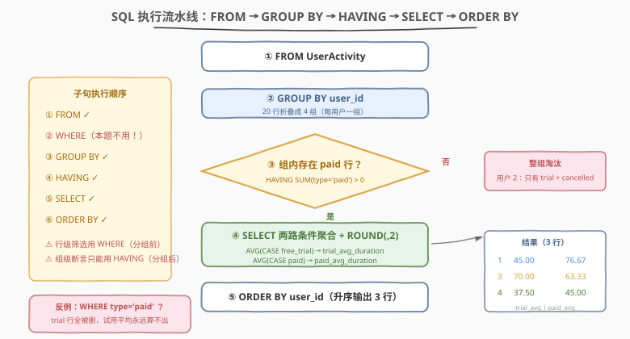

# LeetCode 分析订阅转化 题解

## 1. 题目概述

- **标题 / 题号**：分析订阅转化（#3497，medium）
- **链接**：https://leetcode.cn/problems/analyze-subscription-conversion/
- **难度**：中等
- **标签**：数据库、SQL、条件聚合、`CASE WHEN`、`AVG`、`ROUND`、`GROUP BY`、`HAVING`、聚合函数忽略 `NULL`

**题意**：订阅服务提供 **7 天免费试用**，试用结束后用户可选择订阅**付费计划**或**取消**。给定 `UserActivity` 表记录用户每天的活动，要求找出**从免费试用转为付费订阅**的用户，并分别计算其**试用期间**与**付费期间**的**平均每日活动时长**（均四舍五入到小数点后 2 位）。

**表结构**：

```text
Table: UserActivity
+------------------+---------+
| Column Name      | Type    |
+------------------+---------+
| user_id          | int     |
| activity_date    | date    |
| activity_type    | varchar |
| activity_duration| int     |
+------------------+---------+
(user_id, activity_date, activity_type) 是这张表的唯一主键。
activity_type 是 ('free_trial', 'paid', 'cancelled') 中的一个。
activity_duration 是用户当天在平台上花费的分钟数。
每一行表示一个用户在特定日期的活动。
```

**示例**：

```text
输入：
UserActivity 表：
+---------+---------------+---------------+-------------------+
| user_id | activity_date | activity_type | activity_duration |
+---------+---------------+---------------+-------------------+
| 1       | 2023-01-01    | free_trial    | 45                |
| 1       | 2023-01-02    | free_trial    | 30                |
| 1       | 2023-01-05    | free_trial    | 60                |
| 1       | 2023-01-10    | paid          | 75                |
| 1       | 2023-01-12    | paid          | 90                |
| 1       | 2023-01-15    | paid          | 65                |
| 2       | 2023-02-01    | free_trial    | 55                |
| 2       | 2023-02-03    | free_trial    | 25                |
| 2       | 2023-02-07    | free_trial    | 50                |
| 2       | 2023-02-10    | cancelled     | 0                 |
| 3       | 2023-03-05    | free_trial    | 70                |
| 3       | 2023-03-06    | free_trial    | 60                |
| 3       | 2023-03-08    | free_trial    | 80                |
| 3       | 2023-03-12    | paid          | 50                |
| 3       | 2023-03-15    | paid          | 55                |
| 3       | 2023-03-20    | paid          | 85                |
| 4       | 2023-04-01    | free_trial    | 40                |
| 4       | 2023-04-03    | free_trial    | 35                |
| 4       | 2023-04-05    | paid          | 45                |
| 4       | 2023-04-07    | cancelled     | 0                 |
+---------+---------------+---------------+-------------------+

输出：
+---------+--------------------+-------------------+
| user_id | trial_avg_duration | paid_avg_duration |
+---------+--------------------+-------------------+
| 1       | 45.00              | 76.67             |
| 3       | 70.00              | 63.33             |
| 4       | 37.50              | 45.00             |
+---------+--------------------+-------------------+
```

**约束**：

- `(user_id, activity_date, activity_type)` 是主键
- `activity_type ∈ ('free_trial', 'paid', 'cancelled')`
- 返回结果以 `user_id` **升序**排序

> 💡 **读题关键**：① 「从免费试用转为付费」= 该用户的行里**存在 `paid` 记录**——业务上付费必先试用，示例中凡有 `paid` 的用户都有 `free_trial`；② 两个平均是**同一分组内按 `activity_type` 拆开的两个子集**各自的平均，不是整体平均；③ `cancelled` 行**两个平均都不参与**（示例里用户 4 有一条 `cancelled`，但它既不进试用平均也不进付费平均，且不影响该用户「已转化」的判定）。

## 2. 解题思路

### 2.1 暴力思路：两个子查询各自过滤 + JOIN

最直觉的写法是「一个平均值一条查询」：

1. 查询 A：`WHERE activity_type = 'free_trial'` → `GROUP BY user_id` → `AVG` 得试用平均；
2. 查询 B：`WHERE activity_type = 'paid'` → `GROUP BY user_id` → `AVG` 得付费平均；
3. 再用「有 `paid` 记录的用户集合」把两者 `JOIN` 起来，补上 `ROUND` 与排序。

三趟扫描、两条子查询、一个 JOIN，逻辑分散、表被反复读。更深层的问题是**方向错了**：两个平均值共享同一个分组键 `user_id`，本就属于**同一个组**——拆成两个查询再拼回去，等于先人为拆散再手工缝合。

> ⚠️ 还有个隐藏错误方向：把「筛选转化的用户」写成 `WHERE activity_type = 'paid'`——`WHERE` 是**行级**过滤，一旦执行，`free_trial` 行全部消失，试用平均永远算不出来。「组内是否存在某类行」是**组级**条件，只能用 `HAVING`。

### 2.2 核心观察：条件聚合——一次分组同时算两个平均



**观察一：`AVG` 会忽略 `NULL`，这正好当「分流闸门」用。**

```sql
AVG(CASE WHEN activity_type = 'free_trial' THEN activity_duration END)
```

`CASE` 不写 `ELSE` 时默认返回 `NULL`：`paid` 与 `cancelled` 行被「闸门」放成 `NULL`，`AVG` 对其视而不见——组内只对试用行求平均。同一个表达式换成 `'paid'` 就是付费平均。**一次 `GROUP BY user_id`，两个平均值同时产出**，表只扫一遍。

**观察二：「是否转化」是组级条件，交给 `HAVING`。**

```sql
HAVING SUM(activity_type = 'paid') > 0
```

`activity_type = 'paid'` 在 MySQL 里返回 1/0，组内求和大于 0 即「存在付费行」。担心跨库兼容可写标准形态 `COUNT(CASE WHEN activity_type = 'paid' THEN 1 END) > 0`。用户 2 只有 `free_trial` + `cancelled`，求和为 0，整组被过滤——这正是示例中它不出现的原因。

**观察三：`cancelled` 行不需要任何专门处理。**

它在两个 `CASE` 中都不匹配 → 双双变 `NULL` → 两个 `AVG` 都跳过；也不影响 `HAVING` 的判定。**「不参与就等于不存在」**，无需 `WHERE` 预先剔除（剔了也不影响正确性，但属多余动作）。

> 💡 **条件聚合**（conditional aggregation）是 SQL「一次分组、多路统计」的招牌技巧：`GROUP BY` 定粒度，`CASE WHEN` 在聚合函数内部定子集。凡见「每组内按某维度再拆开算」的需求，第一反应都应是它，而不是多条查询 + JOIN。

### 2.3 算法流程图



| 步骤 | 子句 | 作用 |
|------|------|------|
| ① | `FROM UserActivity` | 读取全部活动行 |
| ② | `GROUP BY user_id` | 按用户折叠，每人一组 |
| ③ | `HAVING SUM(activity_type = 'paid') > 0` | 组级筛选：只留「存在付费行」的用户 |
| ④ | `SELECT` 两个条件 `AVG` + `ROUND(..., 2)` | 组内按类型分流求平均，保留 2 位小数 |
| ⑤ | `ORDER BY user_id` | 结果升序输出 |

> 💡 **子句执行顺序**：`FROM` → `WHERE` → `GROUP BY` → `HAVING` → `SELECT` → `ORDER BY`。`HAVING` 在分组**之后**求值，故能引用聚合结果；`SELECT` 里的两个 `AVG` 同样在分组后对每组求值。理解这条流水线，「为什么转化判定只能放 `HAVING`」就自明了。

### 2.4 示例演算

对示例的 20 行数据，`GROUP BY user_id` 得 4 组：

| 用户 | 组内行（type: 时长） | trial 集合 | paid 集合 | HAVING 判定 | trial_avg | paid_avg |
|------|----------------------|-----------|-----------|-------------|-----------|----------|
| 1 | free_trial×3 + paid×3 | {45, 30, 60} | {75, 90, 65} | 存在 paid ✓ | $(45+30+60)/3 = 45.00$ | $(75+90+65)/3 = 76.67$ |
| 2 | free_trial×3 + cancelled×1 | {55, 25, 50} | **∅** | 无 paid ✗ 淘汰 | — | — |
| 3 | free_trial×3 + paid×3 | {70, 60, 80} | {50, 55, 85} | 存在 paid ✓ | $210/3 = 70.00$ | $190/3 = 63.33$ |
| 4 | free_trial×2 + paid×1 + cancelled×1 | {40, 35} | {45} | 存在 paid ✓ | $75/2 = 37.50$ | $45/1 = 45.00$ |

两个细节值得盯住：

- **用户 4 的 `cancelled` 行**（时长 0）：若错误地把 0 算进付费平均，得 $(45+0)/2 = 22.50$，与期望 45.00 不符——`CASE` 闸门把它变成 `NULL`，`AVG` 分母只数非 NULL 行，天然避开；
- **平均的分母是「出现的天数」而非「试用天数跨度」**：用户 4 试用只记录了 2 天（4-01、4-03），分母就是 2，不补零、不按 7 天试用期摊薄。$37.50 = 75/2$ ✓。

## 3. 参考代码

### SQL（解法 A：条件聚合 + `HAVING`，推荐）

```sql
SELECT
    user_id,
    ROUND(AVG(CASE WHEN activity_type = 'free_trial'
                   THEN activity_duration END), 2) AS trial_avg_duration,
    ROUND(AVG(CASE WHEN activity_type = 'paid'
                   THEN activity_duration END), 2) AS paid_avg_duration
FROM UserActivity
GROUP BY user_id
HAVING SUM(activity_type = 'paid') > 0
ORDER BY user_id;
```

> 💡 **写法要点**：
> - **`CASE` 不写 `ELSE`**：默认返回 `NULL`，`AVG` 自动忽略——这是整个解法的支点；
> - **`HAVING` 判定转化**：`SUM(activity_type = 'paid') > 0` 是 MySQL 惯用的「存在性」写法（布尔表达式求和）；
> - **`ROUND(x, 2)`**：对聚合结果四舍五入到 2 位，输出 `45.00`、`76.67` 这类 DECIMAL 形态；
> - 单次扫描、单个分组，无子查询无 JOIN。

### SQL（解法 B：`COUNT` 存在性 + 严格双条件）

```sql
SELECT
    user_id,
    ROUND(AVG(CASE WHEN activity_type = 'free_trial'
                   THEN activity_duration END), 2) AS trial_avg_duration,
    ROUND(AVG(CASE WHEN activity_type = 'paid'
                   THEN activity_duration END), 2) AS paid_avg_duration
FROM UserActivity
GROUP BY user_id
HAVING COUNT(CASE WHEN activity_type = 'free_trial' THEN 1 END) > 0
   AND COUNT(CASE WHEN activity_type = 'paid'       THEN 1 END) > 0
ORDER BY user_id;
```

> 💡 **与解法 A 的区别**：
> - `COUNT(CASE WHEN ... THEN 1 END)`（不匹配 → `NULL` → 不计数）是**标准 SQL** 的存在性写法，不依赖「布尔表达式可求和」的方言特性，PostgreSQL / SQLite 等方言下也成立；
> - 同时要求 `free_trial` 与 `paid` **都存在**，更贴合「从试用**转为**付费」的字面语义，防住「跳过试用直接付费」的脏数据（若数据保证先试用后付费，两者结果一致，本题示例即如此）；
> - 若沿用 2.1 的暴力方向（两个 `WHERE` 子查询 + `JOIN`），结果相同但代码量翻倍——可作为反面参照体会条件聚合的价值。

### Python（pandas）

```python
import pandas as pd

def analyze_subscription_conversion(user_activity: pd.DataFrame) -> pd.DataFrame:
    piv = user_activity.pivot_table(
        index='user_id', columns='activity_type',
        values='activity_duration', aggfunc='mean',
    ).reset_index()
    piv = piv[piv['paid'].notna()].copy()
    piv['trial_avg_duration'] = piv['free_trial'].round(2)
    piv['paid_avg_duration'] = piv['paid'].round(2)
    return (
        piv[['user_id', 'trial_avg_duration', 'paid_avg_duration']]
        .sort_values('user_id')
        .reset_index(drop=True)
    )
```

> 💡 **pandas 对照**：
> - `pivot_table(index='user_id', columns='activity_type', ...)` 对应「一次分组 + 按类型分流」——`aggfunc='mean'` 相当于对每个 `(user_id, type)` 子集各做一次 `AVG`，`pivot` 把结果摊成每人一行、每类一列；
> - `piv[piv['paid'].notna()]` 对应 `HAVING`：某用户无付费行则该列为 `NaN`，被行级布尔掩码过滤；
> - `cancelled` 列在 `pivot` 后自然生成，但两行输出都不引用它——对应「`CASE` 闸门 + `AVG` 忽略」的沉默处理；
> - ⚠️ `pandas` 的 `.round()` 是**四舍六入五成双**（banker's rounding），与 MySQL `ROUND` 的四舍五入在 `.005` 边界上可能差 0.01，本题数据不踩边界；较真场景可用 `decimal` 模块或 `x.map(lambda v: float(Decimal(v).quantize(Decimal('0.01'), ROUND_HALF_UP)))`。

## 4. 复杂度分析

| 维度 | 复杂度 | 说明 |
|------|--------|------|
| 时间复杂度 | $O(n)$ | $n$ 为 `UserActivity` 行数：单趟扫描，每行做 $O(1)$ 次 `CASE` 求值与哈希分组累加 |
| 空间复杂度 | $O(m)$ | $m$ 为不同用户数：哈希聚合需为每组维护两个「和 + 计数」累加器 |
| 扫描次数 | 1 | 对照暴力版两次 `WHERE` 子查询 + JOIN 共 3 次涉表，单趟即最优 |

> 💡 若在 `UserActivity(user_id)` 上建有索引，`GROUP BY user_id` 可走索引序扫描免哈希；数据量小（单表题目惯例）时无感。`ORDER BY user_id` 在分组键有序时可直接流式输出。

## 5. 扩展：`FILTER` 子句与转化率变体

**① SQL 标准的 `FILTER` 子句**。条件聚合还有个更现代的写法（SQL:2003）：

```sql
SELECT user_id,
       ROUND(AVG(activity_duration) FILTER (WHERE activity_type = 'free_trial'), 2),
       ROUND(AVG(activity_duration) FILTER (WHERE activity_type = 'paid'), 2)
FROM UserActivity
GROUP BY user_id ...
```

`FILTER (WHERE ...)` 把「分流」从聚合参数内部挪到聚合函数外部，语义更直白。PostgreSQL、SQLite 3.30+ 已支持；MySQL 8 尚未实现，LeetCode MySQL 环境下只能用 `CASE` 形态——面试里能讲出「`CASE` 是 `FILTER` 的可移植退化版」是加分项。

**② 转化率统计**。把本题再推一步就是漏斗分析：**试用 → 付费的转化率** = 有 `paid` 行的用户数 ÷ 有 `free_trial` 行的用户数。骨架仍是条件聚合，只是聚合对象从 `activity_duration` 换成「用户」：

```sql
SELECT ROUND(
         SUM(CASE WHEN activity_type = 'paid'    THEN 1 ELSE 0 END)  -- 转化用户次
         / SUM(CASE WHEN activity_type = 'free_trial' THEN 1 ELSE 0 END),
         4) AS conversion_rate
FROM (SELECT DISTINCT user_id, activity_type FROM UserActivity) t;
```

这正是留存/转化类题（如 550「游戏玩法分析 IV」的次日留存率）的通用模板：**先 `DISTINCT` 出「用户-状态」对，再条件计数求比**。

**③ 时间窗口转化**。若把条件收紧为「试用开始后 7 天内付费」，需要先用窗口函数 `MIN(CASE WHEN activity_type='free_trial' THEN activity_date END) OVER (PARTITION BY user_id)` 取试用首日，再对 `paid` 行做日期差判定——条件聚合负责「算什么」，窗口函数负责「时间上怎么对齐」，两者经常搭档。

## 6. 面试要点

1. **`AVG` / `SUM` 对 `NULL` 的处理规则是什么？为什么这是本题的支点？**

   > 聚合函数 `AVG`、`SUM`、`COUNT(表达式)`、`MIN`、`MAX` 都**忽略 `NULL**`（`COUNT(*)` 除外）。`CASE WHEN cond THEN x END` 让不匹配的行贡献 `NULL`，等于在聚合内部做了一次「软过滤」——同一组里能同时算出多个互斥子集的聚合值。本题的两个平均、以及 `HAVING` 里的存在性计数，全部建立在这条规则上。

2. **判定「用户已转化」为什么必须写 `HAVING` 而不是 `WHERE`？**

   > 「组内**是否存在** `paid` 行」是对**分组结果**的整体性质做断言，而 `WHERE` 在 `GROUP BY` **之前**逐行执行——写 `WHERE activity_type = 'paid'` 会把 `free_trial` 行整批删掉，试用平均随之丢失。执行顺序 `WHERE → GROUP BY → HAVING` 决定了：行级筛选取前，组级断言取后。

3. **`SUM(activity_type = 'paid') > 0` 这种写法跨数据库安全吗？**

   > 不完全。它利用了 MySQL「比较表达式返回 1/0」的特性（PostgreSQL 需显式 `::int`，SQLite 布尔本质是 0/1 可用但依赖隐式转换，标准 SQL 则无布尔类型可求和）。**可移植写法**是 `COUNT(CASE WHEN activity_type = 'paid' THEN 1 END) > 0` 或 `MAX(CASE WHEN activity_type = 'paid' THEN 1 ELSE 0 END) = 1`——面试中先给方言版、再补标准版，体现边界意识。

4. **`cancelled` 行会不会污染平均？要不要先 `WHERE` 剔除？**

   > 不会，也不必。它在两个 `CASE` 里都不匹配 → 双双 `NULL` → 两个 `AVG` 的分子分母都不含它；对 `HAVING` 判定也无影响。预先 `WHERE activity_type != 'cancelled'` 结果相同，但属于多余动作。真正要警惕的是反方向：若错把时长 0 的 `cancelled` 行算进付费平均（用户 4 会得 22.50 而非 45.00），分母被虚增——记住「平均的分母 = 非 `NULL` 行数」。

5. **题目说平均「每日」活动时长，分母是自然天数还是记录条数？**

   > 是**有记录的天数**（即各子集的行数）。主键 `(user_id, activity_date, activity_type)` 保证同用户同类型同日期至多一行，每行就是「该用户该类型在这一天」的观测；没有活动的日子在表里不存在，也不该计入分母。用户 4 试用只有 2 行记录，$75/2 = 37.50$，而非除以 7 天试用期的 $75/7 \approx 10.71$——按业务口径选择分母是数据统计里高频的歧义点，答题前值得跟面试官确认一句。

> 💡 **一句话总结**：3497 = **条件聚合招牌题**——`GROUP BY user_id` 定粒度，`AVG(CASE WHEN ...)` 在组内分流算两个平均，`HAVING SUM(type='paid') > 0` 做组级转化筛选；灵魂是「聚合函数忽略 `NULL`」与「`WHERE` 行级 / `HAVING` 组级」的分界。

## 同类练习题

| # | 题目 | 与本题的关联 |
|---|------|-------------|
| 550 | [游戏玩法分析 IV](https://leetcode.cn/problems/game-play-analysis-iv/)（[题解](../0501-0600/550_游戏玩法分析IV.md)） | **留存率/转化率**的模板题——`MIN` 首日 + 日期差 + 除法，本题第 5 节转化率变体的直接同构 |
| 1322 | [广告效果](https://leetcode.cn/problems/ads-performance/)（[题解](../1301-1400/1322_广告效果.md)） | 条件聚合 `AVG`/`SUM` + 除零防御，体会「一次分组多路统计」在 CTR 场景的用法 |
| 1398 | [购买了产品A和B却没有购买C的顾客](https://leetcode.cn/problems/customers-who-bought-products-a-and-b-but-not-c/)（[题解](../1301-1400/1398_购买了产品A和产品B却没有购买产品C的顾客.md)） | `HAVING` + 条件聚合做「组内存在/不存在」集合判定，本题 `HAVING` 的强化版 |
| 2990 | [贷款类型](https://leetcode.cn/problems/loan-types/)（[题解](../2901-3000/2990_贷款类型.md)） | `SUM(布尔表达式)` + `HAVING` 的存在性计数专项训练 |
| 3057 | [员工项目分配](https://leetcode.cn/problems/employees-project-allocation/)（[题解](../3001-3100/3057_员工项目分配.md)） | `GROUP BY` + `AVG` + `HAVING` 组合的近亲题，巩固「分组 → 组级过滤 → 聚合输出」流水线 |
