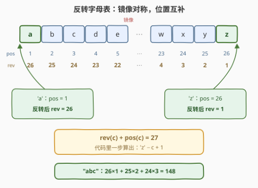
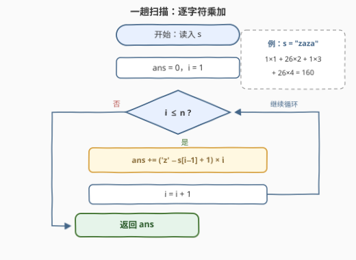

# 字符串的反转度

- **题目名称**：字符串的反转度
- **链接**：[3498. 字符串的反转度](https://leetcode.cn/problems/reverse-degree-of-a-string/)
- **难度**：简单
- **标签**：字符串、模拟

## 1. 题目概述

给你一个字符串 $s$，计算其**反转度**。反转度的计算方法如下：

- 对于每个字符，将其在**反转字母表**中的位置（$'a' = 26$、$'b' = 25$、……、$'z' = 1$）与其在字符串中的**位置**（下标从 $1$ 开始）相乘；
- 将这些乘积全部相加，即为字符串的反转度。

**示例 1**：

```text
输入：s = "abc"
输出：148
解释：'a'：26 × 1 = 26；'b'：25 × 2 = 50；'c'：24 × 3 = 72；
      26 + 50 + 72 = 148。
```

**示例 2**：

```text
输入：s = "zaza"
输出：160
解释：'z'：1 × 1 = 1；'a'：26 × 2 = 52；'z'：1 × 3 = 3；'a'：26 × 4 = 104；
      1 + 52 + 3 + 104 = 160。
```

**约束条件**：

- $1 \le s.length \le 1000$
- $s$ 仅包含小写字母。

> 💡 **读题关键**：两处细节决定实现——① 位置表是**反着的**：$a$ 对应 26、$z$ 对应 1，与日常直觉的 $a=1$ 恰好镜像；② 字符串下标**从 1 开始**，而主流语言的字符串下标从 0 开始，循环里要记得偏移。

---

## 2. 解题思路

### 2.1 暴力思路：查表模拟

按题面字面意思执行：先给 26 个字母各算出反转位置（写一张 26 项的映射表，或构造反转字母串 `"zyx…cba"` 按下标查），再逐字符「查表 → 乘下标 → 累加」：

```text
rev = {'a': 26, 'b': 25, ..., 'z': 1}   # 先建 26 项映射表
ans = 0
for i, c in enumerate(s, 1):            # i 从 1 开始
    ans += rev[c] * i
return ans
```

复杂度 $O(n)$ 本身没有问题——瓶颈不在复杂度，在于**那张表是多余的**：字母表是连续的等差序列，「查表」把一个 $O(1)$ 的算术闭式藏进了一次哈希/数组访问。更朴素的写法甚至逐字符从 $a$ 数到 $c$ 再做反转（$O(26n)$），同样是没看穿位置规律的手工劳动。

### 2.2 核心观察：反转位置有闭式，rev + pos = 27



正序位置 $\text{pos}(c)$（$a \to 1$、$z \to 26$）与反转位置 $\text{rev}(c)$ **关于字母表中心互补**：

$$\text{rev}(c) + \text{pos}(c) = 27 \quad\Longrightarrow\quad \text{rev}(c) = 27 - \text{pos}(c)$$

验证：$\text{rev}(a) = 26$ ✓、$\text{rev}(z) = 1$ ✓、$\text{rev}(c) = 24$ ✓。落到代码里就是一步字符减法（C++ 中 `char` 参与运算自动转整数值）：`'z' - c + 1`，**无需任何预处理**：

$$\text{reverseDegree}(s) = \sum_{i=1}^{n} \text{rev}(s_i)\cdot i$$

> ⚠️ **下标偏移是最常见的翻车点**：循环变量从 0 开始时，乘的必须是 $i+1$ 而非 $i$。示例 2 的 $a$ 在下标 2 处贡献 $26 \times 2 = 52$——若误乘 0 起下标 1，每个字符的贡献整体错位。

> ⚠️ **数值范围核对**：全 $a$ 且 $n = 1000$ 时取最大值 $26 \times \frac{1000 \times 1001}{2} = 13{,}013{,}000 < 2^{31}-1$，32 位 `int` 全程安全，无需 `long long`。

### 2.3 算法流程图



一次遍历、每字符一次减法一次乘加，没有分支没有搜索——**循环体一行就是全部**。

### 2.4 示例演算

以 $s = $ "zaza"（$n=4$）为例：

| 下标 $i$ | 字符 $c$ | 反转位置 $\text{rev}(c)$ | 乘积 $\text{rev}(c) \times i$ | 累计 |
|------|------|------|------|------|
| 1 | z | 1 | 1 | 1 |
| 2 | a | 26 | 52 | 53 |
| 3 | z | 1 | 3 | 56 |
| 4 | a | 26 | 104 | **160** ✓ |

> 💡 同一个字符在不同下标贡献不同：两个 $a$ 分别贡献 52 与 104——**位置权重**正是「反转度」区别于普通字符计数的地方。

---

## 3. 参考代码

### C++

```cpp
class Solution {
  public:
    int reverseDegree(string s) {
        int ans = 0;
        for (int i = 0; i < (int)s.size(); ++i)
            ans += ('z' - s[i] + 1) * (i + 1);   // rev(c) = 'z' - c + 1，下标从 1 计
        return ans;
    }
};
```

### Python

```python
class Solution:
    def reverseDegree(self, s: str) -> int:
        return sum((ord('z') - ord(c) + 1) * i for i, c in enumerate(s, 1))
```

> 💡 Python 的 `enumerate(s, 1)` 让下标天然从 1 开始，直接省掉 `i + 1`；`ord('z')` 是常量，追求极致可提取成局部变量。

---

## 4. 复杂度分析

| 维度 | 复杂度 | 说明 |
|------|--------|------|
| 时间复杂度 | $O(n)$ | 每字符一次减法、一次乘法、一次累加；查表版同为 $O(n)$，但多一张 26 项表与一次查表访问 |
| 空间复杂度 | $O(1)$ | 无辅助数据结构（查表版需 $O(26)$） |

---

## 5. 扩展：互补恒等式与子串反转度

由 $\text{rev}(c) = 27 - \text{pos}(c)$ 可得**互补恒等式**——定义「正向度」$\text{deg}_+(s) = \sum_{i=1}^{n} \text{pos}(s_i)\cdot i$（用正序位置加权），则：

$$\text{reverseDegree}(s) + \text{deg}_+(s) = 27 \cdot \frac{n(n+1)}{2}$$

验证 "abc"：正向度 $= 1 \times 1 + 2 \times 2 + 3 \times 3 = 14$，$27 \times 6 - 14 = 148$ ✓。两把尺子互为镜像，任意字符串的两种「度」加起来恒等于总分 $27 \cdot T(n)$——「整体基线 − 偏差」的拆分视角，与 3492 的 min 公式同源。

若题目升级为**多次询问任意子串** $s[l..r]$ 的反转度：预处理两个前缀和 $A_i = \sum_{j \le i} \text{rev}(s_j)$ 与 $B_i = \sum_{j \le i} \text{rev}(s_j)\cdot j$；子串内第 $k$ 个字符的全局下标为 $j = l - 1 + k$，展开 $\sum \text{rev}(s_j)\,(j - l + 1) = \big(B_r - B_{l-1}\big) - (l-1)\big(A_r - A_{l-1}\big)$，单次查询 $O(1)$。

---

## 6. 面试要点

1. **反转位置为什么不用建表？**

   > 字母表是连续等差序列，$\text{rev}(c) = 27 - \text{pos}(c)$，代码里一步字符减法 `'z' - c + 1` 即得。更一般地，凡是「序数 ↔ 值」的线性映射（Excel 列号、字母等级转换）都先找闭式再动手，查表只是兜底。

2. **下标从 1 开始这个细节在代码里怎么体现？**

   > C++ 循环从 0 开始时乘 $(i+1)$；Python 用 `enumerate(s, 1)` 把起点设为 1。这是本题唯一容易翻车的边界：示例 2 中 $a$ 在下标 2 贡献 52，错乘 1 则整体错位。

3. **结果会溢出 int 吗？**

   > 最大值在全 $a$、$n=1000$ 时取得：$26 \times \frac{1000 \times 1001}{2} \approx 1.3 \times 10^7$，远小于 $2^{31}-1 \approx 2.1 \times 10^9$。但若 $n$ 放宽到 $10^5$，上界涨到 $1.3 \times 10^{11}$，必须换 `long long`——主动报出上界是加分项。

4. **如果改成 0 起下标、或改用正序位置，答案分别怎么变？**

   > 0 起下标：整体减去 $\sum_i \text{rev}(s_i)$（每项少乘 1）。改用正序位置：由互补恒等式直接得 $27 \cdot \frac{n(n+1)}{2} - \text{reverseDegree}(s)$。两问都在考「位置权重」是否真懂——它是可拆、可换基的线性组合。

5. **这题和 3110「字符串的分数」有什么本质共性？**

   > 都是「字符的数值属性 × 位置信息」的线性组合：本题是 $\text{rev}(s_i) \times i$，3110 是相邻字符 ASCII 差 $|s_i - s_{i-1}|$。识别出「答案 = 对字符的一趟线性扫描」后，剩下的只防细节：下标基、字符集、数值上界。

> 💡 **一句话总结**：3498 = $\sum_{i=1}^{n} \text{rev}(s_i)\cdot i$——反转位置是正序位置的镜像（和恒为 27），闭式取代查表，一趟乘加收工；防一手 0/1 下标偏移即可。

---

## 7. 同类练习题

- [3110. 字符串的分数](https://leetcode.cn/problems/score-of-a-string/)（[题解](../3101-3200/3110_字符串的分数.md)）：相邻字符 ASCII 差绝对值求和，同为「字符数值的线性组合」一趟扫描
- [1528. 重新排列字符串](https://leetcode.cn/problems/shuffle-string/)（[题解](../1501-1600/1528_重新排列字符串.md)）：按 `indices` 重排字符，同考「字符 ↔ 位置」的对应关系
- [2138. 将字符串拆分为若干长度为 k 的组](https://leetcode.cn/problems/divide-a-string-into-groups-of-size-k/)（[题解](../2101-2200/2138_将字符串拆分为若干长度为k的组.md)）：按下标切段 + 填充字符，位置边界细节同款考点
- [2278. 字母在字符串中的百分比](https://leetcode.cn/problems/percentage-of-letter-in-string/)（[题解](../2201-2300/2278_字母在字符串中的百分比.md)）：数字符出现次数再取占比，字符统计模拟的极简版
