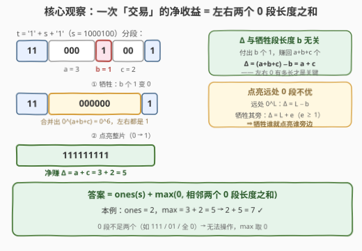
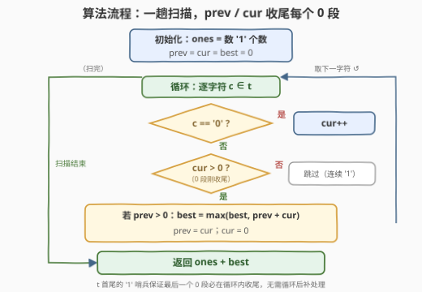

# LeetCode 操作后最大活跃区段数 I 题解

## 1. 题目概述

- **标题 / 题号**：操作后最大活跃区段数 I（#3499，medium）
- **链接**：https://leetcode.cn/problems/maximize-active-section-with-trade-i/
- **难度**：中等
- **标签**：字符串、枚举、游程分段

**题意**：给你一个长度为 $n$ 的二进制字符串 $s$，其中：

- `'1'` 表示一个**活跃**区段；
- `'0'` 表示一个**非活跃**区段。

你可以执行**最多一次操作**来最大化 $s$ 中的活跃区段数量。在一次操作中，你可以：

1. 将一个**被 `'0'` 包围**的连续 `'1'` 区块转换为全 `'0'`；
2. **然后**，将一个**被 `'1'` 包围**的连续 `'0'` 区块转换为全 `'1'`。

返回执行最优操作后 $s$ 中的**最大**活跃区段数。

注意：处理时需要在 $s$ 的两侧加上 `'1'`，即 $t = \texttt{1} + s + \texttt{1}$。这些加上的 `'1'` 不会影响最终的计数。

**示例 1**：

```text
输入：s = "01"
输出：1
解释：没有被 '0' 包围的 '1' 区块，无法进行有效操作，最大活跃区段数为 1。
```

**示例 2**：

```text
输入：s = "0100"
输出：4
解释："0100" → 补位得 "101001" → 牺牲中间的 "1" 得 "100001" → 点亮 "0000" 得 "111111"，
      去掉两端后为 "1111"，最大活跃区段数为 4。
```

**示例 3**：

```text
输入：s = "1000100"
输出：7
解释："1000100" → 补位得 "110001001" → 牺牲中间的 "1" 得 "110000001" → 点亮得 "111111111"，
      去掉两端后为 "1111111"，最大活跃区段数为 7。
```

**示例 4**：

```text
输入：s = "01010"
输出：4
解释："01010" → 补位得 "1010101" → 牺牲第二个 "1" 得 "1000101" → 点亮 "0000" 得 "1111101"，
      去掉两端后为 "11110"，最大活跃区段数为 4。
```

**约束**：

- $1 \le n = |s| \le 10^5$
- $s_i$ 仅包含 `'0'` 或 `'1'`

> 💡 **读题关键**：
> ① 「活跃区段数」数的是 **`'1'` 字符的个数**——每个字符就是一个区段。示例 2 的最终串 `"1111"` 若按「连续 1 区块的个数」只有 1，但答案是 4；
> ② 操作是**两步连环**：必须先「牺牲」一个被 0 包围的 1 块，才能「点亮」一个被 1 包围的 0 块，不能只做第二步白赚；
> ③ 两侧补 `'1'` 是题意的一部分：$s$ 开头/结尾的 0 块在补位后也算「被 1 包围」，可以点亮（示例 2 被点亮的四格里就有 $s$ 开头的 `'0'`）。

## 2. 解题思路

### 2.1 暴力思路：枚举牺牲块 × 枚举点亮块

按题面直接模拟：枚举「牺牲哪个 1 块」，再枚举「点亮哪个 0 块」，每次模拟完两步操作后重新数一遍 `'1'` 的个数。$t$ 中区块总数为 $O(n)$，双重枚举加上每次 $O(n)$ 的重数，总代价 $O(n^2)$ 乃至 $O(n^3)$，$n = 10^5$ 时必然超时；而且「区块合并重组」的模拟细节极易写错。

其实两步操作连起来看是一笔**交易**：**付出 $b$ 个 1，换回一整片 0 区域**。把这笔账算清楚，枚举维度就能从「块 × 块」坍缩成「一趟线性扫描」。

### 2.2 核心观察：交易净收益 = 左右两个 0 段长度之和



**补位分段**。令 $t = \texttt{1} + s + \texttt{1}$，把 $t$ 按连续字符切成交替的 1 段与 0 段。由于 $t$ 首尾都是 `'1'`，**任意两个相邻的 0 段之间必然夹着一个「被 0 包围」的内部 1 段**——这正是唯一的可牺牲对象集合。

**算清交易账**。设某个内部 1 段长为 $b$，左右 0 段长分别为 $a$、$c$：

1. **牺牲**：这 $b$ 个 1 变 0，与左右 0 段连成一片 $0^{a+b+c}$；
2. **点亮**：把这片 $0^{a+b+c}$ 整体变 1。

净收益为

$$\Delta = (a+b+c) - b = a + c$$

> 💡 **收益与 $b$ 无关**——牺牲哪个 1 段不重要，重要的是它**左右两边的 0 各有多长**。每个内部 1 段恰好对应一个候选值 $a+c$，全部取最大即可。

**确认「点亮合并段」恒为最优**。若不点亮合并段，而点亮远处的某个 0 段 $0^L$，收益是 $L - b$（牺牲的 $b$ 个 1 白白亏掉）；但改为牺牲 $0^L$ **旁边**的 1 段（它另一侧还有个长 $e \ge 1$ 的 0 段），收益是 $L + e > L - b$，恒更优。所以最优方案里点亮的总是「自己牺牲所合并出来的那段」，无需考虑其他组合。

**结论**：设 $z_1, z_2, \dots, z_k$ 为 $t$ 中所有 0 段的长度，则

$$\text{答案} = \operatorname{ones}(s) + \max\{0,\ z_1 + z_2,\ z_2 + z_3,\ \dots,\ z_{k-1} + z_k\}$$

其中每个「相邻 0 段对」$(z_i, z_{i+1})$ 必夹着内部 1 段，天然合法。0 段不足两个（如 `"111"`、`"01"`、`"10"`、全 0）时无法操作，$\max$ 取 0。

### 2.3 算法流程图



一趟扫描 $t$，只需 4 个变量：`ones`（初始 1 的个数）、`cur`（当前 0 段长度）、`prev`（上一个 0 段长度）、`best`（相邻 0 段对之和的最大值）。每逢遇到 `'1'` 且 `cur > 0`，说明一个 0 段刚收尾——此时 `prev + cur` 恰好是「夹着某个内部 1 段」的两个 0 段之和，用它更新 `best`。`prev` 初值取 0，兼作「尚无前驱 0 段」的哨兵：首个 0 段左边是边界 1 段（不可牺牲），不产生候选。

### 2.4 示例演算

| 示例 | $t$ 的 0 段序列 | 相邻对之和 | ones | 答案 |
|------|----------------|-----------|------|------|
| 1 | `"01"` → $[1]$ | 无（0 段不足 2 个） | 1 | $1 + 0 = 1$ |
| 2 | `"0100"` → $[1, 2]$ | $1+2=3$ | 1 | $1 + 3 = 4$ |
| 3 | `"1000100"` → $[3, 2]$ | $3+2=5$ | 2 | $2 + 5 = 7$ |
| 4 | `"01010"` → $[1, 1, 1]$ | $\max(1+1,\ 1+1)=2$ | 2 | $2 + 2 = 4$ |

以示例 3 详述：$t = \texttt{110001001}$ 分段为 $\texttt{11} \mid \texttt{000} \mid \texttt{1} \mid \texttt{00} \mid \texttt{1}$。牺牲中间的 $\texttt{1}$（$b=1$），其左右 0 段 $a=3$、$c=2$，合并成 $\texttt{000000}$ 后整体点亮，$\Delta = 3+2 = 5$，得 $\texttt{111111111}$，去掉两端即 $\texttt{1111111}$，共 7 个活跃区段 ✓。

## 3. 参考代码

### C++（虚拟哨兵，O(1) 额外空间）

```cpp
class Solution {
  public:
    int maxActiveSectionsAfterTrade(string s) {
        int n = s.size(), ones = 0;
        for (char c : s) ones += (c == '1');

        int best = 0, prev = 0, cur = 0;
        for (int i = -1; i <= n; i++) {
            char c = (i < 0 || i == n) ? '1' : s[i];
            if (c == '0') {
                cur++;
            } else if (cur > 0) {
                if (prev > 0) best = max(best, prev + cur);
                prev = cur;
                cur = 0;
            }
        }
        return ones + best;
    }
};
```

> 💡 **写法要点**：
> - 下标从 $-1$ 扫到 $n$，越界位置视作 `'1'`——等效于 $t = \texttt{1} + s + \texttt{1}$ 但不真正拼接，额外空间 $O(1)$；
> - `prev` 初值 0 兼作「还没有前驱 0 段」的哨兵：真实 0 段长度至少为 1，故 `prev > 0` 的判断不会误伤，而首个 0 段收尾时被正确跳过（它左侧是边界 1 段，没有可牺牲对象）；
> - 扫描必然以 `'1'` 结束，最后一个 0 段一定在循环内收尾，无需循环后补处理。

### Python（显式补位版）

```python
class Solution:
    def maxActiveSectionsAfterTrade(self, s: str) -> int:
        t = "1" + s + "1"
        ones = s.count("1")
        best = prev = cur = 0
        for c in t:
            if c == "0":
                cur += 1
            elif cur > 0:
                if prev > 0:
                    best = max(best, prev + cur)
                prev, cur = cur, 0
        return ones + best
```

> 💡 显式拼接 $t$ 更贴合 2.2 的推导过程，可读性优先；$n \le 10^5$ 下多出的 $O(n)$ 字符串无所谓。两个版本逻辑逐行同构。

## 4. 复杂度分析

| 维度 | 复杂度 | 说明 |
|------|--------|------|
| 时间复杂度 | $O(n)$ | 两趟线性扫描（数 `ones` 一趟、主扫描一趟），每个字符 $O(1)$ 决策，可合并为一趟 |
| 空间复杂度 | $O(1)$ / $O(n)$ | C++ 虚拟哨兵版常数级；Python 显式拼接 $t$ 占 $O(n)$ |
| 预处理 | 无 | 不需要真正存下游程序列——`prev` / `cur` 流式维护即可 |

> ⚠️ 对照暴力枚举的 $O(n^2)$：优化来源不是数据结构，而是**把「块 × 块」的组合枚举折叠成「每个内部 1 段一个候选值 $a+c$」的线性枚举**——先算清交易账再动手，是字符串分段题的通用降维手法。

## 5. 扩展：区间查询版（3501，困难）

本题的续作 [3501. 操作后最大活跃区段数 II](https://leetcode.cn/problems/maximize-active-section-with-trade-ii/) 把单次询问升级为 `queries` 数组：每个查询给定子串 $s[l..r]$，要求在**补位后单独处理**该子串的最大活跃区段数，各查询相互独立。

核心结论不变——答案 = 整个 $s$ 的 1 的个数（对所有查询是同一常数，窗口外的 1 原样保留）+ $\max(z_{i-1} + z_{i+1})$（$z$ 取 0 段**在窗口内**的长度），但多了两个新障碍：

- **预处理**：对整个 $s$ 做一次游程分段并给每段编号，预存每个内部 1 段的候选值 $val[j] = len[j-1] + len[j+1]$，用 ST 表 / 线段树支撑区间最大值查询；
- **边界裁剪**：查询区间会把首尾的段**切坏**——段只有部分落在 $[l, r]$ 内时有效长度要截断。牺牲段必须严格位于窗口内部；其左右 0 段被切坏时用窗口内长度，故紧贴首尾的两个候选（$j=a+1$、$j=b-1$）需单独修正，只有完整覆盖的中间候选（$j \in [a+2, b-2]$）才能直接查预存值。

整体用**ST 表**（或线段树）维护区间内候选值 $a+c$ 的最大值，单查询 $O(\log n)$。单点版本（本题）把这棵树压成了一个 `best` 变量——先吃透 3499，再写 3501 会顺畅得多。

## 6. 面试要点

1. **「活跃区段数」到底数什么？**

   > 数 **`'1'` 字符的个数**，不是「连续 1 区块的个数」。示例 2 最终串 `"1111"` 只有 1 个连续块，答案却是 4。混淆这两者，后续所有推导都会偏航。

2. **为什么净收益是 $a+c$ 而不是 $a+b+c$？**

   > 牺牲步先把 $b$ 个 1 变 0（亏 $b$），点亮步再把合并出的 $0^{a+b+c}$ 全变 1（赚 $a+b+c$），两步合并 $\Delta = (a+b+c) - b = a + c$。漏算「牺牲成本」会把示例 2 算成 $1 + 4 = 5$。

3. **为什么点亮的总是「合并段」，而不是更远处的长 0 段？**

   > 点亮远处 $0^L$ 的收益是 $L - b$（牺牲的 $b$ 个 1 白亏）；而牺牲 $0^L$ 旁边的 1 段（另一侧 0 段长 $e \ge 1$）再点亮其合并段，收益 $L + e$ 恒更大。所以「牺牲谁就点亮谁旁边」——枚举只需覆盖每个内部 1 段的 $a+c$。

4. **两侧补 `'1'` 起什么作用？去掉行不行？**

   > 两个作用：① 语义上，让 $s$ 开头/结尾的 0 段也算「被 1 包围」，成为合法的点亮对象（示例 2 首格 `'0'` 即被点亮）；② 结构上，让 $t$ 首尾必为 1 段，从而「相邻 0 段对」必然夹着内部 1 段，扫描逻辑无需特判边界。去掉补位就要手工处理一堆边界分支，得不偿失。

5. **哪些输入无法操作？如何被代码自然覆盖？**

   > 0 段少于 2 个的情形：全 1（无 0 段）、恰有一个 0 段（如 `"01"`、`"10"`、`"1000"`、全 0）。此时不存在被 0 包围的 1 段，`best` 保持 0，`ones + best` 直接返回原值——「最多一次操作」中「可以不做」被 $\max\{0, \cdot\}$ 天然吸收，无需专门分支。

> 💡 **一句话总结**：3499 = **分段 + 算账**——补位切成游程后，一次交易的净收益就是牺牲段左右两个 0 段长度之和，与牺牲段本身无关；答案 = `ones + max(相邻 0 段对之和)`，一趟扫描四个变量收工。

## 同类练习题

| # | 题目 | 与本题的关联 |
|---|------|-------------|
| 1493 | [删掉一个元素以后全为 1 的最长子数组](https://leetcode.cn/problems/longest-subarray-of-1s-after-deleting-one-element/)（[题解](../1401-1500/1493_删掉一个元素以后全为1的最长子数组.md)） | 本题的**对偶题**——那里删一个 0 让两个 1 段合并求最长，这里牺牲一个 1 段让两个 0 段合并求最多，同一套「段合并」套路 |
| 1869 | [哪种连续子字符串更长](https://leetcode.cn/problems/longer-contiguous-segments-of-ones-than-zeros/)（[题解](../1801-1900/1869_哪种连续子字符串更长.md)） | 0/1 游程分段的基本功训练 |
| 1759 | [统计同质子字符串的数目](https://leetcode.cn/problems/count-number-of-homogenous-substrings/)（[题解](../1701-1800/1759_统计同质子字符串的数目.md)） | 游程长度 $L$ 贡献 $L(L+1)/2$ 的计数套路 |
| 1004 | [最大连续1的个数 III](https://leetcode.cn/problems/max-consecutive-ones-iii/) | 「消耗预算换取 0 变 1」的滑动窗口版，与本题「牺牲 1 换点亮 0」互为镜像 |
| 3501 | [操作后最大活跃区段数 II](https://leetcode.cn/problems/maximize-active-section-with-trade-ii/) | 本题的区间查询困难版，游程编号 + 线段树，见第 5 节 |
