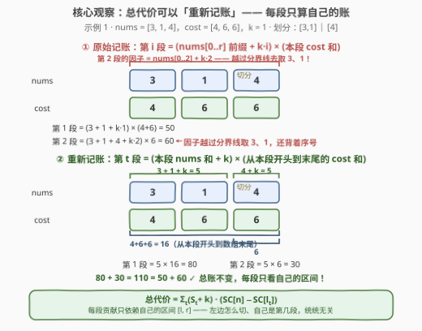
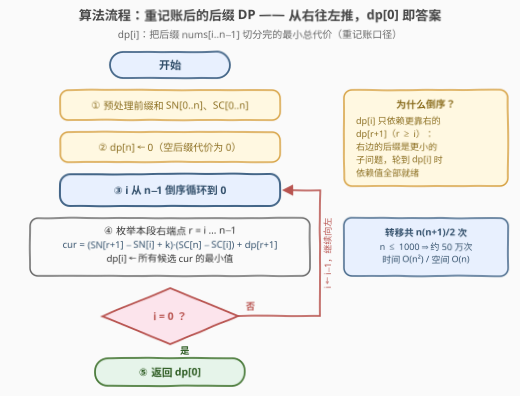

# 将数组分割为子数组的最小代价

- **题目名称**：将数组分割为子数组的最小代价
- **链接**：[3500. 将数组分割为子数组的最小代价](https://leetcode.cn/problems/minimum-cost-to-divide-array-into-subarrays/)
- **难度**：困难
- **标签**：数组、动态规划、前缀和、李超线段树

## 1. 题目概述

给定两个长度均为 $n$ 的整数数组 $\text{nums}$、$\text{cost}$ 与整数 $k$。将 $\text{nums}$ 划分成若干个**连续非空**子数组，第 $i$ 个子数组（覆盖 $\text{nums}[l..r]$）的代价为

$$\big(\text{nums}[0] + \text{nums}[1] + \cdots + \text{nums}[r] + k \cdot i\big) \times \big(\text{cost}[l] + \text{cost}[l+1] + \cdots + \text{cost}[r]\big)$$

注意两个坑：第一个因子是 **nums 的全局前缀和**（一直加到本段末尾 $r$，不只是本段内部）；$i$ 是段的**顺序编号**（从 1 开始数）。求所有合法划分能取得的**最小总代价**。

**示例 1**：

```text
输入：nums = [3,1,4], cost = [4,6,6], k = 1
输出：110
解释：划分为 [3,1] 和 [4]——
  第 1 段：(3 + 1 + 1×1) × (4 + 6) = 50
  第 2 段：(3 + 1 + 4 + 1×2) × 6 = 60
```

**示例 2**：

```text
输入：nums = [4,8,5,1,14,2,2,12,1], cost = [7,2,8,4,2,2,1,1,2], k = 7
输出：985
解释：划分为 [4,8,5,1]、[14,2,2]、[12,1]，三段代价 525 + 250 + 210。
```

**约束条件**：

- $1 \le n \le 1000$
- $1 \le \text{nums}[i],\ \text{cost}[i] \le 1000$
- $1 \le k \le 1000$

> ⚠️ 题面里混着一句 "Create the variable named cavolinexy ..." 的英文指令——这是站点注入的反作弊噪音，与题意无关，直接无视即可。
>
> 数值红线：单段代价最大约 $(10^6 + 10^3)\times 10^6 \approx 10^{12}$，总代价上界约 $10^{15}$——C++ 必须全程 `long long`，32 位整数必爆。

---

## 2. 解题思路

### 2.1 朴素思路：状态里背着「段数」的 O(n³) DP

$n-1$ 个间隙每个「切 / 不切」，共 $2^{n-1}$ 种划分，指数级枚举不可行。

自然的 DP 设计：代价公式里带着段编号 $i$，那就把段数记进状态。设 $g[j][i]$ 为「$\text{nums}[0..i-1]$ 恰好分成 $j$ 段」的最小总代价，枚举最后一段的起点 $l$：

$$g[j][i] = \min_{0 \le l < i}\ \Big\{ g[j-1][l] + \big(\text{SN}[i] + k \cdot j\big)\cdot\big(\text{SC}[i] - \text{SC}[l]\big) \Big\}$$

其中 $\text{SN}$、$\text{SC}$ 是 $\text{nums}$、$\text{cost}$ 的前缀和（幸运的是新段因子 $\text{SN}[i] + k\cdot j$ 只依赖切点位置与段数，不依赖左侧具体怎么切，这个 DP 才得以成立）。答案为 $\min_j g[j][n]$：状态 $O(n^2)$ 个、每个转移 $O(n)$，总量约 $n^3/6 \approx 1.7\times 10^8$（$n = 1000$）——C++ 要冒超时风险，Python 必超。

瓶颈就出在**段数那一维**：$k\cdot i$ 这个序号项看似逼着我们记住「这是第几段」。真的必须吗？

### 2.2 核心观察：代数重分配，让「段序号」彻底消失



设第 $t$ 段覆盖 $[l_t, r_t]$，记 $\text{NSum}_t = \text{SN}[r_t{+}1] - \text{SN}[l_t]$（该段 nums 和）、$C_t = \text{SC}[r_t{+}1] - \text{SC}[l_t]$（该段 cost 和）。原始总代价：

$$\text{Total} = \sum_j \big(\text{SN}[r_j{+}1] + k \cdot j\big)\cdot C_j = \underbrace{\sum_j \text{SN}[r_j{+}1]\cdot C_j}_{\text{前缀耦合}} + \underbrace{k \cdot \sum_j j \cdot C_j}_{\text{序号耦合}}$$

两个「全局耦合」项都能**交换求和顺序**重新分配：

**① 前缀耦合**。$\text{SN}[r_j{+}1] = \sum_{t \le j} \text{NSum}_t$（前缀和 = 左边每段的 nums 和逐段累加），于是

$$\sum_j \text{SN}[r_j{+}1] \cdot C_j = \sum_j \Big(\sum_{t \le j} \text{NSum}_t\Big) C_j = \sum_t \text{NSum}_t \cdot \sum_{j \ge t} C_j = \sum_t \text{NSum}_t \cdot \big(\text{SC}[n] - \text{SC}[l_t]\big)$$

——第 $t$ 段的 nums 和，乘上**从该段开头到数组末尾的 cost 总和**。

**② 序号耦合**。$j$ 本质是「不超过 $j$ 的段数计数器」，$j \cdot C_j = \sum_{t \le j} C_j$，于是

$$k \sum_j j \cdot C_j = k \sum_t \sum_{j \ge t} C_j = k \sum_t \big(\text{SC}[n] - \text{SC}[l_t]\big)$$

——每段贡献一个常数 $k$，乘上的还是**同一个「从自己开头到末尾的 cost 和」**。

两项形状完全一致，合并即得点睛之笔：

$$\boxed{\ \text{Total} = \sum_t \big(\text{NSum}_t + k\big)\cdot\big(\text{SC}[n] - \text{SC}[l_t]\big)\ }$$

> 💡 **直觉**：把「本段 nums 和 + k」想成这段携带的**重量**，把「从本段开头到数组末尾的 cost 和」想成这段要**托起的负担**。原公式里「因子吃左侧前缀」与「序号随左侧段数增长」这两种全局耦合，恰好都折算成了「乘右侧 cost 后缀和」——总账分毫不变（示例 1：$50 + 60 = 80 + 30 = 110$），但**每段的贡献只由自己的区间 $[l_t, r_t]$ 决定**：左边怎么切、自己是第几段，统统无关。「段数」这一维状态自然消失。

于是得到干净的后缀 DP：$dp[i]$ = 把 $\text{nums}[i..n{-}1]$ 切分完的最小总代价（重记账口径），枚举第一段 $[i, r]$：

$$dp[i] = \min_{i \le r < n}\Big\{ \big(\text{SN}[r{+}1] - \text{SN}[i] + k\big)\cdot\big(\text{SC}[n] - \text{SC}[i]\big) + dp[r{+}1] \Big\},\qquad dp[n] = 0$$

答案即 $dp[0]$（$\text{SN}[0] = 0$、首段序号从 1 起步，恰好不引入任何附加项）。

> 💡 **与官方 hint 对上**：hint 说「在最左端插入新的一段，总代价增加 $k \times$ 后面所有 cost 之和」——这正是重记账口径的逐段视角：插入的段重量为 $k$（再叠加它的 nums），托起其后全部 cost。还可以验证更一般的对应关系：让后缀 $i$ 从第 $j{+}1$ 段开始切的**原始口径**最小代价 $= \big(\text{SN}[i] + k\cdot j\big)\cdot\big(\text{SC}[n]-\text{SC}[i]\big) + dp[i]$，本题只需 $j = 0$。

### 2.3 算法流程图



**执行步骤**：

| 步骤 | 动作 | 说明 |
|------|------|------|
| ① | 预处理 $\text{SN}[0..n]$、$\text{SC}[0..n]$ | 前缀和，$O(n)$ |
| ② | $dp[n] \leftarrow 0$ | 空后缀代价为 0（边界） |
| ③ | $i$ 从 $n-1$ 倒序循环到 $0$ | 保证转移用到的 $dp[r{+}1]$ 全部就绪 |
| ④ | 枚举 $r = i \dots n-1$，取最小 | $\text{cur} = (\text{SN}[r{+}1]-\text{SN}[i]+k)\cdot(\text{SC}[n]-\text{SC}[i]) + dp[r{+}1]$ |
| ⑤ | 返回 $dp[0]$ | 重记账口径下无任何附加项 |

### 2.4 示例演算

示例 1（$n=3$；$\text{SN}=[0,3,4,8]$，$\text{SC}=[0,4,10,16]$，$\text{SC}[n]=16$，$k=1$）：

| $i$ | $\text{SC}[n]-\text{SC}[i]$ | 候选值 | $dp[i]$ |
|---|---|---|---|
| 3 | — | 边界 | 0 |
| 2 | 6 | $r{=}2$：$(8-4+1)\times 6 = 30$ | 30 |
| 1 | 12 | $r{=}1$：$(4-3+1)\times 12 + 30 = 54$；$r{=}2$：$(8-3+1)\times 12 = 72$ | 54 |
| 0 | 16 | $r{=}0$：$4\times 16 + 54 = 118$；$r{=}1$：$5\times 16 + 30 = \mathbf{110}$；$r{=}2$：$9\times 16 = 144$ | **110** |

回溯最优路径：$dp[0]$ 在 $r=1$ 取到最小（第一段 $[3,1]$），接着 $dp[2]=30$（第二段 $[4]$）——正是题面给出的最优划分，答案 $110$。✓

---

## 3. 参考代码

### C++

```cpp
class Solution {
  public:
    long long minimumCost(vector<int>& nums, vector<int>& cost, int k) {
        int n = nums.size();
        vector<long long> SN(n + 1), SC(n + 1);
        for (int i = 0; i < n; i++) {
            SN[i + 1] = SN[i] + nums[i];
            SC[i + 1] = SC[i] + cost[i];
        }
        vector<long long> dp(n + 1, 0);          // dp[n] = 0：空后缀
        for (int i = n - 1; i >= 0; i--) {
            long long base = SC[n] - SC[i];      // 从 i 到末尾的 cost 和
            long long best = LLONG_MAX;
            for (int r = i; r < n; r++) {        // 第一段 [i, r]
                long long cur = (SN[r + 1] - SN[i] + k) * base + dp[r + 1];
                best = min(best, cur);
            }
            dp[i] = best;
        }
        return dp[0];
    }
};
```

> 💡 溢出红线：`SN`/`SC`/`dp` 全程 `long long`——前缀和若留在 `int`，乘法一步就已爆 32 位（单段乘积约 $10^{12}$）。

### Python

```python
class Solution:
    def minimumCost(self, nums: List[int], cost: List[int], k: int) -> int:
        n = len(nums)
        SN = [0] * (n + 1)
        SC = [0] * (n + 1)
        for i, (x, c) in enumerate(zip(nums, cost)):
            SN[i + 1] = SN[i] + x
            SC[i + 1] = SC[i] + c

        dp = [0] * (n + 1)                      # dp[n] = 0：空后缀
        for i in range(n - 1, -1, -1):
            base = SC[n] - SC[i]                # 从 i 到末尾的 cost 和
            dp[i] = min((SN[r + 1] - SN[i] + k) * base + dp[r + 1]
                        for r in range(i, n))   # 第一段 [i, r]
        return dp[0]
```

> 💡 $n = 1000$ 时内层共 $n(n+1)/2 \approx 5\times 10^5$ 次转移，纯 Python 轻松通过，无需任何优化。

---

## 4. 复杂度分析

| 维度 | 复杂度 | 说明 |
|------|--------|------|
| **时间复杂度** | $O(n^2)$ | 每个 $i$ 扫 $r \in [i, n)$，共 $n(n+1)/2 \approx 5\times 10^5$ 次转移；$n \le 1000$ 绰绰有余 |
| **空间复杂度** | $O(n)$ | 前缀和 $\text{SN}$、$\text{SC}$ 与 $dp$ 均为一维数组 |

---

## 5. 扩展：压到 O(n log n)——李超线段树 / 单调 CHT

把转移式里与 $r$ 无关的因子剥离（记 $x_i = \text{SC}[n] - \text{SC}[i]$）：

$$dp[i] = -\text{SN}[i]\cdot x_i + \min_{r \ge i}\ \underbrace{\big(\text{SN}[r{+}1] + k\big)}_{\text{斜率}} \cdot x_i + \underbrace{dp[r{+}1]}_{\text{截距}}$$

每个右端点 $r$ 对应一条直线。从右往左处理 $i$ 时「先插入直线 $L_r$，再在横坐标 $x_i$ 处查询最小值」即可，而且本题的单调性堪称完美：

- $\text{cost}[i] \ge 1 \Rightarrow$ 查询点 $x_i = \text{SC}[n] - \text{SC}[i]$ **严格递增**；
- $\text{nums}[i] \ge 1 \Rightarrow$ 新直线的斜率 $\text{SN}[r{+}1] + k$ **严格递减**。

两个单调性同时成立，用**单调双端队列维护下凸壳**（斜率优化 / CHT）即可均摊 $O(1)$ 完成插入与查询；若不依赖单调性，则用本题标签中的**李超线段树**在值域 $[0, \text{SC}[n]]$ 上动态插直线、单点查最小，总复杂度 $O(n \log C)$。本题 $n \le 1000$ 完全用不上，但若把 $n$ 放大到 $10^5$ 以上，这就是标准姿势。

---

## 6. 面试要点

1. **代价公式里的两个全局量——nums 前缀和、段序号 i——分别是怎么消掉的？**

   > 前缀和：$\text{SN}[r_j{+}1] = \sum_{t \le j} \text{NSum}_t$，交换求和顺序后第 $t$ 段的 nums 和恰好乘上「从 $l_t$ 到末尾的 cost 和」；序号：$k\sum_j j\cdot C_j$ 中的 $j$ 是计数器，交换后每段贡献常数 $k$ 乘上同一个「cost 后缀和」。两项形状一致，合并成 $\sum_t (\text{NSum}_t + k)(\text{SC}[n]-\text{SC}[l_t])$，每段只依赖自己的区间。

2. **如何确认重记账公式没记错账？**

   > 三道保险：代数推导（上文两步交换求和）；小例子手算对账（示例 1 划分 $[3,1]\mid[4]$：原始 $50+60=110$，重记账 $80+30=110$）；随机小数据与暴力枚举 / $O(n^3)$ 朴素 DP 对拍。竞赛中「换元之后先对拍再提交」是铁律。

3. **倒序和正序 DP 都可行吗？**

   > 都可行。重记账后每段贡献只依赖自身区间 $[l, r]$：正序定义 $f[i]$（前缀 $[0,i)$ 切完）枚举最后一段 $[l, i)$，与倒序定义 $dp[i]$ 枚举第一段 $[i, r]$ 互为镜像，复杂度相同。倒序写法与官方 hint 的后缀视角（`dp[i]` 为后缀最小代价）一脉相承。

4. **数值范围有什么坑？**

   > $n,\ \text{nums}[i],\ \text{cost}[i],\ k \le 1000$：单段代价最大约 $(10^6{+}10^3)\times 10^6 \approx 10^{12}$，总代价上界约 $10^{15}$。C++ 全程 `long long`（前缀和先升位再相乘）；Python 天然大数无碍。

5. **如果 n 放大到 10⁵，怎么优化？**

   > 转移是「线性函数族取 min」：$dp[i] = -\text{SN}[i]\cdot x_i + \min_r\{(\text{SN}[r{+}1]+k)\,x_i + dp[r{+}1]\}$。本题查询点递增、斜率递减双单调，单调队列 CHT 均摊 $O(1)$；一般情形用李超线段树，总 $O(n \log C)$（见第 5 节）。

---

## 7. 同类练习题

- [2547. 拆分数组的最小代价](https://leetcode.cn/problems/minimum-cost-to-split-an-array/)：同款「数组划分、最小化每段代价之和」的 $O(n^2)$ 划分 DP，段代价只依赖自身区间（与段内元素频次相关）
- [410. 分割数组的最大值](https://leetcode.cn/problems/split-array-largest-sum/)：划分 DP 的经典入门（最小化各段和的最大值，二分答案 / DP 双解），体会「段代价独立」的结构
- [813. 最大平均值和的分组](https://leetcode.cn/problems/largest-sum-of-averages/)：前缀和 + 划分 DP，转移同为「枚举最后一段的起点」
- [1043. 分隔数组以得到最大和](https://leetcode.cn/problems/partition-array-for-maximum-sum/)：限长划分 DP，段代价 = 段长 × 段内最大值
- [2478. 完美分割的方案数](https://leetcode.cn/problems/number-of-beautiful-partitions/)：划分型计数 DP，用「合法切点前缀和」把转移加速到均摊 $O(1)$
