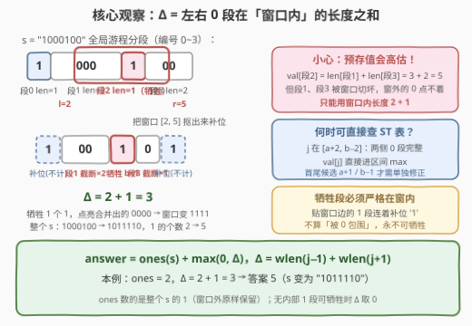
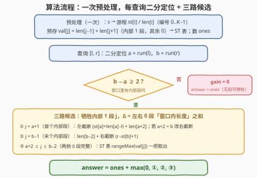

# LeetCode 操作后最大活跃区段数 II 题解

## 1. 题目概述

- **标题 / 题号**：操作后最大活跃区段数 II（#3501，hard）
- **链接**：https://leetcode.cn/problems/maximize-active-section-with-trade-ii/
- **难度**：困难
- **标签**：线段树、数组、字符串、二分查找

**题意**：给你一个长度为 $n$ 的二进制字符串 $s$，其中：

- `'1'` 表示一个**活跃**区段；
- `'0'` 表示一个**非活跃**区段。

你最多可以进行**一次操作**来最大化活跃区段数，操作分两步：

1. 将一个**被 `'0'` 包围**的连续 `'1'` 区块转换为全 `'0'`（牺牲）；
2. **然后**，将一个**被 `'1'` 包围**的连续 `'0'` 区块转换为全 `'1'`（点亮）。

再给你二维数组 `queries`，其中 `queries[i] = [li, ri]`。对每个查询，**仅对子字符串 $s[l_i..r_i]$ 处理**：将其看作两端各补一个 `'1'` 的字符串 $t = \texttt{1} + s[l_i..r_i] + \texttt{1}$（补位的 `'1'` 只当「靠山」，不贡献计数），在这框架内做最优操作，求操作后**整个 $s$** 中可能的最大活跃区段数。各查询相互独立，返回答案数组。

**示例 1**：

```text
输入：s = "01", queries = [[0,1]]
输出：[1]
解释：窗口 "01" 中没有被 '0' 包围的 '1' 区块，无法操作，答案为 1。
```

**示例 2**：

```text
输入：s = "0100", queries = [[0,3],[0,2],[1,3],[2,3]]
输出：[4,3,1,1]
解释：
[0,3]：t = "101001"，牺牲中间的 "1" 得 "100001"，点亮 "0000" → 子串变 "1111"，全串 4 个 1；
[0,2]：t = "10101"，牺牲 "1" 得 "10001"，点亮 "000" → 子串变 "111"，全串 "1110" 共 3 个 1；
[1,3] / [2,3]：窗口内没有被 0 包围的 1 块，无法操作，答案均为 1。
```

**示例 3**：

```text
输入：s = "1000100", queries = [[1,5],[0,6],[0,4]]
输出：[6,7,2]
解释：
[1,5]：牺牲 s[4] 的 "1" 后整片点亮，s 变 "1111110"，共 6 个 1；
[0,6]：牺牲中间的 "1" 后点亮合并段，s 变 "1111111"，共 7 个 1；
[0,4]：窗口 "10001" 的两个 1 块都贴边（连着补位 '1'），无法牺牲，答案 2。
```

**示例 4**：

```text
输入：s = "01010", queries = [[0,3],[1,4],[1,3]]
输出：[4,4,2]
解释：[0,3] 与 [1,4] 各牺牲中间贴零的 "1" 后点亮合并段，全串均 4 个 1；[1,3] 的 1 块全部贴边，无法操作，答案 2。
```

**约束**：

- $1 \le n = |s| \le 10^5$
- $1 \le |\textit{queries}| \le 10^5$
- $s_i$ 只有 `'0'` 或 `'1'`
- $0 \le l_i \le r_i < n$

> 💡 **读题关键**：
> ① 「活跃区段数」数的是 **`'1'` 字符的个数**，且数的是**整个 $s$**——窗口外的 `'1'` 原样保留、照样计数（示例 2 查询 `[2,3]`：窗口 `"00"` 内一个 1 都没有，答案却是 1）；
> ② 操作**两步连环**，不能只做第二步白赚（示例 3 查询 `[0,4]` 窗口 `"10001"` 里明明有被 1 包围的 `"000"`，但没有可牺牲的 1 块，一步都做不了）；
> ③ 补位 `'1'` 只当「靠山」：窗口边缘的 0 块借它算「被 1 包围」、**可以点亮**；窗口边缘的 1 块与它相连成块、不算「被 0 包围」、**不可牺牲**。

## 2. 解题思路

### 2.1 暴力思路：逐查询抠子串模拟

对每个查询把子串抠出来补位成 $t$，枚举「牺牲哪个 1 块 × 点亮哪个 0 块」，模拟完再数一遍 `'1'` 的个数：单查询 $O(n^2)$，总计 $O(qn^2)$，$n, q \le 10^5$ 必然爆炸。浪费在于：$q$ 个查询反复在同一根字符串上切游程。出路是**全局分段一次，每个查询 $O(\log n)$ 组装答案**。

### 2.2 核心观察：全局游程编号 + 窗口截断的收益公式



[3499](../3401-3500/3499_操作后最大活跃区段数I.md) 已算清窗口内的交易账：牺牲长 $b$ 的内部 1 段，与左右 0 段（长 $a$、$c$）合并成 $0^{a+b+c}$ 再整体点亮，净收益

$$\Delta = (a + b + c) - b = a + c$$

且**点亮合并段恒为最优**（点亮远处 $0^L$ 的收益是 $L - b$，不如牺牲其旁 1 段的 $L + e$，$e \ge 1$）。3501 只剩一个新问题：**$q$ 个窗口怎么共享一次分段？**

**全局游程编号**。把整个 $s$ 切成 $K$ 段游程，段 $i$ 记起点 $st[i]$、长度 $len[i]$、字符 $ch[i]$。查询 $[l, r]$ 用二分定位 $a = \textit{run}(l)$、$b = \textit{run}(r)$：

- 段 $a+1 \dots b-1$ **完整**落在窗口内，是仅有的「内部段」——牺牲对象只能从这里出；
- 段 $a$、$b$ 可能被窗口**切坏**，只有窗口内的部分有效。

**收益的窗口修正**。对内部 1 段 $j$，$\Delta(j) = \textit{wlen}(j-1) + \textit{wlen}(j+1)$，其中 $\textit{wlen}$ 是该 0 段**在窗口内的长度**：

- $j \in [a+2,\, b-2]$：两侧 0 段完整 → $\Delta = len[j-1] + len[j+1]$，与窗口无关，可**预存**成 $val[j]$ 交给 ST 表做区间最大值；
- $j = a+1$：左 0 段被切 → $\Delta = \underbrace{(st[a] + len[a] - l)}_{\text{左截断}} + len[a+2]$（当 $a+2 = b$ 时右侧也被切，用 $r - st[b] + 1$）；
- $j = b-1$：右 0 段被切 → $\Delta = len[b-2] + \underbrace{(r - st[b] + 1)}_{\text{右截断}}$。

首尾两个候选 $O(1)$ 现场修正，中间整段交给 ST 表——这正是官方提示所说的「首尾段单独处理」。**⚠️ 预存值不能无脑用到首尾**：示例 2 查询 `[0,2]` 中 $val = 1 + 2 = 3$ 会算出答案 4，截断成 $1 + 1 = 2$ 才是正确答案 3。

**无候选判定**：$b - a < 2$（窗口不足 3 段），或内部段全是 0 段（只在 $b-a=2$ 且 $ch[a]='1'$ 时发生）→ 无法操作，$\Delta = 0$，$\max\{0,\cdot\}$ 天然吸收。

**答案**：

$$\textit{answer} = \operatorname{ones}(s) + \max\{0,\ \max_j \Delta(j)\}$$

其中 $\operatorname{ones}(s)$ 对所有查询是**同一个常数**——窗口外的 1 从不动摇，连前缀和都不用建。

### 2.3 算法流程图



### 2.4 示例演算

$s = \texttt{1000100}$（$\operatorname{ones} = 2$）分段：段0「1」、段1「000」、段2「1」、段3「00」，预存 $val[2] = len[1] + len[3] = 5$，其余 $val = 0$：

| 查询 | $a, b$ | 候选演算 | $\Delta$ | 答案 |
|------|--------|----------|----------|------|
| [1,5] | 1, 3 | $j = a{+}1 = 2$（两侧都切）：$(1{+}3{-}1) + (5{-}5{+}1) = 3+1$ | 4 | $2+4 = 6$ |
| [0,6] | 0, 3 | $j = b{-}1 = 2$（右切）：$len[1] + (6{-}5{+}1) = 3+2$ | 5 | $2+5 = 7$ |
| [0,4] | 0, 2 | 内部只有段1（0 段），无牺牲对象 | 0 | $2$ |

三条均与官方解释吻合（[1,5] 牺牲后全串 `"1111110"` 共 6 个 1）。本例 $K = 4$，中间段区间 $[a+2, b-2]$ 恒为空，ST 表未出场——更长的串上中间候选才走查表路径，首尾修正是每一步都绕不开的活。

## 3. 参考代码

### C++（ST 表，O(1) 区间最大值）

```cpp
class Solution {
  public:
    vector<int> maxActiveSectionsAfterTrade(string s, vector<vector<int>>& queries) {
        int n = s.size(), ones = 0;
        for (char c : s) ones += (c == '1');

        vector<int> st, len, isOne;               // 游程：起点 / 长度 / 是否 1 段
        for (int i = 0; i < n;) {
            int j = i;
            while (j < n && s[j] == s[i]) j++;
            st.push_back(i);
            len.push_back(j - i);
            isOne.push_back(s[i] == '1');
            i = j;
        }
        int K = st.size();

        vector<int> val(K, 0);                    // 牺牲内部 1 段 j 的完整收益
        for (int j = 1; j + 1 < K; j++)
            if (isOne[j]) val[j] = len[j - 1] + len[j + 1];

        int LOG = 1;                              // ST 表：静态区间最大值
        while ((1 << LOG) <= K) LOG++;
        vector<vector<int>> sp(LOG, vector<int>(K, 0));
        sp[0] = val;
        for (int k = 1; k < LOG; k++)
            for (int i = 0; i + (1 << k) <= K; i++)
                sp[k][i] = max(sp[k - 1][i], sp[k - 1][i + (1 << (k - 1))]);

        auto rangeMax = [&](int lo, int hi) {
            int k = 31 - __builtin_clz(hi - lo + 1);
            return max(sp[k][lo], sp[k][hi - (1 << k) + 1]);
        };

        vector<int> ans;
        ans.reserve(queries.size());
        for (auto& q : queries) {
            int l = q[0], r = q[1];
            int a = upper_bound(st.begin(), st.end(), l) - st.begin() - 1;  // l 所在段
            int b = upper_bound(st.begin(), st.end(), r) - st.begin() - 1;  // r 所在段
            int gain = 0;
            if (b - a >= 2) {
                int L = st[a] + len[a] - l;       // 段 a 在窗口内的长度
                int R = r - st[b] + 1;            // 段 b 在窗口内的长度
                if (isOne[a + 1])                 // ① 牺牲首个内部段
                    gain = max(gain, L + (a + 2 == b ? R : len[a + 2]));
                if (b - 1 > a + 1 && isOne[b - 1])  // ② 牺牲末个内部段
                    gain = max(gain, len[b - 2] + R);
                if (a + 2 <= b - 2)               // ③ 中间完整段，ST 表一把取出
                    gain = max(gain, rangeMax(a + 2, b - 2));
            }
            ans.push_back(ones + gain);
        }
        return ans;
    }
};
```

### Python

```python
from bisect import bisect_right
from typing import List


class Solution:
    def maxActiveSectionsAfterTrade(self, s: str, queries: List[List[int]]) -> List[int]:
        n = len(s)
        st, ln, is_one = [], [], []               # 游程：起点 / 长度 / 是否 1 段
        i = 0
        while i < n:
            j = i
            while j < n and s[j] == s[i]:
                j += 1
            st.append(i)
            ln.append(j - i)
            is_one.append(s[i] == '1')
            i = j
        K = len(st)
        ones = s.count('1')

        val = [0] * K                             # 牺牲内部 1 段 j 的完整收益
        for j in range(1, K - 1):
            if is_one[j]:
                val[j] = ln[j - 1] + ln[j + 1]

        sp = [val]                                # ST 表：静态区间最大值
        k = 1
        while (1 << k) <= K:
            prev, half = sp[-1], 1 << (k - 1)
            sp.append([max(prev[i], prev[i + half]) for i in range(K - (1 << k) + 1)])
            k += 1

        def range_max(lo: int, hi: int) -> int:
            k = (hi - lo + 1).bit_length() - 1
            return max(sp[k][lo], sp[k][hi - (1 << k) + 1])

        ans = []
        for l, r in queries:
            a = bisect_right(st, l) - 1           # l 所在段
            b = bisect_right(st, r) - 1           # r 所在段
            gain = 0
            if b - a >= 2:
                L = st[a] + ln[a] - l             # 段 a 在窗口内的长度
                R = r - st[b] + 1                 # 段 b 在窗口内的长度
                if is_one[a + 1]:                 # ① 牺牲首个内部段
                    gain = max(gain, L + (R if a + 2 == b else ln[a + 2]))
                if b - 1 > a + 1 and is_one[b - 1]:  # ② 牺牲末个内部段
                    gain = max(gain, ln[b - 2] + R)
                if a + 2 <= b - 2:                # ③ 中间完整段
                    gain = max(gain, range_max(a + 2, b - 2))
            ans.append(ones + gain)
        return ans
```

> 💡 **写法要点**：
> - `upper_bound(st, l) - 1`（`bisect_right(st, l) - 1`）定位 $l$ 所在段：$st$ 有序，取最后一个起点 $\le l$ 的段；
> - 候选①里的 `a + 2 == b` 分支是 $b - a = 2$ 的特判——此时牺牲段 $a+1$ 的**两侧**都是被切坏的边缘段，右邻也要用截断长度 $R$；
> - `gain` 初值 0 天然吸收「不操作」选项（$\Delta$ 存在时至少为 2，不写 $\max\{0,\cdot\}$ 也不出错，但写上更稳）；
> - ST 表换成线段树（官方标签即 Segment Tree）完全等价：本题静态无修改，ST 表查询 $O(1)$ 更划算。

## 4. 复杂度分析

| 维度 | 复杂度 | 说明 |
|------|--------|------|
| 时间复杂度 | $O(n + (n + q)\log n)$ | 分段 $O(n)$；ST 表 $O(K\log K)$；每查询二分 $O(\log K)$ + 区间最大值 $O(1)$ |
| 空间复杂度 | $O(n\log n)$ | ST 表占大头；游程数组 $O(K)$ |
| 数据结构替换 | 线段树：时间 $O((n+q)\log n)$、空间 $O(n)$ | 查询变 $O(\log n)$；无修改场景两者皆可 |

> ⚠️ 对照暴力的 $O(qn^2)$：优化来自「**共享一次分段**」——把每个窗口各自的游程结构，坍缩成全局编号上的三路 $O(1)$ / $O(\log n)$ 候选。预处理换查询自由，是多询问题的通用杠杆。

## 5. 面试要点

1. **3501 与 3499 的本质区别是什么？**

   > 交易账目（$\Delta = a + c$、点亮合并段恒优）完全不变；变的是**组织方式**：单窗口的一趟线性扫描，升级为「全局分段 + 预存 $val$ + 静态区间最大值」的问答结构。难点从思维转移到了边界工程。

2. **答案里的 ones 是子串的还是整个 s 的？**

   > 整个 $s$ 的，且对所有查询是同一个常数。示例 2 查询 `[2,3]`：窗口 `"00"` 内无 1，答案却是 1——窗口外 $s[1]$ 的 1 照常计数。误用「子串内 1 的个数」会把该例算成 0。

3. **为什么首尾候选必须单独修正？**

   > 段 $a$、$b$ 可能只被窗口盖住一半，预存 $val[j] = len[j-1] + len[j+1]$ 用的是全长度，会把**窗口外的 0 也点亮**，高估收益。示例 2 查询 `[0,2]`：全长度 $1+2=3$ 得答案 4（错），截断 $1+1=2$ 得答案 3（对）。只有完整落在窗口内的 $j \in [a+2, b-2]$ 才能直接查表。

4. **牺牲段为什么必须「严格」在窗口内部？**

   > 贴窗口边的 1 段与补位 `'1'` 相连成块，不满足「被 0 包围」，永不可牺牲——段 $a$、$b$ 即使是 1 段也只能当被截断的 0 邻居（此时 $a+1$ 是 0 段，代码里的字符判断自然跳过候选①②）。同理，窗口内「内部段」的下标范围恰是 $a+1 \dots b-1$，两端天然排除。

5. **ST 表和线段树在这里怎么选？**

   > 本题是**静态数组、无修改、查询区间最大值**，$\max$ 满足可重复贡献（重叠区间取 max 不影响结果），ST 表 $O(1)$ 查询正合适；线段树的优势在支持单点/区间修改，本题用不上，但作为官方标签的通用解法同样正确。

> 💡 **一句话总结**：3501 = 3499 的账 + 多查询的壳——全局游程编号后，每个查询只剩「二分定位首尾段、截断修正两个边缘候选、ST 表掏出中间完整段的最大值」，答案是常数 $\operatorname{ones}(s)$ 加上这三路候选的最大值。

## 同类练习题

| # | 题目 | 与本题的关联 |
|---|------|-------------|
| 3499 | [操作后最大活跃区段数 I](https://leetcode.cn/problems/maximize-active-section-with-trade-i/)（[题解](../3401-3500/3499_操作后最大活跃区段数I.md)） | 本题的线性版单询问，先吃透「$\Delta = a + c$」再上区间查询 |
| 239 | [滑动窗口最大值](https://leetcode.cn/problems/sliding-window-maximum/)（[题解](../0201-0300/239_滑动窗口最大值.md)） | 区间最值的滑动窗口形态（单调队列），与本题的 ST 表互为补充 |
| 1177 | [构建回文串检测](https://leetcode.cn/problems/can-make-palindrome-from-substring/) | 同样「多子串查询 → 前缀预处理、$O(1)$ 应答」的组织套路 |
| 1869 | [哪种连续子字符串更长](https://leetcode.cn/problems/longer-contiguous-segments-of-ones-than-zeros/)（[题解](../1801-1900/1869_哪种连续子字符串更长.md)） | 0/1 游程分段基本功 |
| 1493 | [删掉一个元素以后全为 1 的最长子数组](https://leetcode.cn/problems/longest-subarray-of-1s-after-deleting-one-element/)（[题解](../1401-1500/1493_删掉一个元素以后全为1的最长子数组.md)） | 段合并的对偶题（删 0 并 1 段），与本题「牺牲 1 并 0 段」互为镜像 |
