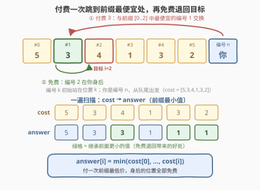
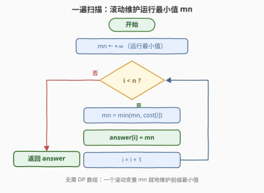

# LeetCode 到达每个位置的最小费用 题解

## 1. 题目概述

- **标题 / 题号**：到达每个位置的最小费用（#3502，easy）
- **链接**：https://leetcode.cn/problems/minimum-cost-to-reach-every-position/
- **难度**：简单
- **标签**：数组

**题意**：给你一个长度为 `n` 的整数数组 `cost`。当前你位于位置 `n`（队伍的末尾），队伍中共有 `n + 1` 人，编号从 `0` 到 `n`——编号 `i` 的人初始站在位置 `i`，而你就是编号 `n` 的那个人。

你希望在队伍中向前移动，但队伍中每个人都会收取一定的费用才能与你**交换**位置：与编号 `i` 的人交换位置的费用为 `cost[i]`。交换规则：

- 如果对方**在你前面**（当前位置比你靠前），你**必须**支付 `cost[i]` 才能与其交换；
- 如果对方**在你后面**，他们可以**免费**与你交换位置。

返回一个大小为 `n` 的数组 `answer`，其中 `answer[i]` 表示到达队伍中位置 `i` 所需的**最小**总费用。

**示例 1**：

```text
输入：cost = [5,3,4,1,3,2]
输出：[5,3,3,1,1,1]
解释：i = 2 时，花 3 与编号 1 的人交换，再免费与编号 2 的人交换；
      i = 4 时，花 1 与编号 3 的人交换，再免费与编号 4 的人交换。
```

**示例 2**：

```text
输入：cost = [1,2,4,6,7]
输出：[1,1,1,1,1]
解释：花 1 与编号 0 的人交换后，可以免费到达队伍中的任何位置。
```

**约束**：

- `1 <= n == cost.length <= 100`
- `1 <= cost[i] <= 100`

> 💡 **读题关键**：「在你前面」按**当前位置**判断，而费用按**人的编号**收取——两个坐标系的错位是本题全部的坑与巧。另外，交换是**任意两人的位置对调**：你可以直接和队伍最前面的任何人交换，不必逐位挪动。

## 2. 解题思路

### 2.1 暴力思路：对每个目标重扫前缀

把过程当成图搜索（状态 = 整个队伍的排列）会直接爆炸——排列数是 $(n+1)!$ 量级。突破口是先猜结构再验证：到达 $i$ 的最优策略形如「**付费一次**跳到某个 $j \le i$，再免费退回 $i$」（2.2 给出证明）。于是对每个 $i$ 枚举付费对象：

```text
for i = 0 .. n-1:
    best = +∞
    for j = 0 .. i:          # 枚举付费对象
        best = min(best, cost[j])
    answer[i] = best
```

复杂度 $O(n^2)$，$n \le 100$ 时最多 $10^4$ 次比较，提交也能过。但内层循环高度重复：算 `answer[5]` 时把 `[0..5]` 扫了一遍，算 `answer[6]` 时又把 `[0..6]` **重扫**一遍——前缀只变长一格，此前的最小值原封不动可复用。把「重复扫描」压成「边走边维护」，就是一遍扫描的前缀最小值。

### 2.2 核心观察：付费一次到前缀最便宜处，再免费退回



**结论**：$\text{answer}[i] = \min(\text{cost}[0..i])$，即 **cost 的前缀最小值数组**。分两个方向证明。

**上界（花这么多一定够）**：设 $j$ 是 $[0, i]$ 中 $\text{cost}$ 最小的一个位置。从位置 $n$ 出发，编号 $j$ 的人此刻正在位置 $j$，在你前面——与他交换，支付 $\text{cost}[j]$，你落到位置 $j \le i$。若 $j = i$，到此为止；若 $j < i$，编号 $i$ 的人还在位置 $i$，如今已在你**身后**——与他交换**免费**，你退到位置 $i$。总费用恰为 $\min(\text{cost}[0..i])$。

**下界（不可能更省）**：考察**任何**一条到达位置 $i$ 的交换序列。你从位置 $n$ 出发，追踪你**第一次**落到某个 $\le i$ 位置的那次交换：交换前你在位置 $x > i$，交换对象在位置 $y \le i$，对方在你前面，这是一次**付费**交换。此刻的关键不变量：

> 在你第一次进入位置 $\le i$ 之前，编号 $0..i$ 的这 $i+1$ 个人从未与你交换过，仍全部待在原位。

因为其中任何人与你交换，都会把你放到他所在的 $\le i$ 位置上，与「第一次」矛盾。于是这次付费的对象编号 $y \le i$，仅此一跳就花掉 $\text{cost}[y] \ge \min(\text{cost}[0..i])$，总费用不可能更低。

两个方向合龙：$\text{answer}[i] = \min(\text{cost}[0..i])$。

> ⚠️ **常见误读**：以为到达 $i$ 必须「逐个付清」路上的人——不需要。交换是任意距离对调，付费一次可直接跳到队伍最前；而免费条款让「跳过头再退回来」零成本。示例 1 中 $\text{answer}[2]=3$：付 3 到位置 1，再免费退到位置 2，全程没碰 $\text{cost}[2]=4$。

### 2.3 算法流程图



一遍扫描，滚动维护运行最小值 $\text{mn}$：每读入一个 $\text{cost}[i]$，先更新 $\text{mn}$，再写入 $\text{answer}[i]$。没有回溯、没有嵌套——**一次遍历就是全部**。

### 2.4 示例演算

以 `cost = [5,3,4,1,3,2]` 走一遍扫描：

| $i$ | $\text{cost}[i]$ | $\text{mn} \leftarrow \min(\text{mn}, \text{cost}[i])$ | $\text{answer}[i]$ | 实际走法 |
|----|------------------|--------------------------------------------------------|--------------------|----------|
| 0 | 5 | 5 | **5** | 付 5 直达编号 0 |
| 1 | 3 | 3 | **3** | 付 3 直达编号 1 |
| 2 | 4 | 3 | **3** | 付 3 到编号 1，免费退到位置 2 |
| 3 | 1 | 1 | **1** | 付 1 直达编号 3 |
| 4 | 3 | 1 | **1** | 付 1 到编号 3，免费退到位置 4 |
| 5 | 2 | 1 | **1** | 付 1 到编号 3，免费退到位置 5 |

> 💡 $\text{mn}$ 一旦在 $i=3$ 处跌到 1，其后所有位置的答案都被它「封顶」。示例 2 是极端形态：全局最小值出现在 $i=0$，整个答案数组全为 1——**付一次最低价，身后随便逛**。

## 3. 参考代码

### C++

```cpp
class Solution {
  public:
    vector<int> minCosts(vector<int>& cost) {
        int n = cost.size();
        vector<int> answer(n);
        int mn = INT_MAX;
        for (int i = 0; i < n; i++) {
            mn = min(mn, cost[i]);
            answer[i] = mn;
        }
        return answer;
    }
};
```

### Python

```python
class Solution:
    def minCosts(self, cost: List[int]) -> List[int]:
        answer = []
        mn = inf
        for c in cost:
            mn = min(mn, c)
            answer.append(mn)
        return answer
```

> 💡 Python 一行版：`return list(accumulate(cost, min))`——`itertools.accumulate` 把聚合函数取成 `min`，产出的正是前缀最小值序列。C++ 若允许原地修改，也可直接覆写输入数组省去 `answer`，但独立开数组语义更清晰。

## 4. 复杂度分析

| 维度 | 复杂度 | 说明 |
|------|--------|------|
| 时间复杂度 | $O(n)$ | 单次遍历，每个位置一次比较；对照暴力版 $O(n^2) \le 10^4$ |
| 空间复杂度 | $O(1)$ | 仅一个运行变量 $\text{mn}$（输出数组不计入） |

## 5. 扩展：免费条款承担了多少结构？

做两个反事实思想实验：

- **若「与身后的人交换」也收费**：免费退回消失，跳过目标就回不来。到达 $i$ 的最后一步必然是「从某个 $x > i$ 付费落到位置 $i$」，而在此之前你从未进入 $\le i$，编号 $i$ 仍在原位——最后一步付的就是 $\text{cost}[i]$，中途在 $> i$ 区域的任何额外付费都只增不减。最优策略退化为「从队尾一步直达」，$\text{answer}[i] = \text{cost}[i]$，前缀最小值结构**荡然无存**。
- **若起点不是队尾而是任意位置 $p$**：不变量证明完全不受影响——编号 $0..i$ 的人在你首次进入 $\le i$ 前不会动。于是对 $i < p$ 仍有 $\text{answer}[i] = \min(\text{cost}[0..i])$；对 $i > p$（目标在身后）则一次免费交换直达，$\text{answer}[i] = 0$。**结论对起点鲁棒**，这正是不变量式证明的威力：它只关心「第一次跨界时的状态」，不关心你从哪里出发。

## 6. 面试要点

1. **为什么 answer[i] 恰好是前缀最小值？请双向论证。**

   > 上界（构造）：取 $j$ 为 $[0,i]$ 中 $\text{cost}$ 最小的位置，付费与编号 $j$ 交换直达位置 $j \le i$；若 $j < i$，编号 $i$ 已在身后，免费交换退回 $i$，总费用 $\min(\text{cost}[0..i])$。下界（不变量）：你第一次落到 $\le i$ 位置的那次交换必然付费，且此刻编号 $0..i$ 的人都还在原位（他们任何一次与你交换都会更早把你放进 $\le i$），故付费对象编号 $\le i$，费用不低于前缀最小值。

2. **「先越过目标再免费退回」为什么合法且最优？**

   > 合法：交换是任意两人的位置对调，与编号 $j < i$ 交换后，位置 $i$ 上的人变成「身后之人」，触发免费条款。最优：它让你只为前缀中最便宜的那一次付费，而不是逐个付清路过的人。

3. **如果删掉免费条款（身后交换也收费），答案变成什么？**

   > 退化成 $\text{answer}[i] = \text{cost}[i]$：最后一步必然付费落到位置 $i$（编号 $i$ 未动过，付 $\text{cost}[i]$），中途任何额外付费都白花，最优就是一步直达。免费条款正是「前缀最小值」结构的全部来源。

4. **代码需要专门的 DP 数组吗？**

   > 不需要。$\text{answer}[i]$ 只依赖运行最小值 $\text{mn}$，一个滚动变量足够；若允许原地修改，直接覆写输入数组即可。前缀和与前缀最值都只需一个滚动标量——需要留存的只是「累积结果」，无需整段历史。

5. **这个不变量论证还能用在哪？**

   > 「考察第一次穿越某边界时的系统状态」是交换 / 移动类下界证明的通用套路：本题用「首次进入 $\le i$」锁定付费对象的编号范围。类似地，跳跃游戏、接雨水等问题也常以「首次到达」或「首次失效」的时刻切开分析。

> 💡 **一句话总结**：3502 = 前缀最小值数组——付费一次跳到 $[0,i]$ 中最便宜的位置，身后免费退回；「费用按编号收、前方按位置判」的错位让越界回退零成本。

## 同类练习题

| # | 题目 | 与本题的关联 |
|---|------|-------------|
| 121 | [买卖股票的最佳时机](https://leetcode.cn/problems/best-time-to-buy-and-sell-stock/) | 同样一遍扫描维护前缀最小值，把它当「历史最低买入价」与当前价作差——前缀最值家族最经典的应用 |
| 2016 | [增量元素之间的最大差值](https://leetcode.cn/problems/maximum-difference-between-increasing-elements/)（[题解](../2001-2100/2016_增量元素之间的最大差值.md)） | 维护前缀最小值求「后面减前面」的最大差，与 121 同构的扫描模板 |
| 53 | [最大子数组和](https://leetcode.cn/problems/maximum-subarray/)（[题解](../0001-0100/53_最大子数组和.md)） | 前缀和配上「历史最小前缀和」，一遍扫描求最大区间和——两个滚动标量的组合技 |
| 724 | [寻找数组的中心下标](https://leetcode.cn/problems/find-pivot-index/)（[题解](../0701-0800/724_寻找数组的中心下标.md)） | 把聚合函数从 $\min$ 换成 $+$ 的前缀扫描，同一模板的不同实例化 |
