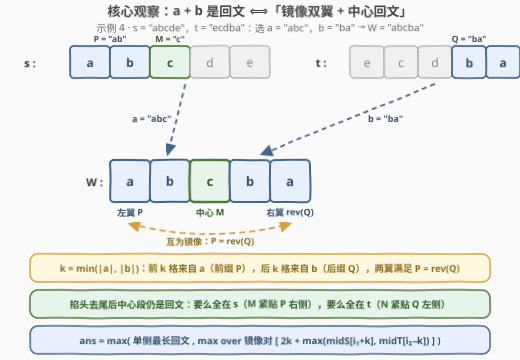
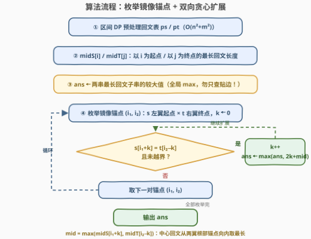

# 子字符串连接后的最长回文串 I

- **题目名称**：子字符串连接后的最长回文串 I
- **链接**：[3503. 子字符串连接后的最长回文串 I](https://leetcode.cn/problems/longest-palindrome-after-substring-concatenation-i/)
- **难度**：中等
- **标签**：双指针、字符串、动态规划、枚举

## 1. 题目概述

给你两个字符串 $s$ 和 $t$。你可以从 $s$ 中选择一个**子串**（可以为空）以及从 $t$ 中选择一个**子串**（可以为空），然后将它们**按顺序**连接（$s$ 的子串在前），得到一个新字符串。返回能构造出的**最长回文串**的长度。

**示例 1**：

```text
输入：s = "a", t = "a"
输出：2
解释：从 s 中选 "a"，从 t 中选 "a"，拼接得到 "aa"，长度为 2。
```

**示例 2**：

```text
输入：s = "abc", t = "def"
输出：1
解释：两串字符互不相同，最长回文只能是任意单个字符。
```

**示例 3**：

```text
输入：s = "b", t = "aaaa"
输出：4
解释：只从 t 中选 "aaaa"（s 侧选空），长度为 4。
```

**示例 4**：

```text
输入：s = "abcde", t = "ecdba"
输出：5
解释：从 s 中选 "abc"，从 t 中选 "ba"，拼接得到 "abcba"，长度为 5。
```

**约束条件**：

- $1 \le \text{s.length}, \text{t.length} \le 30$
- $s$ 和 $t$ 仅由小写英文字母组成

> 💡 两个子串**都可以为空**，所以「只用 $s$」「只用 $t$」「单字符」都是合法方案；由于 $s$、$t$ 非空，答案至少为 $1$。

---

## 2. 解题思路

### 2.1 暴力思路：枚举全部拼接

官方 hint 只有一句 *Brute force*——最直接的做法：枚举 $s$ 的所有 $O(n^2)$ 个子串（含空串）与 $t$ 的所有 $O(m^2)$ 个子串（含空串），两两拼接后判断是否回文：

$$O\big(n^2 \, m^2 \, (n+m)\big) \approx 30^2 \times 30^2 \times 60 \approx 4.9 \times 10^7$$

在 $n, m \le 30$ 下 C++ 可以直接过（判回文可用 `string(rbegin, rend)` 比较）；Python 若借助切片反转 `w == w[::-1]`（C 层实现）也勉强可行，但纯字符循环就会很慢。更重要的是，暴力完全没有利用回文的**结构**——而 $n, m \le 30$ 这个温和的范围，其实是在暗示「比暴力更聪明的枚举」也绰绰有余。

### 2.2 核心观察：镜像双翼 + 中心回文



设 $a$ 是 $s$ 中选出的子串、$b$ 是 $t$ 中选出的子串，$W = a + b$ 是回文，$k = \min(|a|, |b|)$。由回文的对称性 $W[i] = W[L-1-i]$：

- **镜像双翼**：$W$ 的**前 $k$ 个字符**与**后 $k$ 个字符**互为反转。由 $k \le |a|$，前 $k$ 个字符全部落在 $a$ 内，是 $a$ 的前缀 $P$；由 $k \le |b|$，后 $k$ 个字符全部落在 $b$ 内，是 $b$ 的后缀 $Q$。于是必要条件是 $P = \mathrm{rev}(Q)$——$s$ 提供左翼，$t$ 提供右翼，两翼互为**镜像**。
- **中心回文**：回文掐头去尾各 $k$ 个字符后**仍是回文**（回文的经典性质）。剩下的中心段由 $a$ 去掉前缀 $P$ 的剩余 $M$ 和 $b$ 去掉后缀 $Q$ 的剩余 $N$ 拼成；又因为 $k = \min(|a|,|b|)$，$|M|$ 与 $|N|$ 中**至多一个非零**——中心回文**要么完全落在 $s$**（$M$ 是紧贴 $P$ 右侧的回文子串），**要么完全落在 $t$**（$N$ 是紧贴 $Q$ 左侧的回文子串），不可能横跨两串。

> ⚠️ 反过来，任取「互为镜像的 $P, Q$」再在**任意一侧**补上「紧贴翼根的回文」，拼出的 $W$ 一定是回文——上述条件组还是**充分**的。因此枚举的全部自由度只有：镜像对的锚点 $(i_1, i_2)$、翼长 $k$、中心放在 $s$ 还是 $t$。

于是答案为三部分取最大：

$$\text{ans} = \max\Big(\underbrace{\text{LP}(s),\ \text{LP}(t)}_{\text{纯单侧回文}},\ \max_{\text{镜像对}} \big(2k + \max(\text{midS}, \text{midT})\big)\Big)$$

其中 $\text{LP}(\cdot)$ 是单串最长回文子串，$\text{midS}$ 是 $s$ 中以 $P$ 右端 + 1 为**起点**的最长回文子串长度，$\text{midT}$ 是 $t$ 中以 $Q$ 左端 − 1 为**终点**的最长回文子串长度。

以示例 4 验证（$s =$ `abcde`，$t =$ `ecdba`）：镜像对 $P =$ `ab`（$s$ 从下标 0 起），$Q =$ `ba`（$t$ 到下标 4 止），$k = 2$；中心取 $s$ 侧紧贴的 `c`（长度 1，$t$ 侧 $Q$ 左端紧贴的以 `d` 结尾最长回文也只有 1）。总长 $2 \times 2 + 1 = 5$，即 `abc` + `ba` = `abcba` ✓。

### 2.3 算法流程图



**执行步骤**：

| 步骤 | 动作 | 说明 |
|------|------|------|
| ① | 区间 DP 预处理回文表 | $ps[i][j]$ 表示 $s[i..j]$ 是否回文（$pt$ 同理），倒序枚举 $i$、正序 $j$，转移 $w[i] = w[j] \wedge (j - i < 2 \vee dp[i{+}1][j{-}1])$ |
| ② | 计算 $\text{midS}[i]$、$\text{midT}[j]$ | $\text{midS}[i]$：$s$ 中以 $i$ 为**起点**的最长回文长度；$\text{midT}[j]$：$t$ 中以 $j$ 为**终点**的最长回文长度 |
| ③ | 初始化答案 | $\text{ans} \leftarrow$ 两串最长回文子串的较大值（覆盖空侧、单字符情形） |
| ④ | 枚举镜像锚点 $(i_1, i_2)$ | $i_1$ 是 $s$ 中左翼**起点**，$i_2$ 是 $t$ 中右翼**终点**，$k \leftarrow 0$ |
| ⑤ | 双向贪心扩展 | 只要 $s[i_1{+}k] = t[i_2{-}k]$（$s$ 向右、$t$ 向左），$k{+}{+}$，并用 $2k + \max(\text{midS}[i_1{+}k],\ \text{midT}[i_2{-}k])$ 更新 $\text{ans}$ |
| ⑥ | 输出 $\text{ans}$ | 所有锚点枚举完即为答案 |

两个容易踩坑的正确性细节：

- **贪心扩展为何不漏解**：若 $s[i_1..j_1] = \mathrm{rev}(t[i_2'..i_2])$，则必有 $s[i_1] = t[i_2]$（首字符），且**长度 $k$ 的匹配蕴含所有更短长度也匹配**（前缀性质）。因此固定锚点 $(i_1, i_2)$ 后逐字符向两侧扩展，途中每个 $k$ 各自结算一次，就恰好覆盖了以该锚点为端点的全部镜像对——不重不漏。
- **单侧回文必须取全局最大**：步骤 ③ 若只查「贴着串边」的回文（如只看 $\text{midS}[0]$、$\text{midT}[m-1]$）会漏掉中间位置的单侧回文。例如 $s =$ `c`、$t =$ `bbbba`：镜像不存在，正确答案 4 来自 $t$ 中部的 `bbbb`（并不贴右端）。

### 2.4 示例演算

先演算示例 4（$s =$ `abcde`，$t =$ `ecdba`）：$\text{midS} = \text{midT} = [1,1,1,1,1]$（两串都没有长度超过 1 的回文子串），纯单侧最长为 1；锚点 $(1, 4)$：$s[1]=$ `b` $= t[4]=$ `a`? 不等。锚点 $(0, 4)$：$s[0]=$ `a` $= t[4]=$ `a` ✓、$s[1]=$ `b` $= t[3]=$ `b` ✓、$s[2]=$ `c` $\ne t[2]=$ `d`，故最长 $k = 2$，中心 $= \max(\text{midS}[2], \text{midT}[2]) = 1$，总长 $2 \times 2 + 1 = 5$ ✓。

再看一对**结构互补**的例子，体会「中心回文落在哪一侧」：

| 输入 | 最优构成 | 拆解 | 长度 |
|---|---|---|---|
| $s =$ `abacdc`，$t =$ `aba` | $W =$ `abacdc` + `aba` = `abacdcaba` | $P =$ `aba`（$s[0..2]$）$\leftrightarrow Q =$ `aba`（$t$ 整段），$k=3$；中心 $M =$ `cdc`（$s$ 侧，紧贴 $P$ 右侧） | $6 + 3 = 9$ |
| $s =$ `aba`，$t =$ `cdcaba` | $W =$ `aba` + `cdcaba` = `abacdcaba` | $P =$ `aba`（$s$ 整段）$\leftrightarrow Q =$ `aba`（$t[3..5]$），$k=3$；中心 $N =$ `cdc`（$t$ 侧，紧贴 $Q$ 左侧） | $6 + 3 = 9$ |

两个输入拼出了**同一个**回文 `abacdcaba`，但中心一个来自 $s$、一个来自 $t$——这正说明结算时两侧都要查询（$\max(\text{midS}, \text{midT})$）。注意中心回文虽然两侧都「看」，但生效的只有一侧——$k = \min(|a|,|b|)$ 保证了 $\text{midS}$、$\text{midT}$ 的锚点至多一侧有可用字符，取 $\max$ 即可，无需担心「两侧同时拼接」这种非法构造。

---

## 3. 参考代码

### C++

```cpp
class Solution {
  public:
    int longestPalindrome(string s, string t) {
        int n = s.size(), m = t.size();

        auto palTable = [](const string& w) {
            int L = w.size();
            vector<vector<bool>> dp(L, vector<bool>(L, false));
            for (int i = L - 1; i >= 0; --i)
                for (int j = i; j < L; ++j)
                    dp[i][j] = w[i] == w[j] && (j - i < 2 || dp[i + 1][j - 1]);
            return dp;
        };
        vector<vector<bool>> ps = palTable(s), pt = palTable(t);

        vector<int> midS(n, 1), midT(m, 1);
        for (int i = 0; i < n; ++i)             // midS[i]: s 中以 i 为起点的最长回文
            for (int j = i; j < n; ++j)
                if (ps[i][j]) midS[i] = max(midS[i], j - i + 1);
        for (int j = 0; j < m; ++j)             // midT[j]: t 中以 j 为终点的最长回文
            for (int i = 0; i <= j; ++i)
                if (pt[i][j]) midT[j] = max(midT[j], j - i + 1);

        int ans = 1;                             // 纯单侧最长回文（取全局最大）
        for (int x : midS) ans = max(ans, x);
        for (int x : midT) ans = max(ans, x);

        for (int i1 = 0; i1 < n; ++i1)           // 枚举镜像锚点：s 左翼起点 i1，t 右翼终点 i2
            for (int i2 = 0; i2 < m; ++i2) {
                int k = 0;
                while (i1 + k < n && i2 - k >= 0 && s[i1 + k] == t[i2 - k]) {
                    ++k;                         // s 向右、t 向左双向同步扩展
                    int mid = 0;
                    if (i1 + k < n) mid = max(mid, midS[i1 + k]);   // 中心在 s 侧
                    if (i2 - k >= 0) mid = max(mid, midT[i2 - k]);  // 中心在 t 侧
                    ans = max(ans, 2 * k + mid);
                }
            }
        return ans;
    }
};
```

### Python

```python
class Solution:
    def longestPalindrome(self, s: str, t: str) -> int:
        n, m = len(s), len(t)

        def pal_table(w):
            L = len(w)
            dp = [[False] * L for _ in range(L)]
            for i in range(L - 1, -1, -1):
                for j in range(i, L):
                    dp[i][j] = w[i] == w[j] and (j - i < 2 or dp[i + 1][j - 1])
            return dp

        ps, pt = pal_table(s), pal_table(t)

        midS = [1] * n                     # s 中以 i 为起点的最长回文长度
        midT = [1] * m                     # t 中以 j 为终点的最长回文长度
        for i in range(n):
            for j in range(i, n):
                if ps[i][j]:
                    midS[i] = max(midS[i], j - i + 1)
        for j in range(m):
            for i in range(j + 1):
                if pt[i][j]:
                    midT[j] = max(midT[j], j - i + 1)

        ans = max(max(midS), max(midT))    # 纯单侧最长回文（全局最大）
        for i1 in range(n):
            for i2 in range(m):            # 枚举镜像锚点，双向贪心扩展
                k = 0
                while i1 + k < n and i2 - k >= 0 and s[i1 + k] == t[i2 - k]:
                    k += 1
                    mid = 0
                    if i1 + k < n:
                        mid = max(mid, midS[i1 + k])
                    if i2 - k >= 0:
                        mid = max(mid, midT[i2 - k])
                    ans = max(ans, 2 * k + mid)
        return ans
```

---

## 4. 复杂度分析

| 维度 | 复杂度 | 说明 |
|------|--------|------|
| **时间复杂度** | $O\big(nm \cdot \min(n,m)\big)$ | 枚举锚点 $O(nm)$ 对，每对扩展至多 $\min(n,m)$ 步，每步 $O(1)$ 结算；另有预处理 $O(n^2 + m^2)$。$n = m = 30$ 时约 $2.7 \times 10^4$ 次基本运算 |
| **空间复杂度** | $O(n^2 + m^2)$ | 两张回文判定表 $ps$、$pt$；$\text{midS}$、$\text{midT}$ 仅 $O(n + m)$ |

---

## 5. 扩展：II 版与子序列版

1. **[3504. 子字符串连接后的最长回文串 II](https://leetcode.cn/problems/longest-palindrome-after-substring-concatenation-ii/)**：题面相同，数据范围放宽到 $n, m \le 1000$。本文的 $O\big(nm \cdot \min(n,m)\big) \approx 10^9$ 解法在 Python 下会超时（C++ 也属危险边缘）——需要把「锚点 + 逐深度结算」折叠成 $O(nm)$ 的剥皮 DP $dp[i][j] = \max\big(p[i], q[j],\ 2 + dp[i{+}1][j{-}1]\big)$，详见 [3504 题解](3504_子字符串连接后的最长回文串II.md)。
2. **[1771. 由子序列构造的最长回文串](https://leetcode.cn/problems/maximize-palindrome-length-from-subsequences/)**：把「子串」换成「子序列」（$n, m \le 1000$）。子序列**不连续**，镜像匹配不再具有 2.3 节的「前缀传递性」，贪心扩展失效；标准做法是区间 DP $f[i][j]$ 求 $w[i..j]$ 内可构造的最长回文子序列，再枚举分界点把 $s$ 前缀与 $t$ 后缀拼起来。可以对照体会「连续性」这一个条件对算法范式的决定性影响。

---

## 6. 面试要点

1. **为什么 $W$ 掐头去尾各 $k$ 个字符后仍是回文？中心段为什么不能横跨 $s$ 和 $t$？**

   > 回文满足 $W[i] = W[L-1-i]$，对中心段任取位置 $i \ge k$、$j = (L-1) - (i-k) - k$… 具体地，中心段自身的对称位置仍满足 $W$ 的对称等式，故中心段是回文。而 $k = \min(|a|,|b|)$：若 $|a| > k$ 则 $|b| = k$、$N$ 为空，若 $|b| > k$ 则 $M$ 为空，若 $|a| = |b| = k$ 则两者皆空——**至多一侧非空**，中心必然整体落在 $s$ 或 $t$ 一侧。

2. **固定锚点 $(i_1, i_2)$ 贪心双向扩展，为什么不会漏掉「中途断开的短镜像对」？**

   > 长度 $k$ 的镜像匹配 $s[i_1..i_1{+}k{-}1] = \mathrm{rev}(t[i_2{-}k{+}1..i_2])$ 逐字符展开后，蕴含所有 $k' < k$ 的匹配（前缀性质）。贪心扩展途中每一步 $k$ 都即时结算一次答案，扩展停止处的 $k$ 是该锚点的最长匹配，途中每个 $k$ 都已被覆盖——不重不漏。

3. **初始化单侧答案时最容易犯什么错？**

   > 只检查「贴串边」的回文（如 $\text{midS}[0]$ 或 $\text{midT}[m-1]$）。纯单侧回文可以出现在**任何位置**（如 $t =$ `bbbba` 的答案 `bbbb` 不贴右端），必须对 $\text{midS}$、$\text{midT}$ 全体取最大。

4. **$\text{midS}$、$\text{midT}$ 的锚点为什么要「紧贴翼根」？**

   > 中心回文 $M$（或 $N$）与镜像翼 $P$（或 $Q$）必须在原串中**相邻**，才能拼出连续子串。$a = P + M$ 要求 $M$ 的起点恰为 $P$ 右端 + 1；$b = N + Q$ 要求 $N$ 的终点恰为 $Q$ 左端 − 1。锚点错一位，构造出的就不是合法子串拼接。

5. **本题与回文对（336）、子序列版（1771）的异同？**

   > 三者都在问「两段拼接何时成回文」，核心分解相同：**外翼互为镜像 + 内段回文**。336 是判别/分类讨论版；1771 是子序列版，连续性被破坏后只能上区间 DP；本题（及 3504）是子串版，连续性带来前缀传递性，贪心扩展即最优。

---

## 7. 同类练习题

- [5. 最长回文子串](https://leetcode.cn/problems/longest-palindromic-substring/)：区间 DP / 中心扩展判回文的基础模板，本文步骤 ①② 的最小闭环
- [336. 回文对](https://leetcode.cn/problems/palindrome-pairs/)：判断两串拼接是否回文的系统性分类讨论，「镜像翼 + 中心回文」分解的判别版
- [1771. 由子序列构造的最长回文串](https://leetcode.cn/problems/maximize-palindrome-length-from-subsequences/)：本题的「子序列」加强版，贪心扩展失效，必须区间 DP
- [214. 最短回文串](https://leetcode.cn/problems/shortest-palindrome/)：单串上的同款分解——前缀镜像（KMP/哈希求前缀回文边界）+ 中心回文
- [516. 最长回文子序列](https://leetcode.cn/problems/longest-palindromic-subsequence/)：区间 DP 求回文的通用形态，理解 1771 的前置知识
