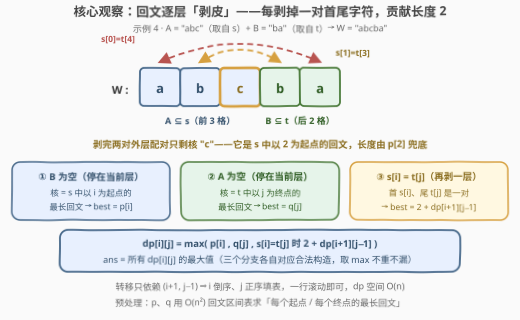
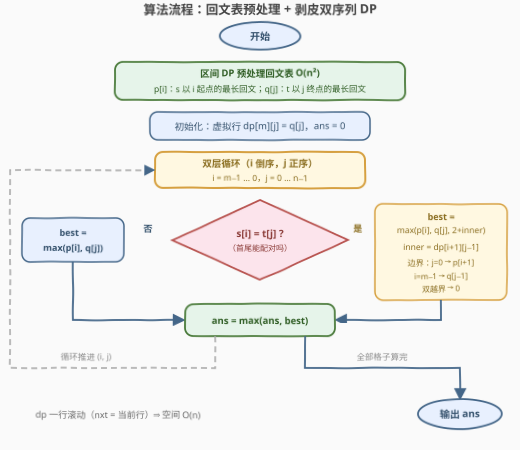

# 子字符串连接后的最长回文串 II

- **题目名称**：子字符串连接后的最长回文串 II
- **链接**：[3504. 子字符串连接后的最长回文串 II](https://leetcode.cn/problems/longest-palindrome-after-substring-concatenation-ii/)
- **难度**：困难
- **标签**：双指针、字符串、动态规划

## 1. 题目概述

给你两个字符串 $s$ 和 $t$。你可以从 $s$ 中选择一个**子串**（可以为空）以及从 $t$ 中选择一个**子串**（可以为空），然后将它们**按顺序**连接（$s$ 的子串在前），得到一个新字符串。返回能构造出的**最长回文串**的长度。

**示例 1**：

```text
输入：s = "a", t = "a"
输出：2
解释：从 s 中选 "a"，从 t 中选 "a"，拼接得到 "aa"，长度为 2。
```

**示例 2**：

```text
输入：s = "abc", t = "def"
输出：1
解释：两串字符互不相同，最长回文只能是任意单个字符。
```

**示例 3**：

```text
输入：s = "b", t = "aaaa"
输出：4
解释：只从 t 中选 "aaaa"（s 侧选空），长度为 4。
```

**示例 4**：

```text
输入：s = "abcde", t = "ecdba"
输出：5
解释：从 s 中选 "abc"，从 t 中选 "ba"，拼接得到 "abcba"，长度为 5。
```

**约束条件**：

- $1 \le \text{s.length}, \text{t.length} \le 1000$
- $s$ 和 $t$ 仅由小写英文字母组成

> 💡 与 [3503. 子字符串连接后的最长回文串 I](https://leetcode.cn/problems/longest-palindrome-after-substring-concatenation-i/) 题面完全相同，唯一区别是数据范围：I 版 $n, m \le 30$，II 版放大到 $n, m \le 1000$——**大了一千多倍**，这正是本题升为「困难」的原因：I 版的枚举解法在这里必须升级算法范式。

---

## 2. 解题思路

### 2.1 暴力思路：为什么老办法不够用了

最直接的做法：枚举 $s$ 的所有 $O(m^2)$ 个子串（含空串）与 $t$ 的所有 $O(n^2)$ 个子串（含空串），两两拼接判回文，总计 $O\big(m^2 n^2 (m+n)\big) \approx 10^{13}$，彻底不可行。

[I 版题解](3503_子字符串连接后的最长回文串I.md)给出的结构化枚举——「镜像双翼 + 中心回文」分解 + 锚点贪心扩展——是 $O\big(nm \cdot \min(n,m)\big)$。但在 $n = m = 1000$ 下约 $10^9$：Python 必然超时，C++ 也游走在时限边缘。必须把复杂度压到 $O(nm)$ 一档，才能高枕无忧。

> 💡 回顾 I 版的分解：回文 $W = A + B$ 总能写成「$k$ 对首尾镜像字符 + 一个落在**单侧**的回文核」。I 版的做法是枚举镜像锚点 $(i_1, i_2)$，双向同步扩展并**在每个深度 $k$ 即时结算** $2k + \max(\text{midS}, \text{midT})$。耗时恰恰耗在「每个锚点的每个深度都结算一次」上。

### 2.2 核心观察：把「逐层结算」折叠成「剥皮 DP」



**状态定义**：$dp[i][j]$ =「$A$ 的开头钉在 $s[i]$（$A$ 也可以整个不选），$B$ 的结尾钉在 $t[j]$（$B$ 也可以整个不选）」时，能拼出的最长回文长度。

**预处理两个单串信息**：

- $p[i]$：$s$ 中**以 $i$ 为起点**的最长回文长度（即 $s[i..]$ 的最长回文前缀）；
- $q[j]$：$t$ 中**以 $j$ 为终点**的最长回文长度（即 $t[..j]$ 的最长回文后缀）。

**转移**——站在 $(i, j)$ 想三类构造：

1. **$B$ 为空**：$W = A$ 就是 $s$ 中以 $i$ 为起点的回文，最优取 $p[i]$；
2. **$A$ 为空**：$W = B$ 就是 $t$ 中以 $j$ 为终点的回文，最优取 $q[j]$；
3. **$A, B$ 均非空**：$W$ 的首字符是 $s[i]$、尾字符是 $t[j]$，回文迫使 $s[i] = t[j]$。**剥掉这一对首尾**，剩下的 $W'$ 仍是回文，且其 $A'$ 是「空或以 $i+1$ 为起点」、$B'$ 是「空或以 $j-1$ 为终点」——恰好是 $dp[i+1][j-1]$ 管辖的形态！于是 $|W| = 2 + |W'| \le 2 + dp[i+1][j-1]$。

合并即得官方 hint 给出的转移：

$$dp[i][j] = \begin{cases} \max\big(p[i],\ q[j]\big) & s[i] \ne t[j] \\ \max\big(p[i],\ q[j],\ 2 + dp[i{+}1][j{-}1]\big) & s[i] = t[j] \end{cases}$$

**边界（虚拟行列）**：转移里的 $dp[i+1][j-1]$ 会越界，但语义清晰：

- $i + 1 = m$（$A'$ 被迫为空）：$dp[m][j] = q[j]$；
- $j - 1 = -1$（$B'$ 被迫为空）：$dp[i][-1] = p[i]$；
- 同时越界（只剩一对字符）：$dp[m][-1] = 0$。

**答案**：$\text{ans} = \max_{i,j} dp[i][j]$。任何合法构造 $W = A + B$：$B$ 空则被任意 $dp[i][\cdot]$ 的 $p[i]$ 项覆盖（$n \ge 1$ 保证列存在）；$A$ 空同理；均非空则恰好落在 $dp[A\text{ 的起点}][B\text{ 的终点}]$。反过来，转移的三个分支各自对应一个**可实现**的构造——取 max 不重不漏。

> 💡 **与 I 版的关系**：I 版「锚点 $(i_1, i_2)$ 扩展到深度 $k$ 后结算 $2k + \max(\text{midS}[i_1{+}k], \text{midT}[i_2{-}k])$」，正是把 $dp$ 的递推链手动展开了一层层的 $2 + \cdots$。DP 的 genius 之处在于：**同一锚点的所有深度共享一条递推链**，每个格子只算一次，$O(nm \cdot \min(n,m))$ 就塌缩成了 $O(nm)$。

### 2.3 算法流程图



**执行步骤**：

| 步骤 | 动作 | 说明 |
|------|------|------|
| ① | 区间 DP 预处理回文表 | $isPal[i][j]$ 表示 $s[i..j]$ 是否回文（$t$ 同理），按长度递增填表 |
| ② | 导出 $p[\cdot]$、$q[\cdot]$ | $p[i]$ 从 $j = m{-}1$ 往回扫到首个 $isPal[i][j]$；$q$ 对 $t$ 的反串做同样的事再翻转下标 |
| ③ | 初始化虚拟行 | $dp$ 的第 $m$ 行直接取 $q$（滚动数组的初值 `nxt = q`），`ans = 0` |
| ④ | 双层循环填表 | $i$ 从 $m{-}1$ 到 $0$（倒序），$j$ 从 $0$ 到 $n{-}1$（正序）——保证依赖的 $(i{+}1, j{-}1)$ 已算出 |
| ⑤ | 结算并更新答案 | $best = \max(p[i], q[j])$；若 $s[i] = t[j]$ 再拼上 $2 + \text{inner}$（$\text{inner}$ 按虚拟行/列取值），`ans = max(ans, best)` |
| ⑥ | 输出 `ans` | |

两个实现细节：

- **滚动数组**：$dp[i][\cdot]$ 只依赖上一行 $dp[i{+}1][\cdot]$ 的**左侧列** $j-1$，先整体算完当前行再替换，一行 $O(n)$ 空间即可；
- **$j = 0$ 的内侧取值**：`inner = nxt[j-1]` 在 $j = 0$ 时应取 `p[i+1]`（虚拟列），且 $i = m-1$ 时取 $0$（虚拟角）——即代码里的 `prev_m1`。

### 2.4 示例演算

先算示例 4（$s =$ `abcde`，$t =$ `ecdba`）。两串都没有长度 $> 1$ 的回文子串，故 $p = q = [1,1,1,1,1]$。$s[i] = t[j]$ 的格子恰好五处：$(0,4)$、$(1,3)$、$(2,1)$、$(3,2)$、$(4,0)$，非匹配格子全是 $\max(p[i], q[j]) = 1$：

| 格子 | 字符对 | 计算 | 值 |
|---|---|---|---|
| $dp[4][0]$ | `e` = `e` | $\max(1, 1, \underbrace{2 + dp[5][-1]}_{i+1=m \Rightarrow 0}) = 2$ | 2 |
| $dp[3][2]$ | `d` = `d` | $\max(1, 1, 2 + dp[4][1]) = \max(1,1,2+1) = 3$ | 3 |
| $dp[2][1]$ | `c` = `c` | $\max(1, 1, 2 + dp[3][0]) = \max(1,1,2+1) = 3$ | 3 |
| $dp[1][3]$ | `b` = `b` | $\max(1, 1, 2 + dp[2][2]) = \max(1,1,2+1) = 3$ | 3 |
| $dp[0][4]$ | `a` = `a` | $\max(1, 1, 2 + dp[1][3]) = \max(1,1,2+3) = \mathbf{5}$ | **5** |

递推链 $dp[0][4] = 2 + dp[1][3] = 2 + (2 + dp[2][2])$ 正是把「剥两对 + 单字符核 `c`」折叠进了一条链，对应 `abc` + `ba` = `abcba` ✓。

再看一个**同时踩到两种边界**的小例子（$s =$ `ab`，$t =$ `ba`）：

| 格子 | 字符对 | 计算 | 值 |
|---|---|---|---|
| $dp[1][0]$ | `b` = `b` | $2 + dp[2][-1]$，$i+1 = m$ 且 $j-1 = -1$ → 虚拟角取 $0$，得 $2$ | 2 |
| $dp[0][1]$ | `a` = `a` | $\max(p[0], q[1], 2 + dp[1][0]) = \max(1,1,4) = 4$ | **4** |

答案 4，即 `ab` + `ba` = `abba`——整串 $s$ 配整串 $t$，两对配对剥完正好落在虚拟角上。

---

## 3. 参考代码

### C++

```cpp
class Solution {
  public:
    int longestPalindrome(string s, string t) {
        int m = s.size(), n = t.size();

        auto palStart = [](const string& a) {      // p[i]：a 中以 i 为起点的最长回文长度
            int L = a.size();
            vector<vector<char>> isPal(L, vector<char>(L, 1));
            for (int i = 0; i + 1 < L; ++i) isPal[i][i + 1] = (a[i] == a[i + 1]);
            for (int len = 3; len <= L; ++len)
                for (int i = 0; i + len - 1 < L; ++i) {
                    int j = i + len - 1;
                    isPal[i][j] = (a[i] == a[j]) && isPal[i + 1][j - 1];
                }
            vector<int> p(L, 1);
            for (int i = 0; i < L; ++i)
                for (int j = L - 1; j > i; --j)
                    if (isPal[i][j]) { p[i] = j - i + 1; break; }
            return p;
        };

        vector<int> p = palStart(s);                // s 侧：每个起点的最长回文
        vector<int> qr = palStart(string(t.rbegin(), t.rend()));
        vector<int> q(n);                           // t 侧：每个终点的最长回文（反串起点 = 正串终点）
        for (int j = 0; j < n; ++j) q[j] = qr[n - 1 - j];

        int ans = 0;
        vector<int> nxt = q;                        // 虚拟第 m 行：dp[m][j] = q[j]
        for (int i = m - 1; i >= 0; --i) {
            int prevM1 = (i + 1 < m) ? p[i + 1] : 0;    // dp[i+1][-1]
            vector<int> cur(n);
            for (int j = 0; j < n; ++j) {
                int best = max(p[i], q[j]);             // 停在当前层：单串回文核
                if (s[i] == t[j]) {                     // 剥掉外层一对首尾
                    int inner = (j >= 1) ? nxt[j - 1] : prevM1;
                    best = max(best, 2 + inner);
                }
                cur[j] = best;
                ans = max(ans, best);
            }
            nxt = move(cur);                        // 当前行滚动为下一轮的 i+1 行
        }
        return ans;
    }
};
```

### Python

```python
class Solution:
    def longestPalindrome(self, s: str, t: str) -> int:
        m, n = len(s), len(t)

        def pal_start(a):                     # p[i]：a 中以 i 为起点的最长回文长度
            L = len(a)
            is_pal = [[True] * L for _ in range(L)]
            for i in range(L - 1):
                is_pal[i][i + 1] = a[i] == a[i + 1]
            for length in range(3, L + 1):
                for i in range(L - length + 1):
                    j = i + length - 1
                    is_pal[i][j] = a[i] == a[j] and is_pal[i + 1][j - 1]
            p = [1] * L
            for i in range(L):
                for j in range(L - 1, i, -1):
                    if is_pal[i][j]:
                        p[i] = j - i + 1
                        break
            return p

        p = pal_start(s)
        q = pal_start(t[::-1])[::-1]          # t 侧：每个终点的最长回文（反串起点 = 正串终点）

        ans = 0
        nxt = q[:]                            # 虚拟第 m 行：dp[m][j] = q[j]
        for i in range(m - 1, -1, -1):
            prev_m1 = p[i + 1] if i + 1 < m else 0    # dp[i+1][-1]
            cur = [0] * n
            for j in range(n):
                best = max(p[i], q[j])                # 停在当前层：单串回文核
                if s[i] == t[j]:                      # 剥掉外层一对首尾
                    inner = nxt[j - 1] if j else prev_m1
                    best = max(best, 2 + inner)
                cur[j] = best
                ans = max(ans, best)
            nxt = cur
        return ans
```

> ⚠️ 注意 $p[i]$ 必须是「以 $i$ 为**起点**的**最长**回文」的真值——它不一定是某个中心扩展出的**极大**回文（如 `cabac` 中以 1 为起点的最长回文 `aba`，其极大扩展是整串 `cabac`，起点 0）。用区间回文表逐起点取最大是最稳妥的写法；直接拿中心扩展/Manacher 的极大回文数组当 $p$ 用，需要额外的重拆论证，容易踩坑。

---

## 4. 复杂度分析

| 维度 | 复杂度 | 说明 |
|------|--------|------|
| **时间复杂度** | $O(m^2 + n^2 + mn)$ | 两张回文区间表 $O(m^2 + n^2)$ + 导出 $p, q$ 各 $O(m^2 / n^2)$ + DP 填表 $O(mn)$；$m = n = 1000$ 时约 $3 \times 10^6$，Python 实测 0.4s 内通过 |
| **空间复杂度** | $O(m^2 + n^2)$ | 大头是两张回文判定表；DP 本身用滚动行后仅 $O(n)$（用哈希/Manacher 替代表格可把预处理也降到 $O(m + n)$，见第 5 节） |

---

## 5. 扩展：预处理的更快姿势

本题 $n \le 1000$，$O(n^2)$ 预处理绰绰有余；但若范围再放大，瓶颈会依次出现在两处：

1. **回文判定表 $O(n^2)$ → $O(n)$**：用滚动哈希可 $O(1)$ 判任意子串回文（正串哈希 = 反串哈希）；或上 **Manacher** $O(n)$ 求出每个中心的极大回文半径，再由「极大回文起点集合」推出每个起点的最长回文（配合从右往左的扫描/单调栈维护区间最大值）。
2. **DP 填表 $O(mn)$**：这一层已是「每个状态 $O(1)$ 转移」，二维双序列匹配的常态下界，一般不再优化。

另外可以对比记忆：本题的 $dp[i][j]$ 沿「$i$ 增、$j$ 减」的**反对角方向**转移，与 [718. 最长重复子数组](https://leetcode.cn/problems/maximum-length-of-repeated-subarray/)（$dp[i][j] = dp[i-1][j-1] + 1$，主对角方向）同属「双串对齐型」DP——识别这个范式，转移方向和循环顺序就不会写反。

---

## 6. 面试要点

1. **为什么 $dp[i][j]$ 的定义里要允许 $A$、$B$ 为空（塞进 $p[i]$、$q[j]$ 两项）？**

   > 两个作用：一是「单侧构造」（只用 $s$ 或只用 $t$）天然是候选答案，放进每个格子后 $\max_{i,j} dp[i][j]$ 自动覆盖它们；二是转移第 ③ 项「剥到某层后剩下的核」本来就是「空 + 单侧回文」的形态——把退化情形并进状态定义，递推链才能一路剥到底自动兜底，不需要在链条末端补特判。

2. **虚拟行/列的边界值为什么是 $q[j]$、$p[i]$、$0$？**

   > $dp[m][j]$：$A'$ 被迫为空，候选只剩「$B'$ 为空或以 $j$ 结尾的回文」= $q[j]$；$dp[i][-1]$ 对称地等于 $p[i]$；$dp[m][-1]$ 两侧都空 = $0$（对应恰好剩一对字符的构造，总长 $2$）。三者都由状态定义**推导**出来，不是拍脑袋的哨兵。

3. **循环顺序为什么是 $i$ 倒序、$j$ 正序？**

   > 转移依赖 $(i+1, j-1)$：外层 $i$ 从大到小保证上一行已算好；内层 $j$ 从小到大时，本行用的是**上一行**的 $j-1$ 列（`nxt[j-1]`），与本行写入顺序无关，其实 $j$ 正反序都行——但正序与「上一行左侧列」的直觉一致，不易写错。

4. **这题和 3503 的解法差在哪一步？**

   > 分解结构完全相同（镜像对 + 单侧回文核）。3503 枚举锚点后**逐深度展开结算**， $O(nm \cdot \min(n,m))$；本题把「同一锚点、不同深度」的结算折叠成 $dp[i][j] = 2 + dp[i+1][j-1]$ 的递推链，子问题被复用，复杂度降到 $O(nm)$。这是「枚举 → DP」的经典升维：当枚举过程中出现大量**前缀被重复计算**的链式结构时，就该想到记忆化/递推。

5. **如何说服面试官答案不重不漏？**

   > **不漏**：任何构造按「$B$ 空 / $A$ 空 / 均非空」三类归位到某个 $dp[i][j]$，归纳可证 $dp[i][j]$ 不小于该构造长度。**不重**（更重要是「不虚」）：转移的三个分支各自给出一个可实现的回文——$p[i]$、$q[j]$ 是现成回文，$2 + dp[i+1][j-1]$ = 配对字符包裹一个更小的合法构造——所以 $dp$ 的每个值都取得到，max 不会高估。

---

## 7. 同类练习题

- [3503. 子字符串连接后的最长回文串 I](https://leetcode.cn/problems/longest-palindrome-after-substring-concatenation-i/)：同题面小范围版，锚点枚举 $O(nm \cdot \min(n,m))$ 的对照实现，体会「逐层结算 → 递推折叠」的升级路径
- [5. 最长回文子串](https://leetcode.cn/problems/longest-palindromic-substring/)：$p$、$q$ 预处理的本源问题（每个起点/终点的最长回文），本题步骤 ①② 的最小闭环
- [647. 回文子串](https://leetcode.cn/problems/palindromic-substrings/)：回文区间表/中心扩展的入门模板，理解预处理表怎么填
- [1771. 由子序列构造的最长回文串](https://leetcode.cn/problems/maximize-palindrome-length-from-subsequences/)：把「子串」换成「子序列」，镜像配对失去连续性，必须上区间 DP——对照体会连续性对算法范式的决定作用
- [214. 最短回文串](https://leetcode.cn/problems/shortest-palindrome/)：单串版「前缀镜像 + 中心回文」分解，KMP/哈希求最长回文前缀的经典应用
