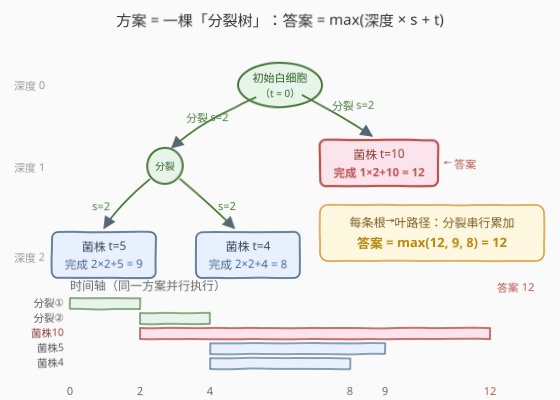
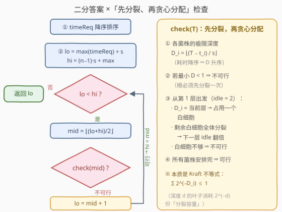

# 查找消除细菌菌株所需时间

- **题目名称**：查找消除细菌菌株所需时间
- **链接**：[3506. Find Time Required to Eliminate Bacterial Strains](https://leetcode.cn/problems/find-time-required-to-eliminate-bacterial-strains/)
- **难度**：困难
- **标签**：贪心、数组、数学、堆（优先队列）
- **关联**：1199（本题原型题「建造街区的最短时间」，完全同构：工人 ↔ 白细胞、街区 ↔ 菌株）

## 1. 题目概述

> ⚠️ 本题为 LeetCode 付费题，题意描述根据官方示例用例与 hints 重建，可能与官方题面有出入。（题面已与社区转载的官方中文翻译交叉核对；两个示例的输出均由自洽代码验证。）

给定整数数组 `timeReq` 和整数 `splitTime`。在人体的微观世界里，免疫系统面临一场挑战：对抗快速繁殖的细菌群落。最初只部署**一个**白细胞（WBC）来消除细菌，规则如下：

1. 消灭第 $i$ 个细菌菌株需要 `timeReq[i]` 个时间单位；
2. 一个白细胞只能消灭**一个**菌株，之后即耗尽，无法执行任何其他任务；
3. 一个白细胞可以将自身**分裂**为两个白细胞，耗时 `splitTime` 个单位；分裂出的两个白细胞可以**并行**工作；
4. 多个白细胞不能同时攻击同一个菌株。

返回消除**所有**细菌菌株所需的**最少**时间。菌株可以按任意顺序消除。

**示例 1**：

```text
输入：timeReq = [10, 4, 5], splitTime = 2
输出：12
解释：t=0 根白细胞开始分裂，t=2 得到 A、B 两个白细胞：
      A 直接消灭菌株 10（耗时 10），完成于 2 + 10 = 12；
      B 再分裂一次，t=4 得到 C、D，分别消灭菌株 5 与菌株 4，
      完成于 4 + 5 = 9 与 4 + 4 = 8。总时间 = max(12, 9, 8) = 12。
```

**示例 2**：

```text
输入：timeReq = [10, 4], splitTime = 5
输出：15
解释：两个菌株各需一个白细胞，根白细胞必须先分裂一次（5 个单位），
      两个子白细胞分别开工，完成于 5 + 10 = 15 与 5 + 4 = 9，答案 15。
```

**约束条件**（付费题，按原型题 1199 的约束惯例重建，以官方为准；即便 `timeReq[i]` 放大到 $10^9$，下述解法与复杂度不变，C++ 注意用 64 位）：

- $1 \le n = \text{timeReq.length} \le 1000$
- $1 \le \text{timeReq[i]} \le 10^5$
- $1 \le \text{splitTime} \le 100$

> 💡 **读题关键**：① 白细胞**不会自然增殖**，唯一的复制手段就是花 `splitTime` 分裂，且每次分裂只让白细胞总数 **+1**（一变二）；② 「一个白细胞只能消灭一个菌株」+「多菌不能围攻」⇒ $n$ 株菌至少需要 $n$ 个白细胞、至少 $n-1$ 次分裂；③ 分裂与消灭都是独占行为，但**不同分支之间完全并行**——这正是优化的全部来源；④ 本题与付费题 [1199. 建造街区的最短时间](https://leetcode.cn/problems/minimum-time-to-build-blocks/) 逐句同构，官方 hints 也直指「二分答案 + 先分裂后贪心分配」。

---

## 2. 解题思路

### 2.1 暴力思路

把时间轴摊开模拟：每个时刻、每个空闲白细胞都有「分裂 / 消灭某株菌 / 闲着」三种选择，方案空间是指数级的。稍微聪明一点的做法是抓住本质：**任何合法方案都对应一棵「分裂树」**——根是最初的白细胞，每个内部节点是一次分裂（耗时 `splitTime`），每个叶子挂一株菌（耗时 `timeReq[i]`）。暴力枚举这棵树：$n$ 个叶子的满二叉树形态有 Catalan$(n-1)$ 种，再乘上 $n!$ 种菌株分配，$n = 1000$ 时是天文数字。

但暴力点破了题目的命门：**答案只由树形决定**——确切地说，只由「每株菌被放在第几层」决定。

### 2.2 核心观察：分裂树——完成时间 = max(深度 × splitTime + timeReq)



**观察一（分裂树模型）**：从根到某片叶子的路径上，分裂必须**依次**发生（同一个白细胞的两次分裂天然串行）；而不同分支之间**完全并行**。于是菌株 $i$ 的完成时间为

$$\text{finish}_i = d_i \times \text{splitTime} + \text{timeReq}[i]$$

其中 $d_i$ 是菌株 $i$ 所挂叶子的深度。**总答案 $=\max_i \text{finish}_i$**。调度的一切细节（谁先谁后、谁在哪分裂）都被「深度」这一个参数吸收了。

**观察二（大菌株放浅层）**：交换论证——若 $t_i > t_j$ 而 $d_i > d_j$，交换两者的深度后，新的两项 $d_j s + t_i \le d_i s + t_i$、$d_i s + t_j < d_i s + t_i$，都不会超过原来的最大值。所以存在最优解：**耗时越大的菌株，深度越浅**。

**观察三（单调性 ⇒ 二分答案）**：若时限 $T$ 内能消灭全部菌株，则 $T+1$ 也行（方案原样保留）——可行性关于 $T$ 单调，**二分答案**。

**观察四（check(T)：先分裂，再贪心分配——官方 hint 的落地）**：固定时限 $T$：

1. 菌株 $i$ 至多能放到深度 $D_i = \lfloor (T - \text{timeReq}[i]) / \text{splitTime} \rfloor$，再深一层就超时；
2. $n \ge 2$ 时根必须先分裂一次，所以**所有** $D_i \ge 1$ 必须成立，否则不可行；
3. **先分裂、再分配**：把菌株按耗时降序（即 $D_i$ 升序）排队，从第 1 层（2 个白细胞）开始逐层推进——恰好只能放到当前层的菌株（$D_i =$ 当前层）**立即**占用本层空闲白细胞；层间剩余白细胞**全体分裂**，数量翻倍进入下一层；任何时刻白细胞不够用 ⇒ 不可行；
4. 全部安排完 ⇒ 可行。

> 💡 这套逐层检查本质是 **Kraft 不等式** $\sum_i 2^{-D_i} \le 1$ 的整数化模拟：把每株菌都压到它的极限深度 $D_i$（压得越深，消耗的「分裂容量」越小），深度 $d$ 的叶子消耗 $2^{-d}$ 份容量，总消耗不超过 1（整棵树的容量）即可行。

### 2.3 算法流程图



| 步骤 | 动作 | 说明 |
|------|------|------|
| ① 预处理 | `timeReq` 降序排序 | 耗时大 ⇒ 极限深度 $D$ 小，天然升序，`check` 只需一趟扫描 |
| ② 二分框架 | `lo = max + s`，`hi = (n−1)·s + max` | 下界：$n\ge2$ 时每个叶子深度 $\ge 1$；上界：链式树必然可行 |
| ③ check(T) | 逐层分配 + 层间翻倍 | 见 2.2 观察四，$O(n)$ |
| ④ 收敛 | `lo == hi` 即答案 | 最小可行时限 |

### 2.4 示例演算

用**示例 1**（`timeReq = [10,4,5]`，`splitTime = 2`）走一遍。二分区间 $[12, 14]$（`lo = 10+2`，`hi = 2×2+10`），三株菌的极限深度 $D_i = \lfloor (T-t_i)/2 \rfloor$：

| $T$ | 菌株10 的 $D$ | 菌株5 的 $D$ | 菌株4 的 $D$ | 逐层推演 | 可行？ |
|---|---|---|---|---|---|
| 11 | 0 | 3 | 3 | 最重的菌株连第 1 层都进不了 | ✗ |
| 12 | 1 | 3 | 4 | 第 1 层（2 个）：菌株10 占 1 个；剩余 1 个分裂→第 2 层 2 个→再分裂→第 3 层 4 个：菌株5 占 1 个；剩余 3 个分裂进第 4 层：菌株4 占 1 个，全部安排完 | ✓ |
| 13 | 1 | 4 | 4 | 第 1 层：菌株10；第 4 层：菌株5、菌株4（容量足够） | ✓ |

二分过程：`mid=13` 可行 → `hi=13`；`mid=12` 可行 → `hi=12`；`lo == hi = 12`，返回 **12**。对照 2.2 的图：最优树正是「菌株10 在深度 1，菌株5、菌株4 在深度 2」，$\max(1\times2+10,\ 2\times2+5,\ 2\times2+4) = 12$。

**示例 2**（`[10,4]`，`s=5`）：二分区间 $[15, 15]$ 本身就收敛——两株菌必须各占一个第 1 层白细胞，$5+10=15$。

---

## 3. 参考代码

### C++

```cpp
class Solution {
  public:
    long long minEliminationTime(vector<int>& timeReq, int splitTime) {
        int n = timeReq.size();
        if (n == 1) return timeReq[0];                      // 单株菌：无需分裂
        sort(timeReq.begin(), timeReq.end(), greater<int>());  // 降序 ⇒ D 升序
        long long s = splitTime, mx = timeReq[0];
        long long lo = mx + s, hi = (long long)(n - 1) * s + mx;  // 链式树必可行
        while (lo < hi) {
            long long mid = lo + (hi - lo) / 2;
            if (ok(timeReq, s, mid)) hi = mid;
            else lo = mid + 1;
        }
        return lo;
    }
  private:
    bool ok(const vector<int>& a, long long s, long long T) {
        int n = a.size();
        if ((T - a[0]) / s < 1) return false;     // 最重的菌株连第 1 层都进不了
        int i = 0;
        long long depth = 1, idle = 2;            // 根先分裂一次：第 1 层 2 个白细胞
        while (i < n) {
            while (i < n && (T - a[i]) / s == depth) {  // 只能放本层的，立即占用
                if (idle == 0) return false;
                idle--; i++;
            }
            if (i == n) return true;
            if (idle == 0) return false;          // 还有菌株，却无白细胞可分裂
            long long nxt = (T - a[i]) / s;       // 下一个事件层
            while (depth < nxt && idle < n) {     // 剩余白细胞逐层全体分裂（封顶 n 防溢出）
                idle <<= 1;
                depth++;
            }
            depth = nxt;
        }
        return true;
    }
};
```

### Python

```python
class Solution:
    def minEliminationTime(self, timeReq: List[int], splitTime: int) -> int:
        a = sorted(timeReq, reverse=True)          # 降序 ⇒ D = (T-t)//s 升序
        s, n = splitTime, len(a)
        if n == 1:
            return a[0]                            # 单株菌：无需分裂

        def ok(T: int) -> bool:
            if (T - a[0]) // s < 1:                 # 最重的菌株连第 1 层都进不了
                return False
            i, depth, idle = 0, 1, 2               # 根先分裂一次：第 1 层 2 个白细胞
            while i < n:
                while i < n and (T - a[i]) // s == depth:  # 只能放本层的，立即占用
                    if idle == 0:
                        return False
                    idle -= 1
                    i += 1
                if i == n:
                    return True
                if idle == 0:                       # 还有菌株，却无白细胞可分裂
                    return False
                nxt = (T - a[i]) // s               # 下一个事件层
                while depth < nxt and idle < n:     # 剩余白细胞逐层全体分裂（封顶 n）
                    idle <<= 1
                    depth += 1
                depth = nxt
            return True

        lo, hi = a[0] + s, (n - 1) * s + a[0]      # 下界 / 链式上界
        while lo < hi:
            mid = (lo + hi) // 2
            if ok(mid):
                hi = mid
            else:
                lo = mid + 1
        return lo
```

> ⚠️ **易错点**：① `n == 1` 必须特判——答案就是 `timeReq[0]`，一次分裂都不用；② 二分下界别写成 `max(timeReq)`：$n\ge2$ 时每个叶子深度 $\ge 1$，答案至少是 $\max + \text{splitTime}$；③ 检查里 $D_i =$ 当前层的菌株必须**立即**安排，拖一层就超时；④ 层间翻倍要封顶（`idle < n` 才翻），否则大 $T$ 下数字会翻爆（C++ 溢出、Python 变慢）——反正白细胞多于菌株就没有意义。

---

## 4. 复杂度分析

| 维度 | 复杂度 | 说明 |
|------|--------|------|
| 时间复杂度 | $O(n \log n + n \log U)$ | 排序一次；二分 $\log U \approx \log((n{-}1) \cdot s)$ 轮（约束下 $\le 17$ 轮），每轮 `check` 单趟 $O(n)$ |
| 空间复杂度 | $O(1)$ 额外 | `check` 只用常数个变量（不计排序的栈空间） |
| 数据范围验证 | — | $n \le 10^3$、区间宽 $\le 10^5$：排序 $10^4$ 次 + 二分约 $17 \times 10^3$ 次比较，轻松可过 |
| 对比暴力 | — | Catalan 数级枚举树形 × $n!$ 分配，指数级爆炸 |

---

## 5. 扩展：哈夫曼式合并——不二分，自底向上一步到位

官方标签里的「堆（优先队列）」指向另一个更紧的解法。二分是**自顶向下**地猜答案；哈夫曼则**自底向上**直接构造最优树：

**合并规则**：用小根堆维护所有「子树的完成时间」。每轮弹出**最小**的两个值 $a \le b$，合并成一个新节点推回堆中——

$$\text{merged} = \max(a, b) + \text{splitTime}$$

含义：这两个子树由同一个白细胞分裂而成，先花 `splitTime` 分裂，然后两个孩子**并行**开工，故父节点完成时间 $= s + \max(a, b)$。堆中只剩一个值时，它就是答案。

**为什么取最小的两个（正确性）**：分两步看——

1. **合并是精确降维**：把值为 $w = \max(a,b) + s$ 的合并节点放在深度 $d$，等价于把原来那两片叶子放在深度 $d+1$：$\max\big((d{+}1)s + a,\ (d{+}1)s + b\big) = ds + w$，逐字相等。所以每次合并都把问题规模严格减一，且不损失任何信息；
2. **最优树中最小的两个值可以作最深的兄弟**（交换论证）：把小值往下换、大值往上换，$\max$ 不会变大。于是「合并最小的两个」永远安全，归纳即得全局最优。

这与哈夫曼编码的结构完全一致——只是合并函数从 $a+b$ 换成了 $\max(a,b)+s$（最小化 $\max$ 而非求和）。

```python
from heapq import heapify, heappop, heappush

class Solution:
    def minEliminationTime(self, timeReq: List[int], splitTime: int) -> int:
        h = list(timeReq)
        heapify(h)
        while len(h) > 1:                    # 每轮吞掉两个最小子树，诞生一个合并子树
            a = heappop(h)
            b = heappop(h)
            heappush(h, max(a, b) + splitTime)
        return h[0]
```

C++ 把容器换成 `priority_queue<long long, vector<long long>, greater<long long>>` 即可，其余一行不改。复杂度 $O(n \log n)$，比二分的 $O(n \log U)$ 更紧，代码也更短；代价是它依赖 $\max(a,b)+s$ 这种「可合并」结构，不像二分那样只要求「可行性可判定」——泛化性上二分更强（本文两法已对拍 3000+ 组随机数据，包括与暴力枚举树形对照，结果完全一致）。

---

## 6. 面试要点

1. **为什么答案 = max(深度×s + t)，中间的调度细节去哪了？**

   - 同一根→叶路径上的分裂必须串行，不同分支完全并行；把每条路径单独看，完成时间就是「路径上分裂次数 × s + 叶子耗时」。方案之间的一切差异都被各叶子的**深度**吸收，调度顺序是无关变量。

2. **check(T) 里为什么「恰好只能放本层」的菌株要立即安排、剩余白细胞必须全体分裂？**

   - $D_i$ 是该菌株的极限深度，拖一层就超时，别无选择；而空闲白细胞留着不分裂毫无收益——它的后代所在深层容量翻倍，足以覆盖所有「还能等」的菌株（它们的 $D$ 都更大），分裂永不吃亏。

3. **二分的上下界怎么定？为什么上界一定可行？**

   - 下界 $\max + s$：$n \ge 2$ 时每个叶子深度 $\ge 1$。上界 $(n-1) \cdot s + \max$：构造链式树（深度 $1..n$ 各一片叶子、最重菌株放最浅），每条路径代价 $\le (n-1)s + \max$，必然可行——保证二分区间右端是「可行」的。

4. **哈夫曼解法为什么取两个最小的合并？合并值为什么是 max(a,b)+s 而不是 a+b+s？**

   - 交换论证保证最优树里最小的两个值可以当最深的兄弟；$\max(a,b)+s$ 来自「分裂串行在前、双子树并行在后」——并行取大者，不是求和。若误写成 $a+b+s$，就是把并行当串行，答案会系统性偏大。

5. **这题和 1199 什么关系？看到新题怎么快速识别这种原型？**

   - 完全同构（blocks ↔ timeReq，split ↔ splitTime）。识别特征：「单一执行体 + 花固定代价复制自身 + 任务独占」——凡是「工人分裂 / 进程 fork / 细胞分裂」的叙事，都可以先套分裂树模型，再选二分或哈夫曼落地。

---

## 7. 同类练习题

- [1199. 建造街区的最短时间](https://leetcode.cn/problems/minimum-time-to-build-blocks/)：本题原型（付费题），工人分裂建街区，哈夫曼合并解法的标准出处
- [2594. 修车的最少时间](https://leetcode.cn/problems/minimum-time-to-repair-cars/)：二分答案 + 贪心计数的近亲，check 里用 $\lfloor\sqrt{T/r}\rfloor$ 累加各技工的修车能力
- [2064. 分配给商店的最多商品的最小值](https://leetcode.cn/problems/minimized-maximum-of-products-distributed-to-any-store/)：最小化最大值 → 二分答案 + 贪心验证
- [1011. 在 D 天内送达包裹的能力](https://leetcode.cn/problems/capacity-to-ship-packages-within-d-days/)（[站内题解](../1001-1100/1011_在D天内送达包裹的能力.md)）：同款「二分答案 + 贪心验证」骨架的入门题
- [875. 爱吃香蕉的珂珂](https://leetcode.cn/problems/koko-eating-bananas/)：二分答案族里最朴素的一题，适合先热身
