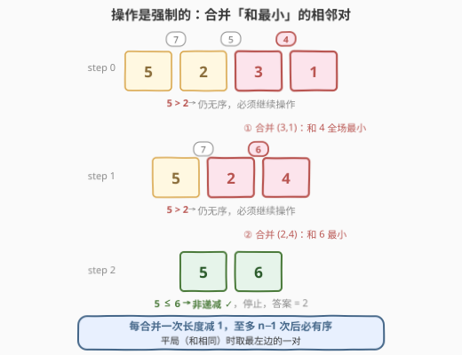
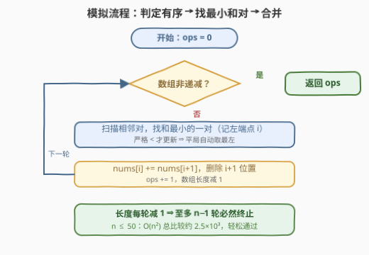

# 移除最小数对使数组有序 I

- **题目名称**：移除最小数对使数组有序 I
- **链接**：[3507. 移除最小数对使数组有序 I](https://leetcode.cn/problems/minimum-pair-removal-to-sort-array-i/)
- **难度**：简单
- **标签**：数组、模拟

## 1. 题目概述

给你一个数组 `nums`，你可以执行以下操作任意次数：

- 选择**相邻**元素对中**和最小**的一对；如果存在多个这样的对，选择**最左边**的一个；
- 用它们的**和**替换这对元素（两格并成一格，数组长度减 1）。

返回将数组变为**非递减**所需的最小操作次数。非递减指数组中每个元素都大于或等于它前一个元素（如果存在的话）。

**示例 1**：

```text
输入：nums = [5,2,3,1]
输出：2
解释：(3,1) 的和最小为 4，替换后 nums = [5,2,4]；(2,4) 的和为 6，替换后 nums = [5,6]，非递减。
```

**示例 2**：

```text
输入：nums = [1,2,2]
输出：0
解释：数组已经是非递减的。
```

**约束条件**：

- `1 <= nums.length <= 50`
- `-1000 <= nums[i] <= 1000`

> 💡 **读题关键**：「最小操作次数」听起来像要优化决策的 DP/贪心题，但操作规则是**完全强制**的——选哪一对由「和最小 + 平局最左」唯一确定，不存在任何选择余地。于是答案就是这个确定性过程跑到非递减时的自然步数，本题本质是**模拟题**（官方标签里的堆、双向链表等，对应的是进阶 II 版的加速手段，见第 5 节）。

---

## 2. 解题思路

### 2.1 暴力思路：每一轮完整模拟

把题面逐字翻译成循环：每轮先花 $O(n)$ 检查数组是否非递减；若否，再花 $O(n)$ 扫出**和最小**的相邻对，合并（左位置写和、右位置删除），操作数加一。由于每轮长度减 1、长度为 1 的数组必然非递减，循环至多执行 $n-1$ 轮，总工作量 $O(n^2)$——$n \le 50$ 时不过几千次基本操作。

也没有「更聪明」的空间可言：2.2 说明本题没有任何决策供你优化，模拟本身就是全部。

### 2.2 核心观察：没有决策，只有执行



**操作是强制规则**：被合并的对由「相邻和最小 + 平局取最左」唯一确定，与任何策略无关。所谓「最小操作次数」，就是这个确定性过程终止时的步数——**直接模拟即是答案**（也是唯一路径）。两个实现细节决定对错：

- **平局必须取最左**：比较时用**严格小于**才更新（相等不换人），保留下标更早的对。这不是可有可无的细节——以 `nums = [1,3,2,2]` 为例，对 $(1,3)$ 与 $(2,2)$ 的和同为 $4$：按规则取最左得 $[4,2,2]$，还要再合并一次，答案 $2$；若误取最右则 $[1,3,4]$ 一步收工，答案 $1$。**平局规则直接影响答案**。
- **有序判定是非递减**：只有 $a > b$ 才算逆序，$a = b$ 合法。C++ 的 `std::is_sorted` 恰好按此语义实现，可直接用。

另外留意值域：合并会让元素**累加**，$n \le 50$、$|nums[i]| \le 1000$ 时和的绝对值不超过 $5\times10^4$，`int` 绰绰有余（II 版的 $10^5$ 规模才需要认真评估）。

### 2.3 算法流程图



循环体三步走：**判定有序 → 找最小和对 → 合并计数**。每轮长度减 1，至多 $n-1$ 轮后长度归 1、循环必然终止，不存在死循环。

### 2.4 示例演算

把官方示例 `nums = [5,2,3,1]` 逐步走一遍：

| 轮次 | 数组 | 相邻对和 | 合并对象（和最小） | 操作后 | 有序？ |
|------|------|----------|--------------------|--------|--------|
| 1 | `[5,2,3,1]` | 7, 5, **4** | $(3,1)$，和 4 | `[5,2,4]` | 否（$5>2$） |
| 2 | `[5,2,4]` | 7, **6** | $(2,4)$，和 6 | `[5,6]` | 是（$5\le6$） |

两轮后非递减，答案 **2**。再看平局例子 `[1,3,2,2]`：对和 $4,5,4$，$(1,3)$ 与 $(2,2)$ 打平，按规则取最左 → `[4,2,2]` → 对和 $6,4$，合并 $(2,2)$ → `[4,4]` 非递减，答案 $2$。

> 💡 负数同样参与「和最小」比较：`[2,2,-1]` 中 $(2,-1)$ 的和 $1$ 全场最小，先合并得 `[2,1]` 仍无序（$2>1$），再合并成 `[3]` 才停。「和最小」比的是**代数和**，不是绝对值，也不是「找最小元素」。

---

## 3. 参考代码

### C++

```cpp
class Solution {
  public:
    int minimumPairRemoval(vector<int>& nums) {
        int ops = 0;
        while (!is_sorted(nums.begin(), nums.end())) {
            int best = 0;  // 和最小相邻对的左端点；严格 < 才更新，平局自动取最左
            for (int i = 1; i + 1 < (int)nums.size(); i++) {
                if (nums[i] + nums[i + 1] < nums[best] + nums[best + 1]) {
                    best = i;
                }
            }
            nums[best] += nums[best + 1];
            nums.erase(nums.begin() + best + 1);
            ops++;
        }
        return ops;
    }
};
```

### Python

```python
class Solution:
    def minimumPairRemoval(self, nums: List[int]) -> int:
        ops = 0
        while any(a > b for a, b in zip(nums, nums[1:])):
            i = min(range(len(nums) - 1), key=lambda k: nums[k] + nums[k + 1])
            nums[i] += nums[i + 1]
            del nums[i + 1]
            ops += 1
        return ops
```

> 💡 Python 的 `min(range(...), key=...)` 在多个元素并列最小时返回**最小下标**，与「平局取最左」天然一致；C++ 用严格小于更新 `best` 同理。长度为 1 的数组在有序检查处即被拦下，不会走到取 `nums[1]` 的越界分支；若不允许修改输入，复制一份再模拟即可。

---

## 4. 复杂度分析

| 维度 | 复杂度 | 说明 |
|------|--------|------|
| 时间复杂度 | $O(n^2)$ | 至多 $n-1$ 轮，每轮「有序判定 + 找最小对」各扫一遍 $O(n)$；$n \le 50$ 时约 $2.5 \times 10^3$ 次比较 |
| 空间复杂度 | $O(1)$ | 原地修改（`erase` 的搬移仍在原数组内），仅常数个额外变量 |

---

## 5. 扩展：II 版（3510）的 $O(n \log n)$ 加速

进阶版 [3510. 移除最小数对使数组有序 II](https://leetcode.cn/problems/minimum-pair-removal-to-sort-array-ii/) 把规模抬到 $n \le 10^5$，$O(n^2)$ 模拟不再可行。瓶颈在每轮的两个 $O(n)$——找最小对、以及「删除 + 有序检查」，分别用四件套拆掉：

- **找最小和对 → 小顶堆**：堆中存 $(\text{sum}, \text{左端点编号})$，和相同时编号小者先出，天然实现「平局取最左」。每次合并只会新产生**一个**相邻对（左邻与合并结果），推入堆即可。
- **合并与邻接关系 → 双向链表**：合并 = 左节点改值 + 删除右节点，链表 $O(1)$ 完成，绕开数组删除的 $O(n)$ 搬移。
- **堆中过期条目 → 懒删除**：被合并波及的旧对不会自动从堆里消失，弹出时校验「该对仍相邻且和匹配」，不匹配直接丢弃。
- **有序判定 → 相邻逆序计数**：维护满足 $a > b$ 的相邻对个数；每次合并只波及合并点附近 $O(1)$ 对邻接关系，增量更新；计数归零即停。

合起来每轮 $O(\log n)$、总计 $O(n \log n)$。这套「**堆 + 双向链表 + 懒删除 + 计数器**」是「重复取最值元素删除/合并」类模拟题的标准加速模板（同款组合见 [2659. 将数组清空](https://leetcode.cn/problems/make-array-empty/)）。

---

## 6. 面试要点

1. **题目问「最小操作次数」，为什么不需要 DP 或贪心证明？**

   > 操作规则是完全强制的：每一步被合并的对由「相邻和最小 + 平局取最左」唯一确定，不存在决策分支。答案就是确定性过程终止时的步数——模拟即最优，也是唯一解。

2. **平局取最左的规则如何实现？为什么它重要？**

   > 比较用严格小于才更新，相等不换，保留最早下标（Python `min(range, key=...)` 天然返回最小下标）。它直接影响答案：`[1,3,2,2]` 中 $(1,3)$ 与 $(2,2)$ 同和，取最左答案为 2，取最右答案为 1。

3. **循环最多执行多少轮？如何保证不死循环？**

   > 每次合并长度减 1，长度为 1 的数组必非递减，故至多 $n-1$ 轮，总时间 $O(n^2)$。有序判定用 $a > b$（非递减语义，相等合法），C++ 可直接用 `is_sorted`。

4. **若把 n 提到 10^5（II 版），瓶颈在哪，怎么拆？**

   > 每轮两个 $O(n)$：找最小对、删除与有序检查。分别换成小顶堆（平局按左端点编号）、双向链表 $O(1)$ 删除、懒删除丢弃过期堆条目、相邻逆序计数增量维护，整体 $O(n \log n)$。

5. **负数和值域对实现有什么影响？**

   > 「和最小」比的是代数和，负数可直接胜出（如 `[2,2,-1]` 先合并 $(2,-1)$）；合并是累加，本题 $n \le 50$、$|nums[i]| \le 1000$ 下 `int` 足够，大规模版要重新评估防溢出。

---

## 7. 同类练习题

- [3510. 移除最小数对使数组有序 II](https://leetcode.cn/problems/minimum-pair-removal-to-sort-array-ii/)：本题的 $10^5$ 规模版，堆 + 双向链表 + 懒删除 + 逆序计数的完整模板演练
- [2659. 将数组清空](https://leetcode.cn/problems/make-array-empty/)（[题解](../2601-2700/2659_将数组清空.md)）：同样是「按确定性顺序删元素」的加速模拟，双向链表 + 按序遍历的组合技，与 II 版数据结构高度重合
- [665. 非递减数列](https://leetcode.cn/problems/non-decreasing-array/)（[题解](../0601-0700/665_非递减数组.md)）：聚焦「非递减」判定本身——只许修改一次时的边界坑（改左还是改右）
- [312. 戳气球](https://leetcode.cn/problems/burst-balloons/)（[题解](../0301-0400/312_戳气球.md)）：同样是相邻元素的合并/消除，但允许自选顺序，那才是真正的区间 DP 决策题——与本题「零决策」恰成对照
- [23. 合并K个升序链表](https://leetcode.cn/problems/merge-k-sorted-lists/)（[题解](../0001-0100/23_合并K个升序链表.md)）：小顶堆 + 链表结构配合的入门经典，II 版数据结构组合的原型

> 💡 **一句话总结**：3507 = 纯模拟——操作被「和最小 + 平局最左」强制规定，零决策空间，逐轮合并直到非递减；坑点全在细节（平局规则、非递减语义、负数代数和），规模放大后就是堆 + 双向链表的 II 版。
