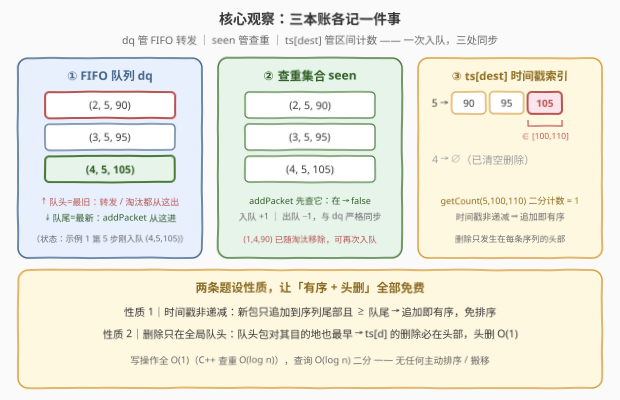
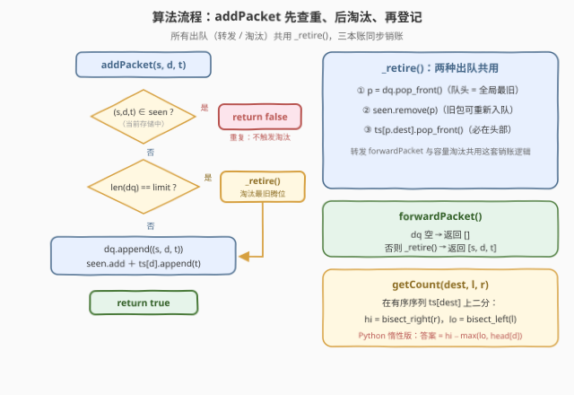

# 设计路由器

- **题目名称**：设计路由器
- **链接**：[3508. 设计路由器](https://leetcode.cn/problems/implement-router/)
- **难度**：中等
- **标签**：设计、队列、哈希表、二分查找、有序集合

## 1. 题目概述

设计一个网络路由器 `Router`，在固定内存限制下管理数据包。每个数据包由三元组 `(source, destination, timestamp)` 描述，需支持四个操作：

- `Router(int memoryLimit)`：初始化，路由器任意时刻最多存 `memoryLimit` 个包；
- `bool addPacket(source, destination, timestamp)`：入队一个新包。若**当前存储中**已存在相同 `(source, destination, timestamp)` 的包，视为重复，返回 `false`；否则若加入后会超容量，先移除**最旧**的包再入队，返回 `true`；
- `int[] forwardPacket()`：按 **FIFO** 顺序转发下一个包（从存储中移除并返回 `[source, destination, timestamp]`），无包可转发时返回空数组；
- `int getCount(destination, startTime, endTime)`：统计**当前存储中**目的地为 `destination` 且时间戳落在 `[startTime, endTime]`（闭区间）内的包数。

注意：所有 `addPacket` 调用的 `timestamp` 按**非递减**顺序给出。

**示例 1**：

```text
输入：
["Router", "addPacket", "addPacket", "addPacket", "addPacket", "addPacket", "forwardPacket", "addPacket", "getCount"]
[[3], [1, 4, 90], [2, 5, 90], [1, 4, 90], [3, 5, 95], [4, 5, 105], [], [5, 2, 110], [5, 100, 110]]

输出：
[null, true, true, false, true, true, [2, 5, 90], true, 1]

解释：
Router(3)                        // 内存限制 3
addPacket(1, 4, 90)              // true
addPacket(2, 5, 90)              // true
addPacket(1, 4, 90)              // false：与第 1 个包重复
addPacket(3, 5, 95)              // true
addPacket(4, 5, 105)             // true：超容量，最旧的 (1,4,90) 被淘汰
forwardPacket()                  // [2, 5, 90]：FIFO 转发并移除
addPacket(5, 2, 110)             // true
getCount(5, 100, 110)            // 1：只有 (4,5,105) 满足 dest=5 且 t∈[100,110]
```

**示例 2**：

```text
输入：["Router", "addPacket", "forwardPacket", "forwardPacket"]
输出：[null, true, [7, 4, 90], []]    // 空路由器转发返回空数组
```

**约束条件**：

- $2 \le \text{memoryLimit} \le 10^5$
- $1 \le \text{source},\ \text{destination} \le 2 \times 10^5$
- $1 \le \text{timestamp} \le 10^9$，且 `addPacket` 的调用按 `timestamp` 非递减
- $1 \le \text{startTime} \le \text{endTime} \le 10^9$
- `addPacket`、`forwardPacket`、`getCount` 总调用次数至多 $10^5$

> 💡 **读题关键**：① 重复的判定范围是「**当前存储中**」——已转发/已淘汰的包不算，查重集合必须随出队同步删；② 容量淘汰与 FIFO 转发**删的是同一个位置**（最旧 = 队头），可共用一套出队逻辑；③ `timestamp` 非递减是白送的单调性——它是后面「免排序二分」的根基。

---

## 2. 解题思路

### 2.1 暴力思路

用一个数组从头到尾存所有包，每个操作直接扫数组：

- `addPacket`：线性扫全表查三元组重复，$O(n)$；
- 容量淘汰 / `forwardPacket`：删除首元素，数组整体前移，$O(n)$；
- `getCount`：全表扫描逐个判断，$O(n)$。

总调用次数 $Q \le 10^5$，最坏 $O(Q \cdot n) \approx 10^{10}$——超时。**病根**：三个操作各自为政，都在用全量扫描换信息；而「查重、FIFO、区间计数」各有一个 $O(1)$ / $O(\log n)$ 的专用结构。

### 2.2 核心观察：三本账各记一件事

维护三套结构，一次入队三处同步写：

| 结构 | 存什么 | 服侍谁 |
|------|--------|--------|
| 双端队列 `dq` | 三元组包序列（队头 = 最旧） | `forwardPacket`（队头出）+ 容量淘汰（也是队头出）+ `addPacket`（队尾进） |
| 哈希集合 `seen` | 所有在存包的 `(s, d, t)` | `addPacket` 查重，$O(1)$ |
| 时间戳索引 `ts[dest]` | 每个目的地一条**有序**时间戳序列 | `getCount` 二分计数，$O(\log n)$ |



真正的题眼是两条**题设性质**，它们让所有维护成本归零：

1. **时间戳非递减** → 新包只会追加到 `ts[dest]` 尾部且不小于队尾 → 每条序列**追加即有序**，全程无需一次主动排序；
2. **删除只发生在全局队头** → 队头是全体中最早入队的包；对它的目的地 `d` 而言，它也是 `d` 的包中最早入队的（`ts[d]` 恰按入队序排列）→ 被删的**一定是 `ts[d]` 的头部** → 每条序列退化成「队尾进、队头出」的队列，头删 $O(1)$。

> 💡 于是「有序」和「可头删」都是**免费**的：C++ 用 `unordered_map<int, deque<int>>`——`std::deque` 头删 $O(1)$、随机访问 $O(1)$，二分直接可用；Python 的 `collections.deque` 随机访问是 $O(n)$，`bisect` 会退化，改用 `list` + `head` 惰性指针：出队只做 `head[d] += 1`，查询时用 `max(head, bisect_left(...))` 校正 stale 前缀（详见参考代码）。

### 2.3 算法流程：先查重、后淘汰、再登记

`addPacket` 的三步决策，与转发/淘汰共用的出队销账逻辑 `_retire()`：



两个容易写错的顺序问题：

1. **先查重还是先淘汰？** 必须**先查重**。设想队列已满且队头恰是 `(1,4,90)`，此时又来一个 `(1,4,90)`：若先淘汰再查重，会把「在存的重复包」踢掉再放行新的，返回 `true`——而正确语义是它**在存**，应返回 `false` 且**不发生淘汰**。
2. **`seen` 何时删？** 与出队**严格同步**。查重的语义是「当前存储中」：漏删会把已转发的包误判为重复（`addPacket` 错误返回 `false`）；出队必删，不存在多删。

### 2.4 示例演算

以示例 1 走一遍（重点看第 5 步淘汰与第 6 步转发的三处同步）：

| 操作 | `dq`（队头→队尾） | `seen` | `ts` | 返回 |
|------|-------------------|--------|------|------|
| `add(1,4,90)` | (1,4,90) | {(1,4,90)} | 4:[90] | `true` |
| `add(2,5,90)` | (1,4,90),(2,5,90) | +{(2,5,90)} | 4:[90], 5:[90] | `true` |
| `add(1,4,90)` | 不变 | 命中 seen | 不变 | `false` |
| `add(3,5,95)` | …,(3,5,95) | +{(3,5,95)} | 5:[90,95] | `true` |
| `add(4,5,105)` | 满 → 淘汰 (1,4,90)：(2,5,90),(3,5,95),(4,5,105) | −(1,4,90) | 4:[∅ 已删], 5:[90,95,105] | `true` |
| `forward()` | (3,5,95),(4,5,105) | −(2,5,90) | 5:[95,105] | `[2,5,90]` |
| `add(5,2,110)` | …,(5,2,110) | +{(5,2,110)} | 2:[110] | `true` |
| `getCount(5,100,110)` | — | — | 5:[95,105] 中二分 [100,110] | `1` |

> ⚠️ 淘汰 `(1,4,90)` 后 `ts[4]` 变空——空序列要连同键一起删掉（或查询时判空），否则后续 `getCount(4, …)` 会踩到脏数据。

---

## 3. 参考代码

### C++

```cpp
class Router {
  public:
    Router(int memoryLimit) : limit(memoryLimit) {}

    bool addPacket(int source, int destination, int timestamp) {
        array<int, 3> key{source, destination, timestamp};
        if (seen.count(key)) return false;        // 先查重：重复包不触发淘汰
        if ((int)dq.size() == limit) retire();    // 后淘汰：队列满才移除最旧
        dq.push_back(key);
        seen.insert(key);
        ts[destination].push_back(timestamp);
        return true;
    }

    vector<int> forwardPacket() {
        if (dq.empty()) return {};
        array<int, 3> p = retire();               // 转发 = 出队 + 三处同步销账
        return {p[0], p[1], p[2]};
    }

    int getCount(int destination, int startTime, int endTime) {
        auto it = ts.find(destination);
        if (it == ts.end()) return 0;
        deque<int>& d = it->second;               // 天然有序，头删/随机访问均 O(1)
        return upper_bound(d.begin(), d.end(), endTime)
             - lower_bound(d.begin(), d.end(), startTime);
    }

  private:
    // 全局队头出队，并同步删 seen / ts 中的对应记录
    array<int, 3> retire() {
        array<int, 3> p = dq.front();
        dq.pop_front();
        seen.erase(p);
        deque<int>& d = ts[p[1]];
        d.pop_front();      // 被删的必是 d 的头部：队头对它的 dest 也最早
        if (d.empty()) ts.erase(p[1]);
        return p;
    }

    int limit;
    deque<array<int, 3>> dq;               // FIFO 包队列
    set<array<int, 3>> seen;               // 三元组查重
    unordered_map<int, deque<int>> ts;     // destination -> 有序时间戳队列
};
```

### Python

```python
from bisect import bisect_left, bisect_right
from collections import defaultdict, deque


class Router:
    def __init__(self, memoryLimit: int):
        self.limit = memoryLimit
        self.dq = deque()               # (source, destination, timestamp)，队头 = 最旧
        self.seen = set()               # 三元组查重
        self.ts = defaultdict(list)     # destination -> 时间戳序列（有序，头部允许惰性失效）
        self.head = defaultdict(int)    # destination -> ts 中第一个有效元素下标

    def _retire(self):
        """全局队头出队，同步删 seen / ts 中的对应记录（转发与淘汰共用）"""
        s, d, t = self.dq.popleft()
        self.seen.remove((s, d, t))
        self.head[d] += 1               # 惰性删除：O(1)，不搬移元素
        if self.head[d] == len(self.ts[d]):   # 该目的地的包已全部出队
            del self.ts[d], self.head[d]
        return s, d, t

    def addPacket(self, source: int, destination: int, timestamp: int) -> bool:
        key = (source, destination, timestamp)
        if key in self.seen:            # 先查重：重复包不触发淘汰
            return False
        if len(self.dq) == self.limit:  # 后淘汰：队列满才移除最旧
            self._retire()
        self.dq.append(key)
        self.seen.add(key)
        self.ts[destination].append(timestamp)
        return True

    def forwardPacket(self) -> List[int]:
        if not self.dq:
            return []
        return list(self._retire())

    def getCount(self, destination: int, startTime: int, endTime: int) -> int:
        if destination not in self.ts:
            return 0
        ts = self.ts[destination]
        lo = max(self.head[destination], bisect_left(ts, startTime))
        hi = bisect_right(ts, endTime)
        return max(0, hi - lo)
```

> 💡 **实现细节**：① 查重键是**完整三元组**——同一对机器不同时间戳的包是合法的不同包，只查 `(s,d)` 会误杀；② C++ 查重用 `set<array<int,3>>`：三元组需要 $18+18+30=66$ bit，塞不进一个 64 位整数，手写哈希有碰撞风险，而 $O(\log n)$ 的红黑树在 $10^5$ 规模毫无压力；③ Python 的 `head` 是**惰性删除**指针——`list.pop(0)` 是 $O(n)$，`head += 1` 是 $O(1)$，代价只是查询时一次 `max` 校正；④ `_retire` 被转发与淘汰**共用**，这是「删除只发生在队头」性质的直接变现。

---

## 4. 复杂度分析

| 维度 | 复杂度 | 说明 |
|------|--------|------|
| `addPacket` | C++ $O(\log n)$ / Python $O(1)$ | 查重（`set` $O(\log n)$ / 哈希 $O(1)$）+ 三处 $O(1)$ 追加 |
| `forwardPacket` | C++ $O(\log n)$ / Python $O(1)$ | 队头弹出 + 三处同步删除，瓶颈在 `seen` 的增删 |
| `getCount` | $O(\log n)$ | 有序序列上 `bisect_left` / `bisect_right` 两次二分相减 |
| 空间 | C++ $O(\text{memoryLimit})$ / Python $O(Q)$ | C++ 物理删除；Python 的 `ts` 保留惰性失效前缀，总量 ≤ 成功入队次数 $Q \le 10^5$ |

实测：示例 1 输出 `[null, true, true, false, true, true, [2,5,90], true, 1]` ✓，示例 2 输出 `[null, true, [7,4,90], []]` ✓；另与数组暴力实现对拍随机操作序列（查重 / 淘汰 / 转发 / 区间计数交错，含「队列满时队头即重复包」等边界）300 组 × 400 步全部一致。

---

## 5. 扩展：若时间戳不再单调

本题两条免费性质都建立在「`timestamp` 非递减」上。若去掉该保证（乱序插入），`ts[dest]` 不再「追加即有序」，头删也不再有理——此时退回**有序多重集合**按值同步增删：

```python
from collections import defaultdict, deque
from sortedcontainers import SortedList


class Router:
    def __init__(self, memoryLimit: int):
        self.limit = memoryLimit
        self.dq = deque()
        self.seen = set()
        self.ts = defaultdict(SortedList)     # dest -> 有序时间戳多重集合

    def addPacket(self, source: int, destination: int, timestamp: int) -> bool:
        key = (source, destination, timestamp)
        if key in self.seen:
            return False
        if len(self.dq) == self.limit:
            self._retire()
        self.dq.append(key)
        self.seen.add(key)
        self.ts[destination].add(timestamp)   # O(log n) 插入保序
        return True

    def forwardPacket(self) -> List[int]:
        if not self.dq:
            return []
        return list(self._retire())

    def _retire(self):
        s, d, t = self.dq.popleft()
        self.seen.remove((s, d, t))
        self.ts[d].remove(t)                  # O(log n) 按值删除
        return s, d, t

    def getCount(self, destination: int, startTime: int, endTime: int) -> int:
        sl = self.ts.get(destination)
        if not sl:
            return 0
        return sl.bisect_right(endTime) - sl.bisect_left(startTime)
```

C++ 对应 `unordered_map<int, multiset<int>>`。所有操作严格 $O(\log n)$，代价是失去「免排序」的白送福利——**先问数据有没有单调性，再选结构**，是设计题的通用决策顺序。

---

## 6. 面试要点

1. **为什么每个目的地的序列天然有序，删除又只发生在头部？**

   - 有序：`addPacket` 时间戳非递减，追加到序列尾部的值 ≥ 队尾，序列始终非降。头删：全局队头是全体最早入队的包，对它的目的地而言也是最早入队者，而该目的地的序列恰按入队序排列——出队删除的必是序列头部。两条性质合起来，`ts[dest]` 就是一条「尾进头出」的有序队列。

2. **`seen` 的增删时机为什么必须与队列严格同步？**

   - 查重语义是「当前存储中」。入队不加 → 该包永远不被判重；出队不删 → 已转发/淘汰的包被误判为重复，`addPacket` 错误返回 `false`。反例：淘汰 `(1,4,90)` 后再次 `addPacket(1,4,90)` 应返回 `true`。

3. **Python 为什么不直接 `list.pop(0)` 或用 `deque` 存 `ts[dest]`？**

   - `list.pop(0)` 是 $O(n)$；`collections.deque` 头删 $O(1)$ 但随机访问 $O(n)$，`bisect` 退化。`list` + `head` 惰性指针两者兼得：追加 $O(1)$、失效 $O(1)$、二分时 `max(head, bisect_left(...))` 校正 stale 前缀。C++ 无此烦恼——`std::deque` 随机访问就是 $O(1)$。

4. **队列满时队头恰好是要加入的重复包，会发生什么？**

   - 先查重后淘汰：`(s,d,t)` 在 `seen` 中 → 直接 `false`，**不发生淘汰**，队列原样。若顺序写反（先淘汰），队头重复包被踢、新包入队返回 `true`——语义错误。这是本题最阴的边界。

5. **为什么查重必须用完整三元组？**

   - 「重复」定义为三者全同。同一对机器在不同时刻的包是合法的不同包，只查 `(s,d)` 会误杀，`getCount` 也会跟着数错。

---

## 7. 同类练习题

- [146. LRU 缓存](https://leetcode.cn/problems/lru-cache/)：固定容量 + 淘汰旧元素的设计题鼻祖，哈希 + 双向链表；本题淘汰是 FIFO，一个 deque 就够
- [622. 设计循环队列](https://leetcode.cn/problems/design-circular-queue/)：固定容量 FIFO 队列的裸实现，即本题 `dq` 的底层形态
- [981. 基于时间的键值对](https://leetcode.cn/problems/time-based-key-value-store/)：时间戳单调追加 + 二分查找，本题 `getCount` 的单流简化版
- [2080. 区间内查询数字的频率](https://leetcode.cn/problems/range-frequency-queries/)：值 → 有序出现位置表，查询两次二分相减，与 `getCount` 手法同源
- [460. LFU 缓存](https://leetcode.cn/problems/lfu-cache/)：把容量淘汰从「最旧」升级为「最不常用」的进阶设计题
