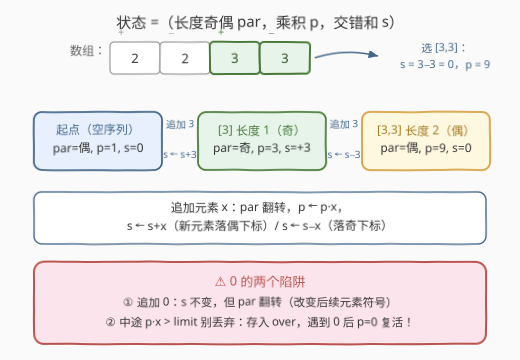
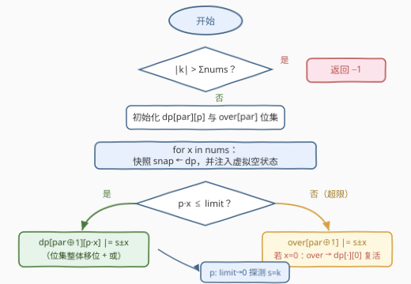

# LeetCode 最大化交错和为 K 的子序列乘积 题解

## 1. 题目概述

- **标题 / 题号**：最大化交错和为 K 的子序列乘积（#3509，hard）
- **链接**：https://leetcode.cn/problems/maximum-product-of-subsequences-with-an-alternating-sum-equal-to-k/
- **难度**：困难
- **标签**：数组、哈希表、动态规划

**题意**：给定整数数组 `nums` 和两个整数 `k` 与 `limit`，找一个**非空子序列**，满足：

- 它的**交错和**恰好等于 $k$（交错和：以下标 0 开始，偶数下标元素之和减去奇数下标元素之和）；
- 在**乘积不超过 `limit`** 的前提下，最大化所有数字的乘积。

返回该最大乘积；不存在这样的子序列时返回 $-1$。

**示例 1**：`nums = [1,2,3], k = 2, limit = 10` → 输出 `6`。子序列 `[1,2,3]` 交错和 $1-2+3=2$，乘积 $6 \le 10$。

**示例 2**：`nums = [0,2,3], k = -5, limit = 12` → 输出 `-1`。不存在交错和为 $-5$ 的子序列。

**示例 3**：`nums = [2,2,3,3], k = 0, limit = 9` → 输出 `9`。`[2,2,3,3]` 交错和为 $0$ 但乘积 $36 > 9$ 超限；次优的 `[3,3]` 交错和 $3-3=0$、乘积 $9$，正好卡在 `limit` 上。

**约束**：$1 \le n \le 150$，$0 \le nums[i] \le 12$，$-10^5 \le k \le 10^5$，$1 \le limit \le 5000$。

## 2. 解题思路

### 2.1 暴力思路

枚举全部 $2^{150}$ 个子序列，对每个子序列计算交错和与乘积再取最大——天文数字，不可行。

优化方向：子序列的「身份」其实由三个量决定——**长度奇偶性、乘积、交错和**。只要把这三元组的**可达性**递推出来，就不需要枚举每个具体子序列。关键在于这三个量的值域都被约束压得很窄。

### 2.2 核心观察：值域受限的可达性 DP（枚举乘积 × 交错和）

> 💡 **一句话**：不枚举子序列，改枚举「(奇偶, 乘积, 交错和)」三元组，用位集记录哪些三元组可达。

**观察一：交错和值域很窄。** 交错和的绝对值不超过元素总和 $\Sigma \le 150 \times 12 = 1800$。若 $|k| > \Sigma$ 直接返回 $-1$。

**观察二：合法乘积值域很窄。** 最终乘积要么是 $0$，要么落在 $[1, limit]$（$limit \le 5000$）。乘积一旦超过 `limit` 就不可能是答案——**除非后续再乘一个 $0$，乘积归零重新合法**（见下面的陷阱）。

**观察三：追加元素只需知道长度奇偶。** 子序列是从左到右逐个追加元素构成的。设当前子序列长度为 $L$：

- $L$ 为偶数时，新元素落在（子序列内部的）偶数下标，交错和 $s \leftarrow s + x$；
- $L$ 为奇数时，新元素落在奇数下标，交错和 $s \leftarrow s - x$；
- 同时乘积 $p \leftarrow p \cdot x$，长度奇偶翻转。

于是定义 DP 状态：

$$dp[par][p] = \text{位集}，\ \text{第 } (s+\Sigma) \text{ 位为 1} \iff \exists \text{ 子序列：长度奇偶 } par、\text{乘积 } p、\text{交错和 } s$$

转移即「位集整体移位再按位或」：$par=0$ 时左移 $x$ 位（$s+x$），$par=1$ 时右移 $x$ 位（$s-x$）。



> ⚠️ **0 的两个陷阱（本题最阴的考点）**
>
> 1. **追加 0 元素**：$s \pm 0 = s$ 不变，但**长度奇偶翻转**，会改变后续元素的符号——0 不是"废子"，它能调整奇偶！
> 2. **中途乘积超限 ≠ 死路**：比如 $[1,3,1,4]$ 乘积 $12 > limit=6$，看似该剪掉；但再乘一个 $0$（子序列 $[1,3,1,4,0,3]$），乘积变 $0 \le limit$，交错和 $1-3+1-4+0-3=-8$ 照样有效。所以超限状态不能丢，要额外维护 $over[par]$ 位集（只记交错和），**等 $0$ 来救**；$over$ 遇到 $x=0$ 时转入 $dp[par \oplus 1][0]$ 复活。

**虚拟空状态**：初始「空序列」对应 $(par{=}0, p{=}1, s{=}0)$，但空序列本身不能作为答案。做法：每轮处理元素 $x$ 时，把空状态**只注入到快照**里参与转移（等价于"以 $x$ 开头新开一个子序列"），而不写入 `dp` 本体——这样 `dp` 中永远只有非空子序列，答案提取无需特判。

### 2.3 算法流程图



文字版流程：

1. 若 $|k| > \Sigma nums$，返回 $-1$；
2. 初始化 $dp[par][p]$ 与 $over[par]$（全空位集）；
3. 依次遍历每个元素 $x$：对 $dp$ 做快照 `snap`，并在 `snap[0][1]` 中注入虚拟空状态；
4. 对快照中每个状态 $(par, p, s)$：计算 $np = p \cdot x$，位集按 $par$ 左移/右移 $x$ 位；$np \le limit$ 则并入 $dp[par \oplus 1][np]$，否则并入 $over[par \oplus 1]$（超限缓存）；
5. `over` 位集同样转移：$x = 0$ 时并入 $dp[par \oplus 1][0]$（复活），否则继续在 $over$ 中移位流转；
6. 全部元素处理完后，$p$ 从 $limit$ 降到 $0$，第一个在 $dp[0][p]$ 或 $dp[1][p]$ 中命中 $s = k$ 位的 $p$ 即答案；都不命中返回 $-1$。

### 2.4 示例演算

以示例 3 `nums = [2,2,3,3], k = 0, limit = 9` 为例（位集用交错和集合简记）：

| 处理元素 | 新增/更新的状态 | 说明 |
|---|---|---|
| $x=2$ | $dp[1][2] = \{2\}$ | 子序列 $[2]$：$s=2$ |
| $x=2$ | $dp[0][4] = \{0\}$ | $[2,2]$：$2-2=0$，$p=4$ |
| $x=3$ | $dp[1][3] = \{3\}$，$dp[0][6] = \{-1\}$，$over[1] = \{3\}$ | $[2,3]$：$2-3=-1$；$[2,2,3]$ 乘积 $12 > 9$ 超限进 `over` |
| $x=3$ | $dp[0][9] = \{0\}$，$over[0] = \{0\}$ | $[3,3]$：$3-3=0$，$p=9$ ✓；`over` 中 $3-3=0$ 继续流转 |

最终 $p$ 从 $9$ 开始探测：$dp[0][9]$ 含 $s=0=k$ → **答案 $9$**。注意 $[2,2,3,3]$ 的乘积 $36$ 走的是 `over` 通道，永远不会被提取为答案，正确地被 `limit` 挡在门外。

## 3. 参考代码

### C++

```cpp
class Solution {
public:
    int maxProduct(vector<int>& nums, int k, int limit) {
        int S = accumulate(nums.begin(), nums.end(), 0);
        if (k < -S || k > S) return -1;
        const int OFF = S;                        // 位 (s + OFF) ∈ [0, 2S] ⊆ [0, 3600]
        using BS = bitset<3601>;
        vector<vector<BS>> dp(2, vector<BS>(limit + 1));  // dp[par][p]
        array<BS, 2> over{};                      // over[par]：乘积已超限的交错和集合

        for (int x : nums) {
            vector<BS> snap0 = dp[0], snap1 = dp[1];
            BS o0 = over[0], o1 = over[1];
            snap0[1][OFF] = 1;                    // 虚拟空状态：仅入快照，不入 dp 本体
            for (int par = 0; par < 2; ++par) {
                auto &snap = (par == 0 ? snap0 : snap1);
                for (int p = 0; p <= limit; ++p) {
                    if (snap[p].none()) continue;
                    long long np = 1LL * p * x;
                    BS nb = snap[p];
                    if (par == 0) nb <<= x; else nb >>= x;   // s+x / s−x
                    if (np <= limit) dp[par ^ 1][np] |= nb;  // 合法：进 dp
                    else             over[par ^ 1] |= nb;    // 超限：等 0 复活
                }
                BS ob = (par == 0 ? o0 : o1);
                if (ob.any()) {
                    if (x == 0) dp[par ^ 1][0] |= ob;        // 乘 0：p=0 复活
                    else {
                        BS nb = ob;
                        if (par == 0) nb <<= x; else nb >>= x;
                        over[par ^ 1] |= nb;                 // 仍超限
                    }
                }
            }
        }
        for (int p = limit; p >= 0; --p)
            if (dp[0][p][OFF + k] || dp[1][p][OFF + k]) return p;
        return -1;
    }
};
```

### Python

用 Python 大整数当位集（无限精度，移位天然安全）：

```python
class Solution:
    def maxProduct(self, nums: List[int], k: int, limit: int) -> int:
        S = sum(nums)
        if not (-S <= k <= S):
            return -1
        OFF = S
        EMPTY = 1 << OFF                       # 虚拟空状态位：s = 0
        dp = [dict(), dict()]                  # dp[par][p] = 交错和位集（乘积合法）
        over = [0, 0]                          # over[par] = 交错和位集（乘积超限）

        for x in nums:
            snap0, snap1 = dict(dp[0]), dict(dp[1])
            o0, o1 = over[0], over[1]
            snap0[1] = snap0.get(1, 0) | EMPTY  # 空状态只注入快照
            for par in (0, 1):
                snap = snap0 if par == 0 else snap1
                dst = dp[par ^ 1]
                for p, bits in snap.items():
                    np_ = p * x
                    nb = bits << x if par == 0 else bits >> x   # s+x / s−x
                    if np_ <= limit:
                        dst[np_] = dst.get(np_, 0) | nb         # 合法：进 dp
                    else:
                        over[par ^ 1] |= nb                     # 超限：等 0 复活
                ob = o0 if par == 0 else o1
                if ob:
                    if x == 0:
                        dp[par ^ 1][0] = dp[par ^ 1].get(0, 0) | ob  # 复活
                    else:
                        over[par ^ 1] |= ob << x if par == 0 else ob >> x

        target = 1 << (OFF + k)
        for p in range(limit, -1, -1):
            if (dp[0].get(p, 0) & target) or (dp[1].get(p, 0) & target):
                return p
        return -1
```

> 💡 两份代码均通过：官方 3 个示例 + 上万组与 $O(2^n)$ 暴力的随机对拍（含 0 密集用例）。$n = 150$ 的随机实例 Python 约 0.02s。

## 4. 复杂度分析

设 $n$ 为数组长度，$\Sigma = \sum nums \le 1800$，$w$ 为机器字长（64）。

| 维度 | 复杂度 | 说明 |
|---|---|---|
| 时间 | $O\left(\dfrac{n \cdot limit \cdot \Sigma}{w}\right)$ | 每个元素对至多 $limit{+}1$ 个乘积桶做一次位集移位+或，每次位集运算 $O(\Sigma/w)$；代入 $150 \times 5000 \times 3600 / 64 \approx 4 \times 10^7$ 字操作 |
| 空间 | $O\left(\dfrac{limit \cdot \Sigma}{w}\right)$ | $dp[2][limit{+}1]$ 个位集，约 $2 \times 5001 \times 451\text{B} \approx 4.5\text{MB}$（C++ `bitset`；Python 用 `dict` 只存非空桶更省） |

## 5. 扩展：如果元素可以为负数

$nums[i] \in [0, 12]$ 是本题值域 DP 的基石：乘积非负、交错和有界。若允许负数：

- 乘积符号会翻转，需要把状态扩成 $(par, |p|, \text{符号}, s)$，或用哈希表存 $(p, s)$ 对——但 $|p|$ 可达 $12^{150}$，值域爆炸；
- 此时只能退回 $O(2^n)$ 爆搜，或 $n \le 40$ 时用 **meet-in-the-middle**（前后两半各枚举 $2^{n/2}$，按 $(s, p)$ 分桶合并）。

另外若把「最大化乘积」改成「统计方案数」，把位集换成计数数组即可，套路不变。

## 6. 面试要点

**Q1：为什么状态里必须有「长度奇偶」这一维？**
　　因为追加元素的符号由当前子序列长度决定：长度为偶时新元素落偶下标（$+x$），为奇时落奇下标（$-x$）。只记 $(p, s)$ 无法确定转移方向，同一个 $s$ 的后续演化完全不同。

**Q2：0 元素在本题里起什么作用？**
　　两个作用：一是**翻转奇偶而不改变交错和**（±0），相当于免费的"换手"；二是让**超限乘积复活**为 0（$p > limit$ 的状态乘 0 后 $p = 0 \le limit$）。第二点是最容易写错的剪枝陷阱。

**Q3：为什么乘积能当状态维度而不爆？**
　　因为合法乘积值域被 `limit ≤ 5000` 封顶，且 $nums[i] \le 12$ 意味着乘积只会离散步进。一般地，「值域受限的量」都可以做 DP 维度（背包里的容量、本题的乘积/交错和都是）。

**Q4：虚拟空状态为什么要注入快照而不是直接放进 dp？**
　　若空状态 $(p{=}1, s{=}0, par{=}0)$ 常驻 `dp`，最后提取答案时它会被误当成乘积 1、交错和 0 的"子序列"（其实是空序列，非法）。只注入每轮快照，既让每个元素都能当"第一个元素"，又保证 `dp` 中全是非空子序列。

**Q5：over 位集为什么不需要乘积维度？**
　　超限状态的乘积具体是多少无关紧要——它要么继续超限（乘非零元素，留在 `over`），要么归零（乘 0，进 `dp[\cdot][0]$）。答案提取只看 `dp`，`over` 只是等待复活的缓冲区，所以压掉乘积维度，省内存也省转移量。

## 同类练习题

| # | 题目 | 与本题的关联 |
|---|------|-------------|
| 2585 | [获得分数的方法数](https://leetcode.cn/problems/number-of-ways-to-earn-points/) | 值域背包，按「和」做状态维度计数，与本题「枚举值域而非子序列」同思想 |
| 956 | [最高的广告牌](https://leetcode.cn/problems/tallest-billboard/) | 哈希保存所有可达的「左右差值 → 最大高度」，同样是可达性 DP 压状态数 |
| 1981 | [最小化目标值与所选元素的差](https://leetcode.cn/problems/minimize-the-difference-between-target-and-chosen-elements/) | 每行选一个数、和的值域受限做 bitset 可达性，移位技巧与本题一致 |
| 2902 | [和带限制的子多重集合的个数](https://leetcode.cn/problems/count-of-sub-multisets-with-bounded-sum/) | 值域多重背包，同样要小心处理 0 元素带来的退化情形 |
| 1434 | [每个人戴不同帽子的方案数](https://leetcode.cn/problems/number-of-ways-to-wear-different-hats-to-each-other/) | 把一维状态压进 bitset 的经典 DP，与本文交错和位集压缩同套路 |
