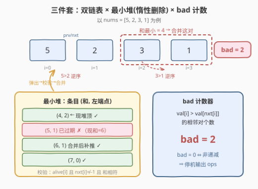
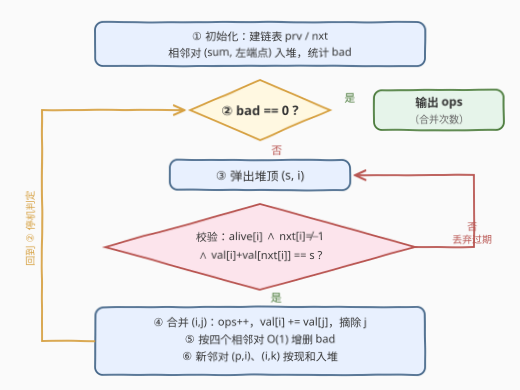

# 移除最小数对使数组有序 II

- **题目名称**：移除最小数对使数组有序 II
- **链接**：[3510. 移除最小数对使数组有序 II](https://leetcode.cn/problems/minimum-pair-removal-to-sort-array-ii/)
- **难度**：困难
- **标签**：数组、链表、模拟、堆（优先队列）、有序集合

## 1. 题目概述

给你一个数组 `nums`，你可以执行以下操作任意多次：

- 选择**相邻**元素对中**和最小**的一对；如果存在多个这样的对，选择**最左边**的一个；
- 用它们的和**替换**这对元素（两个元素合并为一个）。

返回将数组变为**非递减**所需的最小操作次数。

数组**非递减**指每个元素都大于或等于它前一个元素（如存在）。

**示例 1**：

```text
输入：nums = [5,2,3,1]
输出：2
解释：
元素对 (3,1) 的和最小，为 4。替换后 nums = [5,2,4]。
元素对 (2,4) 的和为 6。替换后 nums = [5,6]。
数组 nums 在两次操作后变为非递减。
```

**示例 2**：

```text
输入：nums = [1,2,2]
输出：0
解释：数组 nums 已经是非递减的。
```

**约束条件**：

- $1 \le \text{nums.length} \le 10^5$
- $-10^9 \le \text{nums[i]} \le 10^9$

> 💡 注意操作**没有任何选择空间**：「和最小」唯一确定目标和，并列时「最左边」再唯一确定位置——每一次操作都被题面强制确定。因此整条执行链唯一，答案就是**模拟到数组非递减为止所执行的合并次数**；「最小操作次数」体现在「一旦非递减立即停机」。

---

## 2. 解题思路

### 2.1 暴力思路：每轮线性扫描，$O(n^2)$

直接按题面模拟：每轮扫描全部相邻对找最小和（并列取最左），合并两数（数组中间删元素需 $O(n)$ 搬移），再线性检查是否非递减。每轮 $O(n)$，至多合并 $n-1$ 轮，总计 $O(n^2)$。

这是 3507（本题的弱化版，$n \le 50$）的标准解法，但 $n = 10^5$ 时 $O(n^2) = 10^{10}$ 必然超时。要把每轮的三个动作全部提速：

| 动作 | 暴力代价 | 目标代价 | 器件 |
|------|---------|---------|------|
| 找「和最小、最左」的相邻对 | $O(n)$ 扫描 | $O(\log n)$ | 最小堆（惰性删除） |
| 合并相邻对（中间删一个元素） | $O(n)$ 搬移 | $O(1)$ | 双向链表 |
| 判断当前是否非递减 | $O(n)$ 扫描 | $O(1)$ | 逆序对计数 `bad` |

### 2.2 核心观察：双链表 × 惰性删除堆 × bad 计数器



三件套各司其职：

**① 双向链表（数组模拟）**：元素按原始下标 $0..n-1$ 建节点，`prv[i]` / `nxt[i]` 存前后邻居。合并相邻对 $(i,\ j=\text{nxt}[i])$ 时只需 `val[i] += val[j]`、把 $j$ 摘链（$\text{nxt}[i] \leftarrow \text{nxt}[j]$，$\text{prv}[\text{nxt}[j]] \leftarrow i$），$O(1)$ 完成「中间删除」。下标是静态的，用三个数组即可，不需要真正的链表节点或哈希表。

**② 最小堆 + 惰性删除**：堆中存放二元组 $(\text{sum},\ i)$——**先按和、再按左端点**比较，弹出顺序恰好就是「和最小、并列最左」。麻烦在于合并后邻居关系与 `val[i]` 都变了，堆中旧条目的和随之**过期**。解法是**不主动删除旧条目**，弹出时做三合一校验：

$$\text{alive}[i] \ \wedge\ \text{nxt}[i] \ne -1 \ \wedge\ \text{val}[i] + \text{val}[\text{nxt}[i]] = s$$

不通过就丢弃、继续弹。由于每次合并后会为受影响的两个邻对 $(\text{prv}[i],\ i)$、$(i,\ \text{nxt}[i])$ **补推现和条目**，「每个当前相邻对在堆中必有一条现和条目」这一不变量始终成立——于是**第一个通过校验的弹出条目，必是全局最小和的最左对**。

**③ bad 计数器**：维护满足 $\text{val}[i] \gt \text{val}[\text{nxt}[i]]$ 的存活相邻对个数，则

$$\text{bad} = 0 \iff \text{数组非递减} \iff \text{停机输出}$$

合并只波及 $O(1)$ 个相邻对，`bad` 可以 $O(1)$ 增删（清单见 2.3）。

> ⚠️ **负数是隐藏考点**：$\text{nums[i]} \in [-10^9, 10^9]$，合并后「大数 + 负数」会让现和**变小**，堆里残留的旧小和条目可能比一切现和都小。若只比较和的大小而不做上述校验，就会取错对——惰性删除的校验不是防御性编程，而是**正确性的一部分**。

### 2.3 算法流程图



**执行步骤**：

| 步骤 | 动作 | 说明 |
|------|------|------|
| ① | 初始化 | 建链表 `prv` / `nxt`；全部 $n-1$ 个相邻对按现和入堆；统计初始 `bad` |
| ② | 停机判定 | `bad == 0` ⇒ 输出 `ops`，结束 |
| ③ | 弹出 + 校验 | 弹堆顶 $(s, i)$，过三合一校验则采纳，否则丢弃、回到 ③ |
| ④ | 合并 $(i, j)$ | `ops++`；`val[i] += val[j]`；摘除 $j$，接回 $(p, i, k)$ |
| ⑤ | 维护 bad | 按下表对四个相邻对 $O(1)$ 增删 |
| ⑥ | 补推条目 | 新邻对 $(p, i)$、$(i, k)$ 若存在则按现和入堆，回到 ② |

其中「维护 bad」的完整清单——合并 $(i, j)$（记 $p = \text{prv}[i]$，$k = \text{nxt}[j]$）时被波及的相邻对**恰好四个**：

| 相邻对 | 变化 | bad 修正 |
|--------|------|----------|
| $(i, j)$ | 消失 | 旧值逆序则 `bad--` |
| $(j, k)$ | 消失 | 旧值逆序则 `bad--` |
| $(p, i)$ | `val[i]` 变了 | 旧 `val[i]` 逆序先 `bad--`，新 `val[i]` 逆序再 `bad++` |
| $(i, k)$ | 新生 | 新值逆序则 `bad++` |

漏掉 $(j,k)$ 或 $(p,i)$ 是最常见的 bug 来源：$(j,k)$ 随 $j$ 被摘除而消失；$(p,i)$ 的右端值变了，可能由顺变逆（或由逆变顺）。

### 2.4 示例演算

以 `nums = [5,2,3,1]` 完整走一遍：

**初始**：链表 `5 ⇄ 2 ⇄ 3 ⇄ 1`；相邻对 $(5,2)=7$、$(2,3)=5$、$(3,1)=4$ 全部入堆；逆序对 $(5,2)$、$(3,1)$ ⇒ `bad = 2`。

**第 1 轮**：堆顶 $(4, 2)$——下标 2 处的对 $(3,1)$，校验通过（现和就是 4）。合并：`val[2] = 3+1 = 4`，摘除下标 3，数组变 `[5,2,4]`；$(3,1)$ 原本逆序 ⇒ `bad = 1`（只剩 $5 \gt 2$）；为新生邻对 $(2,4)$ 推入 $(6, 1)$。此时堆内有 $(5,1)$、$(6,1)$、$(7,0)$——其中 $(5,1)$ 已**过期**（下标 1 处的对现和是 $2+4=6$）。

**第 2 轮**：堆顶 $(5, 1)$，校验 $2+4=6 \ne 5$ ⇒ **丢弃**。新堆顶 $(6, 1)$ 校验通过。合并：`val[1] = 2+4 = 6`，摘除下标 2，数组变 `[5,6]`；左侧对 $5 \gt 2$ 的逆序随 `val[1]` 更新消失（$5 \le 6$）⇒ `bad = 0` ⇒ **停机**。

共 2 次操作，与示例一致。注意第 2 轮里过期条目 $(5,1)$ 先于现和条目 $(6,1)$ 弹出、被校验拦下的过程——正是 2.2 中 ⚠️ 所描述的机理（此例的过期由「邻居变了」而非「负数」引起，本质相同：现和 $\ne$ 条目和）。

---

## 3. 参考代码

### C++

```cpp
class Solution {
  public:
    int minimumPairRemoval(vector<int>& nums) {
        int n = nums.size();
        vector<long long> val(nums.begin(), nums.end());  // 累积和可达 1e14，用 long long
        vector<int> prv(n), nxt(n);
        vector<bool> alive(n, true);
        for (int i = 0; i < n; ++i) {
            prv[i] = i - 1;
            nxt[i] = i + 1 < n ? i + 1 : -1;
        }

        int bad = 0;  // 逆序相邻对个数
        priority_queue<pair<long long, int>, vector<pair<long long, int>>, greater<>> pq;
        for (int i = 0; i + 1 < n; ++i) {
            if (val[i] > val[i + 1]) ++bad;
            pq.push({val[i] + val[i + 1], i});  // (和, 左端点)：天然「最小和、并列最左」
        }

        int ops = 0;
        while (bad > 0) {  // bad == 0 ⇔ 非递减 ⇔ 停机
            auto [s, i] = pq.top();
            pq.pop();
            int j = nxt[i];
            if (!alive[i] || j == -1 || val[i] + val[j] != s) continue;  // 惰性删除：三合一校验

            int p = prv[i], k = nxt[j];
            ++ops;  // 合并 (i, j)
            if (val[i] > val[j]) --bad;              // 对 (i,j) 消失
            if (k != -1 && val[j] > val[k]) --bad;   // 对 (j,k) 消失
            long long oldI = val[i];
            val[i] = oldI + val[j];
            alive[j] = false;
            nxt[i] = k;  // 摘除 j，接回 (p, i, k)
            if (k != -1) prv[k] = i;
            if (p != -1) {  // 对 (p,i)：值变化，先退旧判再进新判
                if (val[p] > oldI) --bad;
                if (val[p] > val[i]) ++bad;
                pq.push({val[p] + val[i], p});
            }
            if (k != -1) {  // 新生对 (i,k) 入堆
                if (val[i] > val[k]) ++bad;
                pq.push({val[i] + val[k], i});
            }
        }
        return ops;
    }
};
```

### Python

```python
class Solution:
    def minimumPairRemoval(self, nums: List[int]) -> int:
        n = len(nums)
        val = list(nums)                           # 累积和可达 1e14
        prv = list(range(-1, n - 1))               # prv[i] = i-1
        nxt = list(range(1, n + 1)); nxt[-1] = -1  # nxt[i] = i+1
        alive = [True] * n

        bad = 0                                    # 逆序相邻对个数
        heap = []
        for i in range(n - 1):
            if val[i] > val[i + 1]:
                bad += 1
            heap.append((val[i] + val[i + 1], i))  # (和, 左端点)
        heapq.heapify(heap)

        ops = 0
        while bad > 0:                             # bad == 0 ⇔ 非递减 ⇔ 停机
            s, i = heapq.heappop(heap)
            if not alive[i]:
                continue
            j = nxt[i]
            if j == -1 or val[i] + val[j] != s:    # 惰性删除：三合一校验
                continue

            ops += 1                               # 合并 (i, j)
            p, k = prv[i], nxt[j]
            if val[i] > val[j]:
                bad -= 1                           # 对 (i,j) 消失
            if k != -1 and val[j] > val[k]:
                bad -= 1                           # 对 (j,k) 消失
            old_i = val[i]
            val[i] = old_i + val[j]
            alive[j] = False
            nxt[i] = k                             # 摘除 j，接回 (p, i, k)
            if k != -1:
                prv[k] = i
            if p != -1:                            # 对 (p,i)：值变化，先退旧判再进新判
                if val[p] > old_i:
                    bad -= 1
                if val[p] > val[i]:
                    bad += 1
                heapq.heappush(heap, (val[p] + val[i], p))
            if k != -1:                            # 新生对 (i,k) 入堆
                if val[i] > val[k]:
                    bad += 1
                heapq.heappush(heap, (val[i] + val[k], i))
        return ops
```

---

## 4. 复杂度分析

| 维度 | 复杂度 | 说明 |
|------|--------|------|
| **时间复杂度** | $O(n \log n)$ | 至多 $n-1$ 次合并；堆条目总数 $\le (n-1) + 2(n-1) \lt 3n$，每条至多进出堆各一次，单次 $O(\log n)$ |
| **空间复杂度** | $O(n)$ | 链表三数组、存活标记、堆（含过期条目）均为 $O(n)$ |

---

## 5. 扩展：有序集合写法与 I 版对照

1. **有序集合等价写法**：官方 hint 给的是另一套器件——「哈希表（下标 → 值）维护存活元素 + 有序集合存 $(\text{和}, \text{左下标})$ + 哈希集合存待删下标」。取有序集合首元素即最小最左对，合并后**精确删除**旧条目、插入新条目，代替惰性删除。两种写法完全等价：Java 选手用 `TreeMap` + `TreeSet` 更顺手（`PriorityQueue` 不支持删除任意元素），Python / C++ 用「堆 + 惰性删除」代码更短。
2. **[3507. 移除最小数对使数组有序 I](https://leetcode.cn/problems/minimum-pair-removal-to-sort-array-i/)**：同一题面的 $n \le 50$ 弱化版，$O(n^2)$ 暴力模拟即可通过；本文解法**原样覆盖** 3507——数据范围从 50 放大到 $10^5$，把「怎么模拟」逼成了「用什么器件模拟」，正是 I / II 分题的意义。

---

## 6. 面试要点

1. **操作有选择余地吗？为什么「模拟」就是「最小操作次数」？**

   > 没有。「和最小」唯一确定目标和，并列时「最左」再唯一确定位置，每次操作被题面完全强制，执行链唯一。唯一自由度是停机时机，而「一旦非递减立即停」显然最优——答案 = 模拟执行的合并次数。

2. **惰性删除的校验为什么要查三项？少查「和相等」会怎样？**

   > 三项分别拦截：左端点已死（结构性过期）、已无右邻居（变成尾节点）、现和与条目和不符（数值性过期）。第三项尤为关键——元素可为负，合并后现和可能**变小**，堆里残留的旧小和条目会比一切现和都小，不校验就会取错对。

3. **为什么堆序 $(\text{sum}, \text{左端点})$ 就实现了「并列取最左」？过期条目会干扰吗？**

   > 二元组按字典序比较，和相同时左端点小者先出。每个当前相邻对都有现和条目，过期条目即便更先弹出也会被校验拦下丢弃——所以**第一个通过校验的弹出条目**恰是「最小和、并列最左」的现行对。

4. **合并 $(i,j)$ 时 `bad` 的维护清单？最容易漏哪个？**

   > 四处：$(i,j)$ 消失、$(j,k)$ 消失、$(p,i)$ 因 `val[i]` 变化重判、$(i,k)$ 新生。最易漏 $(j,k)$（右侧对随 $j$ 一起消失）和 $(p,i)$（左邻对的右端值变了却忘记重判）；漏判会让 `bad` 虚高或虚低，轻则多合并，重则死循环。

5. **堆里的过期条目会不会越积越多，复杂度退化？**

   > 不会。每次合并只补推至多 2 条，总条目数 $\lt 3n$ 仍是 $O(n)$；每条至多进出堆一次，总代价 $O(n \log n)$。惰性删除的过期条目只贡献常数因子，不改变量级。

---

## 7. 同类练习题

- [3507. 移除最小数对使数组有序 I](https://leetcode.cn/problems/minimum-pair-removal-to-sort-array-i/)：本题 $n \le 50$ 弱化版，暴力 $O(n^2)$ 模拟即可，对照体会数据范围如何把模拟题逼成数据结构题
- [2289. 使数组按非递减顺序排列](https://leetcode.cn/problems/steps-to-make-array-non-decreasing/)：同为「反复消除逆序直到非递减」的确定性模拟，用单调双端队列做到均摊 $O(n)$，可与本题的堆做法对照
- [23. 合并 K 个升序链表](https://leetcode.cn/problems/merge-k-sorted-lists/)：「最小堆驱动 + 链表 $O(1)$ 摘接」协同模拟的经典模板，与本题三件套同源
- [1845. 座位预约管理系统](https://leetcode.cn/problems/seat-reservation-manager/)：有序集合 / 堆维护「取最小」的基础件，对应官方 hint 中有序集合的用法
- [355. 设计推特](https://leetcode.cn/problems/design-twitter/)：堆的惰性删除（先推后验）在设计题中的标准应用，理解本题校验三件套的垫脚石
