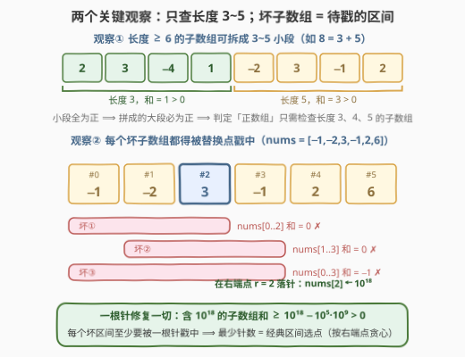
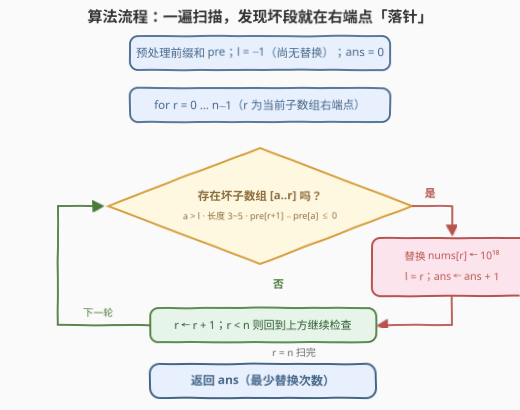

# LeetCode 构造正数组 题解

## 1. 题目概述

- **标题 / 题号**：构造正数组（#3511，medium）
- **链接**：https://leetcode.cn/problems/make-a-positive-array/
- **难度**：中等
- **标签**：贪心，数组，前缀和

> ⚠️ 本题为 LeetCode 付费题，题意描述根据官方示例用例与 hints 重建，可能与官方题面有出入。

**题意**：给定一个数组 `nums`。称一个数组是**正**的，如果其中**每个**包含**超过两个元素**（即长度 ≥ 3）的**子数组**的元素之和都严格为正。

你可以执行以下操作任意多次：

- 将 `nums` 中的**一个**元素替换为 $[-10^{18}, 10^{18}]$ 之间的任意整数。

返回使 `nums` 变为正数组所需的**最少**操作次数。

**示例 1**：

```text
输入：nums = [-10,15,-12]
输出：1
解释：长度超过 2 的子数组只有数组本身，和为 -7 ≤ 0。
      把 nums[0] 替换为 0 后，新和为 0 + 15 + (-12) = 3 > 0，数组转正。
```

**示例 2**：

```text
输入：nums = [-1,-2,3,-1,2,6]
输出：1
解释：和不为正的长子数组有三个：nums[0..2]（和 0）、nums[1..3]（和 0）、nums[0..3]（和 -1）。
      例如令 nums[1] = 1，三者新和分别为 3、3、2，全部转正。
```

**示例 3**：

```text
输入：nums = [1,2,3]
输出：0
解释：数组已经是正的，无需操作。
```

**约束**：

- $3 \le \text{nums.length} \le 10^5$
- $-10^9 \le \text{nums[i]} \le 10^9$

> 💡 **读题关键**：「子数组」指**连续**区间；约束只针对长度 ≥ 3 的子数组，长度 1、2 的子数组无论和是多少都不用管。替换值可取到 $\pm 10^{18}$，比整个数组能贡献的负和总量（$10^5 \times 10^9 = 10^{14}$ 量级）大四个数量级——这是后面「一针修复一切」的底气。

## 2. 解题思路

### 2.1 暴力思路

暴力有双重障碍：

- **判定贵**：判断一个数组是否为正，朴素要枚举全部 $O(n^2)$ 个子数组求和；
- **搜索贵**：枚举「替换哪些位置」是组合爆炸——$n$ 个位置共 $2^n$ 个子集，无从下手。

先解决判定，搜索侧才有戏。突破口是把两件事分开看：

1. **哪些子数组需要检查？**——其实只有长度 3~5 的（观察一）；
2. **替换到底干了什么？**——它不是「修改一个数」，而是「激活一个位置」（观察二）。

### 2.2 核心观察：只查长度 3~5 + 坏子数组区间选点



**观察一（判定侧）：只需检查长度为 3、4、5 的子数组。**

任何长度 $L \ge 3$ 的子数组都能**无缝切成**若干长度为 3~5 的小段：$L = 3k$ 用 $k$ 个 3；$L = 3k+1$ 用一个 4 配若干 3；$L = 3k+2$ 用一个 5 配若干 3（如 $6=3+3$、$7=3+4$、$8=4+4$）。若所有小段之和为正，则大段总和 = 小段和之和 > 0。逆否即：**只要存在长度 ≥ 3 的坏子数组，就一定存在长度 3~5 的坏子数组**。于是「所有长度 3~5 的子数组和为正」⟺「数组为正」——配合前缀和，每个右端点至多查 3 个起点，判定从 $O(n^2)$ 降到 $O(n)$。

**观察二（操作侧）：一次替换 = 一根能戳穿一切的「针」。**

- **必要性**：子数组 $[a..b]$ 的和只由它自己的元素决定。坏子数组（和 $\le 0$）想转正，**必须**至少替换它内部的一个位置——外面怎么动都鞭长莫及；
- **充分性**：把位置 $p$ 替换成 $10^{18}$ 后，任何包含 $p$ 的子数组新和 $\ge 10^{18} - (n-1)\cdot 10^9 > 10^{18} - 10^{14} > 0$，**一个点就够**。

于是最小操作数 = 「用最少的点，戳中所有坏子数组对应的区间」——正是经典的**区间选点**问题（452 射气球的同款模型）。贪心策略：

> **按右端点从小到大处理坏区间；遇到还没被戳中的区间，就把替换点放在它的右端点上。**

**交换论证**：设 $[a_1, b_1]$ 是右端点最小的坏区间。任何可行方案都得在它内部放个点 $p$。任取一个包含 $p$ 的坏区间 $J$：$J$ 的右端点 $\ge b_1$（$b_1$ 是全局最小右端点），而 $J$ 的左端点 $\le p \le b_1$，故 $J$ 也包含 $b_1$——把 $p$ 挪到 $b_1$ **不会丢掉任何覆盖**。所以存在「所有点都落在坏区间右端点上」的最优解，贪心构造的正是它。

**实现要点**：右端点从小到大 = 从左往右扫 $r$；用 $l$ 记录**上次替换的位置**：

- 以 $r$ 为右端点检查时，只考虑起点 $a > l$ 的候选——**包含 $l$ 的子数组已被 $10^{18}$ 修复**，无需再查；
- 一旦某个候选坏（$\text{pre}[r+1] - \text{pre}[a] \le 0$），立即替换 $r$（$l \leftarrow r$，ans 加一）。

> 💡 **为什么候选只查长度 3~5 就与「查所有长度」等价？** 若未修复段里存在以 $r$ 结尾的坏子数组（无论多长），把它切成 3~5 的小段：总和非正 ⟹ 某小段非正；该小段右端点若小于 $r$，早在扫到它时就会触发替换（与当前 $l < a$ 矛盾）；故它必以 $r$ 结尾、长度 3~5。即**每个触发时刻都有 3~5 的「证人」**。

### 2.3 算法流程图



一遍扫描 + 前缀和，发现坏段立刻在右端点落针：

```text
pre ← 前缀和；l ← −1；ans ← 0
for r = 0 … n−1:
    for a ∈ {r−4, r−3, r−2}:              # 长度 5 / 4 / 3
        if a > l 且 pre[r+1] − pre[a] ≤ 0:
            ans++；l ← r                   # 在 r 处替换为 10^18
            break
return ans
```

### 2.4 示例演算

以 `nums = [-1,-2,3,-1,2,6]` 走一遍（`pre = [0,-1,-3,0,-1,1,7]`）：

| $r$ | 候选起点 $a$（长 5/4/3） | 合法候选（$a > l$） | 检查结果 | 动作 |
|----|--------------------------|---------------------|----------|------|
| 0, 1 | — | — | 长度不足 3 | — |
| 2 | $-2 / -1 / 0$ | $a = 0$ | $\text{pre}[3]-\text{pre}[0] = 0 \le 0$ ✗ | **替换** $\text{nums}[2] \leftarrow 10^{18}$，$l = 2$，ans = 1 |
| 3 | $-1 / 0 / 1$ | 无 | —（坏区间 $[1..3]$、$[0..3]$ 都包含已替换的下标 2） | 安全 |
| 4 | $0 / 1 / 2$ | 无 | — | 安全 |
| 5 | $1 / 2 / 3$ | $a = 3$ | $\text{pre}[6]-\text{pre}[3] = 7 > 0$ ✓ | 安全 |

最终 ans = 1：三个坏区间 $[0..2]$、$[1..3]$、$[0..3]$ 全都包含下标 2，一针全部转正。

> ⚠️ 官方示例解释里替换的是 $\text{nums}[1]$（同样一次搞定三个坏区间）——最优解不唯一，但**最少次数**唯一，贪心给出的正是这个最小值。

## 3. 参考代码

### C++

```cpp
class Solution {
  public:
    int makeArrayPositive(vector<int>& nums) {
        int n = nums.size();
        vector<long long> pre(n + 1);
        for (int i = 0; i < n; i++) {
            pre[i + 1] = pre[i] + nums[i];
        }
        int ans = 0;
        int l = -1;                                  // 上一次替换的位置
        for (int r = 0; r < n; r++) {
            for (int a : {r - 4, r - 3, r - 2}) {    // 长度 5 / 4 / 3
                if (a > l && a >= 0 && pre[r + 1] - pre[a] <= 0) {
                    ans++;                           // 在右端点 r 替换为 1e18
                    l = r;
                    break;
                }
            }
        }
        return ans;
    }
};
```

### Python

```python
class Solution:
    def makeArrayPositive(self, nums: List[int]) -> int:
        n = len(nums)
        pre = [0] * (n + 1)
        for i, x in enumerate(nums):
            pre[i + 1] = pre[i] + x
        ans, l = 0, -1                               # l = 上一次替换的位置
        for r in range(n):
            for a in (r - 4, r - 3, r - 2):          # 长度 5 / 4 / 3
                if a > l and a >= 0 and pre[r + 1] - pre[a] <= 0:
                    ans += 1                         # 在右端点 r 替换为 1e18
                    l = r
                    break
        return ans
```

> 💡 **替换之后 `pre` 为什么不用更新？** 后续所有查询的起点都满足 $a > l$，算的是从未被动过的**原始值**区段——被替换位置左侧的前缀和虽然「过期」，但永远不会再用到。

## 4. 复杂度分析

| 维度 | 复杂度 | 说明 |
|------|--------|------|
| 时间复杂度 | $O(n)$ | 前缀和预处理一遍；每个 $r$ 至多检查 3 个候选起点 |
| 空间复杂度 | $O(n)$ | 前缀和数组 `pre`；用第 5 节滑窗写法可压到 $O(1)$ |

## 5. 扩展：$O(1)$ 额外空间的滑窗写法

不建 `pre` 数组也能做：在未修复段 $(l, r]$ 内滚动维护前缀和 $s$ 与「最优切割点之前」的前缀和最大值 $\text{pre\_mx} = \max_{l \le j \le r-3} \text{sum}(l{+}1..j)$，则

$$s \le \text{pre\_mx} \iff \exists\, j,\ \text{sum}(j{+}1..r) \le 0 \iff \text{存在以 } r \text{ 结尾的坏子数组}$$

```python
class Solution:
    def makeArrayPositive(self, nums: List[int]) -> int:
        l = -1
        ans = pre_mx = s = 0
        for r, x in enumerate(nums):
            s += x                          # s = sum(l+1..r)
            if r - l > 2 and s <= pre_mx:   # 窗口长 ≥3 且发现坏子数组
                ans += 1
                l = r
                pre_mx = s = 0
            elif r - l >= 2:
                pre_mx = max(pre_mx, s - x - nums[r - 1])
        return ans
```

这一版天然检查**所有**长度 ≥ 3 的子数组，与只查 3~5 等价（见 2.2 的「证人」论证）。注意 `elif` 里加入的切割点 $j = r-2$ 是供**下一轮**检查用的——判断发生的时刻，$\text{pre\_mx}$ 恰好覆盖 $j \le r-3$ 的全部候选，对应子数组长度 ≥ 3，不多不少。

## 6. 面试要点

1. **为什么判定「正数组」只需检查长度 3~5 的子数组？**

   > 拆分论证：任何长度 $\ge 3$ 的子数组可无缝切成若干 3~5 的小段（$L = 3k / 3k{+}1 / 3k{+}2$ 分别用若干 3、一个 4、一个 5 搭配），小段全正 ⟹ 总和为正。逆否：存在坏子数组 ⟹ 必存在长度 3~5 的坏子数组。

2. **为什么坏子数组内一个替换点既必要又充分？**

   > 必要：子数组的和只由自身元素决定，不动它的内部元素，它的和就不会变。充分：替换为 $10^{18}$ 后，包含它的子数组新和 $\ge 10^{18} - (n-1)\cdot 10^9 > 0$——值域上界比负和总量高 4 个数量级。

3. **贪心为什么把替换点放在坏子数组的右端点？**

   > 区间选点交换论证：取最小右端点 $b_1$ 的坏区间 $[a_1, b_1]$，任何方案在其内部放点 $p$；包含 $p$ 的任何区间右端点 $\ge b_1$、左端点 $\le p \le b_1$，故也包含 $b_1$。把 $p$ 挪到 $b_1$ 不失任何覆盖 ⟹ 存在全部落在右端点上的最优解。

4. **替换后前缀和不更新，为什么不影响正确性？**

   > 之后所有查询都要求起点 $a > l$（上次替换位），落在原始值区段上；「过期」前缀和对应的区段已含 $10^{18}$，天然为正、无需查询。

5. **和 452 射气球这类经典区间选点题相比，本题新在哪？**

   > 452 的区间是**输入直接给的**；本题的坏区间要**自己找**——用「长度 3~5 才需检查 + 前缀和 $O(1)$ 判坏」把发现成本压到 $O(n)$，再套同款右端点贪心。发现与贪心融为一体：扫到即判断，判坏即落针。

> 💡 **一句话总结**：3511 = 「坏子数组 ⟹ 待戳区间」的翻译题——只需盯长度 3~5（更长的可拆分），替换 $10^{18}$ 一针修复一切，然后套区间选点：按右端点扫，遇坏落针。

## 同类练习题

| # | 题目 | 与本题的关联 |
|---|------|-------------|
| 452 | [用最少数量的箭引爆气球](https://leetcode.cn/problems/minimum-number-of-arrows-to-burst-balloons/)（[题解](../0401-0500/452_用最少数量的箭引爆气球.md)） | 区间选点本尊——按右端点排序、在右端点放箭，本题贪心内核与它完全同源 |
| 435 | [无重叠区间](https://leetcode.cn/problems/non-overlapping-intervals/)（[题解](../0401-0500/435_无重叠区间.md)） | 区间选点的对偶（最少删除 = n − 最多互不重叠），同一套按右端点排序的交换论证 |
| 646 | [最长数对链](https://leetcode.cn/problems/maximum-length-of-pair-chain/)（[题解](../0601-0700/646_最长数对链.md)） | 按右端点贪心选最长链，与 435 一体两面 |
| 1326 | [灌溉花园的最少水龙头数目](https://leetcode.cn/problems/minimum-number-of-taps-to-open-to-water-a-garden/)（[题解](../1301-1400/1326_灌溉花园的最少水龙头数目.md)） | 从「选点戳区间」翻转为「选区间覆盖线段」，右端点贪心家族的覆盖分支 |
| 1024 | [视频拼接](https://leetcode.cn/problems/video-stitching/)（[题解](../1001-1100/1024_视频拼接.md)） | 区间覆盖贪心又一变体——从区间集合里挑最少条覆盖目标段 |
