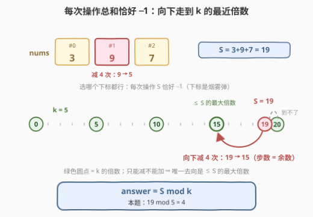
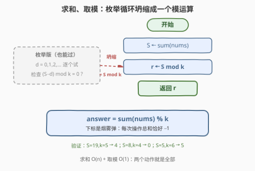

# 使数组和能被K整除的最少操作次数

- **题目名称**：使数组和能被 K 整除的最少操作次数
- **链接**：[3512. 使数组和能被 K 整除的最少操作次数](https://leetcode.cn/problems/minimum-operations-to-make-array-sum-divisible-by-k/)
- **难度**：简单
- **标签**：数组、数学

## 1. 题目概述

给你一个整数数组 `nums` 和一个整数 `k`。你可以执行以下操作**任意次**：

- 选择一个下标 `i`，并将 `nums[i]` 替换为 `nums[i] - 1`。

返回使数组元素之**和**能被 `k` 整除所需的**最小**操作次数。

**示例 1**：

```text
输入：nums = [3,9,7], k = 5
输出：4
解释：对 nums[1] = 9 执行 4 次操作。现在 nums = [3,5,7]，
      数组之和为 15，可以被 5 整除。
```

**示例 2**：

```text
输入：nums = [4,1,3], k = 4
输出：0
解释：数组之和为 8，已经可以被 4 整除，无需操作。
```

**示例 3**：

```text
输入：nums = [3,2], k = 6
输出：5
解释：对 nums[0] = 3 执行 3 次操作，对 nums[1] = 2 执行 2 次操作。
      现在 nums = [0,0]，数组之和为 0，可以被 6 整除。
```

**约束条件**：

- `1 <= nums.length <= 1000`
- `1 <= nums[i] <= 1000`
- `1 <= k <= 100`

> 💡 **读题关键**：操作只能**减不能加**，且目标约束只挂在**总和**上，与单个元素无关——「选哪个下标」是题面放的烟雾弹。

---

## 2. 解题思路

### 2.1 暴力思路：从 0 开始枚举操作次数

先盯住一个事实：设 $S = \sum_i \text{nums}[i]$，无论每次操作落在哪个下标上，$d$ 次操作之后总和都恰好变成 $S - d$。于是最朴素的解法是**枚举操作次数**：

```text
S ← sum(nums)
for d = 0, 1, 2, ...:
    if (S - d) mod k == 0:
        return d
```

满足条件的 $d$ 必在 $[0, k)$ 内出现（余数每隔 $k$ 个数循环一圈），循环至多 $k \le 100$ 圈，加上求和总共 $O(n + k)$，提交稳过。但这个循环其实一步就能跳到终点——首个命中的 $d$ 位置完全可以预测。

### 2.2 核心观察：每次操作总和恰好 −1，答案 = S mod k



三条事实拼出答案：

1. **下标无关**：操作 $\text{nums}[i] \leftarrow \text{nums}[i] - 1$ 无论选哪个 $i$，对总和的效应都是恰好 $-1$。题面看似有 $n$ 维状态（整个数组），但整除性这个约束**只读总和**这一个聚合量——问题从 $n$ 维坍缩到一条数轴。
2. **必要性**：$d$ 次操作后总和为 $S - d$，要求 $k \mid (S - d)$ 即 $d \equiv S \pmod k$。合法的 $d$ 只能是 $S \bmod k,\ S \bmod k + k,\ S \bmod k + 2k, \dots$，最小者就是 $S \bmod k$。
3. **可达性**：$d = S \bmod k \le S$（$S < k$ 时余数就是 $S$ 本身；$S \ge k$ 时余数 $< k \le S$），而把全部元素降到 0 恰好能提供 $S$ 次「减 1」的容量，容量足够；且这 $d$ 次减法可以随意摊到各元素上，**不会把任何元素减成负数**（示例 3 中 $S = 5 < k = 6$，$d = 5$ 正好全部清零）。

$$\text{answer} = \left(\sum_i \text{nums}[i]\right) \bmod k$$

> ⚠️ **常见误读**：看到「整除」就想凑**最近的**倍数——操作只减不增，「向上的下一个倍数」$S + (k - S \bmod k)$ 永远够不着，唯一出路是向下走 $S \bmod k$ 步，落点是不超过 $S$ 的最大倍数。示例 3 里 $S = 5, k = 6$：向上到 6 不可达，只能一路减到 0，花 5 次。

### 2.3 算法流程图



先求和、再取模，两个动作就是全部。2.1 里「枚举 $d$」的循环可以被一个模运算**整体替换**——因为循环首个命中的位置就是 $S \bmod k$。

### 2.4 示例演算

| 示例 | $S$ | $k$ | $S \bmod k$ | 落点（$\le S$ 的最大倍数） | 说明 |
|------|-----|-----|-------------|---------------------------|------|
| 1 | 19 | 5 | **4** | 15 | 对 9 减 4 次：$[3,5,7]$ |
| 2 | 8 | 4 | **0** | 8（原地不动） | 已整除，0 次操作 |
| 3 | 5 | 6 | **5** | 0 | $S < k$，余数即 $S$，全部清零 |

> 💡 $S \bmod k = 0$ 时答案是 0（示例 2）；$S < k$ 时答案是 $S$ 本身（示例 3），对应「全部清零」的极端走法。两种边界都被同一个公式覆盖，无需特判。

---

## 3. 参考代码

### C++

```cpp
class Solution {
  public:
    int minOperations(vector<int>& nums, int k) {
        return accumulate(nums.begin(), nums.end(), 0) % k;
    }
};
```

### Python

```python
class Solution:
    def minOperations(self, nums: List[int], k: int) -> int:
        return sum(nums) % k
```

> 💡 $S \le 1000 \times 1000 = 10^6$，`int` 绰绰有余。C++ 的 `accumulate` 初值给 `0`（`int` 字面量），保持求和类型为 `int`，避免初值与容器元素类型不一致的经典坑。

---

## 4. 复杂度分析

| 维度 | 复杂度 | 说明 |
|------|--------|------|
| 时间复杂度 | $O(n)$ | 一次求和 + 一次取模；对照枚举版 $O(n + k)$，$k \le 100$ 时差距不大，但公式版一步到位 |
| 空间复杂度 | $O(1)$ | 只需一个累加变量 |

---

## 5. 扩展：改动一字，答案换形态

- **操作改成 ±1 双向**：既能减也能加，「向上的下一个倍数」变得可达。设 $r = S \bmod k$，答案变成 $\min(r,\ k - r)$（$r = 0$ 时为 0）——向下走 $r$ 步或向上走 $k - r$ 步，取近者。
- **操作改成只有 +1**：本题的镜像，只能向上凑，答案为 $(k - S \bmod k) \bmod k$。
- **约束改成「每个元素都能被 k 整除」**：整除性从总和下放到每个元素，聚合不变量失效，答案变成 $\sum_i \big(\text{nums}[i] \bmod k\big)$——每个元素独立向下走到自己的倍数再求和。
- **「删一段子数组使剩余和被 k 整除」**（[1590. 使数组和能被 P 整除](https://leetcode.cn/problems/make-sum-divisible-by-p/)）：同样以 $S \bmod k$ 开局，但一次操作删掉一整段，问题变成找「和 $\equiv S \pmod k$ 的最短子数组」，前缀和 + 哈希解决。

---

## 6. 面试要点

1. **为什么选哪个下标无所谓？**

   > 约束条件（总和被 $k$ 整除）只读聚合量 $S$，而每次操作无论作用在哪个下标，对 $S$ 的效应都是恰好 $-1$。局部选择的自由度在聚合之后被完全抹平——$n$ 维状态坍缩成 $(S, d)$ 两个数。

2. **如何论证答案恰好是 $S \bmod k$？**

   > 必要性：$d$ 次操作后总和为 $S - d$，$k \mid (S - d) \iff d \equiv S \pmod k$，最小非负解为 $S \bmod k$。可达性：$S \bmod k \le S$，把元素全部减到 0 的总容量恰为 $S$，容量足够且可任意摊派，全程不需要负数元素。

3. **$S < k$ 时会发生什么？**

   > 余数就是 $S$ 本身，答案是「全部清零」——例如 $S = 5, k = 6$ 时向下走 5 步到 0。它同时说明为什么不能在「上下两个倍数」里挑近的：单向操作下向上的倍数根本不可达。

4. **如果操作改成 nums[i] + 1 或 ±1，答案怎么变？**

   > 只有 +1：$(k - S \bmod k) \bmod k$，向上凑下一个倍数；±1 双向：$\min(S \bmod k,\ k - S \bmod k)$，两个方向取近者。先问清操作的**方向性**再动笔，是这类「凑整除」题的第一步。

5. **「聚合不变量」这个视角还能用在哪？**

   > 只要「约束/目标只依赖某个聚合量，且每次操作对该聚合量的增量固定」，多维状态就能坍缩成数轴上的行走：[1827](https://leetcode.cn/problems/minimum-operations-to-make-the-array-increase/)（每次 +1，只关心各位缺口总和）、[1005](https://leetcode.cn/problems/maximize-sum-of-array-after-k-negations/)（取反操作只关心对总和的效应）都是同款思路——先找聚合量，再算走几步。

> 💡 **一句话总结**：3512 = `sum(nums) % k`——每次操作总和恰好 $-1$，整除性只看总和，下标是烟雾弹；单向减法决定只能向下走到最近的 $k$ 的倍数。

---

## 7. 同类练习题

- [1590. 使数组和能被 P 整除](https://leetcode.cn/problems/make-sum-divisible-by-p/)（[题解](../1501-1600/1590_使数组和能被P整除.md)）：同款「$S \bmod k$」开局，从逐次减 1 升级为删一整段子数组，余数配前缀和哈希找最短等余段
- [974. 和可被K整除的子数组](https://leetcode.cn/problems/subarray-sums-divisible-by-k/)（[题解](../0901-1000/974_和可被K整除的子数组.md)）：把「mod k 的余数」当哈希键数子数组个数，同余定理的计数向应用
- [1827. 最少操作使数组递增](https://leetcode.cn/problems/minimum-operations-to-make-the-array-increase/)（[题解](../1801-1900/1827_最少操作使数组递增.md)）：每次操作给一个元素 +1、只关心总操作数——同款「聚合量 + 固定增量」的坍缩视角
- [1005. K 次取反后最大化的数组和](https://leetcode.cn/problems/maximize-sum-of-array-after-k-negations/)（[题解](../1001-1100/1005_K次取反后最大化的数组和.md)）：操作作用在局部、目标挂在总和上，按操作对总和的效应分类贪心
