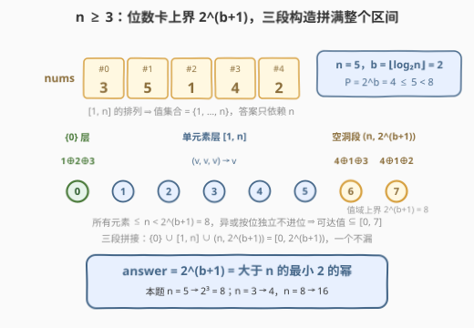
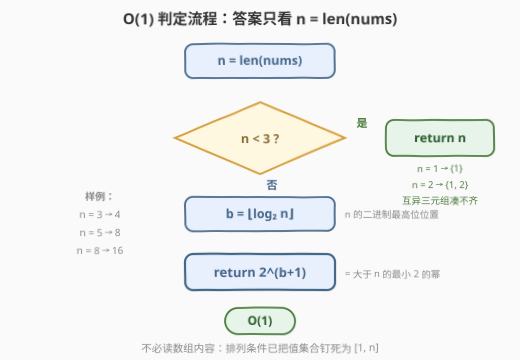

# LeetCode 不同XOR三元组的数目I 题解

## 1. 题目概述

- **标题 / 题号**：不同 XOR 三元组的数目 I（#3513，medium）
- **链接**：https://leetcode.cn/problems/number-of-unique-xor-triplets-i/
- **难度**：中等
- **标签**：位运算、数组、数学

**题意**：给你一个长度为 `n` 的整数数组 `nums`，其中 `nums` 是范围 `[1, n]` 内所有数的**排列**。

**XOR 三元组**定义为三个元素的异或值 `nums[i] XOR nums[j] XOR nums[k]`，其中 `i <= j <= k`。

返回所有可能三元组 `(i, j, k)` 中**不同**的 XOR 值的数量。

**示例 1**：

```text
输入：nums = [1,2]
输出：2
解释：所有可能的 XOR 三元组值为：
  (0,0,0) → 1⊕1⊕1 = 1
  (0,0,1) → 1⊕1⊕2 = 2
  (0,1,1) → 1⊕2⊕2 = 1
  (1,1,1) → 2⊕2⊕2 = 2
  不同的 XOR 值为 {1, 2}，因此输出为 2。
```

**示例 2**：

```text
输入：nums = [3,1,2]
输出：4
解释：可能的 XOR 三元组值包括：
  (0,0,0) → 3⊕3⊕3 = 3
  (0,0,1) → 3⊕3⊕1 = 1
  (0,0,2) → 3⊕3⊕2 = 2
  (0,1,2) → 3⊕1⊕2 = 0
  不同的 XOR 值为 {0, 1, 2, 3}，因此输出为 4。
```

**约束**：

- `1 <= n == nums.length <= 10^5`
- `1 <= nums[i] <= n`
- `nums` 是从 1 到 n 的整数的一个排列

> 💡 **读题关键**：`nums` 是 `[1, n]` 的**排列**——值集合被死死钉在 `[1, n]`，每个值恰好出现一次；又因为 `i <= j <= k` 允许重号（`(i,i,i)`、`(i,i,j)` 都合法），三元组选出的本质是「值的多重集」。两条合起来：**答案只依赖 n，与具体排列顺序无关**——这是整题坍缩成 O(1) 的根源。

## 2. 解题思路

### 2.1 暴力思路：枚举 i ≤ j ≤ k 去重

最直接的做法是三重循环枚举所有 `i <= j <= k`，把 `nums[i] ^ nums[j] ^ nums[k]` 扔进哈希集合，最后返回集合大小：

```text
seen = 空集合
for i = 0 .. n-1:
    for j = i .. n-1:
        for k = j .. n-1:
            seen.add(nums[i] ^ nums[j] ^ nums[k])
return |seen|
```

复杂度 $O(n^3)$，$n = 10^5$ 时约 $1.7 \times 10^{15}$ 次运算，完全不可行。但这个暴力有两点隐藏价值：

1. **先化简问题**：由于 `nums` 是排列，任意一组互异值都能按各自下标从小到大取出，因此 `i <= j <= k` 选出的本质是值的多重集，剥掉「排列顺序」这层外衣后：
   - $(i,i,i)$：值 $v$ 取三次 $\to v \oplus v \oplus v = v$（单元素层）；
   - $(i,i,j)$：值 $v$ 两次 + 值 $u$ 一次 $\to v \oplus v \oplus u = u$（一对相消，仍落在单元素层）；
   - $(i<j<k)$：三个互异值 $\to a \oplus b \oplus c$（三元组层）。

   所以**可达集合** $= \{v : 1 \le v \le n\} \cup \{a \oplus b \oplus c : a,b,c \in [1,n]\ \text{互异}\}$，只由 $n$ 决定。
2. **跑小 n 找规律**：对 $n = 1, 2, 3, \dots$ 跑暴力，答案是 $1, 2, 4, 8, 8, 8, 8, 16, 16, \dots$——每跨过一个 2 的幂才翻倍，疑似「大于 $n$ 的最小 2 的幂」。下面证明这个猜想是对的。

### 2.2 核心观察：上界 $2^{b+1}$，且 $n \ge 3$ 时全部可达



设 $b = \lfloor \log_2 n \rfloor$（$n$ 二进制最高位的位置），$P = 2^b$，则 $P \le n < 2P$。

**上界（可达值 $\subseteq [0, 2^{b+1} - 1]$）**：每个元素 $\le n < 2^{b+1}$，二进制至多占 $b+1$ 位；异或**按位独立、不产生进位**，三个数异或的结果在第 $b+1$ 位及以上恒为 0。所以不同值至多 $2^{b+1}$ 个。

**下界（$n \ge 3$ 时 $[0, 2^{b+1}-1]$ 每个值都可达）**，三段拼接覆盖整个区间：

1. **$v \in [1, n]$（单元素层）**：取 $(i,i,i)$，$v \oplus v \oplus v = v$。
2. **$v = 0$**：$1 \oplus 2 \oplus 3 = 0$（$n \ge 3$ 保证 $1, 2, 3$ 都在数组里）。
3. **$v \in (n,\ 2^{b+1})$（「空洞」段）**：由 $v > n \ge P$ 且 $v < 2P$ 知 $v$ 的最高位恰为 $b$，记 $r = v - P \in [1, P)$：
   - **$r \ge 2$**：取互异三元组 $(P,\ 1,\ r \oplus 1)$，则 $P \oplus 1 \oplus (r \oplus 1) = P \oplus r = v$；三个值互异（$P \ge 2$、$r \oplus 1 \ne 1$、$r \oplus 1 < P$）且都 $\le n$；
   - **$r = 1$**：$v = P + 1 > n$ 与 $P \le n$ 联立得 $n = P$（$n$ 恰为 2 的幂，且 $n \ge 3 \Rightarrow n \ge 4$），取 $(P, 2, 3)$：$P \oplus 2 \oplus 3 = P \oplus 1 = v$。

$$n \ge 3:\quad \text{answer} = 2^{b+1} = 2^{\lfloor \log_2 n \rfloor + 1}$$

即**大于 $n$ 的最小 2 的幂**。

**$n \le 2$ 特判**：上界论证依然成立，但下界的构造原料不足——0 和「空洞值」都需要**三个互异值**配合（本质是 $a \oplus b = c$ 型等式），而 $n \le 2$ 时手里最多两个值：

| $n$ | 可达集合 | 答案 |
|-----|---------|------|
| 1 | $\{1\}$（只有 $(0,0,0) \to 1$） | 1 |
| 2 | $\{1, 2\}$（单元素与相消对只给得出 1、2；$1 \oplus 2 = 3 \notin \{1,2\}$，凑不出 0 和 3） | 2 |

两行合并：$n < 3$ 时答案就是 $n$。

> ⚠️ **常见误读**：看到「不同异或值的数量」就想枚举 pair 建集合去重——那是姊妹题 [3514](https://leetcode.cn/problems/number-of-unique-xor-triplets-ii/) 的打法（值域任意、连续覆盖失效）。本题「排列」条件把值集合钉死成 $[1,n]$ 连续区间，才走得上「上界 + 构造」的 O(1) 快车道。

### 2.3 算法流程图



一次分类判断 + 一次位长计算就是全部。2.1 的 $O(n^3)$ 三重循环被「值域上界 + 三段构造」的数学论证**整体替换**——甚至不需要读数组内容，`len(nums)` 一个数就足够。

### 2.4 示例演算

| $n$ | $b = \lfloor \log_2 n \rfloor$ | 答案 $2^{b+1}$ | 可达集合 |
|-----|-------------------------------|----------------|----------|
| 1 | 0 | —（特判） | $\{1\}$ |
| 2 | 1 | —（特判） | $\{1, 2\}$ |
| 3 | 1 | **4** | $\{0,1,2,3\}$（示例 2：$0 = 1\oplus2\oplus3$） |
| 5 | 2 | **8** | $\{0,\dots,7\}$（$6 = 4\oplus1\oplus3$，$7 = 4\oplus1\oplus2$） |
| 8 | 3 | **16** | $\{0,\dots,15\}$ |

> 💡 $n$ 落在同一档 $[2^b,\ 2^{b+1})$ 内时答案不变（都取该档上界 $2^{b+1}$），跨过 2 的幂才翻倍：$n = 3 \to 4$，$n = 4 \sim 7 \to 8$，$n = 8 \sim 15 \to 16$。

## 3. 参考代码

### C++

```cpp
class Solution {
  public:
    int uniqueXorTriplets(vector<int>& nums) {
        int n = nums.size();
        if (n < 3) return n;
        int b = 31 - __builtin_clz(n);
        return 1 << (b + 1);
    }
};
```

### Python

```python
class Solution:
    def uniqueXorTriplets(self, nums: List[int]) -> int:
        n = len(nums)
        if n < 3:
            return n
        return 1 << n.bit_length()
```

> 💡 $n \le 10^5 \Rightarrow b \le 16$，答案 $\le 2^{17} = 131072$，`int` 绰绰有余。`n.bit_length()` 恰好等于 $b+1$（$n$ 的二进制位数），Python 版因此一步到位；C++ 用 `31 - __builtin_clz(n)` 求 $b$，注意 `__builtin_clz(0)` 未定义——好在 `n >= 3` 的分支已把它挡在前面。

## 4. 复杂度分析

| 维度 | 复杂度 | 说明 |
|------|--------|------|
| 时间复杂度 | $O(1)$ | 一次位长计算 + 一次分类判断；对照暴力 $O(n^3)$，数学论证把整个枚举环节抹掉了 |
| 空间复杂度 | $O(1)$ | 无额外空间（暴力版需要 $O(2^{b+1})$ 的哈希集合） |

## 5. 扩展：去掉「排列」条件会怎样

- **[3514. 不同 XOR 三元组的数目 II](https://leetcode.cn/problems/number-of-unique-xor-triplets-ii/)**：`nums` 不再是排列（$n \le 1500$，$1 \le \text{nums}[i] \le 1500$，可重复）。值集合不再是连续区间，「三段覆盖」的构造随之失效——本题的 O(1) 公式**不可迁移**。正解退回真枚举：先用 $O(n^2)$ 枚举所有 $a \oplus b$ 存进集合 $S$（值域 $\le 2^{11}$，集合很小），再对每个元素 $c$ 把 $S \oplus c$ 整体并入答案集合，外加单元素层。
- **排列条件的本质作用**：它保证了（1）值集合是**连续区间** $[1,n]$，单元素层无洞；（2）$1, 2, 3$ 必在数组中，$0$ 可达；（3）任意互异三元组可取，空洞段构造自由。三条缺一，上界就可能达不到。
- **「上界 + 构造」的论证范式**：先证「答案不可能超过 X」（这里是位数上界），再证「X 内每个值都构造得出来」（三段拼接）。比单纯找规律可靠——$n = 1, 2$ 的反例正是规律在外壳处失效的地方。

## 6. 面试要点

1. **为什么答案只依赖 n，与排列顺序无关？**

   > `i <= j <= k` 允许重号，本质是在取**值的多重集**；排列保证任意互异值组合都能按下标序取出。可达集合 = 单元素层 ∪ 互异三元组层，两层的取值只看值集合 $[1,n]$，与位置无关。

2. **如何论证答案上界是 $2^{b+1}$？**

   > 所有元素 $\le n < 2^{b+1}$，至多占 $b+1$ 个二进制位；异或按位独立、无进位，结果的第 $b+1$ 位及以上恒为 0，故值域 $\subseteq [0, 2^{b+1}-1]$，至多 $2^{b+1}$ 个不同值。

3. **$(n, 2^{b+1})$ 里的「空洞值」怎么构造？**

   > 空洞值最高位为 $b$，写成 $P + r$（$P = 2^b$，$1 \le r < P$）：一般用 $(P, 1, r \oplus 1)$ 凑出 $P \oplus r = v$；$r = 1$ 时 $n$ 必为 2 的幂，改用 $(P, 2, 3)$。构造的关键是 $[1, n]$ 里的值随便挑——这是排列条件给的自由度。

4. **为什么 $n = 2$ 凑不出 0 和 3？**

   > 0 需要 $a \oplus b \oplus c = 0$（某数等于另两数的异或），3 需要 $a \oplus b \oplus c = 3$，都要求三个互异值配合；$n = 2$ 只有 $\{1,2\}$ 两个值，而 $1 \oplus 2 = 3 \notin \{1,2\}$，无解。单元素与相消对只能给出 1、2。

5. **这套「值域上界 + 可达性构造」还能用在哪？**

   > [1829](https://leetcode.cn/problems/maximum-xor-for-each-query/)（每轮 XOR 的最大值 = $2^{\text{bits}} - 1$，构造剩下那个数去凑）、[421](https://leetcode.cn/problems/maximum-xor-of-two-numbers-in-an-array/)（最高位卡上界，找配对达到它）都是同款「先卡上界、再证可达」的论证结构。

> 💡 **一句话总结**：3513 = `n < 3 ? n : 1 << n.bit_length()`——排列把值集合钉死在 $[1,n]$，位数卡死上界 $2^{b+1}$；单元素层、$1\oplus2\oplus3$、高位构造三段拼满整个 $[0, 2^{b+1})$。

## 同类练习题

| # | 题目 | 与本题的关联 |
|---|------|-------------|
| 3514 | [不同 XOR 三元组的数目 II](https://leetcode.cn/problems/number-of-unique-xor-triplets-ii/) | 姊妹题，去掉排列条件后连续覆盖失效，退回 $O(n^2)$ 枚举 pair XOR + 集合并 |
| 1442 | [形成两个异或相等数组的三元组数目](https://leetcode.cn/problems/count-triplets-that-can-form-two-arrays-of-equal-xor/)（[题解](../1401-1500/1442_形成两个异或相等数组的三元组数目.md)） | 同样研究三元组异或结构，前缀异或把 $a \oplus b = c$ 型等式转成相等对计数 |
| 1829 | [每个查询的最大异或值](https://leetcode.cn/problems/maximum-xor-for-each-query/)（[题解](../1801-1900/1829_每个查询的最大异或值.md)） | 同款「位数决定上界 + 构造达到上界」的论证 |
| 421 | [数组中两个数的最大异或值](https://leetcode.cn/problems/maximum-xor-of-two-numbers-in-an-array/) | 最高位卡上界、字典树找达到上界的配对——两数版的上界论证 |
| 260 | [只出现一次的数字 III](https://leetcode.cn/problems/single-number-iii/) | 异或相消基本功，本题 $(i,i,j)$ 相消剩单值、$(i,i,i)$ 取自身的三层结构正是它的推广 |
