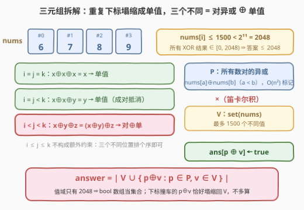
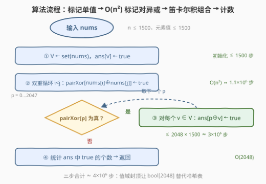

# 不同 XOR 三元组的数目 II

- **题目名称**：不同 XOR 三元组的数目 II
- **链接**：[3514. 不同 XOR 三元组的数目 II](https://leetcode.cn/problems/number-of-unique-xor-triplets-ii/)
- **难度**：中等
- **标签**：位运算、数组、数学、枚举

## 1. 题目概述

给你一个整数数组 `nums`。

**XOR 三元组**定义为三个元素的异或值 `nums[i] XOR nums[j] XOR nums[k]`，其中 `i <= j <= k`。

返回所有可能三元组 `(i, j, k)` 中**不同**的 XOR 值的数量。

**示例 1**：

```text
输入：nums = [1,3]
输出：2
解释：所有可能的 XOR 三元组值为：
      (0,0,0) → 1⊕1⊕1 = 1
      (0,0,1) → 1⊕1⊕3 = 3
      (0,1,1) → 1⊕3⊕3 = 1
      (1,1,1) → 3⊕3⊕3 = 3
      不同的 XOR 值为 {1, 3}，因此输出 2。
```

**示例 2**：

```text
输入：nums = [6,7,8,9]
输出：4
解释：不同的 XOR 值为 {6,7,8,9}，因此输出 4。
```

**约束条件**：

- `1 <= nums.length <= 1500`
- `1 <= nums[i] <= 1500`

> 💡 **读题关键**：两个「1500」联手把问题封了顶——元素值 $< 2^{11} = 2048$，任意异或结果也 $< 2048$，**答案至多 2048**。题目问的是「不同值的个数」而非方案数，值域小就该想到用数组当集合。

---

## 2. 解题思路

### 2.1 暴力思路：三重循环 + 去重集合

枚举所有 $i \le j \le k$，把 $\text{nums}[i] \oplus \text{nums}[j] \oplus \text{nums}[k]$ 丢进集合，最后返回集合大小：

```text
seen ← 空集合
for i = 0 .. n-1:
    for j = i .. n-1:
        for k = j .. n-1:
            seen.add(nums[i] ^ nums[j] ^ nums[k])
return |seen|
```

$n = 1500$ 时三元组约有 $\binom{1502}{3} \approx 5.6 \times 10^8$ 个，必然超时。但换个角度想：**答案本身不超过 2048**——集合里最多 2048 个值，说明海量三元组在重复计算同一个值。突破口是**别按三元组枚举，按「值」组织**。

### 2.2 核心观察：值域封顶 + 三元组拆成「对异或 ⊕ 单值」



**观察一：值域封顶。** $1 \le \text{nums}[i] \le 1500 < 2^{11}$，11 个比特装得下任何元素，异或也不会产生更高的位，因此所有三元组 XOR 值都落在 $[0, 2048)$ 内。用 `bool ans[2048]` 当集合，读写都是 $O(1)$ 且常数极小。

**观察二：按「下标相等模式」给三元组分类。** 设 $x, y, z$ 为三个位置上的元素：

| 模式 | 值 | 归宿 |
|------|-----|------|
| $i = j = k$ | $x \oplus x \oplus x = x$ | 单值集合 $V$ |
| 恰有两个下标相等（$i{=}j{<}k$ 或 $i{<}j{=}k$） | $x \oplus x \oplus y = y$ | 单值集合 $V$ |
| $i < j < k$（三个不同位置） | $x \oplus y \oplus z$ | **对异或 ⊕ 单值** |

前两类被 $\oplus$ 的**成对抵消**（$x \oplus x = 0$）塌缩成单个元素值，天然被 $V = \text{set}(\text{nums})$ 覆盖。真正可能产生新值的只有「三个不同位置」这一类，而它恰好可以拆开：

$$\text{nums}[i] \oplus \text{nums}[j] \oplus \text{nums}[k] = \underbrace{\bigl(\text{nums}[i] \oplus \text{nums}[j]\bigr)}_{p \,\in\, P} \oplus \underbrace{\text{nums}[k]}_{v \,\in\, V}$$

其中 $P = \{\text{nums}[a] \oplus \text{nums}[b] : a < b\}$ 是**所有数对的异或值集合**，一轮 $O(n^2)$ 双重循环即可全部标记。

**于是答案的候选集**：

$$\text{answer} = \bigl|\, V \cup \{\, p \oplus v : p \in P,\ v \in V \,\}\,\bigr|$$

**正确性（两个方向）**：

- **不多算**：任取 $p \oplus v$，其中 $p = \text{nums}[a] \oplus \text{nums}[b]$（$a < b$），$v = \text{nums}[c]$。若 $c \notin \{a, b\}$，它就是合法三元组 $(a, b, c)$ 的异或值；若 $c \in \{a, b\}$，则 $p \oplus v$ 塌缩成单个元素值（$x \oplus x \oplus y = y$），仍在 $V$ 里。无论哪种，都不会算出不可达的值。
- **不少算**：任何 $i < j < k$ 的三元组拆成 $p = \text{nums}[i] \oplus \text{nums}[j]$ 与 $v = \text{nums}[k]$；任何单值 $\text{nums}[b]$（$b \ge 1$）拆成 $(\text{nums}[0] \oplus \text{nums}[b]) \oplus \text{nums}[0]$；$\text{nums}[0]$ 本身在 $V$ 中。所有可达值都被覆盖。

> ⚠️ **下标顺序 $i \le j \le k$ 不构成额外约束**：任意三个不同位置排序后自然满足。拆成「对 ⊕ 单」时两个部件撞用同一个下标的情形，恰好塌缩回 $V$，不影响结果——这正是这个分解漂亮的地方。

### 2.3 算法流程图



三步走：**标记单值 → $O(n^2)$ 标记对异或 → 笛卡尔积组合**。暴力解的三重循环被压成「一轮 $O(n^2)$ 预处理 + 一轮值域扫描」——因为拆解之后，三元组的第三层循环不再依赖前两层的具体下标，它只需要一个「值」。

### 2.4 示例演算

以 `nums = [6,7,8,9]` 为例：

| 步骤 | 内容 | 结果 |
|------|------|------|
| 单值集合 $V$ | $\{6, 7, 8, 9\}$ | `ans` 先标记 6,7,8,9 |
| 对异或集合 $P$ | $6{\oplus}7{=}1$，$6{\oplus}8{=}14$，$6{\oplus}9{=}15$，$7{\oplus}8{=}15$，$7{\oplus}9{=}14$，$8{\oplus}9{=}1$ | $\{1, 14, 15\}$ |
| 组合 $p \oplus v$ | $1{\oplus}6{=}7$，$1{\oplus}7{=}6$，$1{\oplus}8{=}9$，$1{\oplus}9{=}8$，$14{\oplus}6{=}8$，$15{\oplus}7{=}8$，…… | 仍落在 $\{6,7,8,9\}$ |

最终 `ans` 中 `true` 的个数为 **4**，与示例一致。组合步里出现的值都无害：例如 $15 \oplus 7 = 8$，而 $15 = 6 \oplus 9$，于是 $6{\oplus}9{\oplus}7 = 8$ 本就是三个不同位置（#0、#3、#1）的合法三元组值；再如 $1 \oplus 6 = 7$，若 $1$ 取自数对 $(8, 9)$，则 $8{\oplus}9{\oplus}6 = 7$ 同样合法。

---

## 3. 参考代码

### C++

```cpp
class Solution {
  public:
    int uniqueXorTriplets(vector<int>& nums) {
        const int U = 1 << 11;  // 2048：所有可能的异或值个数
        vector<bool> has(U, false), pairXor(U, false);
        for (int x : nums) has[x] = true;
        int n = nums.size();
        for (int i = 0; i < n; i++)
            for (int j = i + 1; j < n; j++)
                pairXor[nums[i] ^ nums[j]] = true;
        vector<bool> ans(has);  // 单值本身可达（i=j=k 或两下标相等）
        for (int p = 0; p < U; p++)
            if (pairXor[p])
                for (int v = 0; v < U; v++)
                    if (has[v]) ans[p ^ v] = true;
        return count(ans.begin(), ans.end(), true);
    }
};
```

### Python

```python
class Solution:
    def uniqueXorTriplets(self, nums: List[int]) -> int:
        U = 1 << 11  # 2048：值域封顶
        n = len(nums)
        pair_xor = [False] * U
        for i in range(n):
            for j in range(i + 1, n):
                pair_xor[nums[i] ^ nums[j]] = True
        vals = sorted(set(nums))
        ans = [False] * U
        for v in vals:
            ans[v] = True
        for p in range(U):
            if pair_xor[p]:
                for v in vals:
                    ans[p ^ v] = True
        return sum(ans)
```

> 💡 `n = 1` 时没有数对，`pair_xor` 全空，`ans` 只含 `nums[0]`，返回 1，无需特判。实测 $n = 1500$ 全规模运行约 0.1 秒。

---

## 4. 复杂度分析

| 维度 | 复杂度 | 说明 |
|------|--------|------|
| 时间复杂度 | $O(n^2 + U \cdot \lvert V \rvert)$，$U = 2048$ | 标记对异或约 $n^2/2 \approx 1.1 \times 10^6$ 步；组合步至多 $2048 \times 1500 \approx 3 \times 10^6$ 步；合计约 $4 \times 10^6$ 步 |
| 空间复杂度 | $O(U)$ | 三个 `bool[2048]` 数组，共约 6 KB |

---

## 5. 扩展：前传 3513——排列版本的 O(1) 公式

本题前传 [3513. 不同 XOR 三元组的数目 I](https://leetcode.cn/problems/number-of-unique-xor-triplets-i/)（[题解](../3501-3600/3513_不同XOR三元组的数目I.md)）限定 `nums` 是 `[1, n]` 的**排列**，此时答案有封闭公式：

$$\text{answer} = \begin{cases} n & n < 3 \\ 2^{\operatorname{bitlen}(n)} & n \ge 3 \end{cases}$$

即 $n \ge 3$ 时答案恰为**大于 $n$ 的最小 2 的幂**（$n = 1500$ 时答案为 2048，正是值域封顶被填满的形态）。用本题的框架理解：排列的 $V = \{1, \dots, n\}$ 已铺满低 $\operatorname{bitlen}(n)$ 位，而 $P$ 中的两两异或足够丰富，两者一组合恰好把 $[0, 2^{\operatorname{bitlen}(n)})$ 整段填满；$n < 3$ 时凑不齐三个不同下标，退化成 $|V| = n$。本题的通用算法直接提交到 3513 也完全正确——两个解在排列上严格一致（可用 $n \le 9$ 的全排列暴力验证）。

---

## 6. 面试要点

1. **为什么 $i \le j \le k$ 的顺序约束不需要特殊处理？**

   > 任意三个**不同**位置排序后天然满足 $i < j < k$；而下标相等的三元组因 $x \oplus x = 0$ 成对抵消，塌缩成单个元素值，被 $V = \text{set}(\text{nums})$ 覆盖。所以只需专门研究「三个不同位置的异或」。

2. **答案的上界是多少？怎么来的？**

   > 2048。$\text{nums}[i] \le 1500 < 2^{11}$，异或不产生超过参与数最高位的比特，所有结果落在 $[0, 2^{11})$。上界小 ⇒ 用 `bool[2048]` 数组代替哈希表，常数更小。

3. **三元组怎么拆？为什么拆完「不多不少」？**

   > 拆成 $(\text{nums}[a] \oplus \text{nums}[b]) \oplus \text{nums}[c]$，即对异或集合 $P$ 与单值集合 $V$ 的笛卡尔积。不多算：下标撞车的 $p \oplus v$ 塌缩回 $V$；不少算：三元组与单值都能拆出来（单值 $\text{nums}[b] = (\text{nums}[0] \oplus \text{nums}[b]) \oplus \text{nums}[0]$，$b \ge 1$）。

4. **为什么用数组而不是哈希表存集合？**

   > 值域只有 2048，直接下标寻址比哈希更快更省内存。「值域受限 ⇒ 数组当哈希」是位运算题的标准提速手段，[898. 子数组按位或操作](https://leetcode.cn/problems/bitwise-ors-of-subarrays/) 是同款套路。

5. **如果 $\text{nums}[i] \le 10^9$ 还能这么做吗？**

   > 不能。值域 $2^{30}$ 起步，数组开不下，且 $P$ 可能有 $O(n^2)$ 个不同值。本题解法的根基是「值域封顶」——值域一爆炸就得换思路（线性基能回答「子集异或能拼出哪些值」，但那是线性子空间语义，与本题「恰好三个元素的异或」不同，不能直接照搬）。

> 💡 **一句话总结**：3514 = 标记 `set(nums)` + $O(n^2)$ 标记所有两两异或 + 值域内做「对 ⊕ 单」笛卡尔积——值域封顶 2048 是一切的前提，重复下标的抵消让单值集合免费入账。

---

## 7. 同类练习题

- [3513. 不同 XOR 三元组的数目 I](https://leetcode.cn/problems/number-of-unique-xor-triplets-i/)（[题解](../3501-3600/3513_不同XOR三元组的数目I.md)）：前传，`nums` 是排列时有 $O(1)$ 公式；本题通用算法直接可过
- [898. 子数组按位或操作](https://leetcode.cn/problems/bitwise-ors-of-subarrays/)（[题解](../0801-0900/898_子数组按位或操作.md)）：同款「值域有限 ⇒ 数组当集合」+ 集合滚动传播，只是运算从 $\oplus$ 换成 $\mid$
- [421. 数组中两个数的最大异或值](https://leetcode.cn/problems/maximum-xor-of-two-numbers-in-an-array/)（[题解](../0401-0500/421_数组中两个数的最大异或值.md)）：两两异或的值域问题，字典树按位贪心的经典解
- [1442. 形成两个异或相等数组的三元组数目](https://leetcode.cn/problems/count-triplets-that-can-form-two-arrays-of-equal-xor/)（[题解](../1401-1500/1442_形成两个异或相等数组的三元组数目.md)）：同样按 $(i, j, k)$ 三元组思考，靠前缀异或把三重循环降维
