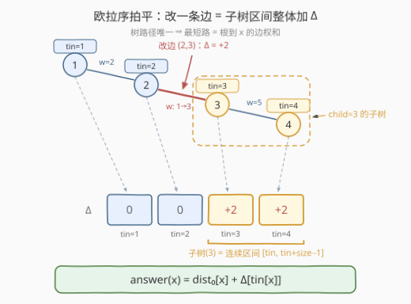
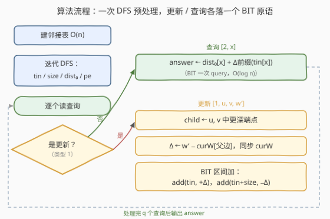

# LeetCode 带权树中的最短路径 题解

## 1. 题目概述

- **标题 / 题号**：带权树中的最短路径（#3515，hard）
- **链接**：https://leetcode.cn/problems/shortest-path-in-a-weighted-tree/
- **难度**：困难
- **标签**：树、深度优先搜索、树状数组、线段树、数组

**题意**：给你一个整数 `n` 和一棵以节点 1 为根的无向带权树，共 `n` 个节点（编号 1 到 n），由长度为 `n - 1` 的二维数组 `edges` 描述，`edges[i] = [ui, vi, wi]` 表示节点 `ui` 与 `vi` 之间有一条权重为 `wi` 的无向边。

再给你一个二维数组 `queries`，其中每个元素是以下两种操作之一：

- `[1, u, v, w']`：**更新**——把节点 `u`、`v` 之间那条边的权重改为 `w'`（保证 `(u, v)` 是 `edges` 中已存在的边）；
- `[2, x]`：**查询**——返回从根节点 1 到节点 `x` 的**最短**路径距离。

对每个 `[2, x]` 操作收集答案，返回整数数组 `answer`。

**示例 1**：

```text
输入：n = 2, edges = [[1,2,7]], queries = [[2,2],[1,1,2,4],[2,2]]
输出：[7,4]
解释：[2,2] 时路径为 7；边 (1,2) 权重 7 改为 4 后，[2,2] 的答案变为 4。
```

**示例 2**：

```text
输入：n = 3, edges = [[1,2,2],[1,3,4]], queries = [[2,1],[2,3],[1,1,3,7],[2,2],[2,3]]
输出：[0,4,2,7]
解释：到自身距离 0；改边 (1,3) 权重 4→7 后，到 3 的距离变为 7，到 2 不受影响。
```

**示例 3**：

```text
输入：n = 4, edges = [[1,2,2],[2,3,1],[3,4,5]], queries = [[2,4],[2,3],[1,2,3,3],[2,2],[2,3]]
输出：[8,3,2,5]
解释：到 4 的路径为 2+1+5=8；改边 (2,3) 权重 1→3 后，到 3 的距离变为 2+3=5，
      到 2 的距离仍为 2（其路径不含这条边）。
```

**约束**：

- `1 <= n <= 10^5`
- `edges.length == n - 1`，`1 <= ui, vi <= n`，`1 <= wi <= 10^4`，保证构成合法的树
- `1 <= queries.length <= 10^5`
- `(u, v)` 一定是 `edges` 中的一条边，`1 <= w' <= 10^4`

> 💡 **读题关键**：「最短路径」是本题最大的烟雾弹——树**连通无环**，任意两点之间**有且仅有一条**简单路径，边权又全为正，根到 `x` 的最短路就是这条唯一路径，与 Dijkstra/SPFA 毫无关系。真正的问题是：**边权会被改 $10^5$ 次，如何不让每次查询都从头算路径和**。

## 2. 解题思路

### 2.1 暴力思路：每次查询沿父链重算

预处理出每个点的父节点与父边后，每次 `[2, x]` 从 `x` 沿父指针一路爬到根，边爬边累加边权，单次查询 $O(\text{depth})$；更新操作 $O(1)$ 改一条边权即可。

树退化成链时深度为 $n-1$，总代价最坏 $O(nq) = 10^{10}$，必然超时。瓶颈全在查询——**改一条边只挪动一个子树的距离，却要为每个查询重走整条路径**。

### 2.2 核心观察：路径唯一 + 欧拉序拍平 + 区间加单点查



三个观察把问题逐层化简：

**观察 1：答案是「根到 x 的边权和」，改一条边只影响一个子树。** 树上路径唯一，设初始（所有更新发生前）根到各点的距离为 $\text{dist}_0[\cdot]$。把边 $(u,v)$ 的权重从 $w$ 改为 $w'$ 时，路径经过这条边的点，**恰好是该边远离根的那一端（孩子端）`c` 的整棵子树**——子树外的点路径不含这条边，距离纹丝不动。对子树内每个点：距离整体 $+\ (w'-w)$，记 $\Delta = w' - w$。

**观察 2：欧拉序（DFS 进序）把子树拍成连续区间。** 从根出发 DFS，按**进入**每个节点的时刻编号 $\text{tin}[v]$（$1 \sim n$）。由于 DFS 的嵌套结构——进入 `c` 之后、退出 `c` 之前访问到的全是 `c` 的后代——`c` 的子树在欧拉序上恰好占据连续区间：

$$[\text{tin}[c],\ \text{tin}[c] + \text{size}[c] - 1]$$

「子树内所有点的距离整体加 $\Delta$」于是变成「数组上一段**区间加** $\Delta$」。

**观察 3：区间加 + 单点查 = 差分 + 树状数组。** 维护一个初始全 0 的累计偏移量数组 $\Delta[\cdot]$：更新时在区间两端打 $\pm\Delta$（差分），查询时取 $\text{tin}[x]$ 处的**前缀和**。这正是树状数组（BIT）最轻量的用法——每个操作只需两个 $O(\log n)$ 的调用，连懒标记线段树都不必请出来。最终：

$$\text{answer}(x) = \text{dist}_0[x] + \Delta[\text{tin}[x]]$$

> ⚠️ **常见误读**：一是往 Dijkstra 上想（树路径唯一，无从「挑短」）；二是更新时对「当前边权」与「初始边权」不加区分——$\Delta$ 必须按**当前**权重算（$w' - w_{\text{cur}}$），且改完要同步更新 $w_{\text{cur}}$，否则同一条边改两次就会算错。

### 2.3 算法流程图



预处理做一次迭代 DFS，拿到 $\text{tin}/\text{size}/\text{dist}_0/\text{depth}$ 与「点 → 父边编号」的映射；之后每种操作都只是一次分流：更新走「定孩子端点 → 算 $\Delta$ → 区间加」，查询走「初始距离 + 前缀和」。

### 2.4 示例演算

以示例 3（链 `1—2—3—4`，边权 `2, 1, 5`）走一遍。DFS 进序即链序，$\text{tin} = [1,2,3,4]$，$\text{dist}_0 = [0, 2, 3, 8]$，$\text{size}(3) = 2$（子树 $\{3,4\}$）：

| 步骤 | 操作 | BIT 累计偏移 $\Delta[\cdot]$（位置 1..4） | 结果 |
|------|------|------------------------------------------|------|
| 预处理 | 迭代 DFS 定 tin / size / dist₀ | $[0, 0, 0, 0]$ | — |
| `[2,4]` | $\text{dist}_0[4] + \Delta[4] = 8 + 0$ | $[0,0,0,0]$ | **8** |
| `[2,3]` | $3 + 0$ | $[0,0,0,0]$ | **3** |
| `[1,2,3,3]` | 孩子 = 3，$\Delta = 3-1 = +2$，区间 $[\text{tin}(3), \text{tin}(3)+2-1] = [3,4]$ 整体 $+2$ | $[0,0,+2,+2]$ | — |
| `[2,2]` | $\text{dist}_0[2] + \Delta[2] = 2 + 0$（子树外，不受影响） | $[0,0,+2,+2]$ | **2** |
| `[2,3]` | $3 + 2$ | $[0,0,+2,+2]$ | **5** |

与期望输出 `[8,3,2,5]` 完全一致。注意 `[2,2]` 这一步：节点 2 在被改边的**子树之外**，$\Delta[2]$ 保持 0，「改边只影响孩子端子树」在此直接可见。

## 3. 参考代码

### C++（迭代 DFS + 差分树状数组）

```cpp
class Solution {
public:
    vector<int> treeQueries(int n, vector<vector<int>>& edges, vector<vector<int>>& queries) {
        vector<vector<pair<int,int>>> adj(n + 1);
        for (int i = 0; i < (int)edges.size(); ++i) {
            adj[edges[i][0]].push_back({edges[i][1], i});
            adj[edges[i][1]].push_back({edges[i][0], i});
        }
        vector<int> parent(n + 1), pe(n + 1, -1), depth(n + 1), tin(n + 1), sz(n + 1, 1);
        vector<long long> dist(n + 1);
        vector<int> order, st = {1};
        for (int timer = 1; !st.empty(); ) {
            int u = st.back(); st.pop_back();
            tin[u] = timer++;                       // DFS 进序，取值 1..n
            order.push_back(u);
            for (auto [v, id] : adj[u]) {
                if (v != parent[u] && !tin[v]) {    // tin==0 即未访问
                    parent[v] = u; pe[v] = id;      // pe[v]：v 到父亲的边编号
                    depth[v] = depth[u] + 1;
                    dist[v] = dist[u] + edges[id][2];
                    st.push_back(v);
                }
            }
        }
        for (int i = n - 1; i >= 1; --i)            // 逆先序自底向上累出子树大小
            sz[parent[order[i]]] += sz[order[i]];

        vector<long long> bit(n + 2);
        auto add = [&](int i, long long d) {
            for (; i <= n; i += i & (-i)) bit[i] += d;
        };
        auto query = [&](int i) {                   // 前缀和 = tin[x] 处累计偏移
            long long s = 0;
            for (; i > 0; i -= i & (-i)) s += bit[i];
            return s;
        };

        vector<int> curW(edges.size());             // 各边「当前」权重（会被反复改）
        for (int i = 0; i < (int)edges.size(); ++i) curW[i] = edges[i][2];
        vector<int> ans;
        for (auto& q : queries) {
            if (q[0] == 1) {
                int c = depth[q[1]] > depth[q[2]] ? q[1] : q[2];   // 更深端点 = 孩子端
                long long d = q[3] - curW[pe[c]];
                curW[pe[c]] = q[3];
                add(tin[c], d);                     // 区间加 = 差分两端点各打一次
                add(tin[c] + sz[c], -d);
            } else {
                ans.push_back((int)(dist[q[1]] + query(tin[q[1]])));
            }
        }
        return ans;
    }
};
```

### Python

```python
class Solution:
    def treeQueries(self, n: int, edges: List[List[int]], queries: List[List[int]]) -> List[int]:
        adj = [[] for _ in range(n + 1)]
        for i, (u, v, w) in enumerate(edges):
            adj[u].append((v, i))
            adj[v].append((u, i))

        parent = [0] * (n + 1)
        pe = [-1] * (n + 1)              # pe[v]：v 到父亲的边编号
        depth = [0] * (n + 1)
        dist = [0] * (n + 1)
        tin = [0] * (n + 1)
        sz = [1] * (n + 1)
        order = []
        st = [1]
        timer = 1
        while st:
            u = st.pop()
            tin[u] = timer               # DFS 进序，取值 1..n
            timer += 1
            order.append(u)
            for v, i in adj[u]:
                if v != parent[u] and not tin[v]:
                    parent[v], pe[v] = u, i
                    depth[v] = depth[u] + 1
                    dist[v] = dist[u] + edges[i][2]
                    st.append(v)
        for u in reversed(order[1:]):    # 逆先序累子树大小（跳过根）
            sz[parent[u]] += sz[u]

        bit = [0] * (n + 2)
        def add(i, d):
            while i <= n:
                bit[i] += d
                i += i & (-i)
        def query(i):                    # 前缀和 = tin[x] 处累计偏移
            s = 0
            while i:
                s += bit[i]
                i -= i & (-i)
            return s

        cur_w = [e[2] for e in edges]    # 各边「当前」权重
        ans = []
        for q in queries:
            if q[0] == 1:
                c = q[1] if depth[q[1]] > depth[q[2]] else q[2]   # 更深端点 = 孩子端
                d = q[3] - cur_w[pe[c]]
                cur_w[pe[c]] = q[3]
                add(tin[c], d)           # 区间加 = 差分两端点各打一次
                add(tin[c] + sz[c], -d)
            else:
                ans.append(dist[q[1]] + query(tin[q[1]]))
        return ans
```

> 💡 **写法要点**：
> - **迭代 DFS 防爆栈**：$n = 10^5$ 的链形树递归深度达 $10^5$，Python 默认递归上限 1000 直接 `RecursionError`，C++ 默认栈也悬。「弹出即编号、再压孩子」的显式栈写法保证栈内后进先出、子树连续，且天然免去递归开销（Python 实测 $10^5$ 节点 + $10^5$ 查询约 0.4s）。
> - **tin 取 1..n 一石二鸟**：既是「未访问 = 0」的天然哨兵，又直接对上 BIT 的 1-based 下标，全程不用 ±1 换算。
> - **pe + curW 让更新全 O(1)**：「边 $(u,v)$ → 深度大者为孩子 → `pe[child]` 得边编号 → `curW` 得当前权重」四步全是数组访问，不需要哈希表存边。
> - **数值范围**：最大距离 $\approx (10^5)\times(10^4) = 10^9$，恰好低于 $2^{31}-1$，`int` 装得下；过程量用 `long long` 更稳。
> - 邻接表用「邻点 + 边编号」成对存储，DFS 时顺手把 `pe` 与 `dist` 一并求出，无需二次遍历。

## 4. 复杂度分析

| 维度 | 复杂度 | 说明 |
|------|--------|------|
| 时间复杂度 | $O((n + q)\log n)$ | 预处理迭代 DFS $O(n)$；每次更新/查询各 1~2 次 BIT 调用，每次 $O(\log n)$ |
| 空间复杂度 | $O(n)$ | 邻接表 $O(n)$ + 五个节点级数组（tin/sz/depth/dist/pe）+ BIT $O(n)$ |

> 💡 对照暴力：$O(nq) = 10^{10}$ → $O((n+q)\log n) \approx 3.5\times10^6$ 次 BIT 结点访问，快三个数量级；换懒标记线段树复杂度同阶，但代码量约为 BIT 的三倍——「区间加 + 单点查」场景下差分 BIT 是最短路径。

## 5. 扩展：变体与升级

- **查询任意两点 $x, y$ 间的最短路**：树路径唯一仍有 $\text{dist}(x,y) = \text{dist}(x) + \text{dist}(y) - 2\,\text{dist}(\mathrm{lca}(x,y))$，而每个点的当前距离仍由 $\text{dist}_0[\cdot] + \Delta[\text{tin}[\cdot]]$ 给出——BIT 维护方式**一字不改**，只需再配一个 LCA（倍增 $O(\log n)$ 或欧拉序 + ST 表 $O(1)$）。
- **边权改点权**：若更新的是「点 $v$ 的权值」，其影响范围恰好是 $v$ 的子树区间（含自身），同一套「区间加 + 单点查」原样成立——欧拉序拍平对边权/点权一视同仁。
- **为什么 BFS 序不行**：BFS 序中同一层的不同子树交错排列，子树不连续（根的孩子 2、3 各有后代时，2 的子树会被 3 隔开）。连续性是 DFS 进序「进入后、退出前只访问后代」的独有性质。
- **何时必须上树链剖分**：本题只需**子树级**更新，欧拉序足矣；若操作改成「路径上加值 / 查路径和」，就要用重链剖分把任意路径拆成 $O(\log n)$ 段连续区间，每段再交给线段树——欧拉序是树剖的前置基本功。

## 6. 面试要点

1. **「最短路径」为什么不用 Dijkstra？**

   > 树连通无环，任意两点间简单路径**唯一**，不存在「挑更短的一条」；边权全为正只是锦上添花。根到 $x$ 的最短路 = 唯一路径的边权和。这是一道披着图论外衣的树上数据结构题。

2. **为什么子树在欧拉序上恰好是连续区间？**

   > DFS 按「进入时刻」编号：从进入 $c$ 到退出 $c$ 之间访问的节点全是 $c$ 的后代（DFS 的嵌套结构），故子树占据 $[\text{tin}[c], \text{tin}[c] + \text{size}[c] - 1]$。BFS 序没有这个性质——同层节点的子树交错，区间化失败。

3. **区间加、单点查为什么一个 BIT 就够？**

   > BIT 维护的是差分数组 $d$：区间 $[l, r]$ 加 $\Delta$ 等价于 $d[l] \mathrel{+}= \Delta,\ d[r+1] \mathrel{-}= \Delta$；单点值 $a[i] = d[1..i]$ 的前缀和，正是 BIT 的原生操作。若再要求区间求和，才需要双 BIT 或懒标记线段树。

4. **更新 `[1, u, v, w']` 时如何 O(1) 定位孩子端点和当前边权？**

   > 预处理记每个点的 `depth` 与父边编号 `pe`：$u, v$ 中**深度大者**即孩子端 $c$（被改的边就是 $c$ 的父边），`pe[c]` 得边编号，`curW[pe[c]]` 得当前权重。$\Delta = w' - w_{\text{cur}}$，并同步 `curW[pe[c]] = w'`——同一条边改两次也不会算错。

5. **Python 为什么必须迭代 DFS？迭代写法如何保证子树连续？**

   > 链形树递归深度 $10^5$，默认上限 1000 必炸。显式栈「弹出 $u$ 时编号、随后压入所有未访问邻点」：栈中 $u$ 的孩子们压在更早元素之上，归纳可知 $u$ 的整个子树会在更早元素之前处理完， preorder 连续性保持。

> 💡 **一句话总结**：3515 = 「欧拉序拍平 + 差分 BIT」——树路径唯一让答案退化为边权和，改边只影响孩子端子树，子树在 DFS 进序里是连续区间，动态维护交给「区间加、单点查」的树状数组，$\text{answer} = \text{dist}_0[x] + \Delta[\text{tin}[x]]$。

## 同类练习题

| # | 题目 | 与本题的关联 |
|---|------|-------------|
| 2646 | [最小化旅行的价格总和](https://leetcode.cn/problems/minimize-the-total-price-of-the-trips/)（[题解](../2601-2700/2646_最小化旅行的价格总和.md)） | 树上差分统计每条边被多少条路径经过，同款「树上批量路径信息摊到差分结构」的思想 |
| 2458 | [移除子树后的二叉树高度](https://leetcode.cn/problems/height-of-binary-tree-after-subtree-removal-queries/)（[题解](../2401-2500/2458_移除子树后的二叉树高度.md)） | 子树级在线查询的另一种预处理（脊柱 + 姐妹子树两次 DFS），与欧拉序拍平法互为参照 |
| 1109 | [航班预订统计](https://leetcode.cn/problems/corporate-flight-bookings/)（[题解](../1101-1200/1109_航班预订统计.md)） | 数组版「区间加 + 单点查」入门，理解本题 BIT 维护的正是差分数组 |
| 370 | [区间加法](https://leetcode.cn/problems/range-addition/)（[题解](../0301-0400/370_区间加法.md)） | 纯离线差分模板题——去掉在线查询后，连 BIT 都可以省掉 |
