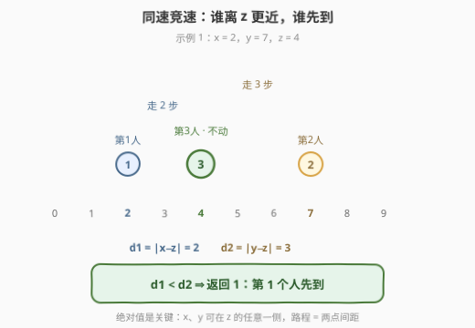
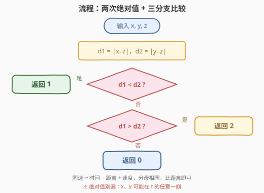

# 找到最近的人

- **题目名称**：找到最近的人
- **链接**：[3516. 找到最近的人](https://leetcode.cn/problems/find-closest-person/)
- **难度**：简单
- **标签**：数学

## 1. 题目概述

给你三个整数 $x$、$y$、$z$，表示数轴上三个人的位置：$x$ 是第 1 个人的位置，$y$ 是第 2 个人的位置，$z$ 是第 3 个人的位置——**第 3 个人不会移动**。第 1 个人和第 2 个人以**相同的速度**向第 3 个人移动。判断谁会**先**到达第 3 个人的位置：

- 如果第 1 个人先到达，返回 `1`；
- 如果第 2 个人先到达，返回 `2`；
- 如果两人同时到达，返回 `0`。

**示例 1**：

```text
输入：x = 2, y = 7, z = 4
输出：1
解释：第 1 个人在位置 2，到达位置 4 需要 2 步；
      第 2 个人在位置 7，到达需要 3 步。第 1 个人先到。
```

**示例 2**：

```text
输入：x = 2, y = 5, z = 6
输出：2
解释：第 1 个人需要 4 步，第 2 个人需要 1 步。第 2 个人先到。
```

**示例 3**：

```text
输入：x = 1, y = 5, z = 3
输出：0
解释：两人都需要 2 步，同时到达。
```

**约束条件**：

- $1 \le x, y, z \le 100$

> 💡 **读题关键**：「相同的速度」把一个看似动态的追逐问题坍缩成了**静态的距离比较**——不需要模拟任何一步移动，答案完全由两个间距的大小关系决定。

---

## 2. 解题思路

### 2.1 暴力思路：逐秒模拟

最直接的写法是按时间步模拟：每一轮两人各向 $z$ 挪一格，挪完检查谁踩到了 $z$：

```text
while true:
    if x == z and y == z: return 0   # 两人都已到达（含开局同点）
    if x == z: return 1              # 第 1 人先踩到
    if y == z: return 2              # 第 2 人先踩到
    x += sign(z - x)                 # 各向 z 挪一格
    y += sign(z - y)
```

复杂度 $O(\max(d_1, d_2))$，本题 $x, y, z \le 100$ 时至多 99 轮，提交也能过。但盯着模拟的每一轮看：**两个距离各自严格减 1**，没有任何决策、没有任何分支变化——第 1 人必在第 $d_1$ 轮到达，第 2 人必在第 $d_2$ 轮到达。既然每一步都完全确定，直接把「轮数」算出来比较即可，循环本身是纯粹的浪费。

### 2.2 核心观察：同速竞速 → 比绝对距离



**结论**：设 $d_1 = |x - z|$，$d_2 = |y - z|$，则

- $d_1 < d_2$：返回 $1$；
- $d_1 > d_2$：返回 $2$；
- $d_1 = d_2$：返回 $0$。

理由只有一行：**速度相同** ⇒ 到达时间 $= \frac{\text{距离}}{\text{速度}}$，分母相同，时间的大小关系完全由分子（距离）决定。同速、同时出发的两个移动者，**先到 ⇔ 更近**。

**绝对值是全题唯一的坑**：$x$、$y$ 与 $z$ 的相对方位没有任何约束——两人都在 $z$ 左侧（示例 2）、都在右侧、或一左一右（示例 1 中 $y = 7$ 在 $z = 4$ 右侧）都有可能。而「向 $z$ 移动的路程」就是数轴上两点的**间距** $|x - z|$，与从哪一侧出发无关。

> ⚠️ **常见错误**：直接写 `z - x`、`y - z` 不加绝对值。任何只取单一方向差值的写法，都必然在其中一侧的用例上得到**负距离**——如示例 1 的 `z - y = -3` 会把「3 步到」误判成「−3 步到」，比较方向全错。

### 2.3 算法流程图



两次减法、两次绝对值、一次三分支比较——没有循环、没有数组，**与坐标范围彻底解耦**（就算 $x, y, z$ 大到 $10^{18}$ 也是常数次运算）。

### 2.4 示例演算

| $x$ | $y$ | $z$ | $d_1 = \lvert x - z \rvert$ | $d_2 = \lvert y - z \rvert$ | 比较 | 返回 |
|-----|-----|-----|------|------|------|------|
| 2 | 7 | 4 | 2 | 3 | $d_1 < d_2$ | 1 |
| 2 | 5 | 6 | 4 | 1 | $d_1 > d_2$ | 2 |
| 1 | 5 | 3 | 2 | 2 | $d_1 = d_2$ | 0 |

> 💡 第 1 行里 $y = 7 > z = 4$：第 2 个人在目标**右侧**、向左走——若不取绝对值，`z - y = -3` 直接为负，「更近」的判断彻底翻转。绝对值不是装饰，是正确性的一部分。

---

## 3. 参考代码

### C++

```cpp
class Solution {
  public:
    int findClosest(int x, int y, int z) {
        int d1 = abs(x - z), d2 = abs(y - z);
        if (d1 < d2) return 1;
        if (d1 > d2) return 2;
        return 0;
    }
};
```

### Python

```python
class Solution:
    def findClosest(self, x: int, y: int, z: int) -> int:
        d1, d2 = abs(x - z), abs(y - z)
        if d1 < d2:
            return 1
        if d1 > d2:
            return 2
        return 0
```

> 💡 Python 一行版：`return 1 * (d1 < d2) + 2 * (d1 > d2)`——布尔值即 0/1，两个互斥条件加权求和恰好落在 $\{0, 1, 2\}$ 上。

---

## 4. 复杂度分析

| 维度 | 复杂度 | 说明 |
|------|--------|------|
| 时间复杂度 | $O(1)$ | 两次减法、两次绝对值、至多两次比较；对照模拟版 $O(\max(d_1, d_2)) \le 99$ |
| 空间复杂度 | $O(1)$ | 仅两个距离变量 |

---

## 5. 扩展：速度不同时怎么比？

若第 1、2 人的速度分别为 $v_1$、$v_2$，到达时间变为 $\frac{d_1}{v_1}$ 与 $\frac{d_2}{v_2}$，分母不同就不能直接比距离了。**不要**用浮点除法比较（相等关系会被舍入误差破坏），整数域上的标准做法是**交叉相乘**：

$$\text{比较 } d_1 \cdot v_2 \ \text{与 } d_2 \cdot v_1$$

分母为正时大小关系不变（$v_1, v_2 \ge 1$ 天然满足），全程整数、零精度风险——这正是分数 / 概率比较的通用套路。再往外推一步：若变成 $k$ 个人抢同一个目标，就是一遍扫描求 $\arg\min_i \lvert p_i - z \rvert$（平局再按题意取编号），本题是它 $k = 2$ 的特例。

---

## 6. 面试要点

1. **为什么只比距离就够了？**

   > 速度相同 ⇒ 到达时间 $=$ 距离 $\div$ 速度，分母相同，除法保持大小关系：$d_1 < d_2 \iff t_1 < t_2$。「同速、同时出发 ⇒ 先到 ⇔ 更近」的全部依据就是这一行。

2. **绝对值能不能省？举一个反例。**

   > 不能。$x$、$y$ 与 $z$ 的方位无约束：取 $x = 7, y = 2, z = 4$，若写 `z - x` 得 $-3$，第 1 人的「距离」凭空变小，方向全反。路程 = 间距 $\lvert x - z \rvert$，与从哪一侧出发无关。

3. **平局（返回 0）的时机怎么刻画？**

   > $d_1 = d_2$：两人同速、同时出发、路程相同，必然**同一轮**踩到 $z$。代码里平局天然是三分支的兜底分支，无需单独判断。

4. **模拟和公式分别适用什么场景？**

   > 模拟 $O(\max(d_1, d_2))$ 在 $x, y, z \le 100$ 下毫无压力，但坐标放大到 $10^9$ 就要跑十亿轮；公式 $O(1)$ 与范围无关。面试口径：先给公式，再补一句「模拟可做但会被范围卡死」，展示对复杂度来源的敏感。

5. **速度不同时如何避免浮点误差？**

   > 交叉相乘：比 $d_1 v_2$ 与 $d_2 v_1$，正分母下序关系不变，全程整数。注意极端值下乘积可能溢出，C++ 中需 `long long`。

> 💡 **一句话总结**：3516 = 比绝对距离——同速竞速里「先到 ⇔ 更近」，$\lvert x - z \rvert$ 与 $\lvert y - z \rvert$ 三分支定 1/2/0；绝对值兼容两侧方位，是正确性的全部细节。

---

## 7. 同类练习题

- [2849. 判断能否在给定时间到达单元格](https://leetcode.cn/problems/determine-if-a-cell-is-reachable-at-a-given-time/)（[题解](../2801-2900/2849_判断能否在给定时间到达单元格.md)）：把「能否按时到达」化成 $\lvert \Delta x \rvert$、$\lvert \Delta y \rvert$ 的距离不等式，与本题同一枚「移动问题 → 间距比较」的钥匙
- [2833. 距离原点最远的点](https://leetcode.cn/problems/furthest-point-from-origin/)（[题解](../2801-2900/2833_距离原点最远的点.md)）：数轴上对带符号位移取绝对值求最远点——「绝对值 = 间距」的取极值版本
- [836. 矩形重叠](https://leetcode.cn/problems/rectangle-overlap/)（[题解](../0801-0900/836_矩形重叠.md)）：把几何判断压成坐标差的不等式组，训练「先猜公式再验证」的坐标比较直觉
- [292. Nim 游戏](https://leetcode.cn/problems/nim-game/)（[题解](../0201-0300/292_Nim游戏.md)）：另一道「模拟可做、数学一行收场」的题——找到规律后 O(1) 出答案
