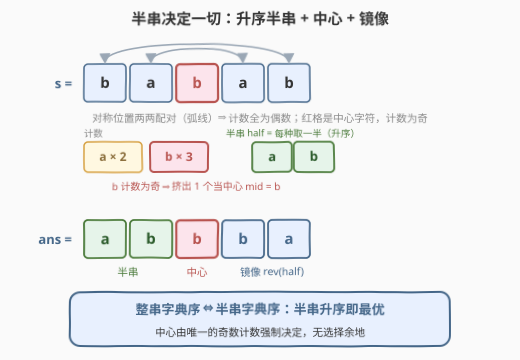
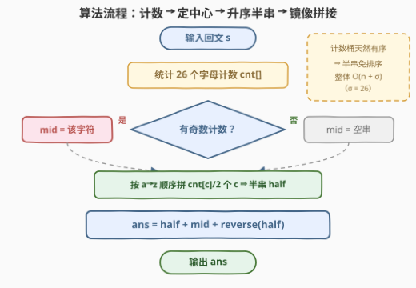

# 最小回文排列 I

- **题目名称**：最小回文排列 I
- **链接**：[3517. 最小回文排列 I](https://leetcode.cn/problems/smallest-palindromic-rearrangement-i/)
- **难度**：中等
- **标签**：字符串、计数排序、排序

## 1. 题目概述

给你一个**回文**字符串 $s$。返回 $s$ 的按**字典序排列的最小**回文排列。

如果一个字符串从前往后和从后往前读都相同，那么这个字符串是一个**回文**字符串。

**排列**是字符串中所有字符的重排。如果字符串 $a$ 按字典序小于字符串 $b$，则表示在第一个不同的位置，$a$ 中的字符比 $b$ 中的对应字符在字母表中更靠前。如果在前 $\min(|a|, |b|)$ 个字符中没有区别，则较短的字符串按字典序更小。

**示例 1**：

```text
输入：s = "z"
输出："z"
解释：仅由一个字符组成的字符串已经是按字典序最小的回文。
```

**示例 2**：

```text
输入：s = "babab"
输出："abbba"
解释：通过重排 "babab" → "abbba"，可以得到按字典序最小的回文。
```

**示例 3**：

```text
输入：s = "daccad"
输出："acddca"
解释：通过重排 "daccad" → "acddca"，可以得到按字典序最小的回文。
```

**约束条件**：

- $1 \le \text{s.length} \le 10^5$
- $s$ 由小写英文字母组成
- 保证 $s$ 是回文字符串

> 💡 关键前提是「$s$ 本身已是回文」——它保证了字符计数的奇偶结构（除至多一个字符外，所有计数均为偶数），使回文排列**必然存在**。若去掉这个保证（如 $s =$ `abc`），题目就要先做一轮可行性判断了。

---

## 2. 解题思路

### 2.1 暴力思路：枚举全部排列

最直接的做法是枚举 $s$ 的所有排列，逐个检查是否回文，再取字典序最小者。可重排列数最坏达 $n!$ 量级——$n = 10^5$ 时是天文数字，完全不可行。

稍作观察可以砍掉一大块：一个多重集**能**排出回文，当且仅当计数为奇数的字符**至多一个**（对称位置两两配对各贡献偶数计数，中心至多容纳一个「落单」字符）。而本题 $s$ 本身就是回文，该条件天然满足——**可行性不是问题，问题只剩构造最优**。

### 2.2 核心观察：半串决定一切



把任意回文串从正中间切开：

$$\text{ans} \;=\; \underbrace{h}_{\text{半串}} \;+\; \underbrace{m}_{\text{中心（可空）}} \;+\; \mathrm{rev}(h)$$

- **半串** $h$（长度 $\lfloor n/2 \rfloor$）决定前一半，后一半被对称性**完全锁死**为 $\mathrm{rev}(h)$；
- **中心** $m$ 仅当 $n$ 为奇数时存在，且由**唯一的奇数计数**强制决定——$s$ 是回文 ⇒ 奇计数字符至多一个，没有任何选择余地。

> ⚠️ 「第一个差异必落在半串内」：两个不同的回文排列共享同一多重集，因而共享同一个 $m$；若两者的 $h$ 相同则整串相同，矛盾。故比较整串 ⇔ 比较半串。

于是整个问题坍缩为一维：**在合法半串中找字典序最小的那个**。合法半串是固定多重集（每种字符恰 $\lfloor \text{cnt}[c]/2 \rfloor$ 个）的一个排列，而固定多重集的排列中字典序最小的就是**升序排列**——交换论证：若某位置放了较大字符而更小的字符还在后面，交换两者立即得到更小的串。

以示例 2 验证（$s =$ `babab`）：计数 $a{:}2,\ b{:}3$，$b$ 计数为奇 ⇒ $m =$ `b`；半串多重集 $\{a, b\}$，升序即 `ab`；拼出 `ab` + `b` + `ba` = `abbba` ✓。

> 💡 **为什么不用真正「排序」？** 按 $a \to z$ 顺序遍历计数桶、依次输出 $\text{cnt}[c]/2$ 个 $c$，得到的半串天然升序——这正是**计数排序**（桶下标即有序），也是本题标签 Counting Sort 的由来。

### 2.3 算法流程图



| 步骤 | 动作 | 说明 |
|------|------|------|
| ① | 统计计数 | 一趟扫描得到 $\text{cnt}[26]$，$O(n)$ |
| ② | 找中心 | 按 $a..z$ 扫计数，为奇的字符记为 $m$（回文保证**至多一个**） |
| ③ | 拼半串 | 按 $a..z$ 顺序输出 $\text{cnt}[c]/2$ 个 $c$，桶序天然升序，免排序 |
| ④ | 镜像拼接 | $\text{ans} = h + m + \mathrm{rev}(h)$，反转 $O(n)$ |

### 2.4 示例演算

| 输入 | 计数 | 中心 $m$ | 半串 $h$ | 拼接结果 |
|---|---|---|---|---|
| `z` | $z{:}1$ | `z` | ""（空） | `z` |
| `babab` | $a{:}2,\ b{:}3$ | `b` | `ab` | `ab`+`b`+`ba` = `abbba` |
| `daccad` | $a{:}2,\ c{:}2,\ d{:}2$ | 无（长度为偶） | `acd` | `acd`+`dca` = `acddca` |

三个官方示例全部命中。注意 `daccad` 原串把 `d` 排在最前，最优解却把小的 `a`、`c` 挪到前半——**原串本身通常不是最优，必须重建**。

---

## 3. 参考代码

### C++

```cpp
class Solution {
  public:
    string smallestPalindrome(string s) {
        int cnt[26] = {0};
        for (char c : s) cnt[c - 'a']++;

        string half;
        char mid = 0;
        for (int i = 0; i < 26; ++i) {
            if (cnt[i] & 1) mid = 'a' + i;      // 唯一奇数计数 ⇒ 中心字符
            half.append(cnt[i] / 2, 'a' + i);   // 按 a..z 桶序输出 ⇒ 天然升序
        }

        string ans = half;
        if (mid) ans.push_back(mid);
        ans += string(half.rbegin(), half.rend());   // 半串 + 中心 + 镜像
        return ans;
    }
};
```

### Python

```python
class Solution:
    def smallestPalindrome(self, s: str) -> str:
        cnt = Counter(s)

        half = []
        mid = ''
        for c in sorted(cnt):                 # a..z 桶序 ⇒ 半串天然升序
            if cnt[c] & 1:
                mid = c                       # 唯一奇数计数 ⇒ 中心字符
            half.append(c * (cnt[c] // 2))

        h = ''.join(half)
        return h + mid + h[::-1]              # 半串 + 中心 + 镜像
```

---

## 4. 复杂度分析

| 维度 | 复杂度 | 说明 |
|------|--------|------|
| **时间复杂度** | $O(n + \sigma)$，$\sigma = 26$ | 一趟计数 $O(n)$ + 桶遍历 $O(\sigma)$ + 拼接与反转 $O(n)$；计数桶天然有序，无比较排序 |
| **空间复杂度** | $O(n)$ | 结果串本身；额外仅 $\text{cnt}[26]$ 的 $O(\sigma)$ |

---

## 5. 扩展：第 k 小的回文排列（II 版）

**[3518. 最小回文排列 II](https://leetcode.cn/problems/smallest-palindromic-rearrangement-ii/)**（困难）把「最小」改成「第 $k$ 小」：返回 $s$ 的回文排列中字典序第 $k$ 小者，不足 $k$ 个不同回文排列则返回空串。

本文的分解原封不动地适用：所有回文排列仍由「半串 + 固定中心」决定，整串第 $k$ 小 ⇔ 半串第 $k$ 小。于是问题变成半串上的**逐位确定**：从左到右枚举当前位置放哪个字符，用**多重集排列数**

$$\frac{(L - i - 1)!}{\prod_{c} r_c!} \qquad (r_c = \text{各字符剩余个数})$$

统计「当前位置放 $c$ 时后缀能凑出的排列数」：若 $\ge k$ 则固定 $c$ 进入下一位；否则 $k$ 减去该数、换更大的候选再试——正是把本文 2.2 的贪心（永远放当前能放的最小字符）推广为**带排名的贪心**。本题是该 II 版的入门垫脚石。

---

## 6. 面试要点

1. **为什么「半串升序」就得到字典序最小的回文？**

   > 所有回文排列共享同一个半串多重集与同一个中心（由奇数计数强制），两个不同回文排列的第一个差异必然落在前半段，即半串的比较；固定多重集的最小排列是升序（交换论证），镜像与中心均无自由度，因此升序半串唯一确定最优解。

2. **为什么至多只有一个字符的计数是奇数？构造时怎么用？**

   > 回文中除中心位置外的字符两两对称，各贡献偶数计数；奇数长度时正中位置恰贡献 1 个奇计数。构造时把奇计数字符记为 $m$（中心），每种字符取 $\text{cnt}/2$ 个进半串。

3. **本题为什么打上 Counting Sort 标签？哪里体现了计数排序？**

   > 半串需要「升序」，但没有跑比较排序：按 $a..z$ 遍历计数桶、依次输出 $\text{cnt}[c]/2$ 个 $c$，桶下标即序——这正是计数排序的核心思想，$O(n + \sigma)$ 优于比较排序的 $O(n \log n)$。

4. **如果不保证 $s$ 是回文，算法要怎么改？**

   > 先数奇数计数的个数：超过 1 个则不存在任何回文排列（本题保证不会发生）；否则同一套构造照常工作。即「先判可行性，再构造最优」。

5. **与 409 最长回文串的计数套路有什么联系？**

   > 409 用「偶数部分全收 + 至多一个奇数落中心」算最长长度，本题用同一套奇偶分析**构造具体串**——一个求数值、一个求方案，是同一结构洞察的两种问法。

---

## 7. 同类练习题

- [2697. 字典序最小回文串](https://leetcode.cn/problems/lexicographically-smallest-palindrome/)：同为「回文 + 字典序最小」的贪心构造，但操作对象是对称字符对（比较后改小），对照本题的「整体重排」视角
- [409. 最长回文串](https://leetcode.cn/problems/longest-palindrome/)：同一套「计数看奇偶、奇数落中心」的分析，求数值而非构造
- [2131. 连接两字母单词得到的最长回文串](https://leetcode.cn/problems/longest-palindrome-by-concatenating-two-letter-words/)：计数 + 奇偶配对的组合变体，练「回文结构 ⇔ 计数条件」的转化手感
- [1328. 破坏回文串](https://leetcode.cn/problems/break-a-palindrome/)：回文上做字典序贪心改造——只能动前半且须打破回文性，体会「前半决定字典序、中心是特殊位」
- [3518. 最小回文排列 II](https://leetcode.cn/problems/smallest-palindromic-rearrangement-ii/)：本题困难版——第 $k$ 小回文排列，半串逐位确定 + 多重集排列计数
